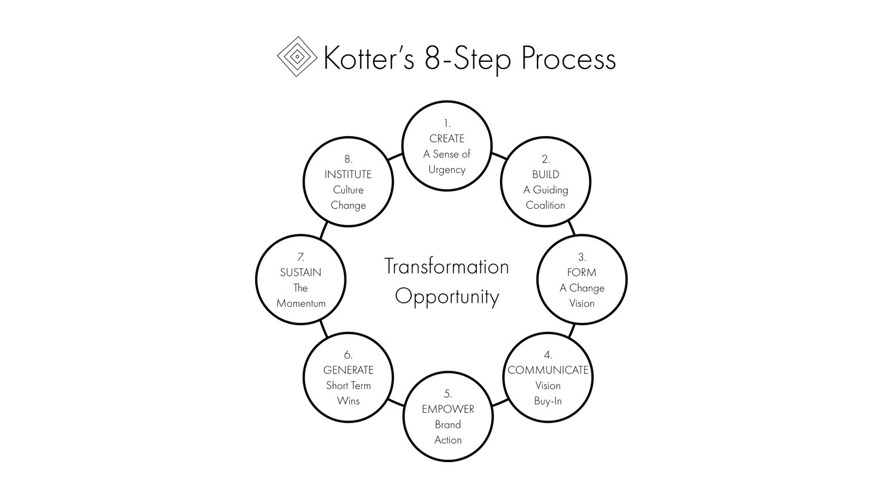

Kurzbeschreibung zu 8_Step_Process_for_Leading_Change um ein erstes Verständnis dafür zu schaffen um was es hier geht.

Hier ganz am Anfang keine Überschrift einfügen - das passiert automatisch basierend auf dem `title`-Attribut
oben im Front-Matter (Bereich zwischen den `---`).

# 8-Stufen-Modell eines Veränderungsprozesses  
Das 8-Stufen-Modell eines Veränderungsprozesses ist eines der beliebtesten [Change Management](https://github.com/ManagingProjectsSuccessfully/ManagingProjectsSuccessfully.github.io/blob/main/kb/Change_Management.md) Modelle.
Es wurde im Jahr 1996 von John P. Kotter entwickelt und erstmals in seinem Buch "Leading Change" vorgestellt. Ausgangspunkt der Entwicklung ist der 1995 erschienene Artikel "Leading Change: Why Transformation Efforts Fail", in welchem Kotter acht kritische Fehler beschreibt, die den Erfolg von organisationalen Veränderungsprozessen beeinträchtigen können.[^1]  
[^2]

# Die acht Stufen des Modells
## 1. Erzeugen eines Dringlichkeitsgefühls
In der ersten Stufe ist er erforderlich, dass den Mitarbeitenden, einschließlich aller Führungskräfte, die Notwendigkeit der Veränderungen aufgezeigt werden.[^1] Hierbei ist es wichtig, dass die Führungskräfte nicht unterschätzen, wie schwierig es sein kann Menschen aus ihrer Komfortzone herauszubringen. Gute Führungskräfte schaffen es, ihre Mitarbeitenden auf einer emotionalen Ebene anzusprechen und einfache vorstellbare Botschaften zu kreieren, welche die Mitarbeitenden dazu inspirert Großes zu vollbringen.[^3]
## 2. Aufbauen einer Führungskoalition  
In dieser Stufe ist es wichtig, ein Führungsteam zusammenzustellen, welches den gesamten Veränderungsprozess begleitet und anführt.[^1] Es ist wichtig, dass das Team die richtige Zusammensetzung besitzt und sich gegenseitig vertraut. Ebenso braucht das Team eine gemeinsamemes Ziel auf das es hinarbeiten kann. Außerdem benötigt das Team
genügend Expertise, Glaubwürdigkeit, Führungsvermögen und Macht.[^3]
## 3. Entwickeln einer Vision
Das in Stufe 2 gebildete Führungsteam muss nun eine Veränderungsvision erarbeiten. Diese dient dazu, die Mitarbeitenden zu motivieren und Verständnis über die Richtung der Veränderungen zu bilden. Die Vision sollte zudem vorstellbar, realistisch, flexibel sein und die Interessen vieler Stakeholder abbilden.[^1]
## 4. Kommunizieren der Veränderungsvision
Im Mittelpunkt dieser Stufe steht die Kommunikation der Vision. Diese sollte einfach, bildhaft, über verschiedene Kanäle und möglichst oft an die Mitarbeitenden vermittelt werden.[^1] Die meisten Firmen unterkommunizieren ihre Vision um den Faktor 10. So ist eine einzige E-Mail oder eine Reihe von Ansprachen nicht genug. Die Vision sollte in E-Mails, Besprechungen und Präsentationen referenziert werden.[^3]
## 5. Befähigen der Mitarbeitenden auf breiter Basis
In der fünften Stufe sollen Hindernisse, welche Mitarbeitenden die Umsetzung der angestrebten Veränderungen erschweren, gelöst werden.[^1] So kann es vonnöten sein bestimmte organisationale Strukturen zu ändern. Auch sind oftmals nicht von den Veränderungen überzeugte Führungskräfte Hindernisse, die es zu überwinden gilt. Generell gibt es für diese Art von Problemen keine einfache Lösung, ein guter Ansatzpunkt ist jedoch ein ehrlicher Dialog.[^3]
## 6. Schaffen schneller Erfolge
Organisationale Veränderungen sind langwierige Prozesse, wodurch es  umso wichtiger wird kurzfristige Erfolge zu feiern. Diese werden benötigt um die Glaubwürdigkeit des eingeleiteten Veränderungsprozesses zu sichern. Weiterhin dienen diese kurzfristigen Erfolge als Belohnung der Bemühungen etwas zu verändern.Außerdem erhöhen diese Erfolge das Dringlichkeitsgefühl und helfen dabei, Optimismus unter denen zu streuen, die die Veränderung vorantreiben.[^1][^3]
## 7. Konsolidieren der erzielten Erfolge und Einleiten weiterer Erfolge
Die siebte Stufe beinhaltet, dass bereits erzielte Erfolge gefestigt werden. Darauf aufbauend kann man neue Veränderungsideen kanalisieren und ebenfalls angehen. Weiterhin warnt Kotter davor das Ende eines großen Veränderungsprozesses zu früh zu verkünden, da dadurch kritisches Momentum verloren gehen kann, was zu Rückschritten führen kann.[^1][^3]
## 8. Verankern der neuen Ansätze in der Kultur
Die finale letzte Stufe eines Veränderungsprozesses ist es, den Veränderungen in der Unternehmenskultur Raum zu geben.[^1] Ziel ist es, nicht mit der Vision übereinstimmende Teile der Unternehmenskultur loszulassen und neue Werte zu integrieren. Da, laut Kotter, die Unternehmenskultur oftmals nur schwer greifbar ist führen erste erfolgreiche etablierten Veränderungen zu einem Wandel der Unternehmenskultur[^1]. Weiterhin muss der Großteil der Organisation hinter den Veränderungen stehen, da ansonsten nicht mit lanfristigem Erfolg zu rechnen ist.[^3]

# Siehe auch

* [Change Management](https://github.com/ManagingProjectsSuccessfully/ManagingProjectsSuccessfully.github.io/blob/main/kb/Change_Management.md)
* [Managing Change in Organisations](https://github.com/ManagingProjectsSuccessfully/ManagingProjectsSuccessfully.github.io/blob/main/kb/Managing_Change_in_Organisations.md)
* [Projektmanagement](https://github.com/ManagingProjectsSuccessfully/ManagingProjectsSuccessfully.github.io/blob/main/kb/Projektmanagement.md)
* [Link auf diese Seite](8_Step_Process_for_Leading_Change.md)

# Quellen

[^1]: https://de.wikipedia.org/wiki/8-Stufen-Modell_eines_Ver%C3%A4nderungsprozesses_nach_J._P._Kotter
[^2]: https://images.squarespace-cdn.com/content/v1/57fedc98414fb543384c05a3/1533689238177-FVACHCSPDW5231EJ3TH3/Kotter-8-Step-Process.jpeg?format=1000w
[^3]: https://na.eventscloud.com/file_uploads/3f6e5b107e7e4a7251e67254fbf82afe_NancySullivan-The8-StepProcessforLeadingChange.pdf
[^4]: 

