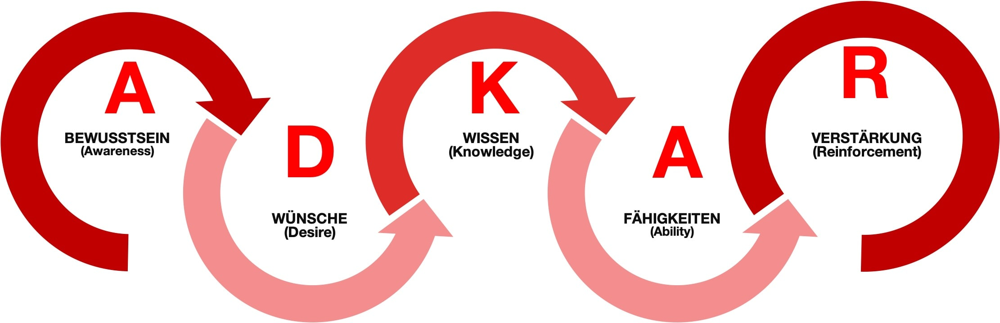

# 1) Was ist das ADKAR Modell?
Das ADKAR Modell von Proscigründer Jeff Hiatt „ist ein zielorientriertes [Change-Management](https://github.com/ManagingProjectsSuccessfully/ManagingProjectsSuccessfully.github.io/tree/main/kb/Change_Management)-Modell, welches als Leitfaden für Veränderungen auf individueller und organisatorischer Ebene gilt.“[^1] 
Bei dem Wort „ADKAR“ handelt es sich um ein Akronym, welches für die fünf Schritte steht, die durchgeführt werden müssen, um Veränderungen auf individueller und im Folgenden dann auch auf organisatorischer Ebene erfolgreich implementieren zu können. 
# 2) Die fünf Stufen des ADKAR Modells
ADKAR ist ein Akronym und steht für: 

*Abbildung: ADKAR Modell* [^2]

## Awareness
Den ersten und wichtigsten Schritt stellt "Awareness" dar. Es soll Bewusstsein für die Notwendigkeit der Veränderung geschaffen werden.
Nachfolgende Fragestellungen können dabei helfen diesen Schritt auszuführen:

- Welche Veränderung ist notwendig? [^3]
- Warum ist die Veränderung notwendig? [^3]
- Welche Auswirkungen birgt die Veränderung? [^3]
- Was passiert, wenn keine Veränderung eintrifft? [^3] [^4]

## Desire 

Die zweite Phase stellt "Desire" dar. Hier muss sichergestellt werden, dass jeder den Wunsch hat die Veränderungen durchzuführen und zu unterstützen.  
Da dieser Schritt sehr individuell ist, müssen anhand von Coachings und Gesprächen die persönliche Situation und Anreize des Mitarbeiters erkannt und angewandt werden. [^5]

## Knowledge

Bei dieser Ebene muss sichergestellt werden, dass die Person das benötigte Wissen hat, die für die Implementierung der Veränderung notwendig ist. Dies kann beispielsweise mit Hilfe von Schulungen erreicht werden. [^4]

## Ability

Es muss sichergestellt werden, dass die Person die Fähigkeit besitzt, die bereits vorangegangenen drei Schritte in die Praxis umzusetzen. [^6] Mögliche Hilfestellungen hierbei können Coachings, Feedback und mehr Übung sein. [^7]

## Reinforcement

Dieser letzte Schritt der Verstärkung wird meistens vergessen oder zu kurz ausgeführt. Damit Veränderungen jedoch langfristig bestehen können, ist es sehr wichtig diesen Schritt auszuüben, denn erst jetzt wird die Veränderung normalisiert. 
Feedbackgespräche, aber auch das Loben der Mitarbeiter können helfen die Veränderung zu bestärken. 
Wenn dieser Schritt nicht oder zu wenig durchgeführt wird, kann es sein, dass die Veränderung nicht beständig ist und man daher wieder bei „Awareness“ anfangen muss. [^8]

# 3) Wie funktioniert das ADKAR Modell?

Es ist notwendig die oben genannten Schritte nacheinander mit jedem einzelnen Individuum durchzuführen. Da die Stufen aufeinander aufbauen, würde ein Überspringen oder mangelhaftes Bearbeiten nicht zu dem gewünschten Ergebnis führen, weshalb man somit gezwungen wäre nochmal von vorne anzufangen. 

Neben den oben genannten Schritten ist auch eine regelmäßige Bewertung notwendig. Die Bewertung erfolgt auf einer Skala von eins bis fünf, wobei eins schlecht und fünf das Optimum darstellt. Erst nachdem man einen der fünf Meilenstein erfolgreich abgeschlossen hat (ab Punkt drei) darf man zu dem nächsten Schritt übergehen. [^4] [^9]

# 4) Anwendungsbereiche

Es wird davon ausgegangen, dass ohne eine Veränderung des Individuums keine Veränderung des Unternehmens erfolgen kann. Aus diesem Grund findet dieses Modell bei persönlichen, als auch bei größeren Gruppierungen wie beispielsweise Organisationen Anwendung. [^4] [^9]

# 5) Vor- und Nachteile

## Vorteile 

- Der Fokus liegt auf dem Ergebnis und nicht auf den Aufgaben [^10] [^11] [^12]
- Der Fortschritt der Veränderung ist messbar [^10] [^11] [^12]
- Das Modell erkennt die Bedeutung der Mitarbeiter an [^10] [^11] [^12]

 
## Nachteile

- Die Komplexität von Veränderungen wird ignoriert [^10] [^11] [^12]
- Das Modell ist eher für kleinere Organisationen geeignet [^10] [^11] [^12]
 

 
# Quellen

[^1]: https://www.tiba-prosci.com/was-ist-adkar/
[^2]: https://www.marhelgroup.de/wp-content/uploads/2020/11/adkar-modell-768x248.jpg
[^3]: https://youtube.com/watch?v=PwwoyzVfsS8
[^4]: https://mind-force.de/vertrieb/wie-das-adkar-change-management-modell-funktioniert/
[^5]: https://youtube.com/watch?v=LNT3Rxci-hU
[^6]: https://youtube.com/watch?v=XvIYdQ8Bp5k
[^7]: https://www.prosci.com/resources/articles/adkar-model-ability
[^8]: https://youtube.com/watch?v=QQjyfN7XoQE
[^9]: https://youtube.com/watch?v=Bg5dy1pFdzg
[^10]: http://changemanagementinsight.com/adkar-model-of-change-management/
[^11]: https://expertprogrammanagement.com/2018/02/adkar-model-of-change/
[^12]: https://www.youtube.com/watch?v=oMiI59NMO2Q
