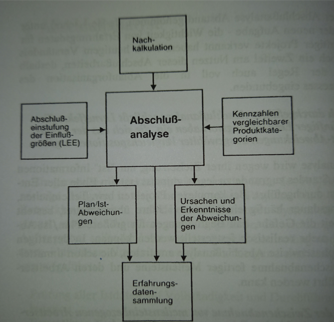

Zur Bewertung eines Projekts gehört eine Abschlussanalyse, um festzustellen, ob das Projekt erfolgreich durchgeführt werden konnte oder insgesamt das Ziel verfehlt 
wurde. 
Aufgrund ihrer Zielsetzung, nur „Ist“-Informationen zugrunde zu legen, befindet sich die Abschlussanalyse meist am Ende eines Projekts[^3]. 
Dieser Beitrag soll im Folgenden aufzeigen, welche Inhalte für die Abschlussanalyse wichtig sind, um eine vollumfassende Bewertung des gesamten Projektes zu 
ermöglichen.

Grundsätzlich wird bei einer Abschlussanalyse ein Soll-Ist Abgleich für Projektziele, -ergebnisse, -zeit und -qualität durchgeführt. Des Weiteren wird eine 
Nachkalkulation und zusätzlich eine Wirtschaftlichkeitsbetrachtung verfasst. Abschließend muss ein Abschlussbericht erstellt und dieser an dem Auftraggeber 
übergeben werden.[^2].

[^3]

# Prozessablauf Abschlussanalyse

## 1. Kennzahlen vergleichbarer Produktkategorien
Zu Beginn werden Kennzahlen vergleichbarer Produktkategorien benötigt, um sie mit den Messzahlen des abgeschlossenen Projektes abgleichen zu können. In der Regel 
treten beim Vergleich Abweichungen auf, deren Gründe bisher nicht ermittelt worden sind. Deshalb wird im nächsten Schritt nach den Ursachen hierfür gesucht.

## 2. Ursachen & Erkenntnisse der Abweichung
Als Grund für eine Abweichung, kann zwischen personellen, technischen und organisatorischen Ursachen unterschieden werden. Allerdings gilt es hierbei zwischen 
vermeidbare und unvermeidbare Ursachen zu unterscheiden. Ein Beispiel für eine vermeidbare Ursache können schlechte Testdaten sein (technisches Abweichungsproblem). 
Fehlerhafte Fremdteile, die man von einem externen Unternehmen bezogen werden und deshalb zu einer Abweichung führen, werden zu den unvermeidbaren Ursachen 
gezählt.[^3].

## 3. Plan/Ist-Abweichung
Bei dem Plan/Ist-Abweichung (oder auch Soll-Ist-Abgleich) wird eine weiterführende Kalkulation – möglichst in derselben Struktur wie bei den vorausgegangenen Vor- 
und Mitkalkulationen – durchgeführt. Hierzu werden die ursprünglichen Berechnungen den tatsächlichen Werten für Aufwand, Umfang und Kosten gegenübergestellt. 
Differenzen bezüglich der Termine und Kosten beim Material sowie der Leistungs- und Qualitätsmerkmale sind hinsichtlich ihrer Ausprägung, Ursachen und möglichen 
Abhilfen im Rahmen einer Abweichungsanalyse zu untersuchen[^4].

Bei komplexen Projekten bzw. Teileinheiten, deren Entwicklungsdauer häufig ein oder zwei Jahre überschreitet, besteht nach so langer Zeit die Gefahr, dass 
Begründungen für größere Plan/Ist-Abweichungen nicht mehr realistisch festgestellt werden können. In derartigen Fällen wird zu einer phasenbezogenen 
Abschlussanalyse geraten, die bereits unmittelbar nach der Zwischenabnahme fertiger Meilensteine und deren Arbeitsergebnisse durchgeführt werden kann[^3].

## 4. Nachkalkulation
Vor der Erstellung des Abschlussberichts wird eine Nachkalkulation erstellt. Diese muss zwar nur die wesentlichen Einheiten benennen, allerdings sollte auch der 
Leistungsgrad und der dazugehörige Qualitätsaufwand erkennbar sein[^3].
Der Vergleich mit dem ersten Planstand kommt die größte Bedeutung zu. Denn bei einer im Prozessablauf kontinuierlich durchgeführten Plankorrektur, würde ein 
Vergleich mit dem letztendlich gültigen Planstand nur noch geringwertige Abweichungen aufweisen. Dabei sollen die Kosten in einem gewissen Rahmen eingehalten worden 
sein, um die Wirtschaftlichkeit des Projekts gewährleisten zu können[^3].

## 5. Abschlussbericht
Die abschließende Bewertung des Projekts ist anhand vorab festgelegter Kriterien zu erfolgen. Eine Abweichung von bis zu 10 % bei allen Zielgrößen kann als “gutes 
Ergebnis” eingestuft werden[^1]. 

## Anwendung im F&E-Bereich

Im Bereich der Forschung und Entwicklung kann durch Gewinnung objektiver Kennzahlen, anhand der Erfahrungsdaten und Messzahlen vieler Entwicklungsabschlüsse im 
Zeitreihenvergleich, auch eine Annäherungsrechnung zum erzielten Produktivitätsfortschritt durchgeführt werden. Der große Vorteil der Abschlussanalysen liegt 
in der Organisation eines breit angelegten Zugriffs zu diesen Daten, der in größeren F&E-Abteilungen zu einem rechnergestützten Wissenstransfer ausgebaut werden 
kann[^3].
Eine wichtige Komponente bei einer Abschlussanalyse sind Erfahrungsdaten. Diese geben eine wesentliche Orientierungshilfe. Im Schätz- und 
Beurteilungsprozess wird das subjektiv vorhandene Erfahrungswissen durch systematisch gesammelte und ausgewertete Erfahrungsdaten ergänzt. Mithilfe einer (am besten 
computergestützten) Datenbank sind Erfahrungsdaten schneller und leichter auswertbar. 
 
# Fazit
Zusammenfassend ist ersichtlich, dass die Plan/Ist-Abweichung (bzw. der Soll-Ist-Abgleich) einen sehr großen Anteil an der Abschlussanalyse einnimmt. Jedoch dürfen
die anderen Aspekte für eine vollständige Analyse nicht vernachlässigt werden. 

# Verlinkungen zu angrenzenden Themen
* [Projektabschluss](Projektabschluss.md)
* [Projektabschlussbericht](Projektabschlussbericht.md)
 
# Quellen

[^1]: (https://www.peterjohann-consulting.de/projektabschluss/#21_der_projektabschlussbericht)
[^2]: (https://www.consulting-life.de/projektabschluss/)
[^3]: Riedl, J. (1990) Projekt-Controlling in Forschung und Entwicklung
[^4]: (https://de.wikipedia.org/wiki/Projektabschluss)

