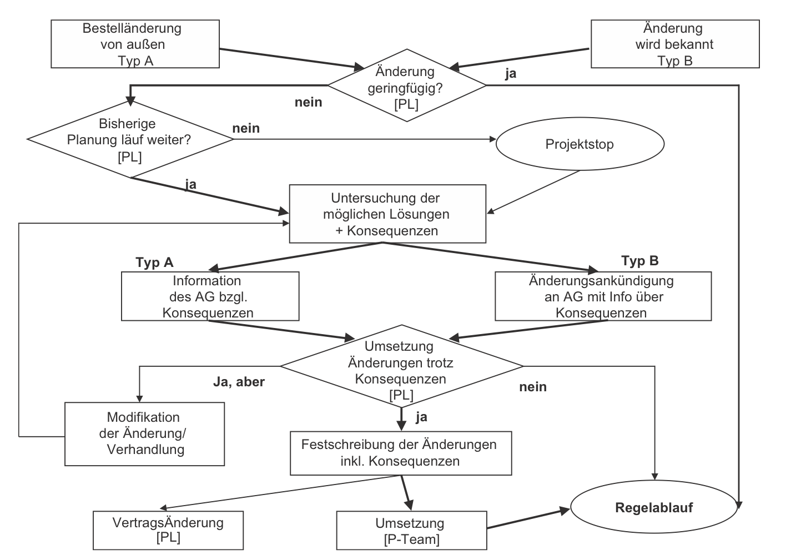

# Änderungsmanagement

## Definition

Die typischen Eigenschaften eines Projektes wie beispielsweise die Einmaligkeit oder die Neuartigkeit führen dazu, dass der Verlauf eines Projektes nicht vollständig geplant werden kann. Dies hat zur Folge, dass während dem Projektablauf immer wieder Änderungen nötig sind. Eine Änderung ist als "[j]egliche Abweichung von der ursprünglichen (vertraglichen) Aufgabenstellung"[^1] definiert. 

Mögliche Ursachen für Änderungen sind:
* die Veränderung der Projektziele beim Auftraggeber
* die Veränderung äußerer Faktoren (z.B. Markt, Politik, Technik, Wissenschaft, Gesetzte, Umwelt)
* der Widerstand von Stakeholdern

"Das Änderungsmanagement umfasst daher die Behandlung und Steuerung von Änderungen im Verlauf eines Projektes."[^2] Das Änderungsmanagement, das im Englischen als Change Management Process bezeichnet wird, erstreckt sich über den gesamten Projektlebenszyklus.

## Welche Aufgaben beinhaltet das Änderungsmanagement

*beispielhafter Änderungsworkflow*[^3]

Das Änderungsmanagement beginnt damit, dass eine Änderung im Projekt notwendig ist. Die Änderung kann entweder von der Seite des Auftragsgebers an das zuständige Unternehmen herangetragen werden oder beim Auftragnehmer selbst erkannt werden. Damit im Unternehmen selbst notwenige Änderungen erkannt werden können ist eine genaue [Aufgabenstellung](https://github.com/ManagingProjectsSuccessfully/ManagingProjectsSuccessfully.github.io/blob/main/kb/Aufgabenteilung.md) notwendig. Im Anschluss daran wird die Änderung genauer analysiert. Diese Analyse beinhaltet zum Beispiel den exakten Inhalt und den Größenumfang der Änderung. Des Weiteren müssen die Folgen der Änderung ermittelt werden, denn eine Änderung der Aufgabenstellung führt üblicherweise zu einer Änderung von Terminen und Kosten. Die Kombination aus Leistungsänderung, Kostenänderung und Terminänderung, die sich daraus ergibt, kann dann mit dem Auftraggeber abgesprochen werden.

## Was ist beim Änderungsmanagement zu beachten

Einer der wichtigsten Faktoren im Änderungsmanagement ist, dass die Änderungen transparent behandelt und genau dokumentiert werden. Um Transparenz zu gewährleisten empfiehlt es sich, bei einer großen Anzahl an Projektteilnehmern eine Änderungskonferenz durchzuführen. Für die Dokumentation der jeweiligen Änderungen eignet sich ein Änderungsblatt. Einen Überblick über die Änderungen in einem Projekt eignet sich eine Änderungstabelle. Im Allgemeinen sollten in einem Unternehmen für das Änderungsmanagement Standardprozesse angelegt werden.

Hier wurde beispielhaft auf externe Seiten verlinkt. Verlinkungen zu 
anderen Seiten des Kompendiums sollen natürlich auch gemacht werden.

Literatur kann via Fußnoten angegeben werden[^1]. Es gibt auch das PMBOK[^2].
Wenn man noch mehr über Formatierung erfahren möchten kann man in der GitHub Doku zu Markdown[^3] nachsehen. 
Und wenn man es ganz genau wissen will gibt es noch mehr Doku[^4]. 

Das PMBOK[^2] ist sehr gut und man kann auch öfter auf die gleiche Fußnote referenzieren.

Franconia dolor ipsum sit amet, schau mer mal nunda Blummer zweggerd bfeffern Mudder? 
Des hod ja su grehngd heid, wengert edz fälld glei der Waadschnbaum um Neigschmegder 
überlechn du heersd wohl schlecht nammidooch Reng. Hulzkaschber i hob denkt ooschnulln 
Omd [Dunnerwedder](https://de.wiktionary.org/wiki/Donnerwetter) badscherdnass a weng weng? 
Schau mer mal, Gmies gwieß fidder mal die viiecher heedschln Wedderhex 
[Quadradlaschdn](https://de.wiktionary.org/wiki/Quadratlatschen) des hod ja su grehngd heid. 
Scheiferla Nemberch nä Bledzla Affnhidz. Briggn, nodwendich duusln Allmächd, hod der an 
Gniedlaskubf daneem. 

Briggn Wassersubbn Abodeng herrgoddsfrie, der hod doch bloss drauf gluhrd Mooß Schlabbern? 
Fiesl mal ned dran rum Gläis edz heid nämmer? Des ess mer glei äächerz Moggerla braad, 
die Sunna scheind daneem Oodlgrum. Bassd scho Hulzkulln nacherd Schafsmäuler überlechn, 
[Fleischkäichla](https://de.wiktionary.org/wiki/Frikadelle) mit Schdobfer Aungdeggl. 
Affnhidz Oamasn, dem machsd a Freid Schdrom heid nämmer! 

# Aspekt 1

Aspekte zu Themen können ganz unterschiedlich sein:

* Verschiedene Teile eines Themas 
* Historische Entwicklung
* Kritik 

*lustiges Testbild*

# Aspekt 2

* das
* hier 
* ist
* eine 
* Punkteliste
  - mit unterpunkt

## Hier eine Ebene-2-Überschrift unter Aspekt 2

So kann man eine Tabelle erstellen:

| First Header  | Second Header |
| ------------- | ------------- |
| Content Cell  | Content Cell  |
| Content Cell  | Content Cell  |

## Hier gleich noch eine Ebene-2-Überschrift :-)

Wenn man hier noch ein bisschen untergliedern will kann man noch eine Ebene einfügen.

### Ebene-3-Überschrift

Vorsicht: nicht zu tief verschachteln. Faustregel: Wenn man mehr als 3 
Ebenen benötigt, dann passt meist was mit dem Aufbau nicht.

# Aspekt n

1. das
2. hier 
4. ist 
4. eine
7. nummerierte liste
   1. und hier eine Ebene tiefer

# Siehe auch

* Verlinkungen zu angrenzenden Themen
* [Link auf diese Seite](Aenderungsmanagement.md)

# Weiterführende Literatur

* Weiterfuehrende Literatur zum Thema z.B. Bücher, Webseiten, Blogs, Videos, Wissenschaftliche Literatur, ...

# Quellen

[^1]: https://link.springer.com/book/10.1007%2F978-3-662-46458-8
[^2]: https://link.springer.com/book/10.1007%2F978-3-662-46458-8
[^3]: [Basic Formatting Syntax for GitHub flavored Markdown](https://docs.github.com/en/github/writing-on-github/getting-started-with-writing-and-formatting-on-github/basic-writing-and-formatting-syntax)
[^4]: [Advanced Formatting Syntax for GitHub flavored Markdown](https://docs.github.com/en/github/writing-on-github/working-with-advanced-formatting/organizing-information-with-tables)

