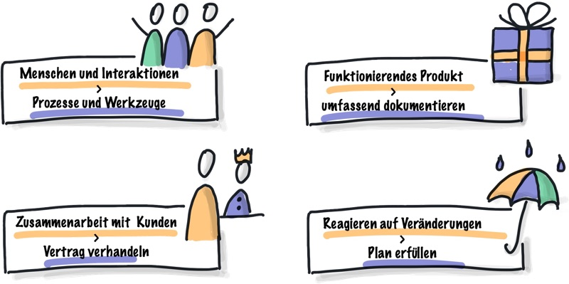

# Agiles Manifest 

Das „Manifesto for Agile Software Development“ oder auch kurz unter dem Namen „Agiles Manifest“ (engl.: Agile Manifesto) bekannt, wurde im Februar 2001 von 17 projekterfahrenen Software-Entwicklern verabschiedet[^2]. 
Sie kamen in einer Lodge im Snowbird-Skigebiet für drei Tage zusammen, um zu reden, Ski zu fahren und eine gemeinsame Basis zu finden[^1]
 
Es besteht aus 4 Leitsätzen und 12 Prinzipien.
Das agile Manifest ist ein Meilenstein und bietet zu gleich die Grundlage für agiles Projektmanagement[^2].

Unter den Erstunterzeichnern befinden sich auch die beiden Scrum-Gründern Ken Schwaber und Jeff Sutherland, sowie die Vertreter von DSDM, Adaptive Software Development, Crystal und viele weitere. Alle hatten ein gemeinsames Ziel, eine Alternative zu dokumentgetriebenen, schwergewichtigen Softwareentwicklungsprozessen zu finden. Dabei entstand das Agile Manifest, mithilfe dessen man endlich den bis dahin unscharfen Begriff der „leichtgewichtigen Software-Entwicklung“ ersetzen konnte[^1].

Im Folgenden soll nun auf die vier Leitsätze, sowie die 12 Prinzipien des agilen Manifests eingegangen werden, sowie dessen aktuelle Bedeutung. 

# Vier Leitsätze

* Individuen und Interaktionen sind wichtiger als Prozesse und Werkzeuge
* Funktionierende Software ist wichtiger als umfassende Dokumentation
* Zusammenarbeit mit dem Kunden ist wichtiger als Vertragsverhandlung
* Reagieren auf Veränderung ist wichtiger als das Befolgen eines Plans[^3]

In der folgenden Grafik sind die vier oben genannten Leitsätze nochmal grafisch dargestellt und zusammengefasst:

Agiles Manifest - die vier Leitsätze[^4]

Wichtig hier anzumerken ist, dass für die 17 Unterzeichner die Werte auf der rechten Seite durchaus als wichtig eingeschätzt wurden, jedoch schätzen sie die Werte auf der linken Seite von noch größerer Bedeutung ein[^2].

# Zwölf Prinzipien 

1. Unsere höchste Priorität ist es, den __Kunden__ durch __frühe__ und __kontinuierliche Auslieferung__ wertvoller Software __zufriedenzustellen__
2. Heiße Anforderungsänderungen sind selbst spät in der Entwicklung __willkommen__. Agile Prozesse nutzen __Veränderungen__ zum __Wettbewerbsvorteil__ des Kunden
3. Liefere __funktionierende Software regelmäßig__ innerhalb weniger Wochen oder Monate und bevorzuge dabei die __kürzere Zeitspanne__
4. FachexpertInnen und EntwicklerInnen müssen während des Projekts __täglich zusammenarbeiten__
5. Errichte Projekte rund um __motivierte Individuen__. Gib ihnen das __Umfeld__ und die __Unterstützung__, die sie benötigen und vertraue darauf, dass sie die Aufgabe erledigen
6. Die effizienteste und effektivste Methode, Informationen an und innerhalb eines Entwicklungsteams zu übermitteln, ist im __Gespräch__ von __Angesicht zu Angesicht__.
7. __Funktionierende Software__ ist das __wichtigste Fortschrittsmaß__
8. Agile Prozesse fördern nachhaltige Entwicklung. Die AuftraggeberInnen, EntwicklerInnen und BenutzerInnen sollten ein __gleichmäßiges Tempo auf unbegrenzte Zeit erhalten können__
9. Ständiges Augenmerk auf __technische Exzellenz__ und __gutes Design__ fördert Agilität
10. __Einfachheit__ – die Kunst, die Menge nicht getaner Arbeit zu maximieren – ist essenziell
11. Die besten Architekturen, Anforderungen und Entwürfe entstehen durch __selbstorganisierte Teams__
12. In __regelmäßigen Abständen__ reflektiert das Team, wie es __effektiver__ werden kann und __passt__ sein __Verhalten__ entsprechend __an__[^5] 

# Heutige Bedeutung

Wie schon am Anfang erwähnt, bildet das Agile Manifest bis heute die Grundlage für das Agile Projektmanagement. Im Laufe der Jahre sind viele weitere Befürworter hinzugekommen. 
Bis heute wird das agile Projektmanagement gerne neben den klassischen Methoden genutzt und findet sich vielen verschiedenen Methoden mit unterschiedlichen Ausprägungen wieder[^2].

# Siehe auch

* [SCRUM](SCRUM.md)
* [Projektmanagement](Projektmanagement.md)

# Weiterführende Literatur

[Software Engineering Tutorial Deutsch #6 - Das Agile Manifest](https://www.youtube.com/watch?v=aN-6Ha66Q9U)

# Quellen

[^1]: [Agile Manifesto - Geschichte](https://agilemanifesto.org/history.html)
[^2]: [Agiles Projektmanagement - Agile Manifesto](http://agiles-projektmanagement.org/agile-manifesto/)
[^3]: [Agile Manifesto - Leitsätze](https://agilemanifesto.org/iso/de/manifesto.html)
[^4]: [Abbildung Agiles Manifest - die vier Leitsätze](https://synapsenstau.de/agiles-manifest/)
[^5]: [Agile Manifesto - Leitsätze](https://agilemanifesto.org/iso/de/principles.html)

