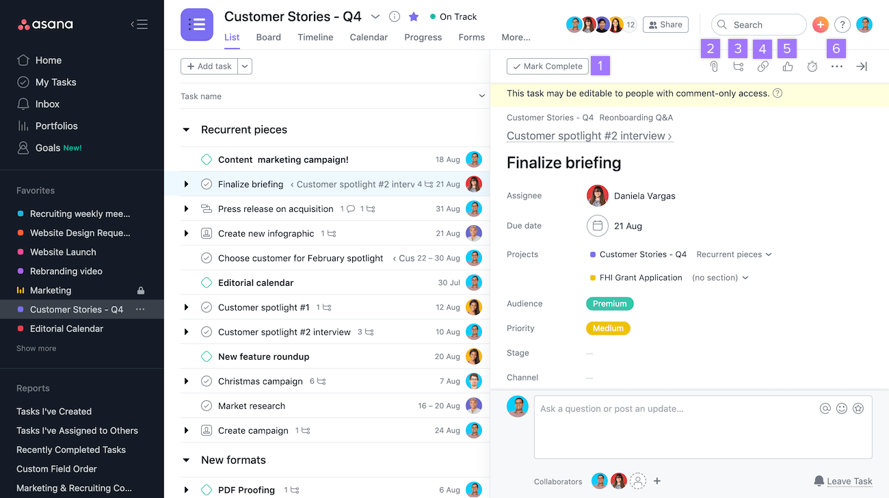

Asana Inc. ist ein US-amerikanisches Unternehmen aus San Francisco für agile [Projektmanagement-Software](Projektmanagementsoftware.md). Das Unternehmen wurde beireits 2008 gegründet, ihr Produkt kam allerdings erst 2012 offiziell auf den Markt[^1] [^2]. 

Die beiden Gründer Dustin Moskovitz und Justin Rosenstein lernten sich bereits zuvor auf der Arbeit bei Facebook kennen. Dort entstand auch ihre Idee für ein Tool, das Teams auf der ganzen Welt bei der Organisation ihrer Projekte und der Kommunikation untereinander unterstützt[^3]. 
Der Name des Unternehmens "Asana" stammt dabei aus dem Sanskrit, der Literatur- und Gelehrtensprache in Indien. Ursprünglich wird es im Yoga verwendet und ist namensgebend für verschiedene Haltungsgruppen, die sowohl Dynamik als auch Beständigkeit ausdrücken[^3] [^4]. 

Als US-amerikanisches Unternehmen werden die mit dem Unternehmen geteilten Daten grundsätzlich nach den amerikanischen Datenschutzrichtlinien behandelt. Allerdings bietet Asana auch die Möglichkeit ein Übereinkommen für eine Datenverarbeitungsvereinbarung zu treffen, nach der die Daten gemäß der DSGVO verarbeitet werden[^2].

# Funktionen von Asana 
Für die Anmeldung bei Asana reicht in den meisten Fällen das bereits bestehende Google Konto aus. Ist die Anmeldung erfolgreich abgeschlossen, gelangt der Nutzer zur Homepage, auf der, wenn bereits vorhanden, alle Projekte und Aufgaben ersichtlich sind, die demnächst fällig werden[^5].

## Meine Aufgaben

Im Register "Meine Aufgaben", befinden sich alle Aufgaben, die dem Nutzer zugeordnet wurden. Für einen besseren zeitlichen Überblick können diese in die Kategorien "Heute erledigen“, "nächste Woche erledigen“ oder "Später erledigen“ sortiert werden[^6]. Um die Zuordnung zu veranschaulichen, kann der Nutzer zwischen einer Listenansicht, einem [Kanban-Board](Kanban.md) und einer [Gantt Chart](Gantt_Diagramme.md) wählen[^2] [^6]. 

## Die Inbox

Damit alle Teammitglieder eines Projektes immer auf dem aktuellen Stand sind, gibt es die Inbox, in der sich alle Benachrichtigungen befinden. Beispiele für mögliche Benachrichtungen sind unter anderem das Hinzufügen einer neuen Aufgabe, eines neuen Projektes oder eines neuen Dokumentes zu einer bereits bestehenden Aufgabe. Auch bekommt der Nutzer eine Benachrichtigung in seiner Inbox, wenn er von anderen Teammitgliedern unter einer Aufgabe getagged wird. Damit der Nutzer Asana nicht immer öffnen muss, um auf dem aktuellen Stand zu sein, wird ihm die Option angeboten, jede Benachrichtigung automatisch als E-Mail an ihn zu versenden[^2] [^5]. Darüber hinaus gibt es in der Inbox die Möglichkeit Nachrichten an andere Teammitglieder zu senden, um sich gemeinsam auszutauschen oder Diskussionen zu führen[^7].

## Das Aufgaben-Fenster 

Wird eine Aufgabe geöffnet, erscheint wie in Abbildung 1 ersichtlich, rechts ein Fenster mit dieser Aufgabe. In diesem Fenster kann der Nutzer sehen, wer für das Projekt verantwortlich ist, wann das Fälligkeitsdatum ist, zu welchem übergeordneten Projekt die Aufgabe gehört, ob es Abhängigkeiten gibt, mögliche Kontaktangaben und eine Kurzbeschreibung des Projektes. Die Kurzbeschreibung des Projektes dient dabei einer Auflistung aller wichtigen Informationen, um den nicht verantwortlichen Teammitgliedern, einen Überblick zu verschaffen. Darüber hinaus können in dem Fenster Unteraufgaben und Anhänge, wie Worddokumente und Excel-Tabellen angefügt werden[^3] [^5] [^7]. Asana bietet außerdem dem Nutzer die Möglichkeit der Integration anderer Tools, wie Teams, Tableau, GitHub und SharePoint[^3]. Des Weiteren können personalisierte Tags hinzugefügt werden, die zum Beispiel die Phase des Projektes veranschaulichen, wie „To Do!“ oder „Warten auf Feedback“[^8]. Auch befindet sich unter jeder Aufgabe ein Kommentarfeld, in dem Teammitglieder aktuelle Informationen austauschen können[^2] [^6]. 

*Abbildung 1: Benutzungsoberfläche bei Asana*[^8]

## Berichte 

Für die Projektmanager gibt es darüber hinaus die Möglichkeit unter dem Register Berichte, Dashboards anzulegen, um sich verschiedene Aspekte des Projektes visuell zu veranschaulichen[^3].

# Preiskategorien 
 Je nachdem welche Ansprüche ein Unternehmen an Asana hat, gibt es die Auswahl zwischen vier Preisvarianten: Basic, Premium, Business und Enterprise. Davon ist allerdings nur die Basic Variante, welche von bis zu 15 Teammitgliedern genutzt werden kann, kostenlos[^2] [^7].
 
 
 
|             |  Basic  |  Premium  |  Business  |  Enterprise  |
|-------------|---------|-----------|------------|--------------|
| Preis      |  0,00€  |   9,25€   |   18,75€   | auf Anfrage  |

Preis bezieht sich auf pro Nutzer pro Monat[^2]
 
 

# Siehe auch
* [Projektmanagementsoftware](Projektmanagementsoftware.md)
* [Übersicht_PM_Tools](Uebersicht_PM_Tools.md)
* [Jira_PM_Tool](Jira_PM_Tool.md)
* [MeisterTask_PM_Tool](MeisterTask_PM_Tool.md)
* [ClickUp_PM_Tool](ClickUp_PM_Tool.md)
* [Hive_PM_Tool](Hive_PM_Tool.md)
* [Trello_PM_Tool](Trello_PM_Tool.md)
* [Podio_PM_Tool](Podio_PM_Tool.md)
* [Stackfield_PM_Tool](Stackfield_PM_Tool.md)
* [Awork_PM_Tool](Awork_PM_Tool.md)
* [Java_PM_Tool](Java_PM_Tool.md)

# Weiterführende Literatur

* [Asana-Guide](https://asana.com/de/guide)
* [Features von Asana](https://asana.com/de/features)
* [Projektmanagement mit Asana](https://asana.com/de/uses/project-management)

# Quellen

[^1]: [Asana Projektmanagement Software](https://www.unternehmenswelt.de/asana-projektmanagement-software)
[^2]: [Projektmanagement-Tools im Vergleich: factro gegen Asana](https://www.focus.de/digital/experten/software-projektmanagement-tools-im-vergleich-factro-gegen-asana_id_10485623.html)
[^3]: [Über Asana - Was ist Asana](https://asana.com/de/company)
[^4]: [Das kleine Asana-Lexikon – die wichtigsten Asanas](https://www.yogaeasy.de/artikel/asana-lexikon)
[^5]: [Using Online Software for Digital Team Management – Case Study Asana](https://www.researchgate.net/publication/318653655_Using_Online_Software_for_Digital_Team_Management_-_Case_Study_Asana)
[^6]: [So gelingt der Einstieg in "Meine Aufgaben" von Asana](https://asana.com/de/guide/help/fundamentals/my-tasks)
[^7]: [Projektmanagement mit Asana macht Spaß – Ein Review](https://pm-tools.info/projektmanagement-software-reviews/projektmanagement-mit-asana-review/)
[^8]: ["So füllen Sie Aufgabenfelder aus" von Asana](https://asana.com/de/guide/help/tasks/fields#gl-tags)
