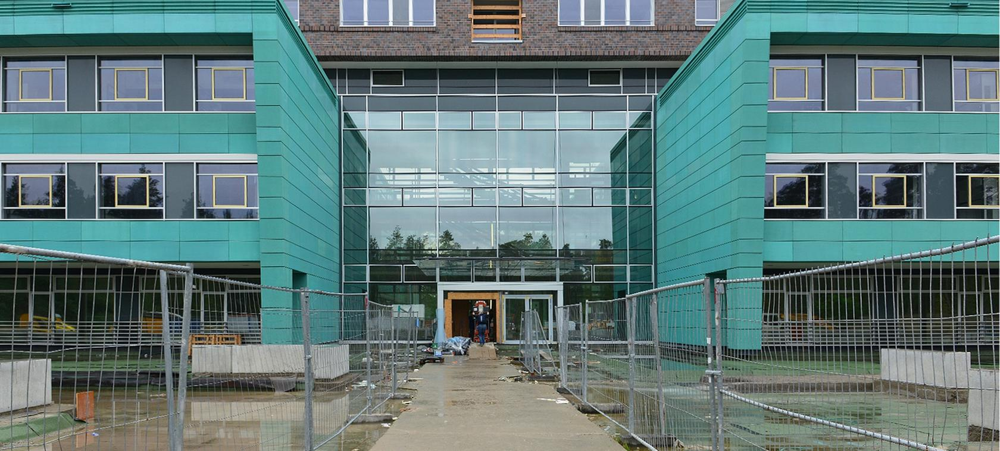

# Bauprojekte
Ein Bauprojekt, auch Bauvorhaben genannt, beschreibt die Errichtung eines in der Regel einmaligen Bauwerks.

## Phasen eines Bauprojekts [^3]

Phase 1 | Phase 2 | Phase 3 | Phase 4 | Phase 5 | Phase 6 
------- | ------- | ------- | ------- | ------- | -------
Konzeptionsphase | Designphase | Projektphase (vor Baubeginn) | Beschaffungsphase | Bauphase | Projektphase (nach Bauabschluss)

# Projektmanagement bei Bauprojekten

Das Bauprojektmanagement kann als die Urform des [Projektmanagements](Projektmanagement.md) betrachtet werden, da z.B. die Pyramiden und die chinesische Mauer Bauprojekte waren. 
Neben Architekten und Bauingenieuren übernehmen heutzutage auch Generalübernehmer bzw. -unternehmer oder auch Projektsteuerer die Aufgabe des Bauprojektmanagements[^1]. Es gibt insgesamt drei Funktionäre bei einem Bauprojekt: Bauherr, Planer und die Ausführenden (z.B. Bauunternehmer)[^2].

## Aufgaben des Bauprojektmanagements [^1]

* Abstimmung aller Entscheidungen mit dem Bauherren
* Planen des Bauwerks in unterschiedlichen Detaillierungsgraden
* Schätzung und Kalkulation der Baukosten
* Planen der Baudurchführung
* Einholen der Baugenehmigung durch die zuständige Behörde / Kommune
* Ausschreibung, Vergabe und Abrechnung der Bauleistungen (AVA)
* Überwachung und Steuerung des Bauprozesses
* Abnahme und Übergabe des fertigen Gebäudes an den Bauherren und an das nachgelagerte Facility Management 

## Das beste Projektmanagement für Bauprojekte
Um das bessere Projektmanagement herauszufinden, muss man das klassische Projektmanagement und das agile Projektmanagement miteinander vergleichen und die Unterschiede und Gemeinsamkeiten näher betrachten.
Der Vertreter des klassischen Projektmanagements ist das [Wasserfallmodell](Wasserfall_Modell.md). Bei diesem Modell ist der [Dokumentationsaufwand](Projektdokumentation.md) jedoch sehr groß. Außerdem werden die Kunden bzw. Endbenutzer kaum in das Projekt integriert. Jedoch hat es einen einfachen Zugang, ist leicht verständlich und besitzt eine klare Struktur. [^5]

# Gescheiterte Bauprojekte
Das Chemikum in Erlangen ist eine [Dauerbaustelle](Dauerbaustelle.md)

*Chemikum FAU*
# Erfolgreiche Bauprojekte
# Bachelorstudiengang Projektmanagement Bau

# Begriffsdefinitionen
1. Generalübernehmer: gleichzusetzen mit Totalunternehmer; (General-)Planer, der zusätzlich die Bauaufgaben übernimmt [^2]
2. Generalunternehmer: vereint alle Baugewerke in einem Unternehmen [^2]
3. Projektsteuerer: Ein Projektsteuerer überwacht und koordiniert, um die Ist-Situation in einem Bauprojekt an die Soll-Situation anzunähern und dadurch das Projekt hinsichtlich bestimmter Bereiche, wie Termineinhaltung und Kosten zu optimieren [^4]

# Siehe auch

* Verlinkungen zu angrenzenden Themen
* [Link auf diese Seite](Bauprojekte.md)

# Weiterführende Literatur
* [Vom Wasserfall zum Daily Scrum – Agile Planung in der Architektur](https://www.dbz.de/artikel/dbz_Vom_Wasserfall_zum_Daily_Scrum_Agile_Planung_in_der_Architektur_3583255.html)
* [Agil sein oder nicht sein: Ist das wirklich noch die Frage? Agile Design Management in der Planungsphase von Bauvorhaben](https://www.mp-gruppe.de/fileadmin/user_upload/content/blog/2019/Bau_VDI-Jahresausgabe_2019-2020f.pdf)

# Quellen

[^1]: [Bauprojektmanagement](https://www.projektmagazin.de/glossarterm/bauprojektmanagement)
[^2]: [Bauprojekt: Wer macht was? Wen brauche ich? Bauunternehmer, Planer, Bauherr / Bauwerkplan erklärt](https://www.youtube.com/watch?v=UVjm9xbqXws)
[^3]: [Die 6 Phasen eines Bauprojekts](https://www.letsbuild.com/de/blog/die-6-phasen-eines-bauprojekts)
[^4]: [Was macht ein Projektsteuerer?](https://www.freelancermap.de/blog/was-macht-ein-projektsteuerer/)
[^5]: [Ist das agile Projektmanagement für die Bauwirtschaft geeignet?: Eine Synopse von klassischem & agilem Projektmanagement](https://books.google.de/books?hl=de&lr=&id=T6TbDwAAQBAJ&oi=fnd&pg=PP1&dq=klassisches+projektmanagement+bei+Bauprojekten&ots=xicw2A9aJr&sig=QTwYuzxAutL_e2n3AlPTjL4zf4g#v=onepage&q=klassisches%20projektmanagement%20bei%20Bauprojekten&f=false)
