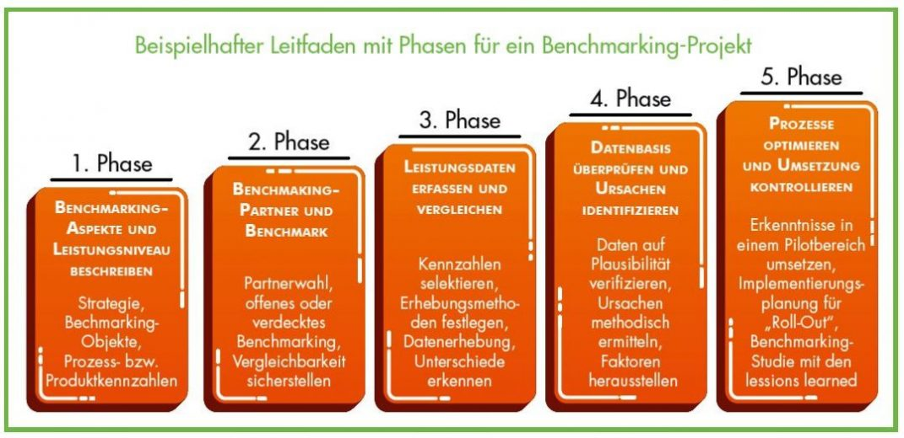

# Definition des Benchmarkings
„[Benchmarking](https://de.wikipedia.org/wiki/Benchmark) (sinngemäß „Maßstäbe vergleichen“) bezeichnet die vergleichende Analyse von Ergebnissen oder Prozessen mit einem festgelegten Bezugswert oder Bezugsprozess."„Ein/eine Benchmark (von englisch benchmark oder bench mark) ist ein Vergleichsmaßstab.“ [^1]

# Die 5 Schritte des Benchmarkings
### Phase 1: Beschreibung der der Benchmarking-Aspekte und des Leistungsniveaus
Die erste Phase des Prozesses beinhaltet die Festlegung der Themen, welche überhaupt verglichen werden sollen. Es soll die Auswahl nach den übergeordneten strategischen Unternehmenszielen getroffen werden.
Diese Fragen stellen Klarheit über die Auswahl der Unternehmensziele:
* Welches sind die strategischen Ziele des Unternehmens?
* Welches sind die hierfür relevanten Erfolgsfaktoren?
* Welche Schwachstellen müssen schließlich im Interesse der strategischen Ziele behoben werden?
Danach erfolgen die detaillierte Untersuchung und Dokumentation des Ausgewählten Benchmarking- Objekts und die daraus folgende Feststellung des Leistungsniveaus. [^3]

### Phase 2: Wahl des Benchmarkt-Partners und des Benchmarks
Auswahl eines oder mehrerer Benchmark-Partner durch verschiedene Vorgehensweisen:
#### Benchmarking -Varianten
##### * Offenes Benchmarking
Die Suche der Benchmark- Partner wird direkt vom Unternehmen oder durch beauftragte, spezielle Unternehmen bzw. Vermittlungsstellen durchgeführt. Darunter fallen unter anderem Internetportale. [^3]
##### * Verdecktes Benchmarking
Die Suche der Benchmark- Partner erfolgt durch die Zwischenschaltung von sogenannten Clearingstellen. Die Daten werden somit nicht direkt ausgetauscht, sondern werden anonym zwischen den beiden Parteien verglichen. Dies hat den Vorteil das die verglichenen Daten nicht einem Unternehmen zuordenbar sind und der Benchmark- Partner nicht weiß mit wem er sich vergleicht. Bei diesem Prozess ist es jedoch wichtig, die vorhandenen Differenzen auf eine gemeinsame Basis zu normalisieren. Dies kann durch Standortfaktoren, Mitarbeiterzahl, Marktbedingungen usw. geschehen. [^3]
##### * Funktionales Benchmarking 
Es werden die Prozesse mit Unternehmen außerhalb der angestammten Branche verglichen. [^2]
##### * Ganzheitliches Benchmarking 
Alle Bereiche und alle Prozesse eines Unternehmens kommen auf den Prüfstand. [^2]
##### * Internes Benchmarking 
Der Vergleich und die Analysen von Prozessen erfolgt zwischen den verschiedenen Bereichen eines Unternehmens beziehungsweise zwischen Konzernunternehmen. [^2]
##### * Wettbewerbsorientiertes Benchmarking
Vergleich des Unternehmens mit direkten Wettbewerbern. [^2]
##### * Kontinuierliches Benchmarking 	
Darunter versteht man die Wiederholung des Benchmarking-Prozesses, welcher in bestimmten Zeitabständen durchgeführt wird. [^2]

### Phase 3: Durchführung einer Benchmarking-Analyse
Für das Durchführen der Benchmarking Analyse sind geeignete Methoden und Tools zur Datenerhebung nötig. Diese erfolgen entweder durch das eigene Unternehmen bei offenen oder durch die Clearingstelle bei verdecktem Benchmarking. [^3]
##### Für die Datenerhebung mögliche Methoden und Tools:
* Fragebogen
* Interview
* Direkte Beobachtung
* usw.
Durch die normalisierten Daten können nun Leistungsunterschiede zwischen den Unternehmen ausgemacht werden. Bei einer großen Abweichung zwischen den Leistungen muss nun genau analysiert werden, wieso der Benchmark-Partner ein höheres Leistungsniveau in den herausstechenden Attributen besitzt.[^2]

### Phase 4: Überprüfung der Datenbasis und Identifikation von Ursachen
In dieser Phase werden verschiedene Methoden dargestellt. Diese stellen die Faktoren dar, mit denen das Partner- Unternehmen eine höhere Leistung erzielt. 
* Ablaufdiagramme der Prozesse,
Ein Ablaufdiagramm (auch Flussdiagramm genannt) ist eine Art der Darstellung von Geschäftsprozessen. [^5]
* Ursache-Wirkungs-Diagramme, usw.
Dieses Diagramm wurde als erstes im Qualitätsmanagement angewandt. Jedoch kann es heute in vielen anderen Bereichen angewandt werden. [^4]

### Phase 5: Optimierung von Prozessen und Kontrolle der Umsetzung 
Zum Ende der Prozesskette müssen die vorherigen Phasen umgesetzt werden und die Verbesserungen im eigenen Unternehmen angewandt werden. Zusätzlich sollen die Erkenntnisse am Ende in einer Abschlussdokumentation zusammengefasst werden.[^2]

*Die 5 Phasen des Benchmarkings als Diagramm dargesellt* [^3]

# Siehe auch
* [Aenderungsmanagement](https://github.com/ManagingProjectsSuccessfully/ManagingProjectsSuccessfully.github.io/blob/main/kb/Aenderungsmanagement.md)
* [Umfeldanalyse](https://github.com/ManagingProjectsSuccessfully/ManagingProjectsSuccessfully.github.io/blob/main/kb/Umfeldanalyse.md)
* [Qualitätsmanagement](https://github.com/ManagingProjectsSuccessfully/ManagingProjectsSuccessfully.github.io/blob/main/kb/Qualitaetsmanagement.md)

# Weiterführende Literatur

* Dr. Walter Gruber/Ulrike Janotta (2003). Benchmarking im Projektmanagement. MOVEYOURMIND Projektmanagement

# Quellen

[^1]: https://de.wikipedia.org/wiki/Benchmark
[^2]: https://blog.vorest-ag.com/kvp/so-fuehren-sie-ein-benchmarking-richtig-und-mit-dem-passenden-benchmarkingpartner-durch/
[^3]: https://www.absatzwirtschaft.de/von-den-besten-lernen-286/#2
[^4]: https://de.wikipedia.org/wiki/Ursache-Wirkungs-Diagramm
[^5]: https://der-prozessmanager.de/aktuell/wissensdatenbank/flussdiagramm
