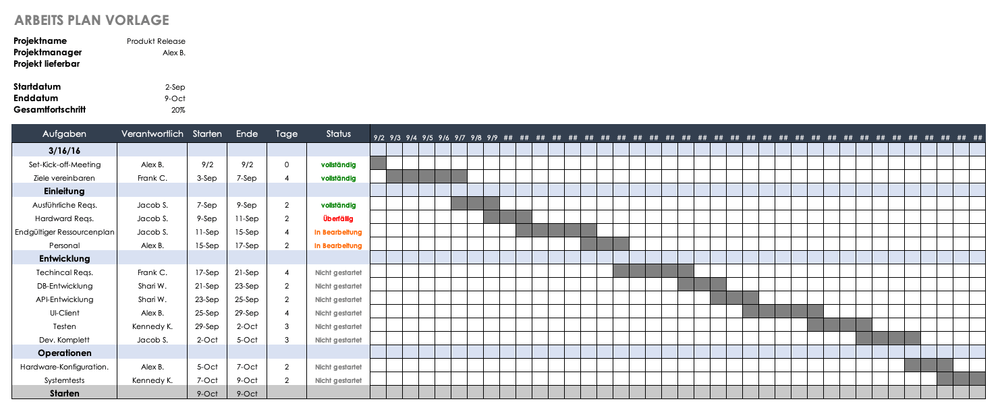

Best Practices sind aus der Praxis entstandene und auf Empirie basierende allgemeine Handlungsempfehlungen für Projektmanagement. Sie sind dabei nicht als optimale Lösung anzusehen, sondern als Erfahrungswert, der im Vergleich zu anderen Erfahrungswerten zu den besten Ergebnissen führt.[^1] Best Practices sollen bei einem Projekt dabei helfen Fehler zu vermeiden, die Auswirkungen auf den Projekterfolg haben können.[^2]

## 1. Frühzeitige und regelmäßige Kommunikation mit allen Stakeholdern
Von [Projektstart](Projektstart.md) an sollten alle Stakeholder im Rahmen des [Stakeholdermanagements](Stakeholdermanagement.md) über Ziele und aktuelle Zwischenstände des Projekts regelmäßig informiert werden. Zu den Stakeholdern gehören beispielsweise die Teammitglieder, Manager oder auch Externe wie Kunden.[^2] 

## 2. Kommunikation von Auswirkungen bei Erweiterung des Projektumfangs
Direkt an Punkt 1 schließt sich die Kommunikation bei Erweiterungen des Projektumfangs an. Oft ergeben sich während des Projekts neue Anfragen von Stakeholdern, bspw. dem Vorstand, die Auswirkungen auf Zeitplan und Budget haben können. Auch hier sollte frühzeitig mit allen Stakeholdern kommuniziert werden, um Konflikten vorzubeugen und bei allen ein klares Verständnis über sich ergebende Abweichungen durch Erweiterung des Projektumfangs zu schaffen.[^3] 

## 3. Betreiben von Risikomanagement
Im Projekt ist es sehr wichtig mögliche Risiken zu identifizieren, einzuschätzen wie sich diese auf das Projekt auswirken können und daraus geeignete Maßnahmen zu entwickeln. Hierdurch sollen Kostenexplosionen als auch Sprengungen des Zeitplans vermieden werden. Beim [Risikomanagement](Risikomanagement.md) im Projekt sollten daher sowohl feste Eskalationspläne als auch verschiedene [Eskalationsstufen](Eskalationsstufen.md) für Probleme etabliert werden. Beide haben das Ziel bei der Bewältigung von Problemen zu helfen, in der Praxis hat sich nämlich gezeigt, dass wichtige Stakeholder oft zu spät über Komplikationen informiert werden. Durch das Risikomanagement sollen neben Risiken aber auch Chancen identifiziert werden. Durch das Wählen richtiger Schritte können ihre Eintrittswahrscheinlichkeiten wiederum erhöht werden.[^3] 

## 4. Detaillierter Projektplan
Der Projektplan soll zur Organisation von Aufgaben und Verantwortlichkeiten dienen. Hierzu sind neben Zeit, Budget und Umfang auch Ziele und Probleme in die [Projektplanung](Projektplanung.md) zu integrieren. Bei der Verteilung von Aufgaben auf Ebene einzelner Arbeitspakete ist es wichtig darauf zu achten, dass diese in vorgegebener Zeit erledigt werden können. Überarbeitung und Demotivation bei den Projektmitgliedern können dadurch verhindert werden. Ein ständiges Monitoring des Projektfortschritts ist hierfür hilfreich.[^3]
Der beigefügte Arbeitsplan zeigt beispielhaft von oben nach unten abgebildet die verschiedenen Projektphasen inklusive dazugehöriger Arbeitspakete und weiteren Informationen, wie dem Zuständigen, dem Status und das Enddatum des Arbeitspakets. Von links nach rechts wird der geplante zeitliche Verlauf des Projekts abgebildet.

[^4]

## 5. Schriftliche Dokumentation
Das schriftliche Festhalten von allen Informationen ist in einem Projekt sehr wichtig. Damit soll sichergestellt werden, dass den Stakeholdern die für sie relevanten Daten zur Verfügung stehen. Des Weiteren kann die [Projektdokumentation](Projektdokumentation.md) später dazu dienen Entscheidungen zu treffen oder nachzuvollziehen, warum bestimmte Entscheidungen getroffen wurden.[^5] 

## 6. Definierte Start- und Endpunkte
Zu Beginn eines Projekts sollte ein [Kick-Off-Termin](Projekt_Kick_Off.md) abgehalten werden. Dieser bietet die Gelegenheit in einer Veranstaltung alle Projektbeteiligten zu versammeln, sich kennenzulernen und auf das gemeinsame Arbeiten einzustimmen.[^3] Nach dem Projektende wiederum ist der Moment erreicht, an dem es Zeit ist zu analysieren wie das Projekt abgelaufen ist, welche Fehler gemacht worden sind und was gut gelaufen ist. Hier sollten erneut alle Projektbeteiligten in einer Besprechung zusammengebracht werden, um deren Ansichten über Erfolge und Misserfolge zu sammeln. Ziel ist es die [Lessons learned](Lessons_Learned.md) zu nutzen, um nächste Projekte zu optimieren und ggf. neue Best Practices zu formulieren. Dadurch können im Idealfall auch Kosten und Zeit gespart werden.[^2]

## Siehe auch

* [Stakeholdermanagement](Stakeholdermanagement.md)
* [Risikomanagement](Risikomanagement.md)
* [Eskalationsstufen](Eskalationsstufen.md)
* [Projektplanung](Projektplanung.md)
* [Projektdokumentation](Projektdokumentation.md)
* [Projekt-Kick-Off](Projekt_Kick_Off.md)
* [Lessons learned](Lessons_Learned.md)

## Weiterführende Literatur

* [Projektmanagement: 9 Best Practices zur Steigerung der Erfolgschancen Ihrer Projekte](https://www.pebco.ag/impuls/projektmanagement-9-best-practices-zur-steigerung-der-erfolgschancen-ihrer-projekte/)
* [10 Best Practices im Projektmanagement](https://www.wrike.com/de/blog/10-best-practices-im-projektmanagement/)

## Quellen

[^1]: https://www.projektmagazin.de/glossarterm/best-practice 
[^2]: https://www.wrike.com/de/blog/10-best-practices-im-projektmanagement/
[^3]: https://www.pebco.ag/impuls/projektmanagement-9-best-practices-zur-steigerung-der-erfolgschancen-ihrer-projekte/ 
[^4]: https://de.smartsheet.com/top-excel-project-plan-templates 
[^5]: https://www.wrike.com/de/blog/projektmanagement-best-practices-infografik/

