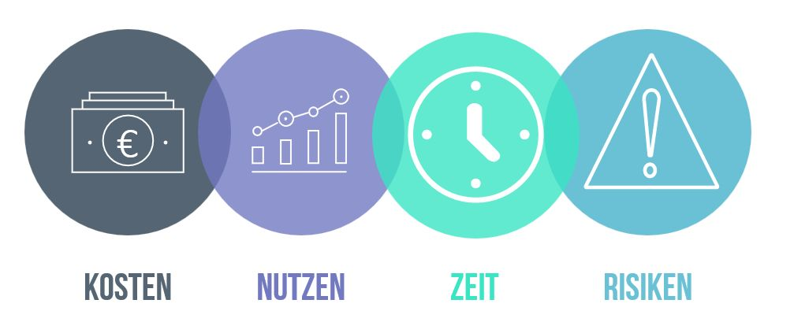

# Business Cases
Ein Business Case ist ein wichtiges Projektdokument. Er analysiert die Wirtschaftlichkeit eines [Projekts](Projekt.md) oder einer Investition und verschafft den Entscheidungsträgern einen umfassenden Überblick über Kosten, Nutzen und Risiken eines Projekts.[^1]  Kosten und Nutzen können monetär sein, umfassen aber auch andere Kriterien wie die Auswirkungen auf die Arbeitgeberattraktivität oder die Mitarbeitermotivation.[^2]  Der Business Case gibt eine Aussage darüber, ob sich die Durchführung eines Vorhabens lohnen würde oder nicht und stellt damit eine wichtige Entscheidungs- und Rechtfertigungsgrundlage für Projekte dar. Ist ein Projekt dann erst einmal genehmigt und im Gange, wird der Business Case stetig aktualisiert, sodass sich damit auch laufende Projekte überprüfen und rechtfertigen lassen.[^1] 
 [^3]

## Inhaltsverzeichnis
* [1. Etymologie](https://github.com/lukasheinrich9/ManagingProjectsSuccessfully.github.io/blob/main/kb/Business_Cases.md#1etymologie)
* [2. Bestandteile](https://github.com/lukasheinrich9/ManagingProjectsSuccessfully.github.io/blob/main/kb/Business_Cases.md#2bestandteile)
* [3. Bedeutung](https://github.com/lukasheinrich9/ManagingProjectsSuccessfully.github.io/blob/main/kb/Business_Cases.md#3bedeutung)
* [4. Vorteile](https://github.com/lukasheinrich9/ManagingProjectsSuccessfully.github.io/blob/main/kb/Business_Cases.md#4vorteile)
* [5. Nachteile](https://github.com/lukasheinrich9/ManagingProjectsSuccessfully.github.io/blob/main/kb/Business_Cases.md#5nachteile)
* [6. Fazit](https://github.com/lukasheinrich9/ManagingProjectsSuccessfully.github.io/blob/main/kb/Business_Cases.md#6fazit)

## 1.	Etymologie
Der Anglizismus „Business Case“ hat sich aufgrund fehlender passender Übersetzungen auch im Deutschen durchgesetzt. Zwar werden in der Literatur hier und da Begriffe wie [„Geschäftsfall”](https://wirtschaftslexikon.gabler.de/definition/geschaeftsvorfaelle-35319) oder [„Geschäftsszenario”](https://www.netinbag.com/de/business/what-is-a-business-scenario.html) verwendet, diese haben aber eine andere Bedeutung. Unzutreffend sind ebenfalls Begriffe wie [„Business Plan"](https://wirtschaftslexikon.gabler.de/definition/businessplan-31252) oder [„Business Model”](https://wirtschaftslexikon.gabler.de/definition/geschaeftsmodell-52275). Durchgesetzt hat sich daher der Begriff „Business Case“, der nicht übersetzt wird.[^1] 

## 2.	Bestandteile
Für einen Business Case existiert keine allgemein gültige Vorlage. Er kann daher unterschiedlich aufgebaut sein. Einen Leitfaden bietet das britische Vorgehensmodell [PRINCE2](PRINCE2.md), nach welchem ein Business Case die folgenden acht Bestandteile aufweist:
* **Gründe für das Projekt:** z.B.: Rückgang der Nachfrage
* **Optionen/Handlungsalternativen:** z.B.: Marketingkampagne
* **Erwarteter Nutzen:** z.B.: Steigerung der Nachfrage
* **Risiken:** z.B.: Scheitern der Kampagne aufgrund von besseren Konkurrenzprodukten
* **Kosten:** sind dem Projektplan zu entnehmen
* **Zeitrahmen:** sind dem Projektplan zu entnehmen
* **Investitionsrechnung:** Analyse der finanziellen Auswirkungen
* **Bewertung des Nutzens und der Investitionsrechnung:** Bewertung der Analyseergebnisse.[^4] 

## 3.	Bedeutung
Unternehmen treffen viele ihrer Entscheidungen auf Basis wirtschaftlicher Überlegungen. Hierbei kommt dem Business Case eine entscheidende Rolle zu, da er beurteilt, welche Vorhaben wirtschaftlich sind und eine Priorisierung von Projekten erlaubt.[^5] Im [Projektmanagement](Projektmanagement.md)-System PRINCE2 ist er sogar das wichtigste Projektdokument.[^6] Mithilfe eines strukturierten Business Case kann ein Unternehmen seinen Fokus gezielt auf die aussichtsreichsten Projekte legen und Ressourcen, Arbeitskräfte und Finanzmittel entsprechend einsetzen. Selbst wenn der Business Case eine negative Rentabilitätsbeurteilung liefert, das Vorhaben sich also nicht lohnt, war der Aufwand für dessen Erstellung nicht umsonst, da die hohen Kosten einer Durchführung des Projekts vermieden werden können.[^5]  

## 4.	Vorteile 
* **Erhöhte Entscheidungssicherheit:** Der Business Case trifft klare Aussagen über die wirtschaftlichen Folgen eines Vorhabens für das Unternehmen.[^1] 
* **Erleichterte Entscheidungsfindungen:** Einheitliche Formate von Business Cases ermöglichen die Vergleichbarkeit von verschiedenen Projekten und die anschließende Umsetzung der rentabelsten.[^7] 
* **Übersicht:** Der Business Case stellt den Entscheidungsträgern einen Gesamtüberblick über das Projekt zur Verfügung.
* **Risikoerkennung:** Der durch den Business Case erlangte Überblick hilft den Entscheidungsträgern dabei, Risiken frühzeitig zu identifizieren und entgegenzuwirken.[^1]
* **Erleichterung des [Projektcontrollings](Projektcontrolling.md):** Die Annahmen zum Projektverlauf im Rahmen des Business Cases lassen sich gut mit dem tatsächlichen Projektverlauf abgleichen.[^5] 

## 5.	Nachteile 
* **Momentaufnahme:** Der Business Case stellt nur eine Momentaufnahme dar, sodass sich die Rentabilität des Projekts im Laufe der Zeit mit zusätzlich erlangten Informationen ändern kann.
* **Hoher Aufwand:** Insbesondere bei großen Investitionen ist der Business Case sehr aufwändig zu erstellen.[^8] 
* **Widersprüchlichkeit:** Sind an einem Projekt mehrere Organisationen oder Unternehmen beteiligt können für ein Projekt verschiedene Business Cases vorliegen, die sich widersprechen.
* **Verfälschung:** Da der Business Case eine wichtige Entscheidungsgrundlage für ein Projekt darstellt, wird der erwartete Nutzen oft besser dargestellt als in Wirklichkeit, um die Projektgenehmigung herbeizuführen.[^9] 

## 6.	Fazit
Der Business Case hat sich zu einem wichtigen Bestandteil im Projektmanagement etabliert und trägt durch seine detaillierte Analyse der Wirtschaftlichkeit von Projekten zu der erfolgreichen Umsetzung der rentabelsten Vorhaben bei.[^7] 

## 8. Siehe auch

* [Projekt](Projekt.md)
* [Projektmanagement](Projektmanagement.md)
* [Projektcontrolling](Projektcontrolling.md)
* [PRINCE2](PRINCE2.md)
* [Kosten-Nutzen-Analyse](Kosten_Nutzen_Analyse.md)
* [Ausgangsanalyse](Ausgangsanalyse.md)

## 9. Quellen

[^1]: [Was ist ein Business Case?](https://www.microtool.de/wissen-online/was-ist-ein-business-case/)
[^2]: [Business Case - Definition](https://wirtschaftslexikon.gabler.de/definition/business-case-123490#definition)
[^3]: [Business Case - Abbildung](https://greenprojectsconsulting.com/wp-content/uploads/2021/07/Business_Case_4_Bubbles.jpg)
[^4]: [Business Case - Definition/Inhalte/Beispiele](https://www.projektmagazin.de/glossarterm/business-case)
[^5]: [Was ist ein Business Case?](https://t2informatik.de/wissen-kompakt/business-case/)
[^6]: [So schreiben Sie einen Business Case. Teil 1: Formalien und Einstieg](https://www.solutionmatrix.de/presse/projektmagazin_business_case_1.pdf)
[^7]: [Business Case: Alles Wichtige auf einen Blick](https://projekte-leicht-gemacht.de/blog/methoden/projektstart/business-case/)
[^8]: [Auf den Punkt - der Business Case](https://www.youtube.com/watch?v=gCbXCawrT8k)
[^9]: [Business Case](https://www.projektmagazin.de/methoden/business-case)

