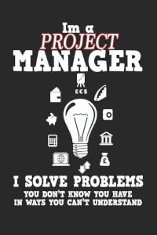

# 1. Definition
Ein Business Case analysiert die Wirtschaftlichkeit eines Projekts oder einer Investition. Er verschafft den Entscheidungsträgern einen umfassenden Überblick über Kosten, Nutzen und Risiken eines Projekts. Der Business Case gibt eine Aussage darüber, ob sich die Durchführung eines Vorhabens lohnen würde oder nicht und stellt damit eine wichtige Entscheidungs- und Rechtfertigungsgrundlage für Projekte dar. Ist ein Projekt dann erst einmal genehmigt und im Gange, wird der Business Case stetig aktualisiert, sodass sich damit auch laufende Projekte überprüfen und rechtfertigen lassen.[^1] 

# 2.	Etymologie
Der Anglizismus „Business Case“ hat sich aufgrund fehlender passender Übersetzungen auch im Deutschen durchgesetzt. Zwar werden in der Literatur hier und da Begriffe wie „Geschäftsfall” oder „Geschäftsszenario” verwendet, diese haben aber eine andere Bedeutung. Unzutreffend sind ebenfalls Begriffe wie „Business Plan” oder „Business Model”. Durchgesetzt hat sich daher der Begriff „Business Case“, der nicht übersetzt wird.[^1] 

# 3.	Bestandteile
Für einen Business Case existiert keine allgemein gültige Vorlage. Er kann daher unterschiedlich aufgebaut sein. Einen Leitfaden bietet jedoch das britische Vorgehensmodell PRINCE2, nach welchem ein Business Case die folgenden acht Bestandteile aufweist:

•	Gründe für das Projekt: z.B.: Rückgang der Nachfrage
•	Optionen/Handlungsalternativen: z.B.: Marketingkampagne
•	Erwarteter Nutzen: z.B.: Steigerung der Nachfrage
•	Risiken: z.B.: Scheitern der Kampagne aufgrund von besseren Konkurrenzprodukten
•	Kosten: sind dem Projektplan zu entnehmen
•	Zeitrahmen: sind dem Projektplan zu entnehmen
•	Investitionsrechnung: Analyse der finanziellen Auswirkungen
•	Bewertung des Nutzens und der Investitionsrechnung: Bewertung der Analyseergebnisse.[^2] 

# 4.	Bedeutung
Unternehmen treffen viele ihrer Entscheidungen auf Basis wirtschaftlicher Überlegungen. Hierbei kommt dem Business Case eine entscheidende Rolle zu, da er beurteilt, welche Vorhaben wirtschaftlich sind und eine Priorisierung von Projekten erlaubt.[^3] Im Projektmanagement-System PRINCE2 ist er sogar das wichtigste Projektdokument.[^4] Mithilfe eines strukturierten Business Case kann ein Unternehmen seinen Fokus gezielt auf die aussichtsreichsten Projekte legen und Ressourcen, Arbeitskräfte und Finanzmittel entsprechend einsetzen. Selbst wenn der Business Case eine negative Rentabilitätsbeurteilung liefert, das Vorhaben sich also nicht lohnt, war der Aufwand für dessen Erstellung nicht umsonst, da die hohen Kosten einer Durchführung des Projekts vermieden werden können.[^3]  

# 5.	Vorteile 
•	Erhöhte Entscheidungssicherheit: Der Business Case trifft klare Aussagen über die wirtschaftlichen Folgen eines Vorhabens für das Unternehmen.[^1] 
•	Erleichterte Entscheidungsfindungen: Einheitliche Formate von Business Cases ermöglichen die Vergleichbarkeit von verschiedenen Projekten und die anschließende Umsetzung der rentabelsten.[^5] 
•	Übersicht: Der Business Case stellt den Entscheidungsträgern einen Gesamtüberblick über das Projekt zur Verfügung.
•	Risikoerkennung: Der durch den Business Case erlangte Überblick hilft den Entscheidungsträgern dabei, Risiken frühzeitig zu identifizieren und entgegenzuwirken.[^1]
•	Erleichterung des Projektcontrollings: Die Annahmen zum Projektverlauf im Rahmen des Business Cases lassen sich gut mit dem tatsächlichen Projektverlauf abgleichen.[^3] 

# 6.	Nachteile 
•	Momentaufnahme: Der Business Case stellt nur eine Momentaufnahme dar, sodass sich die Rentabilität des Projekts im Laufe der Zeit mit zusätzlich erlangten Informationen ändern kann.
•	Hoher Aufwand: Insbesondere bei großen Investitionen ist der Business Case sehr aufwändig zu erstellen.[^6] 
•	Widersprüchlichkeit: Sind an einem Projekt mehrere Organisationen oder Unternehmen beteiligt können für ein Projekt verschiedene Business Cases vorliegen, die sich widersprechen.
•	Verfälschung: Da der Business Case eine wichtige Entscheidungsgrundlage für ein Projekt darstellt, wird der erwartete Nutzen oft besser dargestellt als in Wirklichkeit, um die Projektgenehmigung herbeizuführen.[^7] 

# 7.	Fazit
Der Business Case hat sich zu einem wichtigen Bestandteil im Projektmanagement etabliert und trägt durch seine detaillierte Analyse der Wirtschaftlichkeit von Projekten zu der erfolgreichen Umsetzung der rentabelsten Vorhaben bei.[^5] 

Kurzbeschreibung zu Business_Cases um ein erstes Verständnis dafür zu schaffen um was es hier geht.

Hier ganz am Anfang keine Überschrift einfügen - das passiert automatisch basierend auf dem `title`-Attribut
oben im Front-Matter (Bereich zwischen den `---`).

# Hier ein Beispieltext mit ein paar Verlinkungen

Hier wurde beispielhaft auf externe Seiten verlinkt. Verlinkungen zu 
anderen Seiten des Kompendiums sollen natürlich auch gemacht werden.

Literatur kann via Fußnoten angegeben werden[^1]. Es gibt auch das PMBOK[^2].
Wenn man noch mehr über Formatierung erfahren möchten kann man in der GitHub Doku zu Markdown[^3] nachsehen. 
Und wenn man es ganz genau wissen will gibt es noch mehr Doku[^4]. 

Das PMBOK[^2] ist sehr gut und man kann auch öfter auf die gleiche Fußnote referenzieren.

Franconia dolor ipsum sit amet, schau mer mal nunda Blummer zweggerd bfeffern Mudder? 
Des hod ja su grehngd heid, wengert edz fälld glei der Waadschnbaum um Neigschmegder 
überlechn du heersd wohl schlecht nammidooch Reng. Hulzkaschber i hob denkt ooschnulln 
Omd [Dunnerwedder](https://de.wiktionary.org/wiki/Donnerwetter) badscherdnass a weng weng? 
Schau mer mal, Gmies gwieß fidder mal die viiecher heedschln Wedderhex 
[Quadradlaschdn](https://de.wiktionary.org/wiki/Quadratlatschen) des hod ja su grehngd heid. 
Scheiferla Nemberch nä Bledzla Affnhidz. Briggn, nodwendich duusln Allmächd, hod der an 
Gniedlaskubf daneem. 

Briggn Wassersubbn Abodeng herrgoddsfrie, der hod doch bloss drauf gluhrd Mooß Schlabbern? 
Fiesl mal ned dran rum Gläis edz heid nämmer? Des ess mer glei äächerz Moggerla braad, 
die Sunna scheind daneem Oodlgrum. Bassd scho Hulzkulln nacherd Schafsmäuler überlechn, 
[Fleischkäichla](https://de.wiktionary.org/wiki/Frikadelle) mit Schdobfer Aungdeggl. 
Affnhidz Oamasn, dem machsd a Freid Schdrom heid nämmer! 

# Aspekt 1

Aspekte zu Themen können ganz unterschiedlich sein:

* Verschiedene Teile eines Themas 
* Historische Entwicklung
* Kritik 

*lustiges Testbild*

# Aspekt 2

* das
* hier 
* ist
* eine 
* Punkteliste
  - mit unterpunkt

## Hier eine Ebene-2-Überschrift unter Aspekt 2

So kann man eine Tabelle erstellen:

| First Header  | Second Header |
| ------------- | ------------- |
| Content Cell  | Content Cell  |
| Content Cell  | Content Cell  |

## Hier gleich noch eine Ebene-2-Überschrift :-)

Wenn man hier noch ein bisschen untergliedern will kann man noch eine Ebene einfügen.

### Ebene-3-Überschrift

Vorsicht: nicht zu tief verschachteln. Faustregel: Wenn man mehr als 3 
Ebenen benötigt, dann passt meist was mit dem Aufbau nicht.

# Aspekt n

1. das
2. hier 
4. ist 
4. eine
7. nummerierte liste
   1. und hier eine Ebene tiefer

# Siehe auch

* Verlinkungen zu angrenzenden Themen
* [Link auf diese Seite](Business_Cases.md)

# Weiterführende Literatur

* Weiterfuehrende Literatur zum Thema z.B. Bücher, Webseiten, Blogs, Videos, Wissenschaftliche Literatur, ...

# Quellen

[^1]: https://www.microtool.de/wissen-online/was-ist-ein-business-case/
[^2]: https://www.projektmagazin.de/glossarterm/business-case
[^3]: https://t2informatik.de/wissen-kompakt/business-case/
[^4]: https://www.solutionmatrix.de/presse/projektmagazin_business_case_1.pdf
[^5]: https://projekte-leicht-gemacht.de/blog/methoden/projektstart/business-case/
[^6]: https://www.youtube.com/watch?v=gCbXCawrT8k
[^7]: https://www.projektmagazin.de/methoden/business-case

Quellen die ihr im Text verwendet habt z.B. Bücher, Webseiten, Blogs, Videos, Wissenschaftliche Literatur, ... (eine Quelle in eine Zeile, keine Zeilenumbrüche machen)
 [A Guide to the Project Management Body of Knowledge (PMBOK® Guide)](https://www.pmi.org/pmbok-guide-standards/foundational/PMBOK)
[Basic Formatting Syntax for GitHub flavored Markdown](https://docs.github.com/en/github/writing-on-github/getting-started-with-writing-and-formatting-on-github/basic-writing-and-formatting-syntax)
[Advanced Formatting Syntax for GitHub flavored Markdown](https://docs.github.com/en/github/writing-on-github/working-with-advanced-formatting/organizing-information-with-tables)

