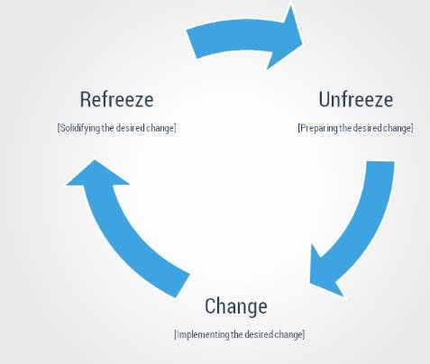
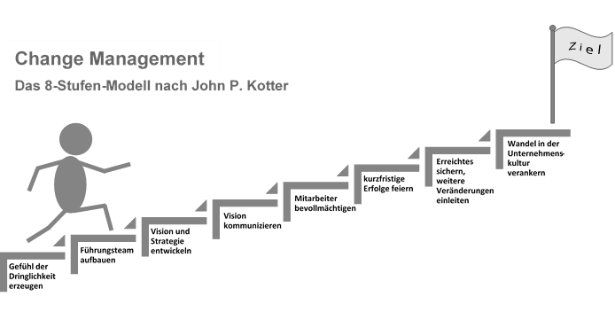

# Veränderungen
Nichts ist so beständig wie der Wandel [^1]. Die Welt im 21. Jahrhundert ist von einer großen Dynamik geprägt.
Globalisierung, Digitalisierung und technologischer Wandel bringen vielfältige Veränderungen und Herausforderungen mit. Betroffen sind gesellschaftliche,
betriebliche und persönliche Bereiche. Um [Veränderungen auf betrieblicher Seite](Managing_Change_in_Organisations.md) zu fördern und zu gestalten, dient das Change Management [^2].

# Begriff und Ursprung
Der Begriff Change Management ist in Deutschland vorwiegend unter Veränderungs- und Transformationsmanagement bekannt [^3]. 
Moran und Brightman beschreiben Change Management als "the process of  continually renewing an organization's direction, structure, and capabilities to serve 
the ever-changing needs of external and internal customer" [^4].
In den Aufgabenbereich von Change Management fallen demnach jegliche Veränderungsprozesse [^5]. 
Der Ursprung von Change Management kann auf die "Hawthorne" Experimente zu Beginn der 1930er Jahre zurückgeführt werden [^3].
Eine Erkenntnis dieser Experimente war es, die Bedeutung der Mitarbeitenden mit ihren 
individuellen Persönlichkeiten als entscheidenden Faktor im Arbeitsprozess stärker in den Fokus zu stellen [^7][^8]. 
Ein kennzeichnendes Merkmal von Change Management ist demnach die nach innen gerichtete und auf die 
Mitarbeitenden einer Organisation ausgelegte Sichtweise. 
Dies ist ein wesentlicher Unterschied zu strategischem Management, welches sich an Faktoren im Unternehmensumfeld orientiert[^2][^3].

# Aufgaben und Ziele
Die Initiierung und Einleitung von Veränderungen in Unternehmen beginnen im Rahmen der strategischen Planung. 
Change Management geht einen Schritt weiter. 
Ziel ist es, den Weg zur Umsetzung der getroffenen Strategie zu fördern und zu gestalten [^2].  
Die Durchführung von [Change Management in Organisationen](Managing_Change_in_Organisations.md) erfolgt 
in Form von [Change Projekten](Change_Projekte.md). Die Steuerung und Planung von [Change Projekten](Change_Projekte.md) ist 
ein vielseitiges und kompliziertes Vorhaben, dass unterschiedliche Aspekte zu berücksichtigen hat [^2]. 
Ein wichtiger Baustein innerhalb dieses Prozesses ist es, die Mitarbeitenden des Unternehmens in den Fokus zu stellen
und im Veränderungsgeschehen zu begleiten. [^4]. 
Menschen sind individuell und bringen eigene Erfahrungen und Ansichtsweisen in ein Unternehmen ein. Aus diesem Grund
gilt es im Zuge von Change Management neben der Entwicklung fehlender Kompetenzen vor allem darum, eine positive Einstellung 
der Mitarbeitenden gegenüber den bevorstehenden Veränderungen zu schaffen [^2]. Insbesondere ein
sensibler Umgang mit Widerständen stellt einen wichtigen Erfolgsfaktor im Veränderungsprozess dar [^7]. 
Weitere hervorzuhebende Faktoren außerhalb der individuellen Ebene liegen vor allem 
in der Berücksichtigung vorliegender Unternehmensstrukturen- und kulturen[^2]. 

# Anleitung und Modelle
Aufgrund der Komplexität der Faktoren ist eine pauschale Anleitung zur erfolgreichen Gestaltung des Wandels nicht vorhanden. 
Jedoch existieren eine Vielzahl an Modellen zur Gestaltung von [Change Projekten](Change_Projekte.md)[^3].
Eine oft zu beobachtende Gemeinsamkeit ist die sequentielle Abfolge einzelner Schritte im Verlauf des Veränderungsprozesses [^8]. 
Zwei der bekanntesten Modelle sind das [8 Stufen Modell von Kotter](8_Step_Process_for_Leading_Change.md) und das 3-Stufen Modell von Lewin [^9][^10].

## Lewin Modell
Lewin unterteilt den Veränderungsprozess in 3 Stufen ein[^9]:
1. unfreezing
2. moving
3. freezing

In der ersten Stufe wird dabei der Veränderungprozess vorbereitet (bspw. durch Diskussionen und Begründungen) [^11].
Erst im folgenden Schritt werden die Neuerungen eingeführt und anschließend als Standards abgesichert[^12]. 

*3-Stufen Modell nach Lewin [^13]*

## Kotter Modell
Kotter schlägt [8 Stufen auf dem Weg zu erfolgreichem Change Management](8_Step_Process_for_Leading_Change.md) vor.
Insbesondere stellt dieser die Bedeutung und das Kommunizieren einer gemeinsamen Vision heraus [^10].

*8-Stufen Modell nach Kotter [^14]*

# Forschung und Praxis

Durch immer kürzere Veränderungszyklen und die zunehmende Schnelllebigkeit in einer globalisierten Welt, hat das Change Management in den letzten 
Jahrzehnten eine erhöhte Aufmerksamkeit in Forschung und Praxis erfahren. Trotz dieser Anstrengungen und 
der daraus entstandenden Vielzahl an Modellen bzw. Vorschläge zur Gestaltungsmöglichkeit, scheitern weiterhin viele [Change-Management-Projekte](Change_Projekte.md) in der Praxis[^12]. 

# Siehe auch

* [Projektmanagement](Change_Management.md)
* [Change-Projekte](Change_Projekte.md)
* [Veränderungen in Unternehmen gestalten](Managing_Change_in_Organisations)
* [8-Stufen Modell von John Kotter](8_Step_Process_for_Leading_Change)

# Weiterführende Literatur
* [Video und Erläuterungen zum Hawthorne-Effekt](https://www.youtube.com/watch?v=fei2WVqEykM)
* [Blog rund um das Thema Change Management](https://www.tiba-prosci.com/blog/#)
* [TED-Talk zur Gestaltung von Veränderungen in Organisationen](https://www.youtube.com/watch?v=3n-c6iAKFgg)
* [Wissenschaftlicher Artikel zur Differenzierung von Change Management und Change Leadership](https://doi.org/10.1080/714023845)
* [Buch zu Grundlagen und Erfolgsfaktoren im Change Management](https://link.springer.com/content/pdf/10.1007%2F978-3-662-59102-4.pdf)
* [Buch zur erfolgreichen Gestaltung von Veränderungsprozessen](https://link.springer.com/content/pdf/10.1007%2F978-3-540-78855-3.pdf)
* [Video zu den 3-Stufen von Lewin](https://www.youtube.com/watch?v=kerDFvln7hU)
* [Video zu den 8-Stufen von John Kotter](https://www.youtube.com/watch?v=xMhfhuB2SME)
* [Weitere Erläuterungen zu den 8-Stufen von John Kotter](https://www.youtube.com/watch?v=7qlJ_Y8w5Yk)
* [Website mit ausführlichen Erklärungen zum 8-Stufen Modell von John Kotter](https://digitaleneuordnung.de/blog/kotter-modell/)
* [Verschiedene Change Management Modelle im Vergleich](https://organisationsberatung.net/change-management-modelle-im-vergleich/)

# Quellen

[^1]: Das Sprichwort wird dem Philosophen Heraklit zugeordnet. Siehe auch: https://www.uni-bamberg.de/fileadmin/uni/fakultaeten/ppp_lehrstuehle/psychologie_4/dokumente/WS1718/Download_Newsletter_2019-01.pdf
[^2]: Lauer, T. (2019). Change Management: Grundlagen und Erfolgsfaktoren (3., vollst. überarb. u. erw. Aufl. 2019 Aufl.). Berlin: Springer Gabler. https://doi.org/10.1007/978-3-662-59102-4
[^3]: Schridde, H. (2019). Change Management. In S. Veit, C. Reichard & G. Wewer (Hrsg.), Handbuch zur Verwaltungsreform (5., vollständig überarbeitete Aufl. 2019 Aufl.) (S. 691 - 704). Wiesbaden: Springer VS. https://doi.org/10.1007/978-3-658-21563-7
[^4]: Moran, J. W., & Brightman, B. K. (2000). Leading organizational change. Journal of workplace learning, 12(2), 66-74. Verfügbar unter: https://www.emerald.com/insight/content/doi/10.1108/13665620010316226/full/html
[^5]: https://wirtschaftslexikon.gabler.de/definition/change-management-28354
[^6]: http://www.wirtschaftslexikon24.com/d/hawthorne-experimente/hawthorne-experimente.htm
[^7]: Doppler, K. & Lauterburg, C. (2014). Change Management. Frankfurt, New York: Campus Verlag. https://books.google.de/books?hl=de&lr=&id=fnRxAgAAQBAJ&oi=fnd&pg=PA5&dq=Doppler,+K.+%26+Lauterburg,+C.+(2014).+Change+Management&ots=ohvjaFcC2m&sig=fOEfUCxmW5kzADplcDIyFNOK9dY#v=onepage&q&f=false
[^8]: Stouten, J., Rousseau, D. M. & de Cremer, D. (2018). Successful Organizational Change: Integrating the Management Practice and Scholarly Literatures. Academy of Management Annals, 12(2), 752–788. https://doi.org/10.5465/annals.2016.0095
[^9]: Lewin, K. (1947). Frontiers in Group Dynamics. Human Relations, 1(1), 5–41. https://doi.org/10.1177/001872674700100103
[^10]: Kotter, J. P. (1995). Why transformation efforts fail. Harvard Business Review. Verfügbar unter: http://www.mcrhrdi.gov.in/91fc/coursematerial/management/20%20Leading%20Change%20-%20Why%20Transformation%20Efforts%20Fail%20by%20JP%20Kotter.pdf
[^11]: https://de.wikipedia.org/wiki/3-Phasen-Modell_von_Lewin
[^12]: https://de.wikipedia.org/wiki/Veränderungsmanagement
[^13]: https://www.researchgate.net/figure/Lewins-3-stage-model-Unfreeze-This-stage-prepares-individuals-for-the-change-In_fig3_334736458
[^14]: https://www.yunava.com/effektives-change-management-bei-der-digitalisierung-interner-prozesse/ 
