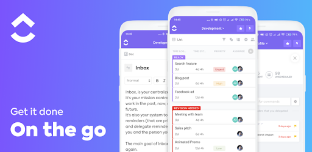

[ClickUp](https://clickup.com) ist ein Kollaborations- & [Projekt-Management Tool](Uebersicht_PM_Tools.md) , das für sämtliche Arten und Größen von Unternehmen geeignet ist. Verschiedene Funktionen, die zur Planung, Organisation und vor allem Zusammenarbeit von [Projekten](Projekt.md) dienen werden auf einer Plattform zusammengefügt[^2]. Die Kernidee des Unternehmens war es Funktionen von bereits vorhandenen Projekt-Management-Tools wie [Trello](Trello_PM_Tool.md), [Asana](Asana_PM_Tool.md), [Jira](Jira_PM_Tool.md), usw. zu einem Tool zu kombinieren.[^1]

# Das Tool

ClickUp verbindet eine große Vielfalt an Features mit einer dennoch sehr übersichtlichen Gestaltung der Anwendung. 
Dem User werden alle Dateien und Aufgaben (Hier: „Tasks“) direkt auf dem eigenen Homescreen angezeigt. Durch die Möglichkeit Tasks und Dateien mit anderen zu
teilen, können Unternehmen anstehende Arbeit auf ihre Mitarbeiter verteilen. Hierbei erhält jede Person, die auf sich zugeteilte Arbeit. Eines der wichtigsten
Features ist hier der Unterpunkt „Spaces“. Hier hat man die Möglichkeit Teams aufzuteilen in die jeweiligen Zuständigkeitsbereiche, wie beispielsweise Marketing,
Software-Entwicklung, etc.[^1] Spaces lassen sich ebenfalls noch unterteilen in „Ordner“ und „Lists“, um für mehr Ordnung zu schaffen. Lists enthalten die eigentlichen Aufgaben, die dann noch aufgrund ihrer Priorität gekennzeichnet werden können. 

Weitere Funktionen, auf die ein großer Wert gelegt wird, sind Dashboards und Docs. Dashboard bietet die Möglichkeit eine Timeline zu erstellen, die verschiedene
Werte, Daten, Videos oder auch einen Chat mit Teammitgliedern anzeigt. Hier sind die Möglichkeiten zur Ausgestaltung wieder zahlreich. Docs ist vergleichbar mit der
Anwendung DropBox. Hier können alle möglichen Arten von Dateien oder Fotos geteilt werden. Bei allen Funktionen kann eingestellt werden welche Personen Zugriff oder
Einsicht haben auf diesen Inhalt.[^1] 

Bei allen Features und Möglichkeiten wird am meisten Wert auf die Kommunikation gelegt. Ob es ein direkter Chat ist oder die Kommentarfunktion bei Tasks, das Team
soll gemeinsam Ziele erreichen. 

# Einstieg in ClickUP
## App 

ClickUp wirbt ihre App mit dem Spruch: „One App to replace them all“. Erneut sollen Funktionen aus verschiedenen anderen Apps zu einer Anwendung zusammengeführt
werden. Ob als Tabellenkalkulation, [Kanban Board](Kanban_Board.md) oder auch als Projektmanagement-App wie [Microsoft Project](Microsoft_Project_PM_Tool.md), die
App ermöglicht verschiedene Anwendungsmöglichkeiten.[^6]

## Erleichterte Datenübernahme

ClickUp erleichtert Usern den Umstieg von anderen Projetkmanagement-Tools auf die eigene Anwendung, indem sie Import-Optionen von anderen Plattformen anbieten.
Aufgaben, Daten, etc. können sofort in den eigenen Account integriert werden. Zusätzlich können Programme wie Office 365, Slack, DropBox oder der Outlook-Kalender
in ClickUp miteinbezogen werden, um noch mehr Personalisierung und Komfort zu schaffen.[^4] 
ClickUp bietet ebenfalls die Möglichkeit andere Internetseiten zur eigenen Timeline, im Dashboard, hinzuzufügen. Beispiele wären YouTube, Keynote, LinkedIn,
Spotify, und viele Weitere.[^5]

# Preisliste

* ClickUp ist kostenlos nutzbar. Möglichkeit, bei Zahlung verschiedene Features freizuschalten.
* Bei der folgenden Tabelle wurden die monatlichen Preise betrachtet. Bei Abschluss von jährlichen Abonnements sinken die Preise monatlich betrachtet.

*(Tabelle gekürzt, bei [ClickUp](https://clickup.com) weitere Kategorien) 

|   Preise            |   Kostenlos   |      9$       |     19$      |      29$      |  Enterprise   |
| ---------------------- | ------------- | ------------- | ------------ | ------------- | ------------  |
|   Speicher             | 100 MB        | Unbegrenzt    | Unbegrenzt   |  Unbegrenzt   |  Unbegrenzt   |
|Synchronisierung¹       | Nein          | Ja            | Ja           |  Ja           | Ja            |
|Security (Features)     | 1 von 16      | 1 von 16      |     3 von 16 |     5 von 16  |    16 von 16  |
|Collaboration (Features)|     9 von 15  |    13 von 15  |    14 von 15 |    15 von 15  |    15 von 15  |
| Priority Support       | Nein          | Nein          | Nein         | Ja            | Ja            |

¹(Google Drive, Dropbox, Box Cloud, OneDrive Cloud)

# Siehe auch

* [Jira](Jira_PM_Tool.md)
* [MeisterTask](MeisterTask_PM_Tool.md)
* [Hive](Hive_PM_Tool.md)
* [Trello](Trello_PM_Tool.md)
* [Podio](Podio_PM_Tool.md)
* [Microsoft Project](Microsoft_Project_PM_Tool.md)
* [Microsoft Planner](Microsoft_Planner_PM_Tool.md)
* [Asana](Asana_PM_Tool.md)
* [Stackfield](Stackfield_PM_Tool.md)
* [Awork](Awork_PM_Tool.md)
* [Java](Java_PM_Tool.md)

# Weiterführende Literatur

* Homepage: [ClickUp](https://clickup.com)

# Quellen

[^1]: [ClickUp_Website](https://clickup.com)
[^2]: [getapp](https://www.getapp.de/software/106331/clickup#features)
[^3]: [ClickUp_Help](https://docs.clickup.com/en/)
[^4]: [Mintblau.com](https://www.mintblau.com/blog/projektmanagement-mit-clickup)
[^5]: [Embeding URL & HTML](https://docs.clickup.com/en/articles/2934308-embed-view)
[^6]: [ClickUp App](https://publishingblog.ch/wie-kann-clickup-eine-app-fuer-alles-sein/)
