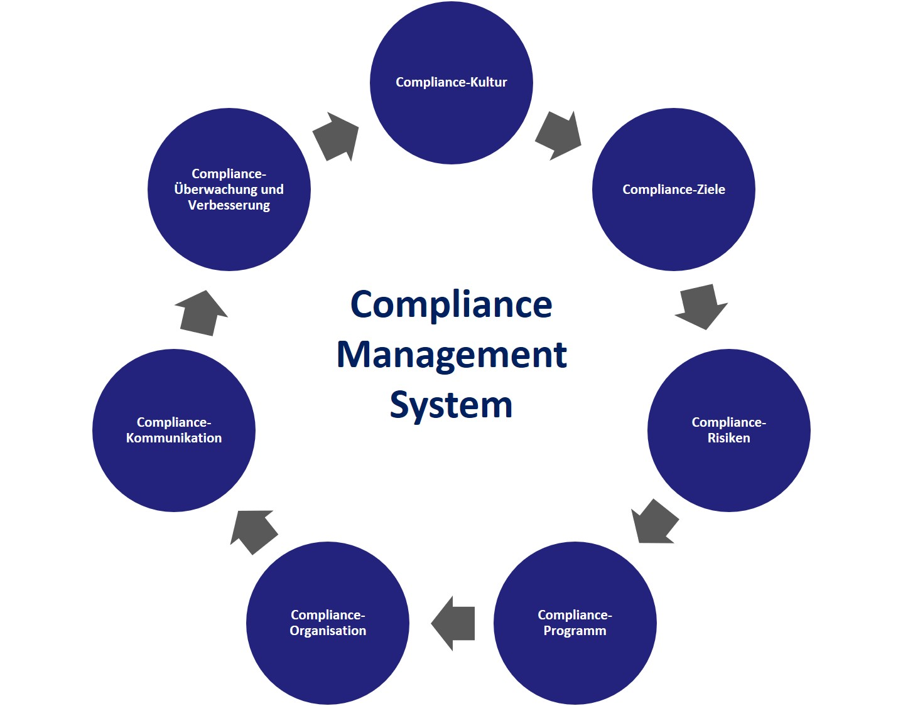

Compliance im Projektmanagement beschreibt im Prinzip, das regelgetreue Verhalten eines Unternehmens im gesetzlichen Kontext. Durch gezieltes Compliance Management sollen durch Prophylaxe gezielt Pflichtverletzungen, Schaden und Haftungsfälle eines Unternehmens vermieden werden. (Szabo, Bela: Compliance Management System) Ein Werkzeug um beispielsweise Lieferungszusagen einhalten zu können ist zum Beispiel das sogenannte [Timeboxing.](https://github.com/MartinEnders/ManagingProjectsSuccessfully.github.io/blob/main/kb/Timeboxing.md) Compliance ist somit am Beginn einer Planungsphase für Projekte innerhalb von Unternehmen einzuordnen.

# Rechtliche Grundlagen

Ein elementares Bestreben eines jeden Unternehmens sollte es sein, die nationalen und internationalen Rechtsverordnungen und Bestimmungen einzuhalten. So gibt es spezifisch im Bezug auf Compliance eine entsprechende ISO-Norm: [ISO 37301:2021](https://www.iso.org/standard/75080.html). Diese Norm spezifiziert Anforderungen und enthält Richtlinien für die Einrichtung, Entwicklung, Implementierung, Bewertung, Aufrechterhaltung und Verbesserung eines effektiven Compliance-Managements innerhalb einer Organisation. (International Organization for Standardization: ISO 37301:2021)
## Nationale Verordnungen
In Deutschland ist der Begriff Compliance juristisch nicht eindeutig definiert. Als Grundlage wird oftmals jedoch der Deutsche Corporate Governance Kodex (DCGK) herangezogen. Der Kodex beinhalten grundsätzlich Vorschriften zur Überwachung und Leitung deutscher börsennotierter Gesellschaften. Er besitzt jedoch keines Wegs eine rechtliche Verbindlichkeit. (Schulenberg, Matthias und Mertens, Jörg: Compliance und die Bedeutung für Unternehmen)
## Internationale Richtlinien
Wichtig für Unternehmen ist der Fakt sich auch an Gesetze anderer Länder im internationalen Geschäftsverkehr halten zu müssen. So müssen die gesetzlichen Verbindlichkeiten vor einer Partnerschaft beidseitig gut analysiert werden. Es gibt beispielsweise den [Foreign Corrupt Practices Act](https://www.justice.gov/criminal-fraud/foreign-corrupt-practices-act) (FCPA) zur Bekämpfung von Korruption oder den [UK Bribary Act](https://de.wikipedia.org/wiki/Bribery_Act_2010) als Compliance Vorschrift in Großbritannien. (Schulenberg, Matthias und Mertens, Jörg: Compliance und die Bedeutung für Unternehmen)
 
# Integration von Compliance im Unternehmen

Compliance in Organisationen umzusetzten bedarf zunächst einer umfangreichenden Ist-Analyse. Vollstädigkeit ist hier tatsächlich sehr umfangreich und deshalb nicht unbedingt einfach. Dieser Schritt ist in der Abbildung als Compliance Kultur zu sehen. Anschließend muss der Soll-Zustand definiert werden. Nun muss analysiert werden durch welche Änderungen und Anpassungen der angestrebte Zustand nun erreicht werden soll. (Schulenberg, Matthias und Mertens, Jörg: Compliance und die Bedeutung für Unternehmen) Da sich Gestze aber ändern können bedarf Compliance einer städigen Kontrolle auf ihrer Aktualität hin. Vor allem im internationalen Geschäftsraum ist es zunehmend schwerer allen Verordnungen und lokalen juristischen Gegebenheiten gerecht zu werden. (Szabo, Bela: Compliance Management System)

*Compliance Management System (CMS) (Leitner, Andreas: Compliance Management System)*

# Risiken und Prävention

Compliance dient in erster Linie dazu, Unternehmen und deren Akteure vor juristischen und wirtschaftlichen Konsequenzen zu bewahren. Oftmals sind für Verstöße gegen rechtliche Verordnungen hohe Geldstrafen fällig. Nicht selten besteht auch die Möglichkeit einer Freiheitsstrafe bei Vergehen härterer Art. (Schulenberg, Matthias und Mertens, Jörg: Compliance und die Bedeutung für Unternehmen) Mit einer Verurteilung bei Missachtung einer Vorschrift geht häufig ein Imageverlust einher, der dem Unternehmen zusätzlichen wirtschaftlichen Schaden kosten kann. (Otte, Holger: Einführung von Compliance Management Systemen)

# Abschließende Bemerkung und Einordnung in den Gesamtkontext

Compliance ist essentiell für Unternehmen und sonstige Organisationen. Diese müssen bereits in der Planungsphase neuer Projekte die rechtlichen Grundlagen des Zielmarktes analysieren und in weitere Schritte mit einbeziehen. Es muss sichergestellt werden ob aktuell rechtliche Bestimmungen verletzt werden und daraufhin gehandelt werden und es muss für zukünftige Projekte die Basisinformationen der rechtlichen Verordnungen sowohl lokaler als auch internationaler Märkte zur Verfügung stellen um so das Unternehmen vor Schaden zu bewahren. Deshalb ist Compliance im Projektmanagement unbedingt in den Beginn einer jeden Planungsphase eines neuen Projektes einzuordnen und unumgänglich wenn wirtschaftlicher und juristischer Schaden vermieden werden soll. Interessant um zu verstehen an welcher Stelle Compliance bei der Projektplanung steht sind vor allem beispielsweise verschiedenste [Vorgehensmodell](https://github.com/MartinEnders/ManagingProjectsSuccessfully.github.io/blob/main/kb/Vorgehensmodelle.md) die ein Projekt in mehrere Phasen unterteilt. Auch die [Digitalisierung im Projektmanagement](https://github.com/MartinEnders/ManagingProjectsSuccessfully.github.io/blob/main/kb/Digitalisierung_im_PM.md) spielt bei der Compliance eine große Rolle. Der ständige und schnelle Datenaustausch ermöglichen schnelle Reaktionen auf sich ändernde Umstände.
# Siehe auch

* [Digitalisierung im Projektmanagement](https://github.com/MartinEnders/ManagingProjectsSuccessfully.github.io/blob/main/kb/Digitalisierung_im_PM.md)
* [Timeboxing](https://github.com/MartinEnders/ManagingProjectsSuccessfully.github.io/blob/main/kb/Timeboxing.md)
* [Vorgehensmodelle](https://github.com/MartinEnders/ManagingProjectsSuccessfully.github.io/blob/main/kb/Vorgehensmodelle.md)

# Quellen

1. Szabo, Bela: Compliance Management System (https://www.haufe.de/compliance/management-praxis/compliance-management-systeme/compliance-management-system_230130_455824.html , zuletzt aufgerufen am 20.11.2021)
2. Schulenberg, Matthias und Mertens, Jörg: Compliance und die Bedeutung für Unternehmen (https://www.validatis.de/kyc-prozess/news-fachwissen/compliance/ , zuletzt aufgerufen am 21.11.2021)
3. International Organization for Standardization: ISO 37301:2021
Compliance management systems — Requirements with guidance for use (https://www.iso.org/standard/75080.html , zuletzt aufgerufen am 19.11.2021)
4. Leitner, Andreas: Compliance Management System (CMS) (https://andreasleitner.de/compliance-management-system/ , zuletzt aufgerufen am 22.11.2021)
5. Otte, Holger: Einführung von Compliance Management Systemen (https://www.bdo.de/de-de/services/audit-assurance/forensic,-risk-compliance/compliance/compliance-management-system-cms , zuletzt aufgerufen am 20.11.2021)

