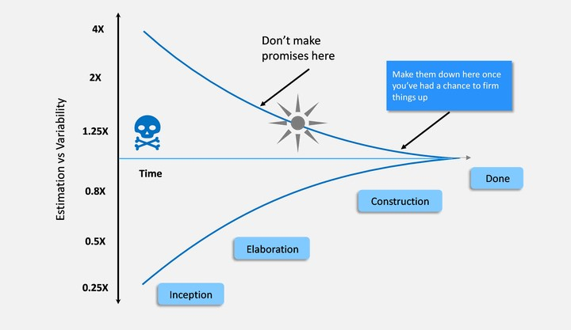
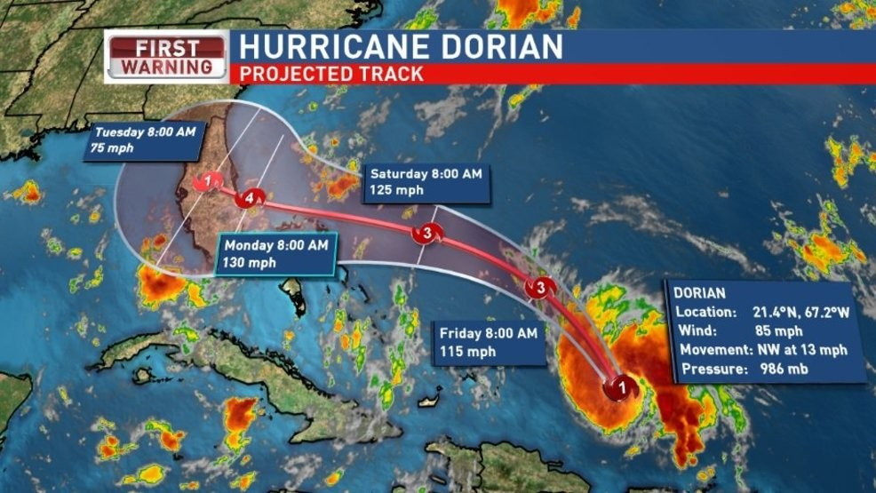

# Begriffserklärung

Der Cone of Uncertainty – im deutschen Kegel der Unsicherheit ist eine graphische Darstellungsmethode dessen, dass zu Beginn eines [Projekts](Projekt.md) etliche Ungewissheiten vorhanden 
sind. Diese Faktoren belegen Aussichten in die Zukunft wie beispielsweise Schätzungen mit zeitabhängigen Unsicherheiten. Der Begriff Kegel soll hierbei aufzeigen, dass je weiter 
man in die Zukunft schaut, desto mehr können sich diese Störfaktoren addieren, „so dass die räumliche Vorstellung eines Kegels, der im Umfang immer größer wird, sehr gut zu 
diesem Effekt passt". Dabei wird der Kegel kleiner, je weniger die noch zu bestreitende Zeitspanne und näher man vor [Projektabschluss](Projektabschluss.md) steht.[^1] Erst wenn das zuständige 
[Projektteam](Projektmitarbeiter.md) ihre Tätigkeit abschließt beziehungsweise die Verantwortung dafür weitergibt, erreichen die Unsicherheiten die null Prozent Marke[^5]. 

*Abbildung 1: Phasen des Cone of Uncertainty [^6]*

# Ursprung und Historie

Das ursprüngliche Konzept des Cone of Uncertainty wurde von der American Association of Cost Engineers für die Chemieindustrie entwickelt[^4], wobei für Kostenschätzungen 
Unsicherheitsbereiche etabliert wurden[^2]. Im Bereich der Software wurde das Konzept von Barry Boehm aufgegriffen und als „Funnel Curve“ bezeichnet[^4]. 16 Jahre später prägte 
Steve McConnel mit dem Buch „Software Project Survival Guide“ die Bezeichnung Cone of Uncertainty[^2].

# Anwendungen

Der Anwendungsbereich ist breit gefächert, so wird der Ansatz wie bereits angesprochen heute noch in der Kostenschätzung verwendet[^2]. Bekannt ist der Effekt auch in der 
Wettervorhersage, „wenn der mögliche Temperaturverlauf in einer Region für die kommenden zwei Wochen als Grafik gezeigt wird“. Dabei wird die Temperaturspanne zwischen Minimum 
und Maximum von Tag zu Tag größer.[^1] Daneben ist auch die Hurrikan-Vorhersage ein wichtiges Anwendungsfeld. Hierbei soll der Korridor, bei dem der Sturm auf Land trifft,       begrenzt werden[^2].  

*Abbildung 2: Anwendung des Cone of Uncertainty in der Hurrikan-Vorhersage [^2]*

# Cone of Uncertainty im Projektmanagement 

Darstellungsmethoden, wie der Cone of Uncertainty sind im [Projektmanagement](Projektmanagement) von großer Bedeutung, um zentrale Punkte aufzuzeigen. Diese sind besonders geeignet zur Illustration 
von Projektscope und -ziel sowie wesentlicher Projektergebnisse. Im Allgemeinen sind Darstellungsmethoden für agile als auch klassische Projekte anwendbar, sodass der „Cone of 
Uncertainty unabhängig vom Paradigma (klassisch vs. agil) einsetzbar“ ist.[^1] Zu Beginn jedes Projekts weiß man nicht, wie viel Zeit dieses exakt in Anspruch nehmen wird. Die 
Gründe hierfür sind vielfältig. Projekte unterscheiden sich in den Anforderungen, Prioritäten, Einschränkungen, Technologien oder auch den Geschäftsbereich und den daran 
beteiligten Personen. Jedes [Projekt](Projekt.md) ist individuell, wofür es jedoch einige hilfreiche Umgangsmöglichkeiten gibt. „Sizing the project relatively“, beschreibt den Ansatz, den 
Umfang eines Projekts mit den anderer zu vergleichen. Dadurch kann verhältnismäßig auf das Ausmaß, des zu betrachtenden Projekts geschlossen werden, was für die Orientierung 
von Vorteil ist. Daneben kann es nützlich sein, seine Berechnungen oder Schätzungen was benötigte Zeit oder Kosten angeht, etwas höher anzusetzen. Dadurch ergibt sich ein 
gewisser "Puffer" und im Projekt zusätzlich Spielraum. Hier ist jedoch darauf zu achten, die richtige Balance zu finden. Werden die Vorhersagen zu hochgesteckt, kann dies zum 
Beispiel mögliche Sponsoren abschrecken. Wird wiederrum zu wenig kalkuliert, läuft man Gefahr, dass finanzielle Mittel oder Zeit ausgehen. Weiterhin wichtig ist es, offen und 
ehrlich Zahlen und aktuelle Standpunkte mit Projektpartnern zu kommunizieren. Damit kann negativen Überraschungen aus dem Weg gegangen werden[^3]. 

# Siehe auch

* Verlinkungen zu angrenzenden Themen
* [Link auf diese Seite](Cone_of_Uncertainty.md)

# Weiterführende Literatur

* The Agile Samurai - Jonathan Rassmuson(2016)

# Quellen

[^1]: [Cone of Uncertainty - ProjectBase](https://project-base.org/projektmanagement-glossar/cone-of-uncertainty/)
[^2]: [Die Fibonacci-Folge und der Kegel der Unsicherheit](https://blog.agileskills.de/de/die-fibonacci-folge-und-der-kegel-der-unsicherheit/)
[^3]: [Cone of Uncertainty - Agile In a Nutshell](http://www.agilenutshell.com/cone_of_uncertainty)
[^4]: [Cone of Uncertainty - Wikipedia](https://en.wikipedia.org/wiki/Cone_of_Uncertainty)
[^5]: [Cone of Uncertainty Explained with Examples](https://www.projectpractical.com/cone-of-uncertainty/)
[^6]: [Cone of Uncertainty Image](https://www.sketchbubble.com/en/presentation-cone-of-uncertainty.html)
