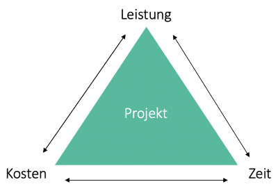

Wenn man ein Projekt managet läuft nicht immer alles nach Plan. Durch unvorhersehbar auftretende Probleme oder einfach nur durch schlechtes [Projektmanagement](Projektmanagement.md) können Projekte zeitlich in Verzug kommen. Da es in Unternehmen meistens einen festen Zeitplan gibt und Verspätungen vermieden werden sollen, wird die verlorene Zeit häufig einfach durch Mehrarbeit der Mitarbeiter wieder aufgeholt. Dieses insbesondere für die Softwareentwicklung typische Phänomen nennt man Crunch Time.

# Ursachen

Crunch Time tritt immer dann auf, wenn ein Projekt in Zeitverzug kommt[^1]. Die Gründe dafür können natürlich vielfältig sein. Irgendwann im Verlauf des Projekts muss es einen Punkt geben, an dem etwas nicht so läuft, wie geplant. Entweder ist bereits in der Planung etwas schiefgelaufen, oder es tritt im Verlauf des Projekts ein Fehler auf, der nicht adäquat behoben wird. Eine schlechte Projektplanung, eine mangelnde Vorbereitung, zu geringe Ressourcen oder zu optimistische Annahmen können dazu führen, dass das Projekt trotz optimaler Ausführung nicht innerhalb des gesetzten Zeitplans fertig werden kann. Während des Projekts auftretende Verzögerungen können unter anderem durch ein schlechtes Projektmanagement, durch zu wenig Kommunikation, oder eine unklare Rollenverteilung im Team auftreten. Unvorhersehbare Störungen, wie der dauerhafte oder temporäre Ausfall eines Teammitglieds, oder eine Forderung des Kunden nach zusätzlichen Features können zusätzliche negative Faktoren sein. Meist wird die Crunch Time dann als der einzige Ausweg gesehen das Projekt noch innerhalb des gesetzten Zeitraums zu vollenden, ohne dass es scheitert oder erst nach der Deadline abgeschlossen werden kann[^2].

# Folgen

Die in der Regel negativen Folgen von Crunch Time betreffen sowohl das Projekt als auch die Mitarbeiter des Unternehmens. Für dieses kommen meist auch noch finanzielle Einbußen hinzu. Die Mitarbeiter stehen in dieser Phase des Projekts in der Regel unter sehr großem Stress und müssen viele Überstunden machen. Damit einher gehen potenziell negative Folgen für ihr Privatleben und ihre Psyche. Da die Mehrarbeit natürlich bezahlt wird, führen die Überstunden somit natürlich auch zu höheren Kosten des Projekts[^3]. Im Projektmanagement stehen dabei immer die drei Größen der Zeit, der Kosten und des Umfangs des Projekts im Konflikt. Ist das Projekt im Verzug, kann dies entweder durch höhere Kosten oder einen niedrigeren Leistungsumfang kompensiert werden. Sollen alle drei Faktoren eingehalten werden, hat dies negative Auswirkungen auf die Qualität des Ergebnisses[^4].

*Magisches Dreieck im Projektmanagement[^5]*

# Lösungen

Ein gutes Projektmanagement ist essenziell, um Crunch Time zu vermeiden. Zur Planung gehört es natürlich die Ursachen zu vermeiden, also neben der genauen und realistischen [Zeitplanung](Zeitplanung.md), auch ein gutes Ressourcenmanagement und regelmäßige Kommunikation im Team[^6]. Dabei ist dies insbesondere im klassischen Projektmanagement teils nur schwer umzusetzen, wodurch die Chance, dass es hier häufig zu Crunch Time kommt, erhöht ist. Ein möglicher Ansatz das Problem durch ein gutes Management des Projekts zu lösen ist durch agiles Projektmanagement[^7]. Ansätze wie [Scrum](Scrum.md) oder Kanban bieten eine höhere zeitliche Flexibilität, und eine regelmäßige Kontrolle des Fortschritts. Dies kann dazu beitragen Crunch Time, wenn möglich zu vermeiden, eine Garantie dafür gibt es aber natürlich nicht[^8]. Ist ein Projekt bereits in Verzug kann man sich auch nach anderen Lösungen umsehen. Dazu zählen beispielsweise, das Hinzuziehen von Mitarbeitern aus anderen Projekten zur Unterstützung, die parallele Bearbeitung von Schritten, die ursprünglich nacheinander geplant waren, oder das Weglassen weniger wichtiger Features[^9].

# Siehe auch

* [Projektmanagement](Projektmanagement.md)
* [Scrum](Scrum.md)
* [Anforderungsmanagement](Anforderungsmanagement.md)
* [Aufwands_Kosten_Kontrolle](Aufwands_Kosten_Kontrolle.md)
* [Zeitplanung](Zeitplanung.md)
* [Magisches Dreieck](Magisches_Dreieck.md)

# Quellen

[^1]: [Crunch Time](http://www.projectmanagementguide.org/project-management/crunch-time)
[^2]: [Warum scheitern Projekte?](https://pm-blog.com/2009/07/04/warum-scheitern-projekte/)
[^3]: [Crunch time in software development: a theory](https://elib.uni-stuttgart.de/bitstream/11682/11110/1/Master%20Thesis_Ruzica%20Jozin.pdf)
[^4]: [What Is the Project Management Triangle?](https://www.coursera.org/articles/project-management-triangle)
[^5]: [Magisches Dreieck im Projektmanagement](https://www.factro.de/blog/projekte-erfolgreich-managen/)
[^6]: [Tips for Improving Bad Time Management to Boost Productivity and Reduce Stress](https://www.freshbooks.com/hub/productivity/poor-time-management?fb_dnt=1)
[^7]: [Projektmanagement-Methoden: klassisch, agil und hybrid](https://www.materna.de/Microsite/Monitor/DE/2020-01/Management-und-Strategie/pm-methoden/pm-methoden_node.html;jsessionid=87298AEC46E44A72560858EBF7715CBD.delivery2-master)
[^8]: [10 Scrum benefits and how to realize them](https://searchsoftwarequality.techtarget.com/tip/10-Scrum-benefits-and-how-to-realize-them)
[^9]: [Erste-Hilfe bei Projektverzögerungen](https://www.zeitblueten.com/news/projektmanagement-verzoegerungen/)
