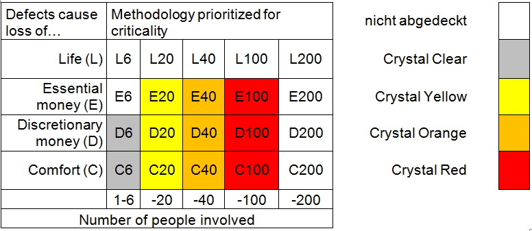
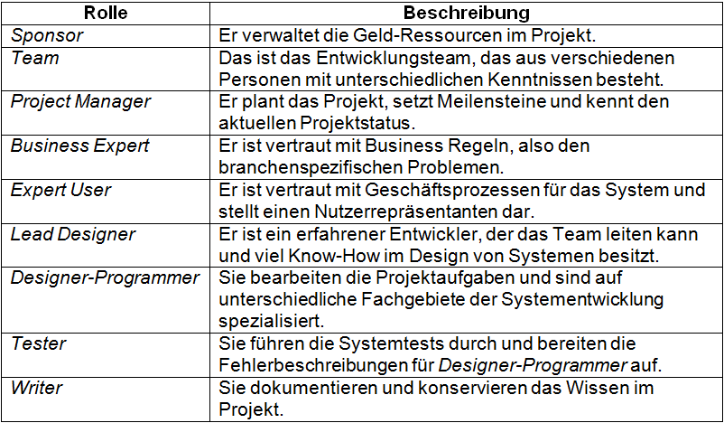

Die vorliegende Arbeit setzt sich mit der Crystal Methode und ihren Anwendungsmöglichkeiten im agilen Projektmanagement auseinander. Crystal ist nicht nur eine agile Methode im [Projektmanagement](Projektmanagement.md), sondern eine ganze Familie von einzelnen [Methoden](Methoden.md). Diese werden abhängig von der Größe und der Kritikalität (Höhe der Risiken) angewandt. Der amerikanische Informatiker Alistair Cockburn entwickelte in den frühen 90er Jahren die Crystal Familie. Im Laufe seiner Forschung wurde ihm klar, dass jedes Projekt und jedes Team einzigartig in Ihrer Zusammensetzung ist und keine allgemeine Vorgehensweise existiert. Deshalb ordnete Cockburn den einzelnen Methoden Farben zu, wobei jede Farbe, Größe und Kritikalität eines Projekts repräsentiert.[^1]

# 1. Verschiedene Crystal-Varianten 

Welche Methode letztendlich für das Projekt ausgewählt wird, entscheidet die Anzahl der teilnehmenden Personen und die Höhe der Risiken. Die Crystal Familie benutzt verschiedene Farben um die verwendete Methode zu kennzeichnen. Die aktuellen Farben sind:[^2]

* Crystal Clear 
  - (bis zu 6 Mitgliedern)
* Crystal Yellow 
  - (7-20)
* Crystal Orange 
  - (21- 40)
* Crystal Red 
  - ( 40-80)
* Crystal Maroon 
   - (80-200)

Die folgende Graphik bildet auf der waagerechten Achse die Größe des Projekts und auf der senkrechten das mit der Software verbundene Risiko ab. C steht für „Loss of Comfort“, D für „Loss of discretionary monies“, E für „Loss of essential monies“ und L für „Loss of Life“. Die Zahl hinter dem Buchstaben kennzeichnet die Anzahl der an einem Projekt beteiligten Leute. 
Ein Beispiel wäre E20, in dem Fall handelt es sich um ein Projekt mit essentiellen Geldern und 20 Leuten. 
Projekte mit lebensbedrohlichen Risiken hat er absichtlich weggelassen, da er keine Erfahrung in solchen Projekten hat. [^2]

 

*Abbildung 1: Klassifizierung der Crystal-Projekte*

# 2. Die 7 Prinzipien der Crystal Methoden

Die Methoden zeichnen vor allem sieben gemeinsame und vorherrschende Eigenschaften aus. Im Laufe der Zeit fand Cockburn heraus, dass je mehr von diesen Eigenschaften in der [Projektplanung](Projektplanung.md) umgesetzt wurden, desto erfolgreicher wurde das Projekt abgeschlossen.[^3]

1. Frequent delivery[^4]

	- Es werden regelmäßig Testversionen und Entwürfe an den Auftraggeber geschickt um 			Feedback am laufenden Projekt zu bekommen 

2. Reflective Improvement

   -	In regelmäßigen Abständen werden Teammeetings einberufen um Projektaufgaben zu 			besprechen und Verbesserungsvorschläge zu sammeln und in das Projekt einzubauen.
  

3. Close communication
	
    - Eine der wichtigsten Vorraussetzungen liegt darin, durch räumliche Nähe einen natürlichen 		Informationsfluss zu generieren. Teams sollten daher nicht zu groß sein.

4. Personal safety
	
	  - Meinungsverschiedenheiten und Kritik sollten offen geäußert werden können ohne 			Konsequenzen. 

5. Focus

	  - Jeder Mitarbeiter arbeitet ziel- und lösungsorientiert an ihren Aufgaben.

	
6. Early Access to expert users
	
	  - Experten sind jederzeit für das Team erreichbar um bespielsweise schnell Detailfragen zu 		klären.

7. Technical environment

	 - Automatisierte Tests, Konfigurationsmanagement und Versionsverwaltung. Mit Hilfe von diesen Tools werden Fehler frühzeitig erkannt und Probleme schneller gelöst.[^3]

# 3. Verschiedene Rollen in Crystal Methods

Unabhängig von der Größe des Projekts existieren ein Sponsor, verschiedene User, der Lead Designer und Designer Programmer. Diese vier Rollen sollten von unterschiedlichen Personen ausgeführt werden um Verantwortlichkeiten klar abzugrenzen. Je größer der [Projektumfang](Projektumfang.md), desto mehr spezialisierte Rollen können im Team auftauchen. Siehe Abbildung 2. [^5]

*Abbildung 2: Die Rollen in Crystal im Überblick*

## Quellen

[^1]: [Crystal] (https://www.onlinesolutionsgroup.de/blog/glossar/c/crystal/

)
[^2]: [The Crystal family](https://files.ifi.uzh.ch/rerg/amadeus/teaching/seminars/seminar_ws0304/04_05_Hollenstein_Rutz_Crystal_Ausarbeitung.pdf)
[^3]: [Agile Patterns- Teil 2/4 Prinzipien Crystal Family](http://www.anecon.com/blog/agile-patterns-teil-2-prinzipien-crystal-family/
)
[^4]: [Crystal Method in Agile](https://www.toolsqa.com/agile/crystal-method/)
[^5]: [Dokumentieren in agilen Methoden Teil 4 - Crystal](https://blog.sophist.de/2013/11/13/dokumentieren-in-agilen-methoden-teil-4-crystal/
)

