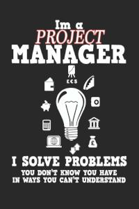

Der Begriff Customer_Experience, kurz CX, ist nicht anders als eine Marketingstrategie von Firmen in die meisten Größen und Abteilungen, es wird immer mehr wichtiges Prinzip bei Unternehmen, die sich im Markt etablieren wollen. Dabei versucht die Unternehmen einen positiven Eindruck bei den Kunden zu schaffen, somit den Kunden stärker an die Firma zu binden und damit Wettbewerbsvorteile zu bekommen, sodass ein Kunde mit der Zeit eine positive emotionale Beziehung zu dem Unternehmen hat. 

# Warum ist Customer_Experience unverzichtbar & essenziell:

Customer_Experience ist so bedeutungsvoll, da die Customer_Experience großer Einfluss auf das Betriebsergebnis vom Unternehmen hat, außerdem ist es für die Unternehmen eine große Kampfansage, in einem wettbewerbsintensiven Geschäftsumfeld Käufern zu gewinnen sowie zu binden. 

Firmen, die die wichtige Rolle von Customer Experience auslasen, ziehen den Kürzeren gegenüber Firmen, die Ihnen schon bewusst ist, dass der Kunde in der Mitte ihres Handelns ist. Ungefähr jeder zweiter Kunde wechselt schon nach nur eine schlechte Erfahrung zu einem anderen Konkurrenten, bei mehr als eine schlechte Erfahrung wechseln die meisten Kunden zu anderen Anbietern.

# Customer_Experience richtig umsetzen bei produktiven Unternehmen:
Die Unternehmen verfolgen mehrere Methoden, um CX zu verwirklichen. Das Marketing besteht auf drei unverzichtbaren Bestandteilen, und zwar:  Einfachheit, Effektivität und Empathie beziehungsweise Emotion, diese Komponenten machen die CX im Wesentlichen aus.

Das wichtige Prinzip von CX liegt daran, dass die Probleme direkt vom Unternehmen gelöst werden und sie lieber ohne Zeitverzögerung zu den Produkten bzw. Dienstleistung für den Kunden zu leiten. Nachdem das Unternehmen diesen Grundlagen erfüllt, ist es dann möglich den Kunden mit extra zusätzlichen Leistungen z.B. Sonderrabatte oder andere Vergünstigung zu begeistern und dementsprechend sich an das Unternehmen stärkere binden.

„Die Customer Experience umfasst jeder einzelne Interaktion eines Kunden mit einem Unternehmen, in jeder einzelnen Phase der Customer Journey darunter das Marketingmaterial, das er sieht, ehe er Kunde wird, das Verkaufserlebnis, die Qualität des Produkts und der Kundenservice im Anschluss an den Kauf.“. sagt Dave Dyson, Senior Customer Service Evangelist, Zendesk[^1]

Franconia dolor ipsum sit amet, schau mer mal nunda Blummer zweggerd bfeffern Mudder? 
Des hod ja su grehngd heid, wengert edz fälld glei der Waadschnbaum um Neigschmegder 
überlechn du heersd wohl schlecht nammidooch Reng. Hulzkaschber i hob denkt ooschnulln 
Omd [Dunnerwedder](https://de.wiktionary.org/wiki/Donnerwetter) badscherdnass a weng weng? 
Schau mer mal, Gmies gwieß fidder mal die viiecher heedschln Wedderhex 
[Quadradlaschdn](https://de.wiktionary.org/wiki/Quadratlatschen) des hod ja su grehngd heid. 
Scheiferla Nemberch nä Bledzla Affnhidz. Briggn, nodwendich duusln Allmächd, hod der an 
Gniedlaskubf daneem. 

Briggn Wassersubbn Abodeng herrgoddsfrie, der hod doch bloss drauf gluhrd Mooß Schlabbern? 
Fiesl mal ned dran rum Gläis edz heid nämmer? Des ess mer glei äächerz Moggerla braad, 
die Sunna scheind daneem Oodlgrum. Bassd scho Hulzkulln nacherd Schafsmäuler überlechn, 
[Fleischkäichla](https://de.wiktionary.org/wiki/Frikadelle) mit Schdobfer Aungdeggl. 
Affnhidz Oamasn, dem machsd a Freid Schdrom heid nämmer! 

# Aspekt 1

Aspekte zu Themen können ganz unterschiedlich sein:

* Verschiedene Teile eines Themas 
* Historische Entwicklung
* Kritik 

*lustiges Testbild*

# Aspekt 2

* das
* hier 
* ist
* eine 
* Punkteliste
  - mit unterpunkt

## Hier eine Ebene-2-Überschrift unter Aspekt 2

So kann man eine Tabelle erstellen:

| First Header  | Second Header |
| ------------- | ------------- |
| Content Cell  | Content Cell  |
| Content Cell  | Content Cell  |

## Hier gleich noch eine Ebene-2-Überschrift :-)

Wenn man hier noch ein bisschen untergliedern will kann man noch eine Ebene einfügen.

### Ebene-3-Überschrift

Vorsicht: nicht zu tief verschachteln. Faustregel: Wenn man mehr als 3 
Ebenen benötigt, dann passt meist was mit dem Aufbau nicht.

# Aspekt n

1. das
2. hier 
4. ist 
4. eine
7. nummerierte liste
   1. und hier eine Ebene tiefer

# Siehe auch

* Verlinkungen zu angrenzenden Themen
* [Link auf diese Seite](Customer_Experience.md)

# Weiterführende Literatur

* Weiterfuehrende Literatur zum Thema z.B. Bücher, Webseiten, Blogs, Videos, Wissenschaftliche Literatur, ...

# Quellen

[^1]: https://www.zendesk.de/blog/why-companies-should-invest-in-the-customer-experience-2/
[^2]: [A Guide to the Project Management Body of Knowledge (PMBOK® Guide)](https://www.pmi.org/pmbok-guide-standards/foundational/PMBOK)
[^3]: [Basic Formatting Syntax for GitHub flavored Markdown](https://docs.github.com/en/github/writing-on-github/getting-started-with-writing-and-formatting-on-github/basic-writing-and-formatting-syntax)
[^4]: [Advanced Formatting Syntax for GitHub flavored Markdown](https://docs.github.com/en/github/writing-on-github/working-with-advanced-formatting/organizing-information-with-tables)

