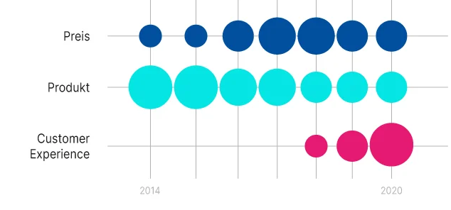
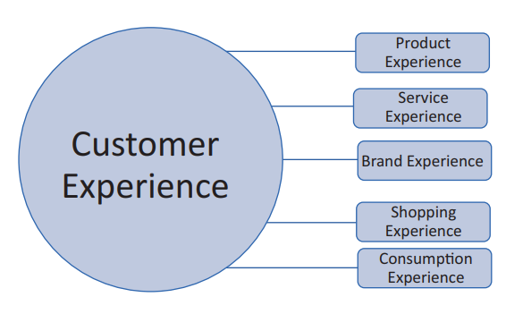
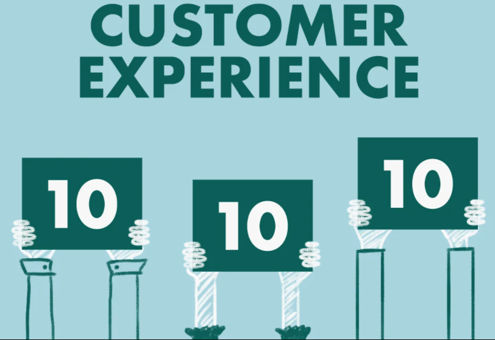

Dies ist ein Marketingbegriff. Customer Experience (CX) ist die Summe der Erfahrungen des Käufers mit einem Unternehmen oder auch einer Marke. Die Erfahrungen ergeben sich aus der positiven oder negativen Bewertung, die der Kunde an den verschiedenen Kontaktpunkten (Touchpoints) während der Customer Journey sammelt. Eine erfolgreiche Customer Experience zeichnet sich dadurch aus, dass der Kunde eine Wiederholung anstrebt und das Unternehmen weiterempfehlt.

# Warum ist Customer_Experience unverzichtbar & essenziell:

Customer_Experience ist so bedeutungsvoll, weil sie enormes Einfluss auf das Geschäftsergebnis vom Unternehmen hat. Deswegen ist es für das Unternehmen eine große Kampfansage, in einem wettbewerbsintensiven Geschäftsumfeld Käufern zu gewinnen. 
Es ist eine echte Herausforderung, in einem wettbewerbsintensiven Geschäftsumfeld Kunden zu gewinnen und zu binden. Unternehmen, die den Aspekt einer nahtlosen und effektiven Customer Experience ignorieren, ziehen den Kürzeren gegenüber Firmen, die wissen, dass der Kunde im Mittelpunkt ihres Handelns steht.[^1].
Im Laufe der Zeit gewinnt CX immer mehr an Bedeutung, wie eine Studie des Beratungsunternehmens Walker belegt, dass CX ab 2020 zum wichtigsten Markenkriterium geworden ist, und damit wichtiger als Preise oder auch Produkte.[^2]

 

* Perfekte Customer Experience [^3]

# Teilbereiche der Customer Experience:
Customer Experience ist kein isoliertes Ereignis, das an einem bestimmten Ort und zu einer bestimmten Zeit auftritt,
sondern sie bildet sich über den gesamten Kundenlebenszyklus.
Dabei lassen sich verschiedene Teilbereiche unterscheiden:

* Teilbereiche der Customer Experience [^4]
1. Die „Product Experience“: Kundenerlebnis als Reaktion auf das Produkt
2. Die „Service Experience“: Dies bezieht sich hauptsächlich auf Interaktionserfahrung mit Servicekunden und Serviceunternehmen
3. Die „Brand Experience“:   Reaktion eines Kunden auf die Marke
4. Die „Shopping Experience“: beschreibt die Kundenerfahrung, die durch unterschiedliche Reize in der Kaufsituation verursacht wird
5. Die „Consumption Experience“: Sie fasst das Erlebnis zusammen, das bei der letztendlichen Nutzung des Produktes entsteht. 

Hervorzuheben ist, dass alle Teilbereiche zusammen das Customer Experience ausmachen und gleichermaßen berücksichtigt werden müssen, um ein stimmiges Gesamterlebnis zu erhalten. 
Es reicht nicht aus, einen Bereich besonders gut zu gestalten und einen anderen Bereich zu ignorieren.[^5]

# Wie wird CX von erfolgreichen Unternehmen umgesetzt?
Die Unternehmen verfolgen mehrere Methoden, um Customer_Experience besser zu gestalten. 
Das Marketing besteht auf drei unverzichtbaren Bestandteilen:  
* Einfachheit
* Effektivität
* Emotion 

Das wichtige Prinzip von Customer_Experience ist, dass Probleme und Reklamationen unverzüglich vom Unternehmen gelöst werden. Nachdem das Unternehmen diese Grundsätze umgesetzt hat, kann das Unternehmen Kunden mit zusätzlichen Services wie Sonderrabatten oder anderen Vorteilen motivieren. damit sich die Kunden an das Unternehmen stärkere binden.

„Wir behandeln Kunden wie Gäste, die zur Party eingeladen sind. Wir sind der Gastgeber. Unsere Aufgabe ist es, jeden wichtigen Aspekt der Customer_Experience jeden Tag zu verbessern.“ Jeff Bezos (gründer des Onlineversandhändlers Amazon).[^6]

* Customer Experience [^7]

# Welche Hauptziele sind bei Customer_Experience zu erlangen:
1. eine höhere Kundenzufriedenheit erzielen [^8]
2. Schnelle und effiktive Problemlösungen
3. Vertrauensaufbau [^9]
4. mehr Neukunden gewinnen
5. Differenzierung zum Wettbewerb hervorheben
6. Feedback von Kunden müssen effizient vom Unternehmen ausgewertet und bearbeitet werden. 
7. Künstliche Intelligenz übernimmt künftig das Customer Experience Management, mit Hilfe von Machine Learning wird es einfacher. Gesammelte Informationen über Kunden, damit Kl lernen kann, die CX jedes Kunden durch immer mehr Informationen zu verbessern.[^10]

 

# Geschichte:
Der Customer_Experience Management wurde von Pine Gilmore im Jahr 1998 erwähnt, bei einem Beitrag für Harvard Business Review. Demnach gelinge es erfolgreichen Unternehmen, dass ihre Kunden aus den möglichst authentischen Erfahrungen mit dem Anbieter persönliche Mehrwerte ableiten.
Verschiedene Experten wie Thompson / Kolsky (2004) vom Beratungsunternehmen Gartner haben vor einigen Jahren die wachsende Bedeutung des Customer Experience Managements für nachhaltigen Geschäftserfolg hervorgehoben.
* Im Jahr 2008 äußerte Jessica Debor, dass durch effiziente Customer_Experience-Management, die Fähigkeit von Unternehmen zu setzen, um positive Meinungen von Kunden zu schaffen, steigert die Kaufbereitschaft und auch die Loyalität zum Unternehmen bzw. Marke [^11]

# Weiterführende Literatur

* Die Treiber von der Customer_Experience von Andreas Toth. https://books.google.de/books?hl=de&lr=&id=k8GPDwAAQBAJ&oi=fnd&pg=PP5&dq=buch+customer+experience&ots=hc3lthO_OR&sig=5ssR13WedV1_esUxMSSYgXYf5bY#v=onepage&q=buch%20customer%20experience&f=false
* Die Beziehung zwischen  Customer Experience Management und Customer Relationship Management von adesso 2021. https://www.adesso.de/de/impulse/cem-crm/index.jsp

# Quellen

[^1]: https://www.zendesk.de/blog/why-companies-should-invest-in-the-customer-experience-2/
[^2]: https://blog.usu.com/de-de/die-perfekte-customer-experience-schaffen-2020
[^3]: https://blog.usu.com/de-de/die-perfekte-customer-experience-schaffen-2020
[^4]: https://link.springer.com/chapter/10.1007/978-3-658-27331-6_2
[^5]: https://link.springer.com/chapter/10.1007/978-3-658-27331-6_2
[^6]: https://www.qualtrics.com/de/erlebnismanagement/kunden/customer-experience/
[^7]: https://www.superoffice.com/blog/customer-experience-statistics/
[^8]: https://www.bigdata-insider.de/was-ist-customer-experience-a-897275/
[^9]: https://easy-feedback.de/blog/customer-experience-strategie/
[^10]: https://www.netigate.net/de/articles/kundenzufriedenheit/alles-was-sie-ueber-customer-experience-cx-wissen-muessen/#h-die-vorteile-von-customer-experience-cx
[^11]: https://de.wikipedia.org/wiki/Customer-Experience-Management
