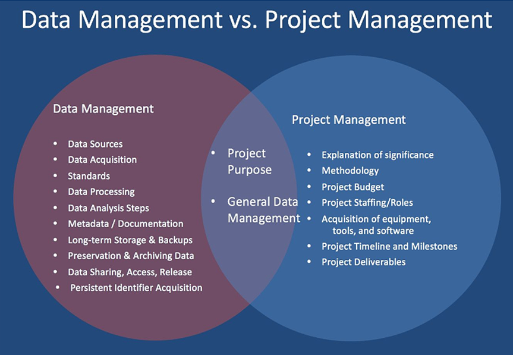
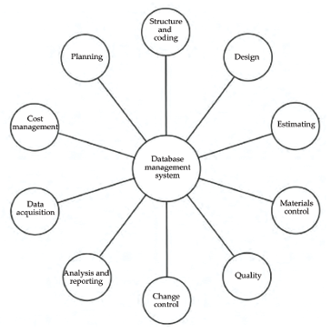

# 1.	Allgemein über Datenmanagement in PM

Alle Projektaufgaben, von der punktuellen theoretischen Phase direkt bis hin zum Ende des [Projektlebenszyklus](Projektlebenszyklus.md), produzieren Informationen. Je größer das Projekt ist, desto größer ist die Summe und die Vielfalt von Informationen beziehungsweise Daten, die überwacht werden müssen. Deswegen sind Projekte von der angemessenen Handhabung, Lagerung und [Qualität](Qualitätsmanagement.md)  enormer Mengen an Daten abhängig.[^1] Pascal erklärt sogar schlechte [Kommunikation](Projektkommunikation.md), Übermittlung und Implementierung der Daten zur "Hauptquelle des möglichen Scheiterns eines Projektes"[^2]. Informationen haben viele Formen. Sie werden über Kanäle und Medien übermittelt und die Welt wird mit ihnen überschwemmt. Der klassische [Projektmitarbeiter](Projektmitarbeiter.md) beschäftigt sich aber nur mit dem Teil der Informationen, die für seine Aufgaben von Bedeutung sind.[^3] Die Abbildung 1 verdeutlicht die Schnittpunkte zwischen Datenmanagement und Projektmanagement.   

*Abbildung 1 Schnittpunkte des Datenmanagements und Projektmanagements*[^12]

# 2.	Verwaltung der Projektinformationen bzw. -daten

## 2.1	Einsatz der Projektmanagementsysteme und Daten

Die Projektinformationen müssen gesichtet und in vergleichender Form zusammengestellt werden damit jeder, der die Verantwortung übernehmen muss, die Daten zum richtigen Zeitpunkt erhält. Wenn ein Projekt effektiv strukturiert ist, kann das wichtige Trennen und Ordnen durch ein [IT-System](IT-Projekte.md) erledigt werden, das dafür sorgt, dass jede Information einen angemessenen Erkennungscode erhält.[^4]

Die Durchführung eines Projektes muss ein integriertes Projektmanagementsystem eingerichtet haben, und zwar unter Berücksichtigung der folgenden Punkte:

•	eine strukturierte Art, mit dem Projekt und seinen Systemen umgehen zu können

•	ein durchgängig verbundenes und kohärent gestaltetes [Kodierungssystem](https://bizfluent.com/info-7814909-projectcoding-systems.html), das die Projektstruktur bzw. -organisation widerspiegelt

•	ein vernünftiges IT-System, das mit geeigneter Software ausgestattet ist und das als Datenbank funktioniert.[^5]

## 2.2	Datenbankmanagementsysteme in PM

Jeder [Projektleiter](Projektleiter.md) ist auf ein leistungsfähiges [Projektmanagementinformationssystem (PMIS)]( http://projektmanagement-definitionen.de/glossar/projektmanagement-informationssystem-pmis/) angewiesen, da es in laufenden Projekten jederzeit zu unkalkulierbaren Informationen beziehungsweise Daten kommen kann, die die Fertigstellung des Projekts erschweren. Systeme zur [Planung](Projektplanung.md), Budgetierung, Beobachtung, Informationenaufschlüsselung und spezifische [Berichterstattung](Projektabschlussbericht.md) haben sich hierfür als grundlegend erwiesen.[^1] Ohne ein anständiges Informationssystem können die Manager ihr Projekt nicht kontrollieren und werden bis zum ["Point of no Return" (PONR)](https://en.wikipedia.org/wiki/Point_of_no_return ) nicht wissen, was vor sich geht oder was von ihnen erwartet wird. Daher wird empfohlen, dass sie ihre Zeit vielmehr in die Suche nach Informationen investieren sollten.[^7]

Das PMIS sollte ein Datenbankmanagementsystem sein, bei dem alle Datensätze in einer Datenbank gespeichert werden, die allen Informationsmodulen regelmäßig zur Verfügung steht. Ein Teil der höherwertigen [Projektmanagementsoftwarepakete](Projektmanagementsoftware.md) werden mit solchen Datenbanken geliefert.[^1] Außerdem ist die Entwicklung eines vollständig integrierten und absolut guten Systems zu entwerfen, ein bedeutendes Unterfangen, das viel Analyse der bestehenden Strategien über ein Projekt voraussetzt.[^9]

# 3.	Informationssysteme im PM 

## 3.1	Gestaltung der Informationssysteme

Das PMIS sollte sinnvoll gestaltet sein, um zu gewährleisten, dass die einzelnen Module funktionsfähig und aufeinander abgestimmt sind. Die Gestaltung und Nutzung sollten einfach sein, was auf die begleitenden Elemente zurückzuführen ist:

•	Der Ansatz des [Projektmanagements](Projektmanagement.md) ist festgelegt.

•	Die IT-Ausstattung und Software sind einfach zu verstehen, vor allem mit zufriedenstellender Geschwindigkeit und Kontrolle. 

•	Es gibt eine umfangreichere Auswahl an [Projektmanagementsoftwarepakete](Projektmanagementsoftware.md), von denen eine große Anzahl flexibel, vielseitig einsetzbar und sinnvoll bewertet ist.

•	Datenbankmanagementinformationspakete sind weithin zugänglich und werden bei vielen unterschiedlichen Projekten genutzt. Die meisten modernen Projektmanagementpakete sind so konzipiert, dass sie sich mit ihnen verbinden lassen.[^10]

### 3.1.1 Primäre und sekundäre Module 

Wir unterscheiden die folgenden primären bzw. sekundären Module des Informationssystems. In der folgenden Tabelle sind nur einige genannt.

| Primäre Module  | Sekundäre Module   |
| --------------- | ---------------   |
| Kostenmanagement| Vertragsgestaltung|
| Design          | Korrespondenz     |
| Qualität        | Sicherheit        |
| Planung         | [Work packs](https://www.wrike.com/project-management-guide/faq/what-is-a-work-package-in-project-management)    |

## 3.2	Implementierung und Integration der Informationssysteme

Alle Module des Informationssystems sind bis zu einem gewissen Grad in Datenmanagement integriert, insbesondere die primären Module, wie in Abbildung 2 gezeigt wird.[^1] Normalerweise produziert jedes Modul Informationen, die von anderen Modulen genutzt werden; nutzt die Informationen, die von anderen Modulen erzeugt werden; oder auch beides parallel. In diesem Sinne ist die Verbindung dieser Module des Informationssystems zu einem koordinierten PMIS von sehr großer Bedeutung für ein leistungsfähiges[ Projektmanagement](Projektmanagement.md).

*Abbildung 2 Interaktion der primären Module*[^1]

# Abkürzungen 

PM - Projektmanagement 
PMIS - Projektmanagementinformationssystem

# Siehe auch

* [Datenmanagement](https://de.wikipedia.org/wiki/Datenmanagement)
* [Projektmanagement](https://de.wikipedia.org/wiki/Projektmanagement)
* [Informationsqualität](https://de.wikipedia.org/wiki/Informationsqualit%C3%A4t)
* [Link auf diese Seite](Datenmanagement_im_PM.md)

# Weiterführende Literatur

* [Project Data Management](https://www.landmark.solutions/ProjectDataManagement)
* [Data management plan](https://en.wikipedia.org/wiki/Data_management_plan)
* [7 Master Data Management Project Best Practices](https://www.informationweek.com/big-data-analytics/7-master-data-management-project-best-practices)
* [Agile Project Management for Data Projects](https://www.youtube.com/watch?v=ERWZhMZuJfs)
* [An Agile Approach to Data Management](https://www.youtube.com/watch?v=Xe2YgNMU8pg)

# Quellen

[^1]: [Project Management](https://www.goodreads.com/book/show/42049169-project-management) S. 137, 138, 142, 143
[^2]: [Practical Issues in Database Management](https://www.pearson.com/uk/educators/higher-education-educators/program/Pascal-Practical-Issues-in-Database-Management-A-Reference-for-the-Thinking-Practitioner/PGM405773.html)
[^3]: [Why manage data](https://www.usgs.gov/products/data-and-tools/data-management/why-manage-data)
[^4]: [Projektmanagement-Tool](https://www.eurice.eu/privacy/project-management-tool/)
[^5]: [Data Management](https://searchdatamanagement.techtarget.com/definition/data-management)
[^6]: [Project Management](https://www.goodreads.com/book/show/42049169-project-management)
[^7]: [Project management information systems - An empirical study of their impact on project managers and project success](https://www.researchgate.net/publication/222572029_Project_management_information_systems_An_empirical_study_of_their_impact_on_project_managers_and_project_success) S. 3
[^8]: [Project Management](https://www.goodreads.com/book/show/42049169-project-management)
[^9]: [Project management information systems](https://portailqualite.acodev.be/fr/system/files/node/342/project_management_information_systems.pdf) S. 92
[^10]: [Data Managemen Modules](https://bluesoft.com/product/data-management-module-dmm/)
[^11]: [Project Management](https://www.goodreads.com/book/show/42049169-project-management)
[^12]: [Data Management vs. Project Management Venn Diagram](https://www.usgs.gov/media/images/data-management-vs-project-management-venn-diagram)

