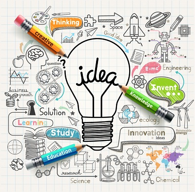

Kurzbeschreibung zu Design_Thinking um ein erstes Verständnis dafür zu schaffen um was es hier geht.

Hier ganz am Anfang keine Überschrift einfügen - das passiert automatisch basierend auf dem `title`-Attribut
oben im Front-Matter (Bereich zwischen den `---`).

# Design Thinking
## Definition

 [^1] 

*“Design thinking is a human-centered approach to innovation that draws from the designer’s toolkit to integrate the needs of people, the possibilities of technology, and the requirements for business success.”*[^2]  

 

[Tim Brown, Executive Chair: IDEO](https://de.wikipedia.org/wiki/Tim_Brown_(Designer))           

 
Design Thinking ist ein menschen-zentrierter Ansatz (Human-Centered Approach) für die Generierung von Lösungen und Innovationen, wobei es sowohl ein Denkansatz als auch ein Prozess-Modell ist. Das Design Thinking unterstützt bei der kreativen Betrachtung einer weiten Bandbreite an innovativen Lösungsmöglichkeiten. In der Praxis in Bezug auf Unternehmen heißt, dass das Design Thinking hilft Unternehmen dabei, die wahren Bedürfnisse und Wünsche ihrer Kunden zu bestimmen.

## Prozess Modell 

Es existieren mehrere Vorgehensmodelle mit einer unterschiedlichen Anzahl an Schritten für den Prozess des Design Thinkings, im Folgenden wird eines der Standartmodelle nach dem Hasso-Plattner-Institut beschrieben.

Der Design Thinking Prozess nach Hasso-Plattner-Institut besteht aus den 6 Phasen: Verstehen, Beobachten/Empathie, Sichtweise definieren, Ideen generieren, Prototypen, Testen. Der Prozess ist non-linear und iterativ.

*6 Schritte des Design Thinkings*[^3]

 

### Phase 1: Verstehen 
Im ersten Schritt wird die Ausgangssituation definiert und sichergestellt, dass alle beteiligten Personen sich auf demselben Wissensstand befinden. Mögliche Standardfragen mit denen Probleme definiert werden können sind: Was soll neu entwickelt werden? Für wen soll die Entwicklung relevant sein? Welche wesentlichen (aktuellen oder zukünftigen) Rahmenbedingungen müssen berücksichtigt werden? Welcher Endzustand soll durch die Lösung erreicht werden?[^3]

### Phase 2: Beobachten
Im Schritt des Beobachtens geht es darum, die Ziele, die Bedürfnisse sowie die Prioritäten der Kunden zu analysieren und zu verstehen. Wichtig ist es hierbei den Kunden reden zulassen und genau zuzuhören, um Missverständnisse zu vermeiden.

### Phase 3: Sichtweisen definieren 
In diesem Schritt erfolgt die Synthese der ersten beiden Schritte. Das Ziel hierbei ist es auf Basis der der gesammelten Annahmen und Beobachtungen einen konzeptionellen Rahmen zu entwickeln und den Lösungsraum abzustecken. Es sollen dabei die Kernbedürfnisse der Nutzer interpretieren und formuliert werden.  (Es gibt  mehrere Techniken um dies zuerreichen, ein Beispiel wäre die Point-of-View Technik.)

### Phase 4: Ideen finden
In der vierten Phase werden mit Hilfe von Kreativitätstechniken, wie z.B. [Brainstorming](Brainstorming.md), [Mindmapping](Mindmapping.md) und [6_3_5 Methode](
6_3_5_Methode.md ) Ideen gesammelt. Die Ideen können dabei auch sehr abstrakt und ausgefallen sein. Die Ergebnisse werden dann nach der Effizienz, der Machbarkeit und Wirtschaftlichkeit bewertet und sortiert. Es werden dann anhand dieser Priorisierung Ideen ausgewählt mit denen weitergearbeitet werden soll.

### Phase 5: Prototypen entwickeln 
In dieser Phase werden für die ausgewählten Ideen Prototypen gebaut, damit die ausgedachten Konstrukte anschaulicher werden und Annahmen getestet werden können. Es ist dabei nicht wichtig, ob die Prototypen perfekt sind. Es wichtiger das Sachen kreativ und so einfach wie möglich angegangen werden. 
Techniken die bei dem erstellen der Prototypn zum Einsatz kommen sind: 

### Phase 6: Testen 
Im letzten Schritt muss das Erarbeitete getestet werden. Die Prototypen werden nun unter der Einbindung der Kunden und Interessensvertreter weiter validiert und getestet. Das Ziel hierbei ist es nicht den Kunden von den Prototypen zu überzeugen, sondern vor allem das Feedback und die Reaktion der Kunden zu analysieren, denn diese sind ein wichtiger Bestandteil, um weitere Ideen und Verbesserungen zu generieren. Wichtig in diesem Schritt ist, dass das die Personen, die das Design Thinking durchgeführt haben, bereit sind neue Ideen anzunehmen, um die Prototypen weiterzuentwickeln und gegeben falls auch nicht funktionierende Prototypen wieder zu verwerfen. Es kann auch zu mehreren Design Thinking-Durchläufen kommen, bis der Kunde und die Entwickler zufrieden sind mit dem Endprodukt. 

# Vor- und Nachteile

| Vorteile des Design Thinkings|  Nachteile des Design Thinkings |
| ----------------------------- | ------------------------------- |
| Content Cell  | Content Cell  |
| Content Cell  | Content Cell  |

# Hier ein Beispieltext mit ein paar Verlinkungen

Hier wurde beispielhaft auf externe Seiten verlinkt. Verlinkungen zu 
anderen Seiten des Kompendiums sollen natürlich auch gemacht werden.

Literatur kann via Fußnoten angegeben werden[^1]. Es gibt auch das PMBOK[^2].
Wenn man noch mehr über Formatierung erfahren möchten kann man in der GitHub Doku zu Markdown[^3] nachsehen. 
Und wenn man es ganz genau wissen will gibt es noch mehr Doku[^4]. 

Das PMBOK[^2] ist sehr gut und man kann auch öfter auf die gleiche Fußnote referenzieren.

Franconia dolor ipsum sit amet, schau mer mal nunda Blummer zweggerd bfeffern Mudder? 
Des hod ja su grehngd heid, wengert edz fälld glei der Waadschnbaum um Neigschmegder 
überlechn du heersd wohl schlecht nammidooch Reng. Hulzkaschber i hob denkt ooschnulln 
Omd [Dunnerwedder](https://de.wiktionary.org/wiki/Donnerwetter) badscherdnass a weng weng? 
Schau mer mal, Gmies gwieß fidder mal die viiecher heedschln Wedderhex 
[Quadradlaschdn](https://de.wiktionary.org/wiki/Quadratlatschen) des hod ja su grehngd heid. 
Scheiferla Nemberch nä Bledzla Affnhidz. Briggn, nodwendich duusln Allmächd, hod der an 
Gniedlaskubf daneem. 

Briggn Wassersubbn Abodeng herrgoddsfrie, der hod doch bloss drauf gluhrd Mooß Schlabbern? 
Fiesl mal ned dran rum Gläis edz heid nämmer? Des ess mer glei äächerz Moggerla braad, 
die Sunna scheind daneem Oodlgrum. Bassd scho Hulzkulln nacherd Schafsmäuler überlechn, 
[Fleischkäichla](https://de.wiktionary.org/wiki/Frikadelle) mit Schdobfer Aungdeggl. 
Affnhidz Oamasn, dem machsd a Freid Schdrom heid nämmer! 

# Aspekt 1

Aspekte zu Themen können ganz unterschiedlich sein:

* Verschiedene Teile eines Themas 
* Historische Entwicklung
* Kritik 

*lustiges Testbild*

# Aspekt 2

* das
* hier 
* ist
* eine 
* Punkteliste
  - mit unterpunkt

## Hier eine Ebene-2-Überschrift unter Aspekt 2

So kann man eine Tabelle erstellen:

| First Header  | Second Header |
| ------------- | ------------- |
| Content Cell  | Content Cell  |
| Content Cell  | Content Cell  |

## Hier gleich noch eine Ebene-2-Überschrift :-)

Wenn man hier noch ein bisschen untergliedern will kann man noch eine Ebene einfügen.

### Ebene-3-Überschrift

Vorsicht: nicht zu tief verschachteln. Faustregel: Wenn man mehr als 3 
Ebenen benötigt, dann passt meist was mit dem Aufbau nicht.

# Aspekt n

1. das
2. hier 
4. ist 
4. eine
7. nummerierte liste
   1. und hier eine Ebene tiefer

# Siehe auch

* Verlinkungen zu angrenzenden Themen
* [Link auf diese Seite](Design_Thinking.md)

# Weiterführende Literatur
* [Design Thinking – Kreativität als Methode](https://www.fu-berlin.de/en/sites/nachhaltigkeit/10_dokumente/DesignThinking-Kreativitaet-als-Methode.pdf) 
* [Design Thinking-Wikipedia](https://de.wikipedia.org/wiki/Design_Thinking)
* [Design Thinking – Mit Methode komplexe Aufgaben lösen und neue Ideen entwickeln](https://digitaleneuordnung.de/blog/design-thinking-methode/)
*  
* Weiterfuehrende Literatur zum Thema z.B. Bücher, Webseiten, Blogs, Videos, Wissenschaftliche Literatur, ...
# Quellen

[^1]:[Design Thinking Defined](https://designthinking.ideo.com/), Abgerufen am 17. November 2021
[^2]:[HPI Academy, Was ist Design Thinking?](https://hpi-academy.de/fileadmin/_processed_/b/9/csm_Design_Thinking_Prozess_DE_6c695bcd10.png), Abgerufen am 17. November 2021
[^3]: [Design Thinking – Methode, Prozess und Workshops](https://iconstorm.com/design-thinking/), Abgerufen am 17. November 2021

Quellen die ihr im Text verwendet habt z.B. Bücher, Webseiten, Blogs, Videos, Wissenschaftliche Literatur, ... (eine Quelle in eine Zeile, keine Zeilenumbrüche machen)
[^4]: [A Guide to the Project Management Body of Knowledge (PMBOK® Guide)](https://www.pmi.org/pmbok-guide-standards/foundational/PMBOK)
[^5]: [Basic Formatting Syntax for GitHub flavored Markdown](https://docs.github.com/en/github/writing-on-github/getting-started-with-writing-and-formatting-on-github/basic-writing-and-formatting-syntax)
[^6]: [Advanced Formatting Syntax for GitHub flavored Markdown](https://docs.github.com/en/github/writing-on-github/working-with-advanced-formatting/organizing-information-with-tables)

