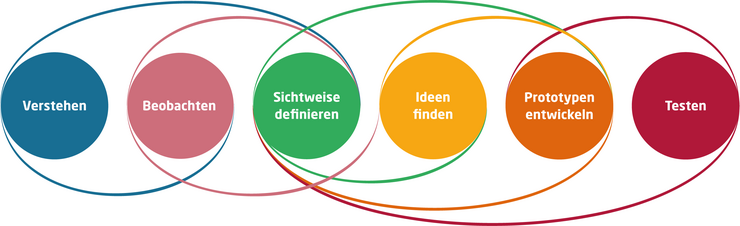

Kurzbeschreibung zu Design_Thinking um ein erstes Verständnis dafür zu schaffen um was es hier geht.

Hier ganz am Anfang keine Überschrift einfügen - das passiert automatisch basierend auf dem `title`-Attribut
oben im Front-Matter (Bereich zwischen den `---`).

# Design Thinking
## Definition

*„Beim Design Thinking geht es darum, Probleme an ihrer Wurzel zu packen, statt nur einige der Symptome zu behandeln.“*[^1] [^2] 

 

[Hasso Plattner, Stifter Hasso Plattner Institut](https://de.wikipedia.org/wiki/Hasso_Plattner)           

  
 
 
Design Thinking ist ein menschenzentrierter Ansatz für die Generierung von Lösungen und Innovationen. Es ist sowohl eine Denkweise als auch ein Prozess-Modell ist. Dabei ist es wichtig zuerst die wahren Bedürfnisse und Wünsche des Kunden zu bestimmen und mit einem Kreativprozess innovative Lösungsmöglichkeiten zu finden.  Der Prozess ist nicht-linear und iterativ.

## Denkweise
Design Thinking hat eine flache Hierarchie und die Teammitglieder begegnen sich auf Augenhöhe. Die wichtigesten Einstellungen der Projektteilnehmer sind:

* Akzeptanz von neuen Denkweisen
* Scheitern als Chance sehen [^3]
* Offenheit für das Unerwartete 

## Prozess Modell 

Es existieren mehrere Vorgehensmodelle mit einer unterschiedlichen Anzahl an Schritten für den Prozess des Design Thinkings. Im Folgenden wird eines der Standardmodelle nach dem Hasso-Plattner-Institut beschrieben. Es besteht aus 6 Phasen (siehe Bild): 

*6 Schritte des Design Thinkings*[^4]

 

### Phase 1: Verstehen 
Im ersten Schritt wird die Ausgangssituation definiert und sichergestellt, dass alle beteiligten Personen sich auf demselben Wissensstand befinden. Mögliche Standardfragen mit denen Probleme definiert werden können sind:
* Was soll neu entwickelt werden?[^5]
* Für wen soll die Entwicklung relevant sein?[^5]
* Welche wesentlichen (aktuellen oder zukünftigen) Rahmenbedingungen müssen berücksichtigt werden?[^5]
* Welcher Endzustand soll durch die Lösung erreicht werden?[^5]

### Phase 2: Beobachten
Im Schritt des Beobachtens geht es darum, die Ziele, die Bedürfnisse sowie die Prioritäten der Kunden zu analysieren und zu verstehen. Wichtig ist es hierbei den Kunden zu interviewen. Hierbei können die Interviewtechniken von strukturiert bis unstrukturiert reichen, um ein tieferes Verständnis der Kundenbedürfnisse zu erlangen. Dazu gehört auch das aktive Zuhören, um Missverständnisse zu vermeiden.

### Phase 3: Sichtweisen definieren 
Hier erfolgt die Synthese der ersten beiden Schritte. Das Ziel hierbei ist es auf Basis der gesammelten Annahmen und Beobachtungen einen konzeptionellen Rahmen zu entwickeln und den Lösungsraum abzustecken. Es sollen dabei die Kernbedürfnisse der Nutzer interpretiert und formuliert werden.

### Phase 4: Ideen finden
In der vierten Phase werden mit Hilfe von Kreativitätstechniken, wie z.B. [Brainstorming](Brainstorming.md), [Mindmapping](Mindmapping.md) und [6_3_5 Methode](
6_3_5_Methode.md), Ideen gesammelt. Die Ideen können dabei auch sehr abstrakt ausfallen. Die Ergebnisse werden dann nach der Effizienz, der Machbarkeit und Wirtschaftlichkeit bewertet und priorisiert. Die besten Ideen werden weiterverfolgt.

### Phase 5: Prototypen entwickeln 
In dieser Phase werden für die ausgewählten Ideen Prototypen gebaut, damit die ausgedachten Konstrukte anschaulicher werden und Annahmen getestet werden können. Diese Prototypen haben meist nur eingeschränkte Funktionalität und werden oft mit einfachen Materialien gefertigt.

### Phase 6: Testen 
Im letzten Schritt muss das Erarbeitete getestet werden. Die Prototypen werden nun unter der Einbindung der Kunden weiter validiert und getestet. Das Ziel hierbei ist es nicht, den Kunden von den Prototypen zu überzeugen, sondern vor allem [Feedback](Feedbackgespräche.md) zu erhalten und zu analysieren. Daraus werden weitere Ideen und Verbesserungen generiert und es soll frühzeitig erkannt werden, ob die Innovation den Kundenbedürfnissen entspricht. Gegebenfalls werden auch nicht funktionierende Prototypen verworfen. Es kann auch zu mehreren Design Thinking-Durchläufen kommen, bis der Kunde und die Entwickler mit dem Endprodukt zufrieden sind. 

[^6][^7][^8][^9]

# Vor- und Nachteile

| Vorteile des Design Thinkings|  Nachteile des Design Thinkings |
| ----------------------------- | ------------------------------- |
| Schnellere Entwicklungsprozesse | Die richtigen Rahmenbedingungen müssen gegeben sein  |
| Nutzerzentriertes Handeln  | Keine Ergebnissicherheit bei der Produktentwicklung  |
| Aktives Einbinden der Kunden in den Prozess | Nicht geeignet für große Teams (>10 Mitarbeiter) |
| Ausschöpfen des kreativen Potentials von Mitarbeitern  | / |
| Unterstützung von positiver Fehlerkultur  | / |

[^10]

# Siehe auch

* [Innovationsprojekte](Innovationsprojekte.md)
* [Methoden](Methoden.md)

# Weiterführende Literatur
* [Design Thinking – Kreativität als Methode](https://www.fu-berlin.de/en/sites/nachhaltigkeit/10_dokumente/DesignThinking-Kreativitaet-als-Methode.pdf) 
* [Design Thinking - Wikipedia](https://de.wikipedia.org/wiki/Design_Thinking)
* [Design Thinking einfach erklärt (mit Workshop-Beispiel)](https://www.youtube.com/watch?v=KH_zqH8EgDo)
* [What Is Design Thinking? An Overview](https://www.youtube.com/watch?v=gHGN6hs2gZY)
* [Design Thinking - Gabler Wirtschaftslexikon](https://wirtschaftslexikon.gabler.de/definition/design-thinking-54120)

# Quellen

[^1]:[Einige ausgewählte Zitate zum Thema Design Thinking](https://www.google.com/url?sa=t&rct=j&q=&esrc=s&source=web&cd=&cad=rja&uact=8&ved=2ahUKEwiSt-fh8ab0AhW2hP0HHWnnCxYQFnoECAoQAw&url=https%3A%2F%2Fhpi.de%2Ffileadmin%2Fuser_upload%2Fhpi%2Fdokumente%2Fpressemitteilungen%2F2015%2F20151012_Zitate_DesignThinking_final.pdf&usg=AOvVaw1V7xMxVHaKRkGpU3s36465), Abgerufen am 17. November 2021
[^2]:[Bild1, Design Thinking Workshop](https://startups-nordwest.de/wp-content/uploads/2018/04/Design-Thinking.jpg), Abgerufen am 17. November 2021
[^3]:[Die Kerngedanken von Design Thinking](https://www.diegluehbirne.de/innovationen-mit-design-thinking/), Abgerufen am 17. November 2021
[^4]:[Bild2, HPI Academy, Was ist Design Thinking?](https://hpi-academy.de/fileadmin/_processed_/b/9/csm_Design_Thinking_Prozess_DE_6c695bcd10.png), Abgerufen am 17. November 2021
[^5]: [Design Thinking – Methode, Prozess und Workshops](https://iconstorm.com/design-thinking/), Abgerufen am 17. November 2021
[^5]: [A Guide to the Project Management Body of Knowledge (PMBOK® Guide)](https://www.pmi.org/pmbok-guide-standards/foundational/PMBOK)
[^6]:[Design Thinking: So entwickeln Sie in 6 Schritten eine innovative Lösung](https://digitalzentrum.berlin/design-thinking-prozess-erklaert), Abgerufen am 17. November 2021
[^7]:[Was ist Design Thinking?](https://hpi-academy.de/design-thinking/was-ist-design-thinking.html), Abgerufen am 17. November 2021
[^8]:[[Design Thinking - Wikipedia](https://de.wikipedia.org/wiki/Design_Thinking), Abgerufen am 17. November 2021
[^9]:[[Design Thinking – Mit Methode komplexe Aufgaben lösen und neue Ideen entwickeln](https://digitaleneuordnung.de/blog/design-thinking-methode/), Abgerufen am 17. November 2021
[^10]:[Die agile Arbeitsmethode “Design Thinking”](https://www.sigel-office.com/de/magazin/die-agile-arbeitsmethode-design-thinking/), Abgerufen am 17. November 2021

