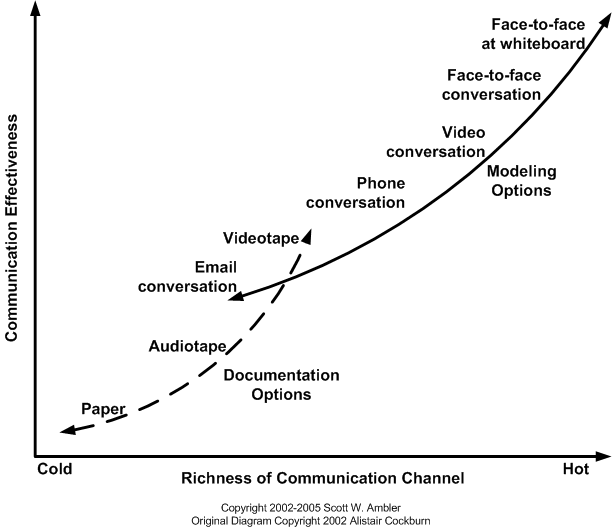

# 1. Definiton Digitale Kommunikation

Die Grundlage der Kommunikation bezeichnet den Austausch von Informationen zwischen mindestens zwei Kommunikationspartnern. Die Kommunikationspartner können dabei sowohl menschlich als auch technische Systeme sein. Bei der digitalen Kommunikation wird die Nachricht dann von einem digitalen Kommunikationskanal wie dem Internet von einem Sender zum Empfänger übertragen. Dies kann dann in verschiedenen Medienformaten wie Text, Video, Bild oder Audio geschehen. Die digitale Kommunikation zeichnet dabei auch die Virtualität aus, dass bedeutet die Entkopplung von Zeit und Raum. Sie wird auch als ”ubiquitär “, d.h. allgegenwärtig möglich bezeichnet[^1].

# 2. Kommunikationsmodell Alister Cockburn

Der Projekterfolg hängt von einer effektiven Kommunikation ab. Kommunikationsmodelle zeigen Konzepte auf, die sich darauf beziehen, wie sich der Bezugsrahmen des Senders und des Empfängers auf die Effektivität der Kommunikation auswirken, wie das Kommunikationsmedium die Effektivität der
Kommunikation beeinflusst und welche Arten von Diskrepanzen zwischen den Erwartungen der Endbenutzer und der Realität bestehen. 
Mit multikulturellen Projektteams und verstreuten Interessengruppen bieten diese Modelle eine Möglichkeit, Kommunikationsstile und -methoden zu betrachten, um die Effizienz und Effektivität zu verbessern [^2].

[^3]

Das Kommunikationsmodell von Alistair Cockburn beschreibt auf der Y-Achse die „Effektivität der Kommunikationsart“ und auf der X-Achse „Die Richness von Kommunikationskanälen“. Richness“ oder auch „Media Richness“ beinhaltet verschiede Eigenschaften zur optimalen Kommunikation.                                     Diese Fähigkeiten zeichnen die [Media Richness Theory](https://dorsch.hogrefe.com/stichwort/media-richness-theory) aus: 
*	Mehrere Informationen gleichzeitig verarbeiten
*	Erleichterung schnelles Feedback zu geben 
*	Einen individuellen Schwerpunkt für jedes Projektmitglied zu setzen, und 
* Eine ["natürliche Sprache"](https://www.inbenta.com/de/technologie/natural-language-processing/) zu nutzen [^2]

Nach Cockburn ist dadurch die effektivste Kommunikationsform von Angesicht zu Angesicht, insbesondere wenn sie durch ein gemeinsames Modellierungsmedium wie ein einfaches Whiteboard, ein Flipchart, Papier oder Karteikarten unterstützt wird. Wenn man sich von dieser Situation entfernt, etwa indem man das gemeinsame Medium entfernt oder nicht mehr von Angesicht zu Angesicht kommuniziert, sinkt die Effektivität der Kommunikation [^3].

# 3. Vorteile durch digitale Kommunikation
Die größten Vorteile digitaler Kommunikation liegen in der zeitlichen- und räumlichen Unabhängigkeit und in der Geschwindigkeitsgewinnung. E-Mails können zeitlich unabhängig versendet werden und erreichen den Empfänger innerhalb weniger Sekunden.
Die räumliche Unabhängigkeit spiegelt sich dadurch wider, dass die Mitglieder aus Projektteams sich in verschieden Regionen oder sogar Zeitzonen befinden können und durch Kommunikationssoftware trotzdem am Projektmeeting teilnehmen können.
Der größte Vorteil ist aber der Zeitgewinn, Aufträge können „just in time“ vergeben werden oder an Projekten können durch „Share-Optionen“ mehrere Personen gleichzeitig arbeiten [^4].

# 4. Die Kommunikationssoftware MS Teams

## 4.1 Was ist MS Teams?
„Microsoft Teams ist ein chatbasierter zentraler Arbeitsbereich (Hub). Das Tool dient der digitalen Unterstützung von effektiverer Kommunikation und Kollaboration bei der Teamarbeit. Es basiert auf vorhandenen Microsoft Technologien und kann andere Office 365 Dienste integrieren“ [^5].

## 4.2 Wichtige Funktionen in MS Teams

Chat- und Videofunktion:
* Chatfunktion für bis zu 50 Personen zur optimalen Abstimmung im Projektteam 
* Videofunktion für Einzelgespräche und Gruppenmeetings 

Feed-Funktion:
*	Übersicht über die Aktivitäten im Teammeeting 
*	Filterfunktion und Aktivitäten können chronologisch geordnet werden 

Share-Optionen: 
* Co-Authoring-Funktion von Office 365-Anwendungen zur parallelen Bearbeitung von Dokumenten 
*	Anwendungen müssen nicht mehr gewechselt werden, sondern Dokumente können direkt in MS Teams bearbeit werden

Verschiedene Tools zur optimalen Projektbearbeitung: 
*	Workspace in MS Teams individuell an verschiedene Arbeitsgruppen anpassbar
*	So kann man alle möglichen Inhalte aus verschiedenen Microsoft-Anwendungen und von mehr als 150 Drittanbietern nutzen [^6]

# 5. Qullenverzeichnis
[^1]: Digitale Kommunikation: https://link.springer.com/content/pdf/10.1007%2F978-3-540-92923-9.pdf (S. 12 ff.)
[^2]: A Guide to the Project Management Body of Knowledge - PMBOK® GUIDE (S. 157)
[^3]: Communication on Agile Software Teams: http://agilemodeling.com/essays/communication.htm
[^4]: Digital ist alles: https://www.perwiss.de/digitale-kommunikation.html
[^5]: Was ist MS Teams: https://www.theprojectgroup.com/de/office-365-microsoft-teams-chat
[^6]: Fünf Funktionen von MS Teams: https://news.microsoft.com/de-de/microsoft-teams-funktionen/
