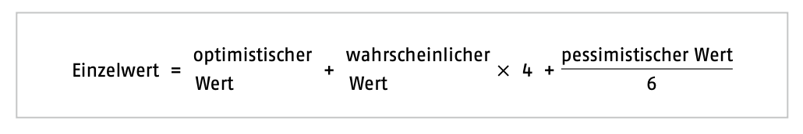
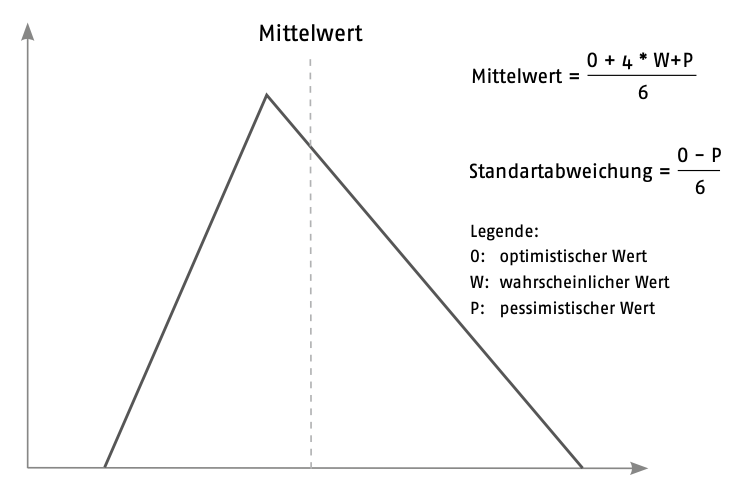

Diese Arbeit setzt sich mit der Drei-Zeiten-Methode, auch 3-Punkt-Schätzung genannt, auseinander. Dabei handelt es sich um eine Schätzmethode des [Projektmanagements](Projektmanagement.md). 
## Schätzungen in Projekten
Schätzungen liefern immer unsichere Ergebnisse, da sie sich auf die Zukunft beziehen. „Es kann sich um eine pessimistische oder auch um eine optimistische Berechnung handeln.“[^1] Beide sind schlecht für das [Projektmanagement](Projektmanagement.md), denn bei der zu pessimistischen Variante wird der Endtermin des Projekts zu weit nach hinten geschoben, bei der zu optimistischen gerät das Projekt in Verzug. Die Terminplanung innerhalb eines Projektes ist allerdings auf gute Berechnung angewiesen. Je realistischer die Schätzung ist, umso genauer kann der Endtermin des Projekts geplant werden. Oft erhält man aber erst im Verlauf eines Projektes immer bessere Daten, mit denen die Schätzungen genauer bestimmt werden können.

Verantwortlich für die Prognose sind die [Projektleiter](Projektleiter.md). Um die [Projektplanung](Projektplanung.md) bestmöglich festzulegen, kann man für die Schätzung folgende Quellen nutzen: 

* die Erfahrungen von Experten abfragen
* bereits bekannte Kosten für Material und Personal planen
* Daten aus bereits durchgeführten Projekten berücksichtigen
## Die Drei-Zeiten-Methode

Bei der Drei-Zeiten-Methode schätzen die Experten für jeden Vorgang drei Werte. Ein optimistischer (Best-Case), ein wahrscheinlicher (Likely-Case) und ein pessimistischer Wert (Worst-Case). Aus diesen drei Schätzwerten berechnet die Drei-Punkt-Schätzung den Erwartungswert mit Standardabweichung.[^2] Es ist häufig unklar, wann ein Szenario als Best-, Worst- oder Likely-Case-Szenario berücksichtigt werden sollte und wann es ignoriert werden darf, weil es zu unwahrscheinlich ist.[^3] 

Die Dauer des Vorgangs wird dann mit der folgenden Formel ermittelt:

*Abbildung 1: Die Einzelwertberechnung* 

Der Schätzfehler wird durch die Formel der Standardabweichung angegeben: 

*Abbildung 2: Die Berechnung der Standardabweichung*

Die Dreipunkt-Schätzung gleicht Schätzfehler aus und liefert so realistischere Werte als die Einzelwert-Schätzung. [Abbildung 3](Drei_Zeiten_Methode/Mittelwert.png) zeigt, wie der Mittelwert bei der Dreipunkt-Schätzung berechnet wird. Die Schätzwerte werden an die horizontale Achse geschrieben und die dazugehörigen Wahrscheinlichkeiten der Prognosen an die vertikale Achse. Der Verlauf der Schätzwerte ist eine Kurve. Die absolute Wahrscheinlichkeit wird durch Fläche unter der Kurve dargestellt. Das Dreieck ist eine Annäherung an die Kurve und lässt sich vereinfacht durch folgende Formel berechnen. [^1]

*Abbildung 3: Die Mittelwertberechnung*

### Einsatzmöglichkeiten

Die Schätzmethode eignet sich in frühen Projektphasen besonders gut, wenn der Leistungsumfang noch nicht eingegrenzt worden ist. Angewendet werden kann sie des weiteren für alle [Aufwands- & Kostenkontrollen](Aufwands_Kosten_Kontrolle.md). Außerdem ist sie nicht nur auf den Einsatz im [Projektmanagement](Projektmanagement.md) beschränkt. 

### Vorteile:
* Internationale Anerkennung in der [Projektplanung](Projektplanung.md)
* Bezieht Erfahrungswissen in die Schätzung mit ein
* Gibt zusätzliche Informationen über die Unsicherheit des Schätzwerts
* Berücksichtigt die Asymmetrie von optimistischer und pessimistischer Schätzung

### Nachteile:

* Liefert unsichere Ergebnisse bei unzureichenden Informationen
* Die Aufgabe muss inhaltlich klar definiert werden
* Mehrere Expertenschätzungen notwendig, um ein belastbares Ergebnis zu erzielen [^2]

# Quellen

[^1]: [Bohinc, T. (2019). Grundlagen des Projektmanagements
Methoden, Techniken und Tools für Projektleiter (GABAL-Verlag)](https://wiso.genios.de/document/GABA__9783956238512240)

[^2]: [Niklas, C. (2017). PERT Drei-Punkt-Schätzung (Projekt Magazin)](https://www.projektmagazin.de/methoden/pert-drei-punkt-schaetzung)

[^3]: [Lüth, K. (2018). Realistische Aufwandsschätzung schnell und systematisch](https://www.wiso-net.de/document/PROJ__1127854)

