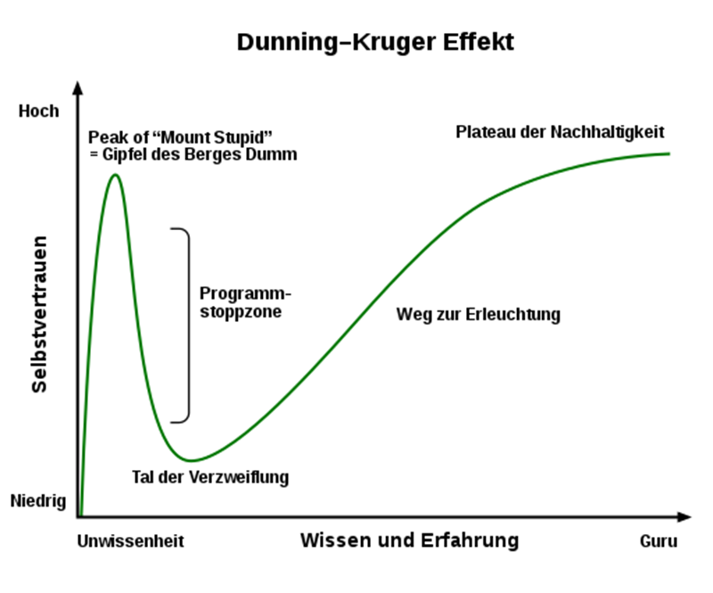

# Dunning-Kruger-Effekt - Die Selbstüberschätzung der Inkompetenten
## Grundgedanke
Im Jahre 1995 ereignete sich in Pittsburgh einer der spektakulärsten Banküberfälle aller Zeiten. Zwei Banken wurden am helllichten Tag von einem nicht maskierten Mann ausgeraubt. Er behauptete, dass er keinesfalls fahrlässig gehandelt habe, schließlich habe er sein Gesicht vor dem Raubüberfall mit Zitronensaft beschmiert, damit ihn die Überwachungskameras nicht sehen konnten. Diese Geschichte gilt als Paradebeispiel für das Phänomen, von dem dieser Beitrag handelt.[^1] Der griechische Philosoph Sokrates sagte einst: "Ich weiß, dass ich nichts weiß". Mit dieser Aussage war er einigen Menschen weit voraus. Der Dunning-Kruger Effekt beleuchtet das Gegenteil dieser Erkenntnis.[^2] 
## Erklärung des Phänomens 
Die [kognitive](https://github.com/ManagingProjectsSuccessfully/ManagingProjectsSuccessfully.github.io/blob/main/kb/Gender_Bias.md) [Verzerrung](https://github.com/ManagingProjectsSuccessfully/ManagingProjectsSuccessfully.github.io/blob/main/kb/Survivorship_Bias.md) im Selbstverständnis inkompetenter Menschen, das eigene Können und Wissen zu überschätzen wird als Dunning-Kruger-Effekt bezeichnet. Diese Eigenschaft beruht auf der Unfähigkeit, sich selbst objektiv zu beurteilen.
## Geschichte und Teufelskreis der Inkompetenz
Die Sozialpsychologen David Dunning und Justin Kruger veröffentlichten im Jahr 1999 ihre Erkenntnisse, bei denen man zum Entschluss kam, dass Unwissenheit oft zu mehr Selbstvertrauen führt als Wissen. Die Publikation zeigte, dass schlechtere Leistungen bei Menschen, oft mit einer größeren Selbstüberschätzung verbunden sind als bei denjenigen mit stärkeren Leistungen. Durch Experimente an der Cornell University in New York kamen die beiden Psychologen zum Ergebnis, dass weniger kompetente Menschen,
* eher dazu tendieren, die eigenen Fähigkeiten zu überschätzen,
* überlegene Fähigkeiten bei anderen Personen unterschätzen und nicht erkennen,
*	das Ausmaß ihrer fehlenden Kompetenz falsch einschätzen,
*	durch Übung und Bildung nicht nur die eigene Kompetenz steigern, sondern auch lernen können, sich selbst und andere besser einzuschätzen.[^3] 

Diese Aneinanderreihung von Fehlern ist auch als Teufelskreis der Inkompetenz bekannt. Die Probanden sollten unter anderem Logik- und Grammatiktests bearbeiten. Nach Beendigung der Tests sollten die Teilnehmer einschätzen, wie gut sie im Vergleich zu ihren Kommilitonen abgeschnitten haben. Gerade diejenigen, die am schlechtesten abschnitten glaubten die besten Lösungen gefunden zu haben.[^4] Deshalb ist ein konstruktives [Feedback](https://github.com/ManagingProjectsSuccessfully/ManagingProjectsSuccessfully.github.io/blob/main/kb/Feedbackgespr%C3%A4che.md) für die Betroffenen besonders wichtig, jedoch stellt die fehlende [Kritikfähigkeit](https://github.com/ManagingProjectsSuccessfully/ManagingProjectsSuccessfully.github.io/blob/main/kb/Umgang_mit_Kritik.md) ein Problem dar.[^5]

 

Abbildung 1: [Die Phasen des Dunning-Kruger-Effekts](https://de.wikipedia.org/wiki/Datei:Dunning%E2%80%93Kruger_Effekt.svg)

Die Visualisierung zeigt den Dunning-Kruger-Effekt. Es ist zu erkennen, dass es nur einen geringen Anstieg der Erfahrung benötigt, damit Menschen denken, dass sie allwissend sind und ein großes Selbstvertrauen haben. Erst wenn die Personen kompetenter werden, sinkt das Selbstvertrauen. Der Effekt spielt sich überwiegend in diesem beschriebenen Bereich ab.
## Einordnung des Effekts in aktuelle Beispiele
Es lässt sich auch in der heutigen Zeit ein Zusammenhang mit dem Dunning-Kruger-Effekt beobachten. Seit März 2020 gibt es zahlreiche Hobby-Virologen, die sich mit dem Coronavirus auskennen.[^6] Ein anderes prominentes Beispiel ist der ehemalige US-Präsident Donald Trump. Sätze wie „Das kann nur ich“ oder „Niemand weiß mehr über diese Sache als ich“ belegen das.[^7] 
## Kulturelle Unterschiede 
Die Studien wurden vor allem an Menschen aus Nordamerika durchgeführt. Eine spätere Studie aus dem Jahr 2001 offenbarte, dass sich beispielsweise Japaner aufgrund von kulturellen Unterschieden anders verhalten als Nordamerikaner. Japaner unterschätzen häufiger ihre eigenen Fähigkeiten und sehen Misserfolge als Anlass, sich zu verbessern.[^8] 
## Siehe auch
* [Survivorship Bias](https://github.com/ManagingProjectsSuccessfully/ManagingProjectsSuccessfully.github.io/blob/main/kb/Survivorship_Bias.md)
* [Gender Bias](https://github.com/ManagingProjectsSuccessfully/ManagingProjectsSuccessfully.github.io/blob/main/kb/Gender_Bias.md)
* [Feedback-Kultur](https://github.com/ManagingProjectsSuccessfully/ManagingProjectsSuccessfully.github.io/blob/main/kb/Feedback_Kultur.md)
* [Feedback-Methoden](https://github.com/ManagingProjectsSuccessfully/ManagingProjectsSuccessfully.github.io/blob/main/kb/Feedback_Methoden.md)
* [Feedbackgespräche](https://github.com/ManagingProjectsSuccessfully/ManagingProjectsSuccessfully.github.io/blob/main/kb/Feedbackgespr%C3%A4che.md)
* [Umgang mit Kritik](https://github.com/ManagingProjectsSuccessfully/ManagingProjectsSuccessfully.github.io/blob/main/kb/Umgang_mit_Kritik.md)
## Quellen
[^1]: [Dunning-Kruger-Effekt: Warum sich Halbwissende für besonders klug halten | National Geographic](https://www.nationalgeographic.de/wissenschaft/2020/06/dunning-kruger-effekt-warum-sich-halbwissende-fuer-besonders-klug-halten)

[^2]: [Dunning-Kruger-Effekt: Die Macht der Selbstüberschätzung - [GEO]](https://www.geo.de/wissen/23942-rtkl-psychologie-dunning-kruger-effekt-weshalb-inkompetente-menschen-oft-das-groesste)

[^3]: [Dunning-Kruger-Effekt – Wikipedia](https://de.wikipedia.org/wiki/Dunning-Kruger-Effekt)

[^4]: [Dunning-Kruger-Effekt: Warum sich Halbwissende für besonders klug halten | National Geographic](https://www.nationalgeographic.de/wissenschaft/2020/06/dunning-kruger-effekt-warum-sich-halbwissende-fuer-besonders-klug-halten)

[^5]: [Dunning-Kruger-Effekt: 4 Phasen der Selbstüberschätzung](https://karrierebibel.de/dunning-kruger-effekt/)

[^6]: [Dunning-Kruger-Effekt: 4 Phasen der Selbstüberschätzung](https://karrierebibel.de/dunning-kruger-effekt/)

[^7]: [Dunning-Kruger-Effekt: Die Macht der Selbstüberschätzung - [GEO]](https://www.geo.de/wissen/23942-rtkl-psychologie-dunning-kruger-effekt-weshalb-inkompetente-menschen-oft-das-groesste)

[^8]: [Dunning-Kruger-Effekt: Die Macht der Selbstüberschätzung - [GEO]](https://www.geo.de/wissen/23942-rtkl-psychologie-dunning-kruger-effekt-weshalb-inkompetente-menschen-oft-das-groesste)

