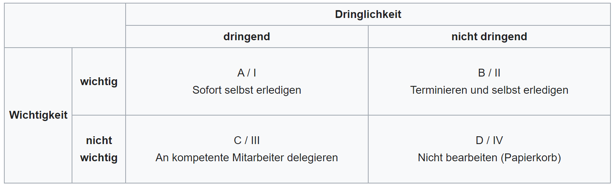

# Eisenhower Matrix

Das Eisenhower Prinzip (auch genannt Eisenhower Methode, Eisenhower Matrix) kann dabei helfen, anstehende Aufgaben in Kategorien einzuteilen und diese zu priorisieren. Dabei wird jede Aufgabe auf Dringlichkeit und Wichtigkeit überprüft. Dadurch sollen die wichtigsten Aufgaben zuerst erledigt werden und die unwichtigen aussortiert. Eine Aufgabe kann wichtig/nicht wichtig sowie dringend/nicht dringend sein. Insgesamt ergeben sich vier Kombinationsmöglichkeiten, die in einer Matrix mit vier Quadranten sichtbar gemacht werden können. Jedem Aufgabentyp wird eine bestimmte Art der Bearbeitung zugeordnet. [^1]

# Inhaltsverzeichnis

* [Wortherkunft](#wortherkunft)
* [Aufgaben-Varianten](#aufgaben-varianten)
* [Vorteile und Nachteile des Eisenhower Prinzips](#vorteile-und-nachteile-des-eisenhower-prinzips)
* [Fazit](#fazit)
* [Quellenverzeichnis](#quellenverzeichnis)

# Wortherkunft

Der Name leitet sich vom ehemaligen US-Präsidenten und Alliierten-General Dwight David Eisenhower. Eisenhower war der 34. Präsident der USA, gehörte der Republikanischen Partei an und regierte zwischen 1953 und 1961. Der Bezug auf Eisenhower geht jedoch auf eine Rede von ihm zurück die folgendermaßen zitiert wird: „I have two kinds of problems, the urgent and the important. The urgent are not the important, and the important are never urgent.“

# Aufgaben-Varianten

**A-Aufgaben:** jene die dringend und wichtig sind. Sie sollten sofort selbst erledigt werden

**B-Aufgaben:** jene die wichtig, aber nicht dringend sind. Sie können auf einen anderen Termin verschoben werden, an dem sie selbst erledigt werden.

**C-Aufgaben:** jene die nicht wichtig, aber dringend sind. Sie können an kompetente Mitarbeiter übergeben werden.

**D-Aufgaben:** jene die nicht wichtig und nicht dringend sind. Sie müssen nicht erledigt werden und werden als Zeitfresser eingestuft.

# Vorteile und Nachteile des Eisenhower Prinzips

Die Einfachheit des Prinzips wird hochgeschätzt. Die Überprüfung der Aufgaben auf Wichtigkeit und Dringlichkeit kann sehr schnell erfolgen. Man kann auch auf Visualisierung verzichten, sofern es um wenige Aufgaben geht. Stehen jedoch viele Aufgaben bevor, ist es hilfreich, sich ein Raster aufzuzeichnen.

Die Eisenhower Methode hilft zudem, Zeitfresser zu identifizieren und diese auszusortieren.

Der größte Nachteil ist, dass das Eisenhower Prinzip überwiegend für Personen in Führungspositionen geeignet ist, die Aufgaben an andere weitergeben können. In der Schule, in der Uni und in vielen Jobs gibt es diese Möglichkeit nicht. Da muss man im Normalfall alle Aufgaben selbst erledigen, auch die C-Aufgaben.

Ein weiterer Kritikpunkt richtet sich an das Kriterium Wichtigkeit. Sie ist oft nur subjektiv und daher nicht immer eindeutig, ob eine Aufgabe wichtig oder unwichtig ist. Es gibt oft keinen äußeren Faktor, der die Wichtigkeit bestimmt im Gegensatz zum Kriterium Dringlichkeit, wo z.B. Deadlines anstehen.
Kritiker kamen zu der Erkenntnis, dass wichtige Aufgaben nur selten dringend seien und dringende Aufgaben nur selten wichtig seien.
Diese Betrachtungsweise stellt das gesamte Prinzip infrage.[^3]

# Fazit
Die Methode ist hilfreich, Prioritäten besser zu setzen.
Im besten Fall bearbeitet jeder Mensch überwiegend Aufgaben, die als dringlich und wichtig eingestuft werden können. Wird die Herangehensweise der Matrix effektiv umgesetzt, sollte sich also ein Zeitgewinn deutlich erkennen lassen. Die gewonnene Zeit kann wiederum für andere Dinge genutzt werden.[^2]

# Quellenverzeichnis

[^1]: [Definition Eisenhower-Methode (Wikipedia)](https://de.wikipedia.org/wiki/Eisenhower-Prinzip#cite_note-1)   
[^2]: [Fazit (bigKarriere)](https://www.bigkarriere.de/karrierewelt/querbeet/zeitmanagement-das-eisenhower-prinzip-do-or-not-do)  
[^3]: [Ziele der Eisenhauer Matrix(t2informatik)](https://t2informatik.de/wissen-kompakt/eisenhower-matrix/)