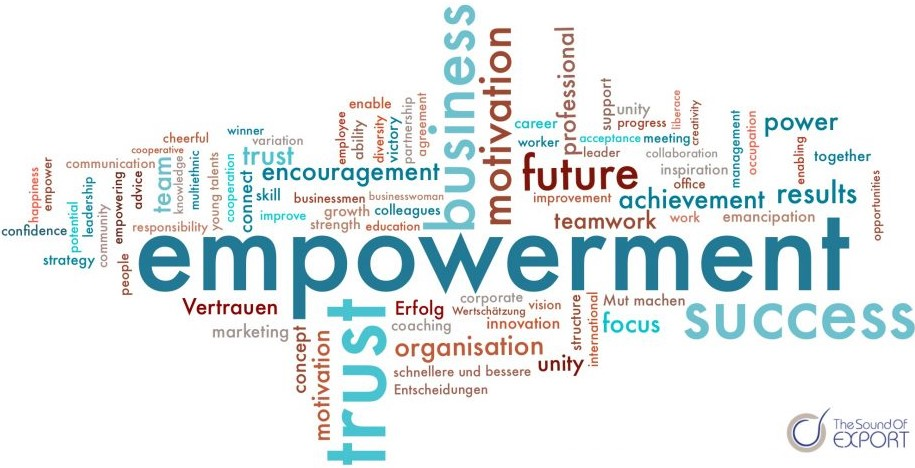

Bei Teamarbeit ist der [Leiter](Projektleiter.md) eines [Projektes](Projekt.md) normalerweise derjenige, der die [Verantwortung](Verantwortlichkeiten.md) und Autorität für alle Entscheidungen übernimmt. Allerdings kann diese Vorgehensweise oftmals verhindern, dass [Projektmitarbeiter](Projektmitarbeiter.md) ihre Fähigkeiten vollständig entfalten. [Empowerment](Empowerment.md) im [Projektmanagement](Projektmanagement.md) bedeutet deshalb auf die Stärkung des gesamten Projektteams überzugehen. Hochproduktive [selbstorganisierende Teams](Selbstorganisierende_Teams.md) erfordern jedoch eine offene Fehlerkultur, damit [Mitarbeiter](Projektmitarbeiter.md) des [Projekts](Projekt.md) nicht zögern, wichtige Entscheidungen zu treffen.
 Somit können mithilfe von [Empowerment](Empowerment.md) das eigene Handeln und Denken der [Projektmitarbeiter](Projektmitarbeiter.md) angeregt, bürokratischer Aufwand und Hierarchiestufen reduziert und Prozesse verbessert werden.[^7][^3]
 Empowerment ermöglicht somit Projektarbeit[^1].

 

*Faktoren von Empowerment[^2]*

 [Empowerment](Empowerment.md) ist dabei dem Umfangs- und [Änderungsmanagement](Änderungsmanagement.md) zuzuordnen. Das Umfangs- und Änderungsmanagement ist eine Kernaufgabe des klassischen sowie agilen [Projektmanagements](Projektmanagement.md). Während es bei agilen [Projekten](Projekt.md) üblicherweise bei konkreten Aufgaben des entsprechenden [Sprints](Sprint.md) Anwendung findet, sind beim klassischen [Projektmanagement](Projektmanagement.md) alle zentralen Aufgaben, wie [Risikomanagement](Risikomanagement.md), Budget-/Kostenmanagement und Zeitmanagement betroffen.[^7]

# Defintion

Im Allgemeinen betitelt [Empowerment](Empowerment.md) Strategien und Maßnahmen, welche den Autonomie- und Selbstbestimmungsgrad von Menschen oder Gemeinschaften steigern. Dabei soll ihnen ermöglicht werden, ihre Interessen eigenmächtig, selbst[verantwortlich](Verantwortlichkeiten.md) und -bestimmt zu vertreten. [Empowerment](Empowerment.md) bezeichnet dabei sowohl den Prozess als auch die professionelle Unterstützung der Emanzipation[^4]

Im Sinne des [Projektmanagements](Projektmanagement.md) bedeutet [Empowerment](Empowerment.md) Macht- und [Verantwortungs](Verantwortlichkeiten.md)übertragung an die [Mitarbeiter](Projektmitarbeiter.md), wodurch ihnen ein höheres Maß an Autonomie, Informationszugang, Entscheidungskompetenz und Mitbestimmung eingeräumt wird. Diese Maßnahmen erlauben [Mitarbeitern](Projektmitarbeiter.md) eigenmächtig über gewisse Budgets, Kulanzleistungen, Urlaubsplanung sowie ihre eigenen Arbeitsabläufe zu entscheiden.[^3]

# Vorteile durch [Empowerment](Empowerment.md)

## [Mitarbeiter](Projektmitarbeiter.md)motivation

Ein erweiterter Entscheidungsspielraum und ein erhöhter Mitbestimmungsgrad der [Mitarbeiter](Projektmitarbeiter.md), welche über die Verwendung gewisser Budgets und die Gestaltung ihrer Arbeitsabläufe autonom und eigen[verantwortlichen](Verantwortlichkeiten.md) entscheiden, stärken erwiesenermaßen die intrinsische Motivation[^2][^6]. Dies hat wiederum positive Auswirkungen auf die [Mitarbeiter](Projektmitarbeiter.md)qualifizierung, da sie motivierter sind sich persönlich weiterzubilden und selbst zu verwirklichen[^6].

## Reaktionsfähigkeit

Oftmals muss innerhalb eines [Projektes](Projekt.md) schnellstmöglich gehandelt werden[^3]. Deshalb ist es häufig nicht sinnvoll die jeweilige Entscheidungsfrage die verschiedenen Hierarchiestufen passieren zu lassen[^3]. Stakeholder erwaten zügige Entscheidungen[^2]. Daher sollte derjenige [Projektmitarbeiter](Projektmitarbeiter.md), der mit der entsprechenden Fragestellung konfrontiert ist, ausreichend Entscheidungskompetenz besitzen[^3]. Somit kann die Reaktionsschnelligkeit des [Projektes] deutlich gesteigert werden[^3].

## Qualität von Entscheidungen

Neben der Reaktionsfähigkeit, ist es natürlich ebenfalls von Relevanz, wie sinnvoll die getroffene Entscheidung ist. [Projektmitarbeiter](Projektmitarbeiter.md), die den nähsten Kontakt zu den jeweiligen Stakeholdern haben, erhalten üblicherweise auch den tiefsten Einblick in die betreffende Situation. [Empowerment](Empowerment.md) ermöglicht es ihnen somit gute und sinnvolle Entscheidungen zu treffen.[^2]

## Fachkräftenachwuchs

Die Jobpräferenzen haben sich deutlich gewandelt: Die jungen Generationen streben in Bezug auf [Projektmanagement](Projektmanagement.md) zunehmend nach größeren Herausforderungen und mehr Eigen[verantwortung](Verantwortlichkeiten.md). Sie bevorzugen flache Hierarchien und einen begrenzten Anteil der Fremdbestimmung und präferieren deshalb [Projekte](Projekt.md), bei denen sie mehr mitbestimmen können. Dieses Bedürfnis nach Freiheit steht somit heutzutage im Konflikt mit dem klassischen engmaschigen Hierarchiedenken.[^3] 

Auf dem Arbeitsmarkt haben sich außerdem Angebot und Nachfrage stark verändert. Der Grund hierfür liegt im demographischen Wandel. Es gestaltet es sich heutzutage schwieriger für Unternehmen kompetente [Mitarbeiter](Mitarbeiter.md) für eine Stelle anzuwerben. Junge qualifizierte Fachkräfte befinden sich also immer öfter in der Situation ihren Arbeitsplatz in einem bestimmten Umfang auswählen zu können. Sehr oft entscheiden sie sich für Unternehmen und Teams mit flachen Hierarchien.[^3]

# Die Bedeutung von Empowerment für Unternehmen

Empowerment hat eine große Bedeutung für die Wirtschaft und Unternehmen der heutigen Zeit.[^6]

Erst wenn Empowerment konsequent auf allen Ebenen des Unternehmens durchgeführt wird und in die Unternehmenskultur eingebettet ist, können Erfolge erzielt werden.[^6]

Nun stellt sich die Frage, welche Vorteile sich aus Empowerment ergeben.[^6]

Wenn sich ein Unternehmen genauer mit Empowerment auseinandersetzt, kann es Einsicht in übergeordnete Zusammenhänge erlangen und so können neue Handlungsfelder für Mitarbeiter entstehen. Ist Empowerment einmal etabliert, können Optionen von den Mitarbeitern wahrgenommen und selbstständig ausgewählt werden. Um diese Befähigung umsetzen zu können, müssen allerdings auch die Rahmenbedingungen im Unternehmen stimmen. Dazu ist es wichtig, hierarchische und bürokratische Hürden aus dem Weg zu räumen, die Mitarbeiter in der Entscheidungsfindung bremsen. Des Weiteren muss eine Unternehmenskultur etabliert werden, in der man Fehler machen kann und dafür nicht bestraft wird und in der Vertrauen entstehen kann. Ein wichtiger Teil des Empowerment stellen Teamentwicklungsmaßnahmen dar, wodurch die Mitarbeiter mit neuen Qualifikationen ihre Rolle im Team finden können.[^6]

Empowerment heißt also nicht einfach Verantwortung abzugeben, sondern, dass alle für das Unternehmen, für die Gewinne und die Produkte und Leistungen des Betriebes verantwortlich sind. Verantwortung bedeutet wiederum, größeres Engagement für eigene Projekte und mehr Klarheit über eigene Ziele und Bedürfnisse. Die Effektivität und Produktivität eines Unternehmens, wird von der Entwicklung der Mitarbeiter sowie von dem Einsatz deren Talente und Qualitäten bestimmt.[^6]

# Siehe auch

* [Selbstorganisierende_Teams](Selbstorganisierende_Teams.md)
* [Teammanagement](Teammanagement.md)
* [Change Management](Change_Management.md)
* [Änderungsmanagement](Änderungsmanagement.md)

# Weiterführende Literatur

* Weiterfuehrende Literatur zum Thema z.B. Bücher, Webseiten, Blogs, Videos, Wissenschaftliche Literatur, ...

# Quellen

[^1]: Gasmann, O.: Praxiswissen Projektmanagement: Bausteine - Instrumente -Checklisten. 2. Auflage, Carl
Hanser Verlag, München, 2006
[^2]: [Warum ist Empowerment so wichtig?](https://www.thesoundofexport.com/warum-ist-empowerment-so-wichtig/)
[^3]: [Empowerment im agilen Kontext: Die 5 Wege zum Empowerment](https://www.berlinerteam.de/magazin/empowerment/)
[^4]:[Empowerment](https://de.wikipedia.org/wiki/Empowerment)
[^6]:[Empowerment: Teil der Managementkonzepte von morgen](https://media.zweikern.com/de/index/empowerment)
[^7]:[Empowerment des Teams](https://project-base.org/projektmanagement-glossar/empowerment-des-teams/)