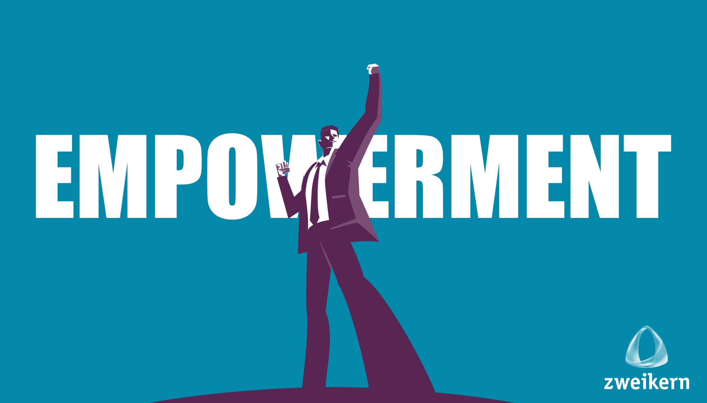

Bei herkömmlicher Teamarbeit ist der [Projektleiter](Projektleiter.md) derjenige, der die [Verantwortung](Verantwortlichkeiten.md) und Autorität für Entscheidungen übernimmt [^6]. Allerdings kann diese Tatsache oftmals verhindern, dass [Projektmitarbeiter](Projektmitarbeiter.md) ihre Fähigkeiten vollständig entfalten. [Empowerment](Empowerment.md) im [Projektmanagement](Projektmanagement.md) bedeutet deshalb, auf die Stärkung des gesamten Projektteams überzugehen [^6]. Dabei wird Empowerment von verschiedenen Faktoren geprägt (vgl. Abb. 1)[^2].

*Abbildung 1: Faktoren von Empowerment[^2]*

Empowerment ist dabei dem Umfangs- und [Änderungsmanagement](Aenderungsmanagement.md) zuzuordnen. Das Umfangs- und Änderungsmanagement ist eine Kernaufgabe des klassischen und agilen Projektmanagements. Während es in agilen [Projekten](Projekt.md) üblicherweise bei den konkreten Aufgaben der jeweiligen [Sprints](Sprint.md) Anwendung findet, sind beim klassischen Projektmanagement alle zentralen Aufgaben wie [Risikomanagement](Risikomanagement.md), Kostenmanagement und Zeitmanagement davon betroffen.[^6]

# Definition

Im Allgemeinen betitelt Empowerment Strategien und Maßnahmen, welche den Autonomie- und Selbstbestimmungsgrad von Menschen oder Gemeinschaften steigern. Dabei soll diesen ermöglicht werden, ihre Interessen eigenständig und selbstverantwortlich zu vertreten. Empowerment bezeichnet dabei sowohl den Prozess als auch die professionelle Unterstützung der Emanzipation.[^4]

*Abbildung 2: Empowerment als bildhafte Darstellung[^7]*

Im Sinne des Projektmanagements bedeutet Empowerment Macht- und Verantwortungsübertragung an die Mitarbeiter, wodurch ihnen ein höheres Maß an Autonomie, Informationszugang, Entscheidungskompetenz und Mitbestimmung eingeräumt wird. Diese Maßnahmen erlauben Mitarbeitern eigenmächtig über gewisse Budgets, Kulanzleistungen und ihre eigenen Arbeitsabläufe zu entscheiden.[^3]

# Bedingungen für Empowerment

Damit die Mitarbeiter eines Projektes nicht zögern wichtige Entscheidungen zu treffen, müssen hierarchische und bürokratische Blockaden reduziert werden[^5]. Des Weiteren erfordern produktive [selbstorganisierende Teams](Selbstorganisierende_Teams.md) eine offene Fehlerkultur, in der Vertrauen aufgebaut werden kann[^6][^5]. Somit können durch Empowerment das eigene Handeln und Denken der Projektmitarbeiter angeregt sowie Prozesse verbessert werden[^3]. Empowerment meint also, dass jeder für die Gewinne, Produkte und Leistungen eines Unternehmens verantwortlich ist und seine Stärken gezielt einsetzt[^5][^8]. Aus mehr Verantwortung folgt wiederum ein verstärktes Mitarbeiterengagement in Projekten[^5]. Empowerment ermöglicht somit Projektarbeit[^1].

Für eine erfolgreiche Umsetzung von Empowerment im Projektmanagement muss sowohl auf der Mitarbeiter- als auch auf der Führungsebene angesetzt werden. Innerhalb von Projekten kann Autonomie und Selbstbestimmung lediglich dann vollständig integriert werden, wenn alle Beteiligten von Empowerment überzeugt und Projektleiter bereit sind, Kontrolle und Macht abzugeben.[^8]

# Vorteile durch Empowerment

## Mitarbeitermotivation

Ein erweiterter Entscheidungsspielraum und ein erhöhter Mitbestimmungsgrad stärken erwiesenermaßen die intrinsische Mitarbeitermotivation[^2][^5]. Dies hat wiederum positive Auswirkungen auf die Qualifizierung der Mitarbeiter, da diese motivierter sind, sich persönlich weiterzubilden und sich selbst zu verwirklichen[^5].

## Reaktionsfähigkeit

Oftmals muss innerhalb eines Projektes schnellstmöglich gehandelt werden[^3]. Deshalb ist es häufig nicht sinnvoll, die jeweiligen Entscheidungsfragen verschiedene Hierarchiestufen passieren zu lassen[^3]. Stakeholder erwarten zügige Entscheidungen[^2]. Daher sollte derjenige Projektmitarbeiter, der mit der entsprechenden Fragestellung konfrontiert wird, die benötigte Entscheidungskompetenz besitzen[^3]. Somit kann die Reaktionsgeschwindigkeit eines Projektes deutlich erhöht werden[^3].

## Qualität von Entscheidungen

Neben der Reaktionsfähigkeit ist es ebenfalls von Relevanz, wie sinnvoll eine getroffene Entscheidung ist. Projektmitarbeiter, die den engsten Kontakt zu den jeweiligen Stakeholdern haben, erhalten üblicherweise auch den tiefsten Einblick in die entsprechende Situation. Empowerment ermöglicht es ihnen somit gute und sinnvolle Entscheidungen zu treffen.[^2]

## Fachkräftenachwuchs

Die Jobpräferenzen haben sich deutlich gewandelt: Die jungen Generationen streben in Bezug auf Projektmanagement zunehmend nach größeren Herausforderungen und mehr Eigenverantwortung. Sie bevorzugen flache Hierarchien sowie einen begrenzten Anteil an Fremdbestimmung und präferieren deshalb Projekte, bei denen sie mehr mitbestimmen können. Dieses Bedürfnis nach Freiheit steht heutzutage somit im Konflikt mit dem klassischen, engmaschigen Hierarchiedenken.[^3]

# Siehe auch

* [Selbstorganisierende_Teams](Selbstorganisierende_Teams.md)
* [Teammanagement](Teammanagement.md)
* [Change Management](Change_Management.md)
* [Änderungsmanagement](Aenderungsmanagement.md)

# Weiterführende Literatur

* Blanchard, K.; Carlos, J.P.; Randolph, A.: Management durch Empowerment: Das neue Führungskonzept: Mitarbeiter bringen mehr, wenn sie mehr dürfen. Rowohlt Verlag. Hamburg, 1998.
* Wüthrich, H.A.; Osmetz, D.; Kaduk, S.: Musterbrecher. Führung neu leben. 2. Auflage. Gabler Verlag. Wiesbaden, 2006.
* Gasmann, O.: Praxiswissen Projektmanagement: Bausteine - Instrumente - Checklisten. 2. Auflage. Carl Hanser Verlag. München, 2006.
* Mayrhofer, W.: Strategische Personalpolitik. Rainer Hampp Verlag. München, 1999.
* Schmitz, G.; Dietz, M.; Eberhardt, S.: Empowerment als ganzheitliches Managementkonzept zur Steuerung der individuellen Lösungskompetenz bei Lösungsanbietern: Wirkungsmechanismen und Implementierung. Universität Duisburg-Essen. Duisburg, 2009.

# Quellen

[^1]: Gasmann, O.: Praxiswissen Projektmanagement: Bausteine - Instrumente - Checklisten. 2. Auflage. Carl Hanser Verlag. München, 2006.
[^2]: [Warum ist Empowerment so wichtig?](https://www.thesoundofexport.com/warum-ist-empowerment-so-wichtig/)
[^3]: [Empowerment im agilen Kontext: Die 5 Wege zum Empowerment](https://www.berlinerteam.de/magazin/empowerment/)
[^4]: [Empowerment](https://de.wikipedia.org/wiki/Empowerment)
[^5]: [Empowerment: Teil der Managementkonzepte von morgen](https://media.zweikern.com/de/index/empowerment)
[^6]: [Empowerment des Teams](https://project-base.org/projektmanagement-glossar/empowerment-des-teams/)
[^7]: [Empowerment als neues Konzept in Unternehmen implementieren](https://media.zweikern.com/de/index/empowerment-implementieren)
[^8]: [EMPOWERMENT: DEFINITION, KONZEPT UND METHODEN](https://www.clevis.de/ratgeber/empowerment/)
