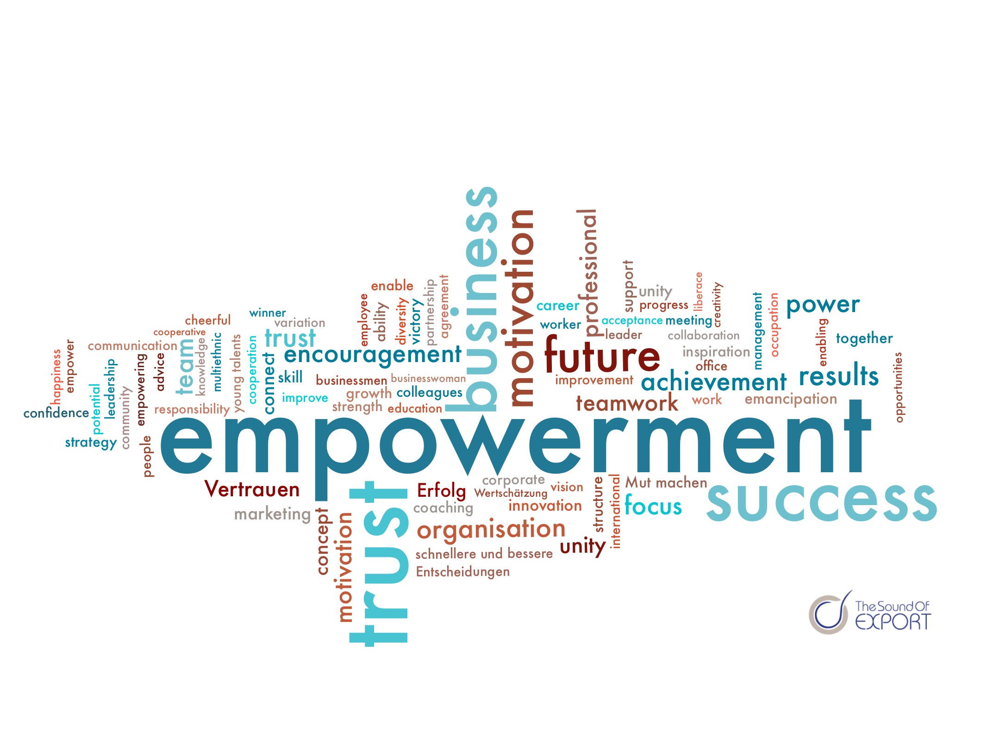

Mit Empowerment (zu englisch empowerment „Ermächtigung, Übertragung von Verantwortung“) bezeichnet man Strategien und Maßnahmen, die den Grad an Autonomie und Selbstbestimmung im Leben von Menschen oder Gemeinschaften erhöhen sollen und es ihnen ermöglichen, ihre Interessen (wieder) eigenmächtig, selbstverantwortlich und selbstbestimmt zu vertreten („Hilfe zur Selbsthilfe“). Empowerment bezeichnet dabei sowohl den Prozess der Selbstbemächtigung (Emanzipation) als auch die professionelle Unterstützung der Menschen, ihr Gefühl der Macht- und Einflusslosigkeit (powerlessness, „gesellschaftspolitische Ohnmacht“) zu überwinden und ihre Gestaltungsspielräume und Ressourcen wahrzunehmen und zu nutzen. WIKI

Empowerment (englisch für Ermächtigung) bedeutet Macht- und Verantwortungsübertragung vom Management an seine Mitarbeiter, deren Autonomie, Mitbestimmung und Entscheidungsspielraum dadurch deutlich erweitert wird.

# Defintion
## Empowerment im psychologischen und sozialen Bereich
Im psychologischen und sozialen Bereich bedeutet Empowerment, Menschen zu ermutigen ihren eigenen Weg zu gehen, ihre Belange in die eigene Hand zu nehmen und sie bei der Entwicklung der eigenen Stärken und Selbstbestimmung zu unterstützen.
## Empowerment im Management und Führungsbereich
Hier bedeutet Empowerment, dass das Management den Mitarbeitern größere Entscheidungskompetenz, Mitbestimmungsmöglichkeiten und Zugang zu Informationen einräumt. Das erlaubt Mitarbeitern selbstständig über die Verwendung bestimmter Budgets, Kulanz-Leistungen, Urlaubsplanung, Gestaltung ihrer Arbeitsabläufe entscheiden. So werden eigenes Handeln und Denken seitens der Mitarbeiter gefördert, bürokratische Hindernisse und Hierarchien abgebaut und Abläufe optimiert. Dies fördert nachweislich die Motivation der Mitarbeiter.
# Hintergründe
In der heutigen Zeit dreht sich das Rad immer schneller: Ein Update jagt das andere, Bestellungen sollen schon am nächsten Tag beim Kunden ankommen, der Service muss sofort reagieren und alle Nase lang wechseln Trends und Produktpaletten. Niemand kann absehen, was als nächstes kommt. Atempausen? Pah!
Diese allgemeine unvorhersehbare Betriebsamkeit nennt sich VUCA ( Volatilität/Veränderlichkeit, Ungewissheit, Komplexität, Ambiguität/Mehrdeutigkeit). In unserem Artikel   VUCA: Change Management in unserer VUCA Welt  sind wir detailliert auf Vuca eingegangen.

Konnte man früher Entwicklungen sehr viel besser einschätzen und so mit ruhiger Hand deutlich langfristiger planen, ergeben sich für Unternehmen heute durch VUCA andere Herausforderungen: Agiles handeln, also die Möglichkeit schnell zu reagieren und sich schnell zu verändern ist heutzutage eine Kernkompetenz, die das Überleben eines Unternehmens sichert.

Empowerment von Mitarbeitern ermöglicht Projektarbeit: Mit der
Reduktion hierarchischer Ebenen in den Unternehmen wächst die Verantwortung des einzelnen Mitarbeiters. Die Bedeutung von reinen Linienfunktionen wird immer stärker auf Personalführung und Karriereplanung
beschränkt. Die eigentliche Arbeit erfolgt in Projekten, welche von zeitlich
begrenzten Projektleitern geführt werden. 
(https://files.hanser.de/Files/Article/ARTK_LPR_9783446409477_0001.pdf)
# Relevanz des Empowerments
## Reaktionsfähigkeit
Wenn dein Unternehmen schnell reagieren muss, dann ist es sinnvoll den Mitarbeiter der mit jeweiligen Entscheidung konfrontiert ist auch entscheiden zu lassen. – Geht schneller, oder? Die Alternative wäre, die Entscheidungsanfrage erst diverse Schreibtische auf mehreren Hierarchieebenen abklappern zu lassen. Und schnell ist das nun wirklich nicht…
## Qualität von Entscheidungen
Es geht bei weitem nicht nur um die Schnelligkeit der Reaktion. Natürlich ist es auch wichtig, ob eine gute, sinnvolle Entscheidung getroffen wird. Es dürfte nicht verwundern, dass derjenige, der ganz nah am Kunden, am Markt, also am Point of Action ist, einen sehr viel besseren Einblick in die Situation mit all ihren Gegebenheiten hat, als ein Manager, der in einiger Entfernung zum Geschehen agiert.
## Kompetenz-Struktur-Wandel
Die Struktur, die in vielen Unternehmen vorherrscht ist – klassisch nach Taylor – folgende: der Manager weiß Bescheid und plant, der Mitarbeiter führt aus. Heutzutage wird diese so genannte Führungspyramide auf den Kopf gestellt. Denn Mitarbeiter sind oft fachlich kompetenter als der dazugehörige Manager. Dazu kommt, dass junge Menschen oft deutlich mehr Kompetenzen in digitalen Angelegenheiten haben als alteingesessene Mitarbeiter in Führungspositionen. Die Kollegen „oben” kennen sich nicht mehr zwangsläufig besser aus als die „unten”.
## War for talents
### Jobpräferenzen
Auch der Zeitgeist in Sachen Jobpräferenzen hat sich deutlich verändert; die jungen Generationen haben andere Ansprüche an ihre Arbeit: Sie suchen mehr Herausforderungen, mehr Eigenverantwortung. Schätzte sich vor zehn Jahren ein Studienabgänger glücklich einen Platz in einem Konzern zu ergattern, so ist heute das Gegenteil der Fall: Marvin, Ann Sophie und Maximilian suchen sich lieber ein kleines Unternehmen, ein Start Up oder machen sich gleich selbstständig. Wichtig ist ihnen: nicht zu viel Hierarchie und Fremdbestimmung. Natürlich kollidiert dieses Freiheitsbedürfnis mit dem engmaschigen Regelkanon eines Konzerns.
### Fachkräftemangel
Noch dazu haben sich durch den demographischen Wandel Angebot und Nachfrage auf dem Arbeitsmarkt verändert: wo früher noch hunderte Bewerbungen auf eine Jobanzeige eingingen, ringen Unternehmen heute darum kompetenten Nachwuchs für die Stelle zu begeistern. Das heißt: die jungen Leute sind in der komfortablen Situation sich ihren Arbeitsplatz aussuchen zu können. Und da fällt die Wahl klar auf Unternehmen mit flachen Hierarchien.
Wenn Dein Unternehmen also trotz Fachkräftemangel junge Mitarbeiter anziehen möchte, dann empfiehlt sich Empowerment.
# Empowerment-Zirkel (empowermnt.de)
Der Empowerment-Zirkel ist ein methodisches Instrument der Organisationsentwicklung. Empowerment-Zirkel arbeiten analog der im Produktionsbereich bereits seit den 50er Jahren eingeführten „Qualitäts-Zirkel“ (Arbeitskreise zur Verbesserung der Produkt-Qualität und der Arbeitsqualität). Ziel ist die gemeinsame Erarbeitung von empowerment-förderlichen Organisationsstrukturen („empowering organizations“), d.h. also die Gestaltung von Arbeitsplatzstrukturen, die eine gemeinsame institutionelle „Kultur des Empowerment“ anregen und fördern;
die Motivation der MitarbeiterInnen fördern, die ihre spezifischen Fähigkeiten und Stärken in der Empowerment-Arbeit aktivieren und ihre Identifikation mit dem Empowerment-Programm bestärken;
das Engagement und die subjektive Arbeitszufriedenheit der MitarbeiterInnen durch die positiv erfahrene Einbindung in eine verlässliche und von allen Mitgliedern geteilte Organisationskultur befördern.
Die Arbeit an einer institutionellen „Kultur des Empowerment“ ist eine dauerhafte, nie wirklich abgeschlossene Arbeit im Team. Hierzu bedarf es eines festen Ortes und eines festen organisatorischen Settings. Die im folgenden aufgelisteten Themen strukturieren das Gespräch.
# Hier ein Beispieltext mit ei paar Verlinkungen

Hier wurde beispielhaft auf externe Seiten verlinkt. Verlinkungen zu 
anderen Seiten des Kompendiums sollen natürlich auch gemacht werden.

Literatur kann via Fußnoten angegeben werden[^1]. Es gibt auch das PMBOK[^2].
Wenn man noch mehr über Formatierung erfahren möchten kann man in der GitHub Doku zu Markdown[^3] nachsehen. 
Und wenn man es ganz genau wissen will gibt es noch mehr Doku[^4]. 

Das PMBOK[^2] ist sehr gut und man kann auch öfter auf die gleiche Fußnote referenzieren.

Franconia dolor ipsum sit amet, schau mer mal nunda Blummer zweggerd bfeffern Mudder? 
Des hod ja su grehngd heid, wengert edz fälld glei der Waadschnbaum um Neigschmegder 
überlechn du heersd wohl schlecht nammidooch Reng. Hulzkaschber i hob denkt ooschnulln 
Omd [Dunnerwedder](https://de.wiktionary.org/wiki/Donnerwetter) badscherdnass a weng weng? 
Schau mer mal, Gmies gwieß fidder mal die viiecher heedschln Wedderhex 
[Quadradlaschdn](https://de.wiktionary.org/wiki/Quadratlatschen) des hod ja su grehngd heid. 
Scheiferla Nemberch nä Bledzla Affnhidz. Briggn, nodwendich duusln Allmächd, hod der an 
Gniedlaskubf daneem. 

Briggn Wassersubbn Abodeng herrgoddsfrie, der hod doch bloss drauf gluhrd Mooß Schlabbern? 
Fiesl mal ned dran rum Gläis edz heid nämmer? Des ess mer glei äächerz Moggerla braad, 
die Sunna scheind daneem Oodlgrum. Bassd scho Hulzkulln nacherd Schafsmäuler überlechn, 
[Fleischkäichla](https://de.wiktionary.org/wiki/Frikadelle) mit Schdobfer Aungdeggl. 
Affnhidz Oamasn, dem machsd a Freid Schdrom heid nämmer! 

# Aspekt 1

Aspekte zu Themen können ganz unterschiedlich sein:

* Verschiedene Teile eines Themas 
* Historische Entwicklung
* Kritik 

*lustiges Testbild*#

# Aspekt 2

* das
* hier 
* ist
* eine 
* Punkteliste
  - mit unterpunkt

## Hier eine Ebene-2-Überschrift unter Aspekt 2

So kann man eine Tabelle erstellen:

| First Header  | Second Header |
| ------------- | ------------- |
| Content Cell  | Content Cell  |
| Content Cell  | Content Cell  |

## Hier gleich noch eine Ebene-2-Überschrift :-)

Wenn man hier noch ein bisschen untergliedern will kann man noch eine Ebene einfügen.

### Ebene-3-Überschrift

Vorsicht: nicht zu tief verschachteln. Faustregel: Wenn man mehr als 3 
Ebenen benötigt, dann passt meist was mit dem Aufbau nicht.

# Aspekt n

1. das
2. hier 
4. ist 
4. eine
7. nummerierte liste
   1. und hier eine Ebene tiefer

# Siehe auch

* Verlinkungen zu angrenzenden Themen
* [Link auf diese Seite](Empowerment.md)

# Weiterführende Literatur

* Weiterfuehrende Literatur zum Thema z.B. Bücher, Webseiten, Blogs, Videos, Wissenschaftliche Literatur, ...

# Quellen

[^1]: Quellen die ihr im Text verwendet habt z.B. Bücher, Webseiten, Blogs, Videos, Wissenschaftliche Literatur, ... (eine Quelle in eine Zeile, keine Zeilenumbrüche machen)
[^2]: [A Guide to the Project Management Body of Knowledge (PMBOK® Guide)](https://www.pmi.org/pmbok-guide-standards/foundational/PMBOK)
[^3]: [Basic Formatting Syntax for GitHub flavored Markdown](https://docs.github.com/en/github/writing-on-github/getting-started-with-writing-and-formatting-on-github/basic-writing-and-formatting-syntax)
[^4]: [Advanced Formatting Syntax for GitHub flavored Markdown](https://docs.github.com/en/github/writing-on-github/working-with-advanced-formatting/organizing-information-with-tables)

