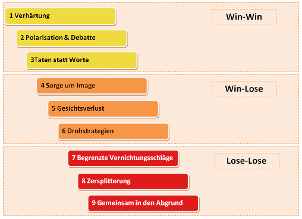

Beim Zusammenleben und der Zusammenarbeit von Menschen treten durch beispielsweise Meinungsverschiedenheiten, verschiedene Haltungen und Sympathien sowie Antipathien häufig Konflikte auf. Diese sind normal und werden erst zu einer Schwierigkeit, wenn diese eskalieren. [^1]

Unter einer Eskalation versteht man Verhaltensmuster, die bewusst oder intuitiv eingesetzt werden und Konfliktsituationen intensivieren. Diese Verhaltensmuster können bewusst oder intuitiv eingesetzt werden. Der Gegensatz hierzu ist die Deeskalation.[^2] 

Um eine Eskalation möglichst zu vermeiden oder zu deeskalieren, gibt es verschiedene Ansätze. Hierdurch entstanden verschiedene Modelle zur Analyse und zum Ablauf von Konfliktsituationen. [^1]

# 9 Eskaltionsstufen mit 3 Ebenen

*9 Eskalationsstufen nach Friedrich Glasl* [^2] 

## 1. Ebene WIN-WIN
In dieser Ebene kann der Konflikt noch gelöst werden. Beide Parteien würden hier von einer Einigung profitieren.  [^4][^5] 

| 1) Verhärtung  | 2) Polarisation | 3) Taten statt Worte |
| ------------- | ------------- | ---------------|
| Hier werden erste Spannungen spürbar und die Fronten verhärten sich. In der ersten Stufe ist die Situation noch harmlos und es treten noch keine Lager- oder Parteibildungen auf.  | Die Gegner versuchen sich durch rationale Argumente zu überzeugen und setzen sich gegenseitig unter Druck. Die Meinungsverschiedenheiten werden fundamentaler und jeder beharrt auf seiner Meinung. | Durch Misstrauen und negativen Erwartungen wird der Konflikt noch mehr verschärft. Gespräche werden frustriert und ergebnislos abgebrochen und die verbale Kommunikation tritt in den Hintergrund.  |

## 2. Ebene WIN-LOSE
In der Lose-Win Ebene ist der Konflikt bereits so weit fortgeschritten, dass es nun mehr einen Gewinner und einen Verlierer geben kann.

| 4) Sorge um Image  | 5) Gesichtsverlust | 6) Drohstrategie |
| ------------- | ------------- | ---------------|
| In dieser Stufe suchen sich die Parteien Verbündete. Hierbei steht nicht mehr im Mittelpunkt den Konflikt zu lösen, sondern letztendlich der Gewinner der Konfliktsituation zu werden. | Die Parteien greifen sich öffentlich und direkt an. Es erfolgt ein vollständiger Vertrauensverlust der Konfliktparteien miteinander. | Eine Konfliktpartei versucht durch Drohung und Erpressung als Gewinner aus dem Konflikt zu gehen. |

## 3. Ebene LOSE-LOSE
Ist der Konflikt so weit fortgeschritten, gibt es nur noch Verlierer. Eine Konfliktlösung ist nur noch durch einen Machteingriff von außen bzw. ein gerichtliches Verfahren möglich. 

| 7) Begrenzte Vernichtungsschläge  | 8) Zersplitterung | 9) Gemeinsam in den Abgrund |
| ------------- | ------------- | ---------------|
| Der Konflikt gerät außer Kontrolle und die eigentliche Konfliktursache steht lange nicht mehr im Vordergrund. Beide Parteien wollen ihrem Gegner möglichst großen Schaden zufügen. Der mit dem geringeren Schaden fühlt sich hierbei als Gewinner.  | Die gegnerische Konfliktpartei soll so weit wie möglich zerstört werden. In dieser Stufe ist die Anwendung von Gewalt nicht ausgeschlossen.  | Die Parteien sind bereit sich selbst zu vernichten, solange der Gegner mit ihnen untergeht. Wenn ein Konflikt so weit fortschreitet, ist ein lösen des Konfliktes ohne Hilfe nicht mehr möglich. |

# Kernmechanismen der Eskalation [^4]
In den Konfliktstufen nach Glasl finden sich die fünf Kernmechanismen der Eskalation. Das sind:

*	Wachsende Selbstfrustration: 
Parteien sind frustriert, wenn sie nicht das bekommen, was sie wollen
*	Ausweitung der strittigen Themen:
Die Partei mit den besseren Argumenten gewinnt die Auseinandersetzung, dadurch versuchen die Konfliktparteien mit unwesentlichen Inhalten die Auseinandersetzung für sich zu entscheiden. Hierdurch steigt die Komplexität und der Konflikt wird unübersichtlich.
*	Wechselseitige Verflechtung von Ursache und Wirkung
*	Tendenz zum Personifizieren des Konfliktes:
Einer bestimmten Person wird die Schuld an einer Streitigkeit gegeben, somit wird für das eigene Handeln keine Verantwortung mehr übernommen.
*	Konflikt-Beschleunigung durch pessimistische Erwartungshaltung: 
Wenn Parteien überzeugt sind, dass ein Konflikt nicht lösbar ist, führt dies dazu das die Konfliktlösung massiv erschwert wird.

# Siehe auch

* Verlinkungen zu angrenzenden Themen
* [Link auf diese Seite](Eskalationsstufen.md)

# Weiterführende Literatur

* Weiterfuehrende Literatur zum Thema z.B. Bücher, Webseiten, Blogs, Videos, Wissenschaftliche Literatur, ...

# Quellen
[^1]: [Eskalationsstufen von Konflikten] (https://www.landsiedel-seminare.de/coaching-welt/wissen/lexikon/eskalationsstufen.html)
[^2]: [Eskalation] (https://de.wikipedia.org/wiki/Eskalation)
[^3]: [Die 9 Eskalationsstufen und wie Konflikte sich lösen lassen!] (https://greator.com/eskalationsstufen/)
[^4]: [Konfliktregelung und Friedensstrategie] (https://link.springer.com/book/10.1007/978-3-531-92789-3)
[^5]: [9 Eskalationsstufen] (https://www.projektmagazin.de/methoden/9-eskalationsstufen-konfliktmanagement)
