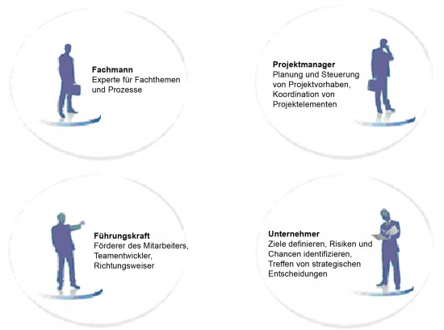
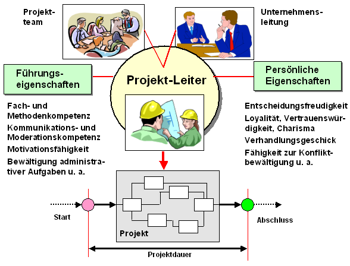

Der [Projektleiter](https://de.wikipedia.org/wiki/Projektleiter) ist für die operative Planung und Steuerung des Projektes verantwortlich. Um ein Projekt zu leiten und dieses erforlgreich zum Ziel zu führen benötigt ein Projektleiter neben fachlichen Kompetenz auch verschiedenste Fähigkeiten.   

# Welche Fähigkeiten benötigt ein Projektleiter?

Ein Projektleiter hat die Aufgabe das Projekt zu initiieren und erfolgreich zum Abschluss zu bringen. Er definiert in der Vorbereitungsphase das Ziel, Budget und Termine und plant die einzelnen Projektschritte. Das Team, das für die Durchführung des Projekts bestimmt ist, koordiniert und motiviert er. Er legt Verantwortlichkeiten fest und verteilt die anfallenden Aufgaben. Dabei ist eine klare und eindeutige Kommunikation äußerst wichtig, damit alle Beteiligten die Aufgaben und Ziele verstehen und umsetzen können[^1]. 

Als Projektleiter muss man sowohl fundiertes fachliches Know-how, als auch die Kompetenzen einer Führungskraft, eines Projektmanagers und eines Unternehmers mitbringen. Im Idealfall füllt der Projektleiter vier Rollen aus. Diese vier Rollen verlangen unterschiedliche Fähigkeiten und Eigenschaften von dem Projektleiter.

*Die vier Rollen des Projektleiters*[^2] 

# Fähigkeiten des Projektleiters als Fachmann

Die meisten Projektleiter erfüllen die fachlichen Anforderungen. Sie sind in der Lage, technische und fachliche Details zu verstehen, zu bewerten oder auch selbst auszuarbeiten. Diese Feldkompetenz und Branchenkenntnis erleichtert einem Projektleiter die tägliche Arbeit, da er Zusammenhänge schneller durchdringt als ein Fachfremder[^2].

* [Fachkompetenz](https://de.wikipedia.org/wiki/Fachkompetenz)
* Erkennen von Zusammenhängen 
* Erkennen von Fehler und Problemlösungsfähigkeiten

# Fähigkeiten des Projektleiters als Projektmanager

Ein Projektleiter muss zudem die Instrumente zum Planen und Steuern von Projekten kennen: Er muss in der Lage sein, die Rahmenbedingungen zu stecken, in denen Abläufe durchgeführt werden und innerhalb derer die Projektmitarbeiter selbständig agieren können. Danach ist es seine Aufgabe, für die Durchführung des Projektes zu sorgen, es zu überwachen und das Team zu leiten. Diese Anforderungen fallen unter die Kategorie „Projektmanagement“ und beinhalten die Fähigkeit, das Projekt zu initiieren, zu definieren, zu planen, durchzuführen, zu steuern und zu bewerten[^1].

* [Methodenkompetenz](https://de.wikipedia.org/wiki/Methodenkompetenz)
* Projektstrukturplan und Priorisierung 
* Aufwand schätzen und Budgetverwaltung
* Zeitleistenplanung
* Ressourceplanung
* Beherrschen der Projektmanagement-Instrumente und deren Anwendung
* Organisationskompetenz

# Fähigkeiten des Projektleiters als Führungskraft

Projektleiter sind Führungskräfte. Ein Projektleiter führt ein Projektteam. Er sollte in der Lage sein, die sich teils widersprechenden Interessen von Kunden, Vorgesetzten, involvierten Abteilungen und den eigenen Projektmitarbeitern zu managen. Der Umgang mit den verschiedenen Stakeholdern eines Projektes erfordert ein hohes Maß an sozialer Kompetenz. Zudem sind Soft Skills und personliche Eigenschaften auch sehr wichtig für Projektmanagement[^2]

## [Sozialkompetenz](https://de.wikipedia.org/wiki/Soziale_Kompetenz)
* Kommunikationsfähigkeit 
* Moderationstechniken
* Überzeugungsfähigkeit
* Koordinierungsaufgaben
* Kontaktfreudigkeit
* Durchsetzungsvermögen
* Fähigkeit zu delegieren
* Zusammenarbeit, Teamfähigkeit, Kooperationsbereitsschaft, Unterstützung
* Führungskompetenz
* Empathie, emotionale Intelligenz
* Motivationsfähigkeit 

## Personliche Eigenschaften
* Selbstvertrauen
* Glaubwürdiges Auftreten
* Leistungsbereitschaft
* Verantwortungsgefühl
* Eigeninitiative 
* Entscheidungsfreude
* Kreativität 
* Belastbarkeit, Stressbewältigung
* Flexibilität und Anpassungsfähigkeit
* Bestmöglicher Umgang mit unvorhersehbaren Problemen und Notfällen, Zeitdruck
* Konfliktfähigkeit: frühzeitig Erkennung von Konflikt, Umgang mit Widerständen, konstruktive Verhaltensweisen in Konfliktsituationen
* Verhandlungshärte und -geschick

*Projektleiter_Fähigkeiten*[^3]

# Fähigkeiten des Projektleiters als Unternehmer

Auch wenn der Projektleiter kein Unternehmen leitet, ähnelt die Aufgabe der eines Geschäftsführers – im Kleinformat und für begrenzte Zeit: Es gilt, Budgets zu planen und mit ihnen zu wirtschaften, Risiken zu identifizieren und zu bewerten, Handlungsstrategien zu entwerfen. Auch Marketingaktivitäten gehören dazu, denn das Projekt muss nach außen gut verkauft und bekannt gemacht werden, damit es Erfolg hat und man, wenn nötig, Partner gewinnen kann. Erfahrene Projektleiter sind daher „Unternehmer im Unternehmen“[^1].

* Risikomangement
* Überblick über das ganze Projekt
* Kritisches Denken
* Wirtschaftliches und unternehmerischen Denkvermögen
* Situative Handlungsfähigkeit
* Veränderungsbereitschaft
* Vernetztes Denken

# Fähigkeiten des Projektleiters in Digitalisierungsumgebung

Entwicklungen bei digitalen Technologien verändern Verhalten, Produktivität und Leistung. Da Unternehmen Projekte zur Einführung von Technologie einsetzen, benötigen Projektleiter bestimmte digitale Fähigkeiten. Projektleiter automatisieren sich wiederholende Aufgaben und ermöglichen die Genauigkeit bei der Schätzung von Aufgaben mithilfe von Künstliche Intelligenz. Daher entwickeln sich  die Fähigkeiten, die von einem Projektleiter benötigt werden, weiter.[^4] 

* Datenwissenschaft: Datenmanagement Analytik mit große Datenmengen
* Sicherheit und Datenschutz Wissen
* Innovative Denkweise
* Fähigkeit zu machen datengesteuerte Entscheidungen

# Fähigkeiten des Projektleiters zu entwickeln

Erfahrung in Projektarbeit und Zertifizierung im Projektmanagement sind gute Möglichkeiten, die Fähigkeiten zu vertiefen und zu erweitern. 

# Siehe auch

* [10 wichtige Fähigkeiten für effektives Projektmanagement](https://www.projectwizards.net/de/blog/2020/03/pm-skills#prioritization)
* [25 wichtige Projektmanagement-Kompetenzen, die Sie für Ihren Erfolg benötigen](https://asana.com/de/resources/project-management-skills)
* [Welche Eigenschaften braucht ein guter Projektleiter?](https://www.experteer.de/magazin/welche-eigenschaften-braucht-ein-guter-projektleiter/)
* [Soft skills Projektleiter](https://www.kayenta.de/training-seminar/artikel/soft-skills-projektleiter-projektmanagement.html) 

# Weiterführende Literatur

* [Projektmanagementhandbuch](https://www.projektmanagementhandbuch.de/)
* [Projektmagazin](https://www.projektmagazin.de/)

# Quellen

[^1]: [Was ist ein Projektleiter](https://refa.de/berufe/projektleiter)

[^2]: [Welche Fähigkeiten und Eigenschaften benötigt ein Projektleiter?](https://www.onpulson.de/3532/welche-faehigkeiten-und-eigenschaften-benoetigt-ein-projektleiter/)
)

[^3]: [Projektleiter DAA Wirtschaftslexikon](https://media.daa-pm.de/ufv_wirtschaftslexikon/Html/P/Projektleiter.htm)

[^4]: [Fähigkeiten und Eigenschaften, die Projektleiter für den Erfolg benötigen](https://de.itpedia.nl/2021/05/11/skills-and-traits-project-leaders-need-for-success/)

