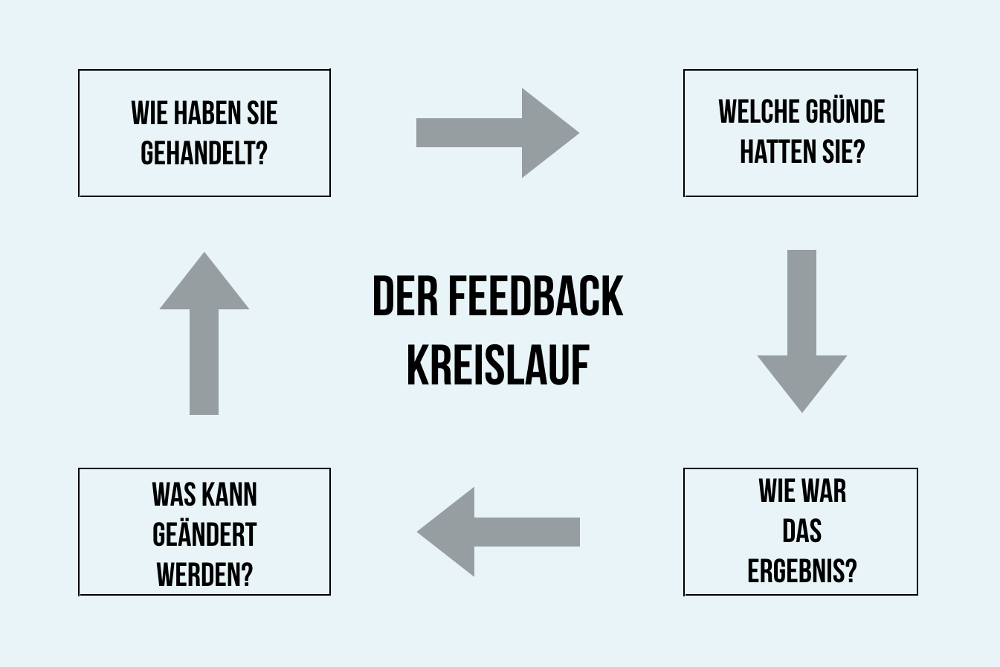

# Feedback-Kultur

 
[^5]

# Definition – Was ist das jetzt?
[Feedback](https://de.wikipedia.org/wiki/Feedback_(Kommunikation)) ist ein wichtiger Bestandteil der zwischenmenschlichen [Kommunikation](https://managingprojectssuccessfully.github.io/kb/Projektkommunikation.html) und bedeutet jemandem Rückmeldung zu geben. Feedback ist im Idealfall weder wertend noch deutend, lässt keine Interpretation oder Beurteilung zu und dient auch nicht zur Provokation oder gar als Vorwurf. Der Begriff Feedbackkultur beschreibt damit eine von gegenseitigem Vertrauen geprägte Kultur in Unternehmen, in der sich Mitarbeitende unabhängig von Hierarchien und Funktionen regelmäßig gegenseitiges Feedback zu Themen wie beispielsweise deren Leistungen, dem Verhalten aber auch deren Außenwirkung geben. Dieses von Offenheit, Vertrauen und hierarchieübergreifender Kommunikation geprägte Arbeitsklima, lebt von strategisch geplanten sowie mit passenden [Feedbackmethoden](https://managingprojectssuccessfully.github.io/kb/Feedback_Methoden.html) durchgeführten regelmäßigen Rück- und Statusmeldungen [^1]. 

# Ziel & Funktion – Was bringt das also alles?
Offene und vor allem angstfreie Kommunikation kann diverse Aspekte eines Unternehmens fördern, wodurch dieses die Möglichkeit erhält neue Ressourcen auszuschöpfen. 

## Funktionen für Mitarbeitende im speziellen:
* Ermutigt und hebt die Motivation
* Unterstützt bei der Identifikation mit der Arbeitsumgebung, lässt zielgerichtet arbeiten und bewirkt eine engere Verbindung mit der Aufgabe
* Ermöglicht klarere Selbsteinschätzung und fördert persönliche Lernprozesse
* Feststellung des Leistungsniveaus und hilfreich bei der Karriereplanung
* Effektiviert Fehlersuche und trägt zur Lösung von Missverständnissen und [Konflikten](https://managingprojectssuccessfully.github.io/kb/Konfliktmanagement.html) bei
* Vertrauen zwischen [Führungskräften und Mitarbeitern](https://managingprojectssuccessfully.github.io/kb/Kommunikation_Projektbeteiligte.html) sowie das Selbstbewusstsein der Mitarbeiter steigen

## Zusätzliche Funktionen für das Unternehmen im Ganzen:
* Überprüfung unternehmensstrategischer Maßnahmen
* Entwicklung von Anreiz- und Entlohnungssystemen
* Schnellere Lern- und Optimierungsprozesse
* steuert Verhalten der Mitarbeiterschaft
* Mitarbeiter auf allen Ebenen denken mit und entfalten mehr Eigeninitiative
* höherer Attraktivität als Arbeitgeber speziell für hochqualifizierte Mitarbeiter
* reibungslosere Abläufe, da Störfaktoren offen angesprochen werden
* Mitarbeiter fühlen sich mehr wertgeschätzt und identifizieren sich stärker mit ihrem Arbeitgeber
* Kontinuierliche Verbesserung wird in der [DNA](https://de.wikipedia.org/wiki/Desoxyribonukleinsäure) der Mitarbeiter, der Organisation verankert 
[^2], [^3] & [^4]

# Relevanz – Warum ist das jetzt so wichtig?
Die Entwicklung einer Feedbackkultur hat im Unternehmenskontext in den letzten Jahren zunehmend an Bedeutung gewonnen, da deren Strukturen immer stärker vernetzt werden und die Team- und [Projektarbeit](https://managingprojectssuccessfully.github.io/kb/Projekt.html) in ihnen zunehmend zur Regelarbeitsform wird. Gleichzeitig agieren Unternehmen in einem Umfeld, das zunehmend von schnellem Wandel und geringer Vorhersehbarkeit geprägt ist. „Deshalb müssen die Mitarbeiter, sei es allein oder im Team, mehr Eigeninitiative entfalten, wenn die Unternehmen mit der gewünschten oder erforderlichen Geschwindigkeit auf Veränderungen in ihrem Umfeld reagieren möchten“ [^4].

# [Feedbackinstrumente](https://managingprojectssuccessfully.github.io/kb/Feedback_Methoden.html) – Wie mach ich das?

Zu den gängigsten Feedbackmethoden zählen:
* [Mitarbeitergespräche](https://managingprojectssuccessfully.github.io/kb/Feedbackgespräche.html)
* 360-Grad-Feedback
* Upward-Feedback
[^9]

# Feedbackregeln – Was muss ich beachten?
Um zielorientiertes Feedback zu gewährleisten, sollten die in der Psychologie und Pädagogik entwickelten Methoden und Regeln für Feedbackgeber und -empfänger befolgt werden. Effektiv können diese Regeln aber nur angewendet werden und Ihre Wirkung in der Veränderung von verhalten entfalten, wenn der Feedbackgeber es ehrlich meint und damit dessen nonverbale Signale mit den verbalen übereinstimmen. Bedeutet, es muss auch viel auf die eigene Gestik und Mimik, nicht nur auf das Gesprochene Wort geachtet werden. Werden die folgenden zehn Regeln von beiden Parteien befolgt, ist das eine solide Grundlage für konstruktives Feedback. 

## FEEDBACKREGELN FÜR DEN FEEDBACKGEBER
1.	Bereitschaft des Nehmers klären, möchte dieser Feedback erhalten?
2.	Senden Sie Ich-Botschaften. 
3.	Konkrete und positive Formulierungen
4.	Zeitpunkt des Feedbacks sollte zeitnahe liegen
5.	wertschätzende und konstruktive Rückmeldungen mit Entwicklungsmöglichkeiten 

## FEEDBACKREGELN FÜR DEN FEEDBACKNEHMER
1.	konzentriert zuhören und Feedbackgeber ausreden lassen
2.	Nützliches aufnehmen, das Vernachlässigbare ziehen lassen
3.	Erklären, rechtfertigen oder verteidigen Sie sich nicht
4.	Bei Unklarheiten nachfragen 
5.	dankbar sein
[^6]

# Feedbackkreislauf – Am Ball bleiben!
Erfolgsversprechender ist Feedback wenn es als fortlaufender Prozess im Unternehmen etabliert wird und nicht als einmalige Aktion verstanden wird. Dieser sich entwickelnde Kreislauf funktioniert dauerhaft, ist unabhängig von zeitlichen Vorgaben und Terminen. Eine richtige Feedback-Kultur kann nur realisiert werden, wenn dieser Prozess zur Routine wird. [^10]

[^7]

# Fazit – Nochmal kurz und knapp
„Von «Feedbackkultur» ist dann die Rede, wenn das Feedback nicht nur als Technik, sondern auch als «Frage der Haltung» verstanden wird, d.h. wenn – neben der Frage nach den richtigen Verfahren und Instrumenten – die individuelle Motivation zum Einholen und zur Nutzung von lernwirksamen Feedbacks wichtig ist„ [^8].

# Quellen

[^1]: [So stärken Sie die Feedbackkultur in Ihrem Unternehmen] (https://www.umantis.com/personalentwicklung/feedbackkultur?akttyp=direkt&aktnr=84834&wnr=04393689)
[^2]: [Was ist Feedback?](https://managementstellen.ch/was-ist-feedback)
[^3]: [Feedback geben](https://www.berufsstrategie.de/bewerbung-karriere-soft-skills/feedback-geben.php)
[^4]: [Feedback-Kultur – Definition](https://www.kraus-und-partner.de/wissen-und-co/wiki/feedback-kultur-entwickeln-berater-beratung)
[^5]: [Feedback-Bild](https://hr-pioneers.com/wp-content/uploads/2014/03/Feedback.jpg)
[^6]: [FEEDBACKREGELN EINFACH ERKLÄRT - SO GEBEN SIE WERTSCHÄTZENDES UND ERHALTEN QUALIFIZIERTES FEEDBACK](https://shyopa.com/ratgeber/feedbackregeln/)
[^7]: [Bild-Feedbackkreislauf] (https://karrierebibel.de/wp-content/uploads/2017/09/Feedbackregeln-Kreisualf-Ablauf-Beispiele-Grafik.png)
[^8]: [Grundlagen zum Aufbau einer Feedbackkultur](https://www.q2e.ch/wp-content/uploads/sites/162/2020/05/q2e-heft-3-grundlagen-zum-aufbau-einer-feedbackkultur.pdf)
[^9]: [Feedback geben – aber richtig: So etablierst du eine starke Feedbackkultur](https://engage.kununu.com/de/blog/starke-feedbackkultur/#flache-hierarchien-erschweren-die-feedbackkultur)
[^10]: [Feedbackregeln: So klappt die Rückmeldung](https://karrierebibel.de/feedbackregeln/)

