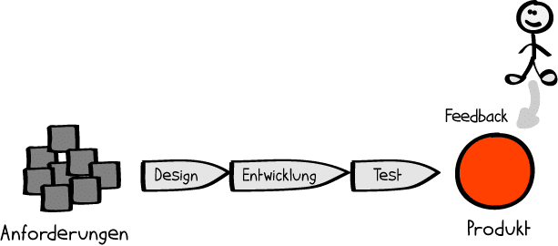

Der Begriff des Feedbacks hat seinen Ursprung in der Kybernetik und bedeutet so viel wie Rückmeldung oder Rückkoppelung. Wenn man Feedback gibt, teilt man seine Wahrnehmung über
eine Person oder Leistung dieser mit. Es gibt verschiedene Formen des Feedbacks beispielsweise im klassischen oder agilen Projektmanagement.[^1][^2]
Jede einzelne bezeichnet man als Feedbackmethode.

# Auswahl der richtigen Feedbackmethode

Die Wahl der passenden Art des Feedbacks hängt von einigen Faktoren ab. Zum einen an wen oder über was Rückmeldung gegeben werden soll oder ob dieses fachlich oder personell
ist. Zum anderen der Zeitpunkt – falls nötig – die Frequenz der Rückmeldung.[^2][^3]
Im Prinzip gibt es drei verschiedene Feedbackmethoden: Individuelles, kollaboratives und qualitatives Feedback. Individuelles Feedback gibt Rückmeldung zur Leistung des
einzelnen Teammitglieds, während kollaboratives das Projektteam und dessen Zusammenspiel als Ganzes bewertet. Am Ende eines Projektes steht vor allem die Einschätzung des
finalen Produkts durch den Auftraggeber im Fokus, also das qualitative Feedback.[^6]
Hierbei gibt es wesentliche Unterschiede zwischen klassischem und agilem Projektmanagement.

# Feedback im klassischen Projektmanagement

Im klassischen Projektmanagement werden Ressourcen, Ziele und Ende vor Start festgelegt, sodass das Feedback fast immer erst nach Abschluss des Projektes erfolgt. Das Feedback 
wird hauptsächlich vom Auftraggeber, dessen Wünsche vorher erfasst wurden, aber auch intern vom Projektleiter und den Teammitgliedern gegeben.[^3][^4] 
Ein großer Nachteil dieser Feedbackmethode ist, dass es sehr lange dauert bis der Kunde das fertige Produkt testen kann. In dieser Zeit besteht die Gefahr, dass sich die
Anforderungen des Kunden geändert haben und nicht mehr den Ursprünglichen entsprechen.[^5]

*Abbildung 1[^3]*

Dennoch gibt es auch beim klassichen Projektmanagement die Möglichkeit während des Projektes Feedback einzubringen, um dieser Unsicherheit entgegenzusteuern. Diese Methode wird
allerdings meist nur angewandt, wenn das Projekt Gefahr läuft zu scheitern. Wird dann auf das Feedback eingegangen, so ist das in der Regel mit einem hohen Umplanungs- und
Kostenaufwand verbunden.[^3]

# Feedback im agilen Projektmanagement

Im Gegensatz zum klassischen Projektmanagement haben die Stakeholder beim agilen Projektmanagement regelmäßig Gelegenheit Feedback einzubringen. So wird nach jeder Iteration 
bzw. Sprint Rückmeldung vom Kunden eingeholt, welches im nächsten Zyklus umgesetzt werden kann. Diese Methode wird auch als Feedback-Schleife bezeichnet.[^7][^8]

![FeedbackAgil]

*Abbildung 2[^3]*
# Aspekt n

1. das
2. hier 
4. ist 
4. eine
7. nummerierte liste
   1. und hier eine Ebene tiefer

# Siehe auch

* Verlinkungen zu angrenzenden Themen
* [Link auf diese Seite](Feedback_Methoden.md)

# Weiterführende Literatur

* Weiterfuehrende Literatur zum Thema z.B. Bücher, Webseiten, Blogs, Videos, Wissenschaftliche Literatur, ...

# Quellen

[^1]: [Feedback geben](https://ebooks-fachzeitungen-de.ciando.com/img/books/extract/3407295065_lp.pdf)
[^2]: [Was ist Feedback?](https://managementstellen.ch/was-ist-feedback)
[^3]: [Unterschiede zwischen klassischem und agilem Projektmanagement](https://projekte-leicht-gemacht.de/blog/projektmanagement/agil/klassisch-agiles-projektmanagement-1/)
[^4]: [Standardisierung vs. Kultur: Klassisches und agiles Projektmanagement im Vergleich](https://dl.gi.de/bitstream/handle/20.500.12116/3061/47.pdf?sequence=1&isAllowed=y)
[^5]: [Klassisches Projektmanagement](https://link.springer.com/content/pdf/10.1007%2F978-3-8349-4202-9_3.pdf)
[^6]: [Drei Feedback-Regeln für agile Unternehmen](https://www.channelpartner.de/a/feedback-ja-klar-aber-richtig,3336722)
[^7]: [Agiles Projektmanagement: Scrum, Use Cases, Task Boards & Co.](https://books.google.de/books?hl=de&lr=&id=HzppDwAAQBAJ&oi=fnd&pg=PP1&dq=agiles+projektmanagement&ots=FHNGEtK50p&sig=k23Pp736cyuXhdZvd1d08u6TMT8&redir_esc=y#v=onepage&q=feedback&f=false)
[^8]: [Agiles Projektmanagement](https://link.springer.com/content/pdf/10.1007/BF03341189.pdf)

