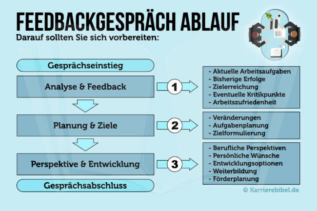
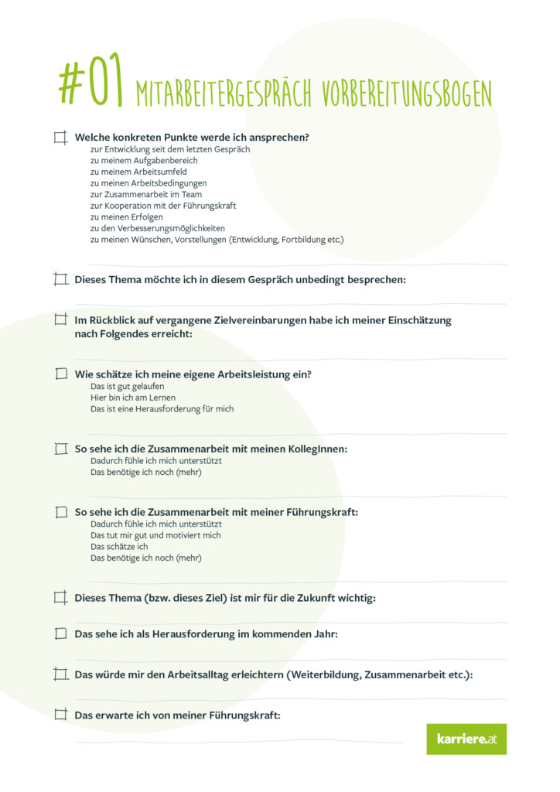

# Feedbackgespräche
## 1. Definition: Feed-back, das
*„Reaktion, die jemandem anzeigt, dass ein bestimmtes Verhalten, eine Äußerung o. Ä. vom Kommunikationspartner verstanden wird [und zu einer bestimmten Verhaltensweise oder -änderung geführt hat]; Rückkoppelung, Rückmeldung.“* [^1]

Feedback wird oft mit Lob oder Kritik verwechselt- allerdings wird uns mit Hilfe von Feedback lediglich eine Rückmeldung über unsere Verhaltensweisen gegeben. 
Feedback von Vorgesetzten, Kollegen, Freunden etc. kann uns dabei helfen, uns selbst weiterzuentwickeln, unsere Kompetenzen weiter auszubauen und (persönliche) Defizite aufzuarbeiten. [^2]

Im Job erhalten Mitarbeiter von Ihren Vorgesetzten mit Hilfe von Feedbackgesprächen Rückmeldung von Ihren Vorgesetzten in Bezug auf ihre Leistung und ihre Verhaltensweisen der vergangenen Wochen und Monate. [^3]
Diese konstruktiven Rückmeldungen können den Mitarbeitern dabei helfen, die eigene Motivation zu steigern, die allgemeine Zusammenarbeit zu verbessern, potenzielle Konflikte frühzeitig erkennen und beheben, berufliche Orientierung zu schaffen und Ziele festzulegen. [^4]

## 2. Mögliche Feedbackgesprächsthemen:

*	Ziele und Zielerreichung
*	Aktuelle Konflikte (und deren Lösungen)
*	Motivation ubd Motivationsanreize
*	Wünsche und Anregungen

| **Schritt für Schritt zum Feedback:** [^5]|  
| ------------- |
| **Was** möchte ich rüberbringen?|
| **Warum** möchte ich es sagen?|
| Was möchte ich damit **bewirken**?|
| Was möchte ich **nicht sagen** (weil es vielleicht zu viel oder kränkend wäre)?|
| **Wie** möchte ich es ausdrücken?|

## 3. Darauf sollte beim Gespräch geachtet werden: [^6]

*	Höflicher und wertschätzender Umgang miteinander
*	Lösungsorientierte Ansätze
*	Strukturierter Gesprächsverlauf
*	Allgemeine Gesprächsregeln beachten (Ausredenlassen etc.)
*	Keine Schuldzuweisungen
*	Konstruktive Kritik 
*	Vor- und Nachbereitung des Gesprächs

| Kriterien für ein erfolgreiches Feedback: [^7] | | 
| -------------------- | ------------- |
| **Respektvoll**| Auch wenn Ihr Gegenüber ein aus Ihrer Sicht negatives Verhalten zeigt, ist gegenseitiger Respekt die Grundhaltung für das Gespräch.|
| **Konkret**| Hingeworfene Bemerkungen, indirektes Feedback durch Mimik bzw. Tonfall oder allgemeine Urteile haben keinen positiven Effekt – im Gegenteil.|
| **Reflektiert**| Überlegen Sie, was Sie sagen, warum Sie es sagen möchten und wie Sie es ausdrücken.|
| **Verantwortungsvoll**| Muten Sie der anderen Person nur das Feedback und nur so viel davon zu, wie Sie annehmen, dass sie es gut verarbeiten kann und es hilfreich ist.|
| **Beschreibend und Persönlich**| Statt »Du warst arrogant« sagen Sie beispielsweise besser: »Ich fand deine Äußerungen ziemlich herablassend.«|
| **Angemessener Zeitpunkt**| Wenn eine/r von beiden im Stress oder erschöpft ist, wirkt Feedback oft kontraproduktiv.|
| **Gegenseitig**| Wer Feedback gibt, sollte auch selbst offen für Feedback sein.|

# 4. Die vier Phasen eines (erfolgreichen) Feedbackgesprächs: [^8] 
## Phase 1: Beurteilung und Feedback

*	Anerkennung von Erfolgen und Fortschritten sowie Erörterung von Verbesserungspotenzialen und Kritikpunkten
*	Rücksprache von Wünschen des Vorgesetzen/ des Mitarbeiters 
*	Ziel des Gesprächs festlegen

## Phase 2: Zieldefinition und Planung

*	Analysieren von Verbesserungspotenzialen 
*	Möglicherweise Verantwortungsbereiche des Mitarbeiters ausbauen/reduzieren 
* Ziele für kommende Monate definieren
u.a. mit Hilfe der SMART- Regel: https://www.youtube.com/watch?v=_nwvWHePqUo

## Phase 3: Wünsche und Perspektiven 

Mitarbeiter kommuniziert eigene Wünsche, Ziele und Planung der beruflichen Zukunft im Unternehmen sowie Verbesserungsvorschläge am Arbeitsplatz

## Phase 4: Nachbereitung

*	Zielerreichungskontrolle 
*	Regelmäßiger Austausch 

 [^9]

# 5. Warum ist regelmäßiges Feedback so wichtig? [^10] 

Feedback...
<ol>
<li>...objektiviert Selbsteinschätzung</li>
<li>...dient der Erfolgskontrolle</li>
<li>...verhindert den Tunnelblick</li>
<li>...reflektiert Arbeitsweisen</li>
<li>...hilft, Ziele zu überprüfen</li>
<li>...verbessert die Zusammenarbeit</li>
<li>...ermöglicht persönliche Entwicklung</li>
<li>...motiviert</li>
</ol>

# 6. Siehe auch:

  * YouTube Video zur Vorbereitung:
  "So gelingt dir das Mitarbeitergespräch": https://www.youtube.com/watch?v=uDk8fSi2OsE

  * Checkliste für dein Feedbackgespräch: [^11] 

  

# Weiterführende Literatur: 
* Scherm, Martin (2019): 360°-Feedback, Hogrefe Verlag, 2. Auflage, Göttingen
* Hossiep, Rüdiger (2020): Mitarbeitergespräche : motivierend, wirksam, nachhaltig, Hogrefe Verlag, 2. Auflage, Göttingen

# Quellen

[^1]: Duden: Feed-back, das. Internetquelle: https://www.duden.de/rechtschreibung/Feedback, abgerufen am: 19.11.2021.
[^2]: Vgl.: Kanitz, Anja; Feedbackgespräche. S. 16 ff.
[^3]: Brückner Benjamin: Feedbackgespräch: Leitfaden + Tipps. Internetquelle: https://www.fuer-gruender.de/blog/feedbackgespraech/, abgerufen am 19.11.2021.
[^4]: Vgl.: Kanitz, Anja; Feedbackgespräche. S. 22.
[^5]: Kanitz, Anja; Feedbackgespräche. S. 31.
[^6]: Brückner Benjamin: Feedbackgespräch: Leitfaden + Tipps. Internetquelle: https://www.fuer-gruender.de/blog/feedbackgespraech/, abgerufen am 19.11.2021.
[^7]: Kanitz, Anja; Feedbackgespräche. S. 26.
[^8]: Brückner Benjamin: Feedbackgespräch: Leitfaden + Tipps. Internetquelle: https://www.fuer-gruender.de/blog/feedbackgespraech/, abgerufen am 19.11.2021.
[^9]: Bildquelle: https://karrierebibel.de/feedbackgespraech/
[^10]: Mai, Jochen (2021): Feedbackgespräch: Ablauf, Vorbereitung, Tipps. Internetquelle: https://karrierebibel.de/feedbackgespraech/, abgerufen am 19.11.2021.
[^11]: Bildquelle: https://www.karriere.at/blog/mitarbeitergespraech-checkliste.html

