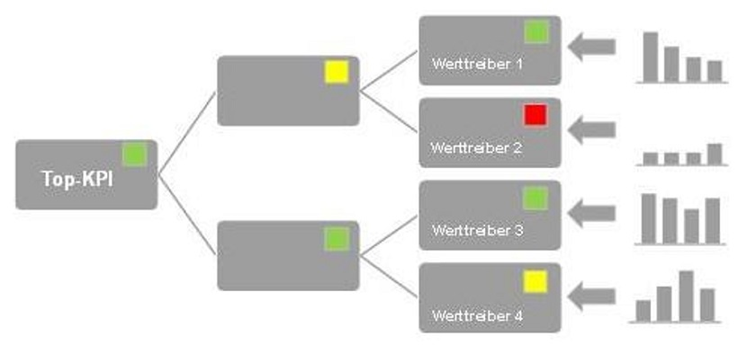

Forecasts sind Prognosen, die auf aktuellen und vergangenen Daten sowie Trends basieren und anhand unterschiedlicher Methoden für das Projekt wichtige Kennzahlen versuchen so präzise wie möglich vorherzubestimmen[^1]. 

# 1 Definition 
Im Projektmanagement werden Forecasts als Steuerungselement eingesetzt, um die Erreichung von sowohl kurzfristigen als auch mittelfristigen Zielen zu kontrollieren und zu unterstützen. Durch die Erzeugung von Informationen und den Vergleich vorhergesagter Werte mit den tatsächlich eingetretenen sollen Abweichungen von der Planung frühzeitig erkannt und entgegenwirkende Maßnahmen so früh wie möglich entwickelt und angewendet werden. Forecasts sind hierbei nicht als eine normale Prognose anzusehen, da sie darüber hinausgehen und neben finanziellen und nicht-finanziellen Aspekten auch Simulations- und [Szenariotechniken](Szenario_Technik.md) umfassen[^2]. Forecasts bilden die Grundlage für die gesamte Projektplanung sowie die Beurteilung der Realisierbarkeit und Rentabilität des Projektziels, die Aufwandsschätzung und die [Risikoanalyse](Risikoanalyse_und_Visualisierung.md)[^4].

# 2 Merkmale erfolgreicher Forecasts
Um zuverlässige Vorhersagen zu erhalten und die gesetzten Ziele zu erreichen, sollten bei der Erstellung eines Forecasts diese Aspekte berücksichtigt werden.
## 2.1 Ehrlichkeit
Eine rein zielorientierte Herangehensweise ohne die Berücksichtigung vorhandener Ressourcen wird mit höherer Wahrscheinlichkeit zu falschen Vorhersagen führen. Den Forecast so zu bearbeiten, dass er die [top down](Top_Down_Planning.md) gesetzten Vorgaben erfüllt, wird zu Beginn eines Projekts vielversprechend wirken, jedoch am Ende häufiger die Ziele verfehlen. Deswegen ist eine [bottom up](Bottom_Up_Planning.md) Planung, die ehrlich zeigt, wo die Grenzen des Projektes liegen und Probleme frühzeitig aufdeckt, empfehlenswerter[^3]. 
## 2.2 Systematik
Jeder Projektteilnehmer sollte auf den ersten Blick erkennen können:
* Wo man sich im Projekt befindet
* Was bereits erreicht wurde
* Welche Schritte von wem als Nächstes gemacht werden müssen[^3]
## 2.3 Einheitlichkeit
Wichtig für die Vergleichbarkeit verschiedener Kennzahlen ist die Wahl einer einheitlichen Methode. Dies umfasst ein gemeinsames Bewertungssystem mit einheitlicher Begriffsdefinition und eine transparente Wahrscheinlichkeitsbewertung[^3]. 
## 2.4 Regelmäßigkeit
Eine regelmäßige Überprüfung der geplanten Vorgänge und deren Erfolg ermöglicht es notwendige Korrekturen schon in frühen Phasen des Projektes zu erkennen und durchzuführen und verringert somit den damit verbundenen Aufwand. Die Chancen, die im Forecast gesetzten Ziele zu erreichen, werden so aufrechterhalten[^3]. 
## 2.5 Anpassungsfähigkeit
Vorhersagen treffen realistisch gesehen nie zu 100% ein, da unkontrollierbare Faktoren existieren, die den Verlauf des Projektes maßgeblich beeinflussen können. Aus diesem Grund ist es wichtig, Raum für gewisse Anpassungen einzuplanen[^3]. 

# 3 Grundlegende Instrumente von Prognosen 
Die Vorausbestimmung eines zukünftigen Zustands kann anhand mehrerer Instrumente geschehen. Die folgenden drei Herangehensweisen werden situationsbedingt in unterschiedlichen Projektarten angewendet. 
## 3.1 Erfahrungswissen 
Prognosen, die auf Erfahrungswerten basieren, stellen in der Regel die zuverlässigste Methode dar. Sie kommen jedoch an ihre Grenzen, sobald es sich um ein sehr neues und innovatives Projekt handelt, wofür noch kein Repertoire an Wissen existiert, auf das man zurückgreifen kann[^4]. 
## 3.2 Expertenschätzung 
Schätzungen von Experten kommen meist in Einsatz, wenn noch kein Erfahrungswissen vorhanden ist und dienen als Orientierungsrahmen für Prognosen. Diese beruhen jedoch meist auf Annahmen, die eine hohe Unsicherheit aufweisen können[^4]. 
## 3.3 Szenarien 
["Wenn-dann-Szenarien"](Szenario_Technik.md) prognostizieren potenzielle Entwicklungen und zeigen in großem Umfang die unterschiedlichen Möglichkeiten eines Projektverlaufs auf[^4]. 

# 4 Unterschiedliche Methoden des Forecastings 
Grundsätzlich kann zwischen zwei Arten des Forecastings unterschieden werden. Standard-Forecasts, die regelmäßig angepasst werden, und Ad-hoc-Forecast, die unregelmäßig durchgeführt werden[^2]. Da mit dem Fortschritt des Projektes das Wissen über den tatsächlichen Projektverlauf steigt, können durch Anpassungen präzisere Vorhersagen vorgenommen und der [Business Case](Business_Cases.md) überprüft und aktualisiert werden[^4].

## 4.1 Earned Value Analyse
Die [Earned Value Analyse](Earned_Value_Analyse.md) stellt eine Variante des laufenden und regelmäßigen Forecastings dar, welche durch die Berechnung des Schedule Performance Index (SPI) eine Prognose über den Endtermin und mit dem Cost Performance Index (CPI) Aussagen über die Entwicklung der Projektkosten bereitstellt[^4]. 

## 4. 2 Effektbasierter Forecast 
Beim effektbasierten Forecast liegt der Fokus auf Effekten und Maßnahmen, die einen maßgeblichen Einfluss auf das Projekt ausüben. Hier wird zwischen wenig beeinflussbaren Effekten wie zum Beispiel dem Wegfall von Patenten und beeinflussbaren Maßnahmen wie zum Beispiel der Kürzung des Werbeetats unterschieden. Es werden insbesondere Effekte berücksichtigt, die starke Abweichungen vom Basis-Forecast zur Folge haben. Dadurch werden vor allem potenziell große Auswirkungen auf den Projektverlauf in den Fokus gestellt sowie diese transparent und berichtsfähig gemacht[^2]. 

  
 
 *Abbildung 1: Effektbasierte Methode*[^5]
  

## 4. 3 Werttreiberbasierter Forecast 
Das Hauptaugenmerk liegt bei dieser Methode liegt auf zuvor festgelegten relevanten Kennzahlen, die den Unternehmenswert erheblich beeinflussen. Dies kann im Hinblick auf das Projektmanagement auch auf den Wert eines Projektes bezogen werden. Der werttreiberbasierte Ansatz berücksichtigt sowohl harte Geschäftstreiber wie beispielsweise den Free Cashflow als auch weiche Werttreiber, welche Vorsteuergrößen für die harten Werttreiber sind. Zu den weichen Treibern zählt zum Beispiel das BIP-Wachstum, der Rohölpreis oder der technologische Fortschritt. Auf Basis der Vorhersage dieser Werte errechnet sich damit der Forecast für die relevanten Kennzahlen des Projektes[^6]. 
 
  
 
 *Abbildung 2: Werttreiberbasierte Methode*[^7]

# Siehe auch

* [Planungssicherheit](Planungssicherheit.md)
* [Projektplanung](Projektplanung.md)
* [Zeitplanung](Zeitplanung.md)
* [Kostenplanung](Kostenplanung.md)

# Weiterführende Literatur

* Becker, A./ Leyk, J./ Riemer, L.: Dynamische Unternehmenssteuerung am Beispiel von Bayer MaterialScience, in: Gleich, R. et al. (Hrsg.): Moderne Budgetierung umsetzen, Der Controlling-Berater, Bd. 27, Freiburg/München, 2013, S. 121-142.
* Borkenhagen, B./Kappes, M.: Moderne Konzernplanung als Basis für eine aktive Konzernsteuerung, in: Gleich, R. et al. (Hrsg.): Moderne Budgetierung umsetzen, Der Controlling-Berater, Bd. 27, Frei-burg/München, 2013, S. 143-156.
* Clasen, M.: Vom Urknall zur Prognose, in: Buttkus, M./Neugebauer, A. (Hrsg.): Controlling im Handel, Wiesbaden, 2012, S. 141-158.

# Quellen
[^1]: [Wikipedia: Forecasting](https://en.wikipedia.org/wiki/Forecasting)
[^2]: [Forecast Controlling - Definition: Was bedeutet Forecast im Controlling?](https://www.haufe.de/controlling/controllerpraxis/forecast-controlling/forecast-controlling-mit-excel_112_453412.html)
[^3]: [7 Regeln für einen qualitativen Forecast](https://unternehmer.de/marketing-vertrieb/72056-7-regeln-fur-einen-qualitativen-forecast)
[^4]: [Projektmagazin: Prognose](https://www.projektmagazin.de/glossarterm/prognose)
[^5]: [Methoden des Forecast Controllings: Effektbasierter Forecast](https://www.haufe.de/controlling/controllerpraxis/bilderserie-methoden-des-forecast-controllings/forecast-controlling-abb-2_112_453406_453396.html)
[^6]: [Controlling-Strategy: Werttreiberplanung](https://www.controlling-strategy.com/werttreiberplanung.html)
[^7]: [Methoden des Forecast Controllings: Werttreiberbasierter Forecast](https://www.haufe.de/controlling/controllerpraxis/bilderserie-methoden-des-forecast-controllings/forecast-controlling-abb-3_112_453406_453398.html)

