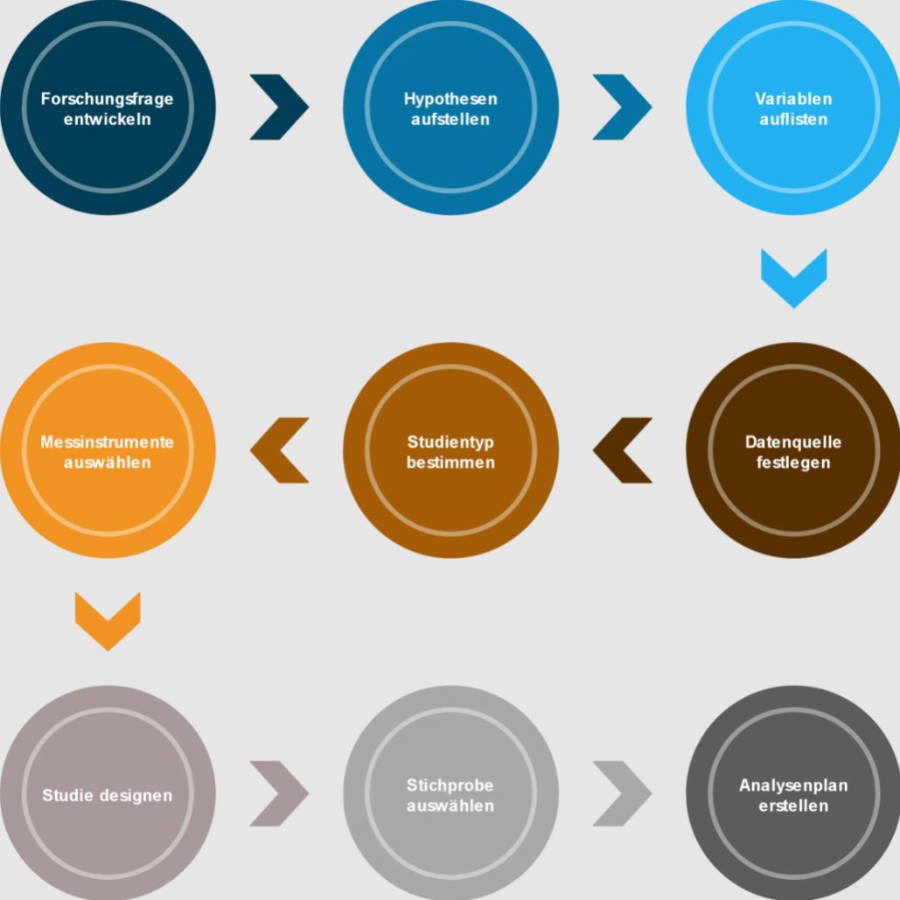

Forschungsprojekte sind vornehmlich einmalig befristete Vorhaben, durchgeführt von mehreren Wissenschaftlern, wissenschaftlichen Gesellschaften oder eines [Instituts](https://de.wikipedia.org/wiki/Institut_(Organisation)), mit dem Ziel einen Erkenntnisgewinn für ein aktuelles Thema in der [Forschung](https://de.wikipedia.org/wiki/Forschung) zu generieren. Ein Projekt der [angewandten Forschung](https://de.wikipedia.org/wiki/Angewandte_Wissenschaft) verfolgt eher das Ziel, bereits erforschte Methoden zu verbessern.

Aufgrund ihrer typischen Kriterien haben Forschungsprojekte ein hohes Risiko, nicht erfolgreich zu sein. Eine Förderung erfolgt meist durch [Drittmittel](https://de.wikipedia.org/wiki/Drittmittel) (Forschungsfonds, öffentliche oder industrielle Förderungsgelder). Um solche Drittmittel zu erhalten ist ein ausführlicher [Projektantrag](Projektantrag.md) (vergleichbar mit einem klassischen Projektantrag) nötig. Dieser legt Ziele, Risiken, Methoden und Ressourcen, Zeit- und Finanzplanung, Angaben über Qualifikation der/des Projektleiter/s sowie eine populär gehaltene Kurzfassung dar. Abschlussberichte sind von großer Bedeutung, aber auch Zwischenberichte werden häufig erstellt, um dem Geldgeber oder der Universität von dem Fortschritt zu berichten. [^1]

# Typische Kriterien
* Bereiche: Medizin, Naturwissenschaft, Technik 
* Unklare Anforderungen bei (neuen) Forschungsgebieten
* Flexibilität in der Zieledefinition
* Komplexe, neuartige Aufgabenstellungen (Erforderlichkeit von Erfahrung v.a. durch Institutionen) 
* Begrenzte Ressourcen und Zeit
* Hohes Risiko des Scheiterns
* Meist Teamarbeit in interdisziplinären Arbeitsgruppen [^1]

# Forschungsprojekte entwickeln
"Die Forschungsfrage stellt das Forschungsziel ins Verhältnis zum gegenwärtigen Stand der Wissenschaft, zur gewählten Methodik und zum aktuellen Paradigma" [^8]. Die Forschungsfrage, in der Regel abgeleitet von einem Problem, stellt das Fundament des Forschungsprojektes dar. Diese wird iterativ durch konkretisierende Forschungsfragen erschlossen. Damit ein Forschungsprojekt erfolgreich durchgeführt werden kann, benötigt man einen detailierten Projektplan. Wie man dabei vorgehen kann, zeigt die untenstehende Abbildung. Der letzte Schritt zur Vollendung des Forschungsplans ist die Erstellung eines Analyseplans. Damit lässt sich die spätere statistische Auswertung erleichtern. [^7] 

*Forschungsfrage entwickeln* [^7]

# Forschungsprojekte im Projektmanagement
Das Projektmanagement ist für die Forschung von ernormer Bedeutung. Denn ohne Projektmanagement ist das Risiko noch höher, dass das Forchungsprojekt scheitert [^2]. Des Weiteren kann das Projektmanagement die Forscher entlasten, damit diese sich besser auf die Forschung konzentrieren können. Spezialisierte Agenturen können so die Qualität sichern, die zum Beispiel in der Medizintechnik eine große Rolle spielt. [^5] 
Es ist wichtig, klare Anforderungen zu formulieren. Dabei muss die Risikobeurteilung und Ressourcenplanung ausreichend berücksichtigt werden, auch wenn das Forschungsgebiet und die Forschungsmethode bereits bekannt ist. Der Forschungsprozess verläuft nicht ziel- sondern inputorientiert, gesteuert durch Zufälle und den Ehrgeiz der Forscher. Da Management nicht direkt mit Forschung assoziiert wird, wird dieses von ihnen eher als lästig oder unnötig empfunden. [^2] 

Das abgebildete Diagramm zeigt, dass vor allem mangelnde Kommunikation sowie schlechte Projektplanung Ursachen für ein gescheitertes Projekt sein können. Deswegen sollten diese Aspekte besonders in den Lösungsansätzen berücksichtigt werden. Eine geeignete Projektmanagemt-Methode kann ausgewählt werden, indem man sich bewusst macht, ob eine agile oder klassische Methode in Frage kommt. 

*Warum scheitern Projekte?* [^6]

## Klassisch vs. Agil
Forschungsprojekte kann man sowohl im klassischen als auch im agilen Projektmanagement einordnen. Dadurch dass in der Anfangsphase die Anforderungen teils unbekannt sind, besitzt ein Forschungsprojekt Tendenz zu einer agilen Methode. Dennoch sind auch Aspekte des klassischen Projektmanagements (z.B. ein detaillierter Projektantrag sowie ein begrenztes Budget und Zeit) erkennbar. 

Die unten aufgeführte Tabelle zeigt mögliche Kategorien und deren Einordnung von Forschungsprojekten in das jeweilige Projektmanagement (fettgedruckt). In diesem Fall wäre eine hybride oder agile Lösung erstrebenswert. [^3]

| Kategorien | Klassisches PM | Agiles PM |
| ------------- | ------------- | ------------- |
| Klar definierte Projektziele | Ja | **Nein**  |
| Klar definierter Projektumfang | Ja | **Nein** |
| Viele zu erwartende Änderungen | Nein | **Ja**  |
| Wichtigkeit der Dokumentation | **Ja**  | Nein |
| Selbstorganisation der Projektteams | Nein  | **Ja** |
| Klar definierte Kosten | **Ja**  | Nein |
| Klar definierte Projektdauer | **Ja**  | Nein | 

## Lösungsansatz
Eine mögliche Lösung stellt hierbei das [Microsoft PPM](https://www.microsoft.com/de-de/microsoft-365/project/project-portfolio-management)-Tool dar. Da es ein benutzerfreundliches Tool für zentrales Projektmanagement mit einer gemeinsamen Arbeits- und Informationsplattform für Forscher und Projektbeteiligte ist, kann es besonders mangelnde Kommunikation verhindern und die Projektplanung verbessern. [^4] 

Nützliche Funktionen des PPM-Tools für Forschungsprojekte:
1. zentrales Speichern und Auswerten, standardisierte Dokumentablage durch SharePoint
2. [Top-down-Kommunikation](https://de.wikipedia.org/wiki/Top-down_und_Bottom-up), [Bottom-up-Prinzip](https://de.wikipedia.org/wiki/Top-down_und_Bottom-up), Meilensteinübersicht, Projektampeln (Erweiterung Multiprojekt)
3. Verknüpfung zum eigenen/firmenübergreifenden Termin-/Projektplan (Erweiterung Softlinks)
4. detaillierter Import von Finanzzahlen, automatisierter Datenaustausch, Verbinden von Projektleitern und Controllern (Erweiterung ERP-System) [^4]

# Aktuelle Forschungsprojekte

* [Fraunhofer-Institut](https://www.ise.fraunhofer.de/de/forschungsprojekte/aktuell.html)
* [Bundesamt für die Sicherheit der nuklearen Entsorgung](https://www.base.bund.de/DE/themen/fa/soa/projekte-aktuell/projekte-aktuell.html)
* [Friedrich-Alexander-Universität Erlangen-Nürnberg](https://www.fau.de/research/)

# Siehe auch

* [Innovationsprojekte](Innovationsprojekte.md)
* [Entwicklungsprojekte](Entwicklungsprojekte.md)
* [Projektmanagement](Projektmanagement.md)
* [Uebersicht_PM_Tools](Uebersicht_PM_Tools.md)
* [Microsoft_Planner_PM_Tool](Microsoft_Project_PM_Tool.md)
* [Microsoft_Project_PM_Tool](Microsoft_Project_PM_Tool.md)

# Weiterführende Literatur

* Bauer W., Bleck-Neuhaus J., Dombois R., Wehrtmann I. (2018). Forschungsprojekte entwickeln – von der Idee bis zur Publikation. NOMOS VERLAGSGES.MBH + CO.
* Schöneck N. & Voß W. (2013). Das Forschungsprojekt, Planung, Durchführung und Auswertung einer quantitativen Auswertung. SpringerVS.
* Projekt Forum. (07.07.2020). [Herausforderungen an das Projektmanagement: Unterschiedliche Arten von Projekten](https://www.youtube.com/watch?v=Ar-qjMOsh7U). YouTube. 
* Hagen Management GmbH. [Projektmanagement Blog](https://pm-blog.com/).

# Quellen

[^1]: [Forschungsprojekte](https://de.wikipedia.org/wiki/Forschungsprojekt) (12.02.2021). In Wikipedia.
[^2]: [Projektmanagement der Forschung](https://www.projektmagazin.de/artikel/projektmanagement-der-forschung_6806) (13.06.2005). Projektmagazin. 19.11.2021.
[^3]: [Agiles vs. klassisches Projektmanagement](https://www.roth-institut.de/roth-wissens-journal/wissen-f%C3%BChrung/agiles-vs-klassisches-projektmanagement/). Roth Institut. 18.11.2021.
[^4]: [Projektlösungen](https://www.theprojectgroup.com/de/ms-project-loesungen/projektmanagement-forschung). TPG. 20.11.2021.
[^5]: [Forschung und Entwicklung - Projektmanagement in der Medizintechnik](https://www.youtube.com/watch?v=6YxbcjEYUj0) (23.09.2013). In YouTube.
[^6]: Hagen S. (04.07.2009). [Warum scheitern Projekte?](https://pm-blog.com/2009/07/04/warum-scheitern-projekte/). 
[^7]: [Forschungsfrage entwickeln](https://novustat.com/statistik-blog/forschungsfrage-entwickeln-und-datenanalyse-planen.html#:~:text=%20Forschungsfrage%20entwickeln%20und%20Datenanalyse%20planen%3A%20In%209,entwickeln%20Sie%20nun%20die%20Hypothesen.%20Hypothesen...%20More%20) (22.01.2018). Novustat.
[^8]:  [Forschungsfrage](https://de.wikipedia.org/wiki/Forschungsfrage) (07.11.2021). In Wikipedia.
