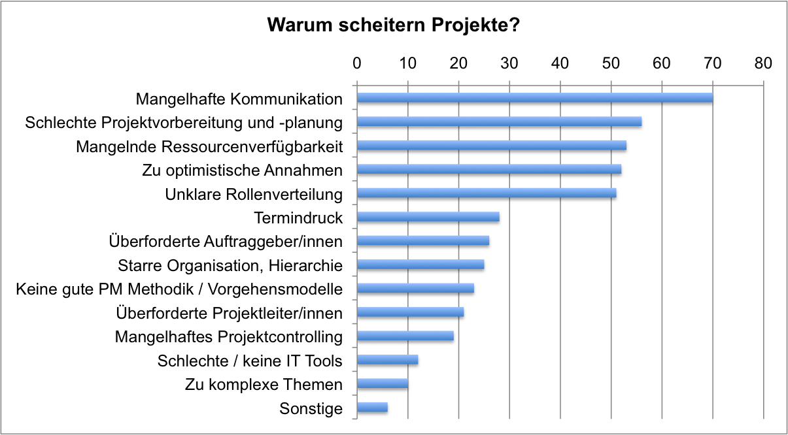

Forschungsprojekte sind vornehmlich einmalig befristete Vorhaben, durchgeführt von mehreren Wissenschaftlern, wissenschaftlichen Gesellschaften oder eines [Instituts](https://de.wikipedia.org/wiki/Institut_(Organisation)), mit dem Ziel einen Erkenntnisgewinn für ein aktuelles Thema in der [Forschung](https://de.wikipedia.org/wiki/Forschung) zu generieren. Ein Projekt der [angewandten Forschung](https://de.wikipedia.org/wiki/Angewandte_Wissenschaft) verfolgt eher das Ziel, bereits erforschte Methoden zu verbessern.

Aufgrund ihrer Gegebenheiten sind Forschungsprojekte nicht selten von einem erhöhten Risiko des Misslingens gekennzeichnet. Förderung erfolgt meist durch [Drittmittel](https://de.wikipedia.org/wiki/Drittmittel) (Forschungsfonds, öffentliche oder industrielle Förderungsgelder). Um solche Drittmittel zu erhalten ist ein ausführlicher [Projektantrag](https://de.wikipedia.org/wiki/Projektantrag) (vergleichbar mit klassischem Projektantrag) von Nöten. Dieser legt Ziele, Risiken, Methoden und Ressourcen, Zeit- und Finanzplanung, Angaben über Qualifikation der/des Projektleiter, sowie eine populär gehaltene Kurzfassung dar. Abschlussberichte sind von großer Bedeutung, aber auch Zwischenberichte sind häufig, um dem Geldgeber oder der Universität von dem Fortschritt zu berichten. [^1]

# Typische Kriterien
* Bereiche: Medizin, Naturwissenschaft, Technik 
* Unklare Anforderungen bei (neuen) Forschungsgebieten in der Zielsetzung 
* Komplexe, neuartige Aufgabenstellungen (Erforderlichkeit von Erfahrung v.a. durch Institutionen) 
* Begrenzte Ressourcen und Zeit
* Hohes Risiko des Scheiterns
* Meist Teamarbeit in interdisziplinären Arbeitsgruppen [^1]

# Forschungsprojekte im Projektmanagement
Das Projektmanagement ist für die Forschung von großer Bedeutung, da ohne Projektmanagement das ohnehin schon hohe Risiko des Misslingens noch zusätzlich gesteigert wird [^2]. Des Weiteren kann das Projektmanagement die Forscher entlasten, damit diese sich besser auf die Forschung konzentrieren können. Spezialiserte Agenturen können so zum Beispiel auch die Qualität sichern, die in der Medizintechnik eine wichtige Rolle spielt. [^5] 
Auch wenn es Schwierigkeiten bereitet, klare Anforderungen zu formulieren und Fortschritte zu dokumentieren, ist es dennoch wichtig, dies anzustreben. Dabei muss die Risikobeurteilung und Ressourcenplanung ausreichend berücksichtigt werden, auch wenn das Forschungsgebiet und die Forschungsmethode bereits bekannt ist. Der Forschungsprozess verläuft nicht ziel- sondern inputorientiert, gesteuert durch Zufälle und Ehrgeiz der Forscher. Management wird nicht direkt mit Forschung assoziiert bzw. eher als lästig empfunden. Forschungsinhalt und Management gehören zusammen [^2]. 

Das abgebildete Diagramm zeigt, dass vor allem mangelnde Kommunikation sowie schlechte Projektplaung Ursachen für ein gescheitertes Projekt sein können. Weswegen diese Aspekte besonders in den Lösungsansätzen berücksichtigt werden müssen. Eine geeignete Projektmanagemt-Methode kann ausgewählt werden, indem man sich bewusst macht, ob eine agile oder klassische Methode in Frage kommt. 

*Warum scheitern Projekte?* [^6]

## Klassisch vs. Agil
Forschungsprojekte kann man sowohl im klassischen als auch im agilen Projektmanagement einordnen. Auch wenn Tendenz zum agilen Projektmanagement besteht, gegeben dadurch, dass in der Anfangsphase oftmals die Anforderungen teils unbekannt sind, hat es jedoch auch Aspekte des klassischen Projektmanagements (z.B. detaillierter Projektantrag). Die unten aufgehführte Tabelle zeigt die Leitfragen und deren Einordnung von Forschungsprojekten (fettgedruckt) in das jeweilige Projektmanagement.

| Kategorien | Klassisches PM | Agiles PM |
| ------------- | ------------- | ------------- |
| klar definierte Projektziele | Ja | **Nein**  |
| klar definierter Projektumfang | Ja | **Nein** |
| viele zu erwartende Änderungen | Nein | **Ja**  |
| Wichtigkeit der Dokumentation | **Ja**  | Nein |
| Selbstorganisation der Projektteams | Nein  | **Ja** |
| klar definierte Kosten | **Ja**  | Nein |
| klar definierte Projektdauer | **Ja**  | Nein | 

[^3]

## Lösungsansätze
Eine mögliche Lösung stellt hier bei das [Microsoft PPM](https://www.microsoft.com/de-de/microsoft-365/project/project-portfolio-management)-Tool dar. Es ist ein benutzerfreundliches Tool für zentrales Projektmanagement, da es eine gemeines Arbeits- und Informationsplattform für Forscher und Projektbeteiligte bereitstellt. [^4] 
Nützliche Funktionen:
1. PPM: zentrales Speichern und Auswerten, standardisierte Dokumentablage durch Sharepoint
2. Erweiterung Multiprojekt: Top-down-Kommunikation, Bottum-up-Prinzip, Meilensteinübersicht, Projektampeln
3. Erweiterung Softlinks: Verknüpfung zum eigenen/firmenübergreifenden Termin-/Projektplan
4. Erweiterung ERP-Sytem: detaillierter Import von Finanzzahlen, automatisierter Datenaustausch, Verbinden von Projektleitern und Controllern [^4]

*lustiges Testbild*

# Aktuelle Forschungsprojekte

* [Frauenhofer](https://www.ise.fraunhofer.de/de/forschungsprojekte/aktuell.html)
* [BASE](https://www.base.bund.de/DE/themen/fa/soa/projekte-aktuell/projekte-aktuell.html)
* [FAU](https://www.fau.de/research/)

# Siehe auch

* [Projektmanagement](Projektmanagement.md)
* [Innovationsprojekte](Innovationsprojekte.md)
* [Entwicklungsprojekte](Entwicklungsprojekte.md)
* [Organisationsprojekte](Organisationsprojekte.md)
* [IT-Projekte](IT-Projekte.md)

# Weiterführende Literatur

* Forschungsprojekte entwickeln, von der Idee bis zur Publikation, W.Bauer, J.Bleck-Neuhaus, R.Dombois, I.Wehrtmann, 2018
* Das Forschngsprojekt, Planung, Durchführung und Auswertung einer quantitativen Auswertung, W.Voß, N.Schöneck, 2013
* https://www.youtube.com/watch?v=Ar-qjMOsh7U
* https://pm-blog.com/ Projektmanagement Blog
* Weiterfuehrende Literatur zum Thema z.B. Bücher, Webseiten, Blogs, Videos, Wissenschaftliche Literatur, ...

# Quellen

[^1]: [Forschungsprojekte](https://de.wikipedia.org/wiki/Forschungsprojekt)
[^2]: [Projektmanagement der Forschung](https://www.projektmagazin.de/artikel/projektmanagement-der-forschung_6806)
[^3]: [Agiles vs. klassisches Projektmanagement](https://www.roth-institut.de/roth-wissens-journal/wissen-f%C3%BChrung/agiles-vs-klassisches-projektmanagement/)
[^4]: [Projektlösungen](https://www.theprojectgroup.com/de/ms-project-loesungen/projektmanagement-forschung)
[^5]: [Forschung und Entwicklung - Projektmanagement in der Medizintechnik](https://www.youtube.com/watch?v=6YxbcjEYUj0)
[^6]: [Warum scheitern Projekte?](https://pm-blog.com/2009/07/04/warum-scheitern-projekte/)
