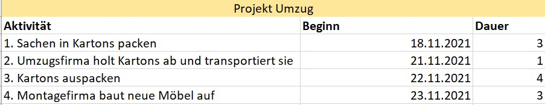
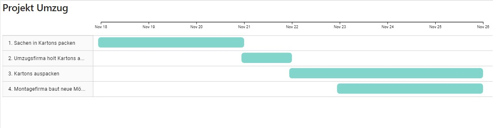

Kurzbeschreibung zu Gantt_Diagramme um ein erstes Verständnis dafür zu schaffen um was es hier geht.

Hier ganz am Anfang keine Überschrift einfügen - das passiert automatisch basierend auf dem `title`-Attribut
oben im Front-Matter (Bereich zwischen den `---`).

# 1 Was ist ein Gantt Diagramm
Gantt-Diagramme  sind Tools zur Projektplanung. Sie unterstützen im klassischen [Projektmanagement]( https://github.com/ManagingProjectsSuccessfully/ManagingProjectsSuccessfully.github.io/blob/main/kb/Projektmanagement.md)  (hier den Artikel verlinken!!), indem sie die zeitliche Abfolge, sowie Beginn und Ende der einzelnen Aktivitäten des Projekts in Balkenform visualisieren [^1].

# # 1.1 Entstehung
Die erste Form des Gantt-Diagramms wurde 1896 von einem polnischen Hüttentechniker namens Karol Adamiecki entworfen. Er bezeichnete es als Harmonogram, was aus dem Polnischen übersetzt „Arbeitsablaufschild“ bedeutet. Unabhängig von Adamieckis Diagramm erstellte Henry Laurence Gantt im Jahr 1910 das erste Gantt-Diagramm, anhand dessen er Produktionsprozesse im Schiffsbau plante. Die Gantt-Chart wie sie heute eingesetzt wird, wurde jedoch nach seinem Tod durch einen Kollegen von H. L. Gantt verbreitet. Dies erfolgte durch Henry Wallace Clark unter anderem durch die Publikation des Buches „The Gantt chart, a working tool of management“ im Jahr 1922 (http://projekt-manager.eu/projektmanagement/balkenplan.html). 

# # 1.2 Aufbau 
Auf der horizontalen Achse des Diagramms befinden sich die Namen der einzelnen Aktivitäten, die visualisiert werden sollen. Begonnen wird oben mit der ersten Aktivität, darauf folgen die restlichen Aktivitäten in der richtigen Reihenfolge.  Zu jeder Aktivität wird in der entsprechenden Zeile ein waagrechter Balken eingetragen, welcher Beginn, Ende, und Dauer der jeweiligen Aktivität anzeigt. Je länger ein Balken ist, umso länger dauert die Aktivität. Sich überschneidende Balken, stellen überlappende Aufgaben dar. Wie detailliert die einzelnen Aktivitäten und [Projektphasen](https://github.com/ManagingProjectsSuccessfully.github.io/blob/main/kb/Projektphasen_klassisch.md) dargestellt werden, kann vom Ersteller entschieden werden ( (https://de.wikipedia.org/wiki/Gantt-Diagramm#Aufbau_und_Struktur).

# # 1.3 Gantt-Diagramme erstellen 
Für die Erstellung eines Gantt Diagramms können zahlreiche Software benutzt werden. 
Einige kostenlose Beispiele sind GanttProject, oder OpenProject. Kostenpflichtige Programme wären zum Beispiel Mindmanager, oder Microsoft Project (https://de.wikipedia.org/wiki/Gantt-Diagramm#Software). Im Folgenden wird gezeigt, wie ein solches Diagramm mit der PowerBI App erstellt werden kann. Zur Erstellung werden folgende Informationen benötigt:
* Detaillierungsgrad
* Aktivitäten
* Reihenfolge der Aktivitäten 
* Beginn
* Ende
* Dauer der Aktivitäten
* Verantwortlicher für jede Aktivität (Optional)

| Beispiel für die nötige Datenbasis für ein Gantt-Diagramm  |  |
| daraus resultierendes Gantt-Diagramm |  |

# 2.  Vor- / Nachteile des Gantt-Diagramms
     Wie jedes Tool hat auch das Gantt-Diagramm seine Vor- und Nachteile. Diese werden in den kommenden Abschnitten näher beleuchtet.

# # 2.1 Vorteile 
 - Klarheit: Aufgrund der verständlichen Visualisierung des Projektablaufs, ist für alle Beteiligten transparent, wann welche Aktivität beginnt, und endet und in welcher Reihenfolge das geschieht.
- Motivation: Durch das Gantt-Diagramm ist jedem Beteiligten bewusst welche Rolle er im Projekt durch seine Aktivitäten einnimmt und welche Verantwortung er trägt damit das Projekt reibungslos ablaufen kann. (https://www.teamleader.de/blog/gantt-diagramm)
-  Ermittlung nötiger Ressourcen: Da bei der Erstellung der Gantt-Chart, zeitliche Rahmen, sowie die Anzahl nötiger Head Counts festgelegt werden, hilft die Gantt-Chart bei der Ressourcenplanung (https://asana.com/de/resources/gantt-chart-basics).   
-
# # 2.2 Nachteile
1. Komplexität bei umfangreichen Projekten: Bei Großprojekten mit einer hohen Anzahl an Aktivitäten, kann das Gantt-Diagramm unübersichtlich werden, wodurch es seinen Zweck, der unkomplizierten Visualisierung des Projektablaufs, verliert. 
2.  Arbeitsaufwand: Bei Änderungen im Projektverlauf muss auch das Diagramm angepasst werden, das kann zu zusätzlichem Arbeitsaufwand führen.
3. undynamisch: Um ein Gantt-Diagramm erfolgreich einsetzen zu können , müssen zum Projektstart alle nötigen Aktivitäten geplant sein. Infolgedessen sind Gantt-Diagramme aufgrund ihrer Starrheit nicht für agiles Projektmanagement geeignet (https://www.teamleader.de/blog/gantt-diagramm).

# Siehe auch

* Verlinkungen zu angrenzenden Themen
* [Link auf diese Seite](Gantt_Diagramme.md)

# Weiterführende Literatur

* Weiterfuehrende Literatur zum Thema z.B. Bücher, Webseiten, Blogs, Videos, Wissenschaftliche Literatur, ...

# Quellen

[^1]: https://studyflix.de/wirtschaft/gantt-diagramm-659
[^2]: [A Guide to the Project Management Body of Knowledge (PMBOK® Guide)](https://www.pmi.org/pmbok-guide-standards/foundational/PMBOK)
[^3]: [Basic Formatting Syntax for GitHub flavored Markdown](https://docs.github.com/en/github/writing-on-github/getting-started-with-writing-and-formatting-on-github/basic-writing-and-formatting-syntax)
[^4]: [Advanced Formatting Syntax for GitHub flavored Markdown](https://docs.github.com/en/github/writing-on-github/working-with-advanced-formatting/organizing-information-with-tables)

