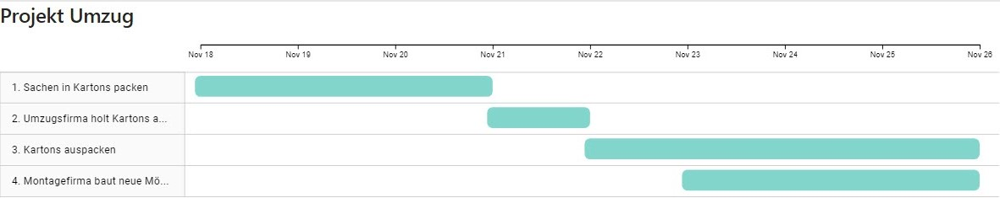

Der folgende Artikel widmet sich dem Thema Gantt-Diagramme, die im klassischen Projektmanagement ein häufig verwendetes Werkzeug darstellen.

# 1 Was ist ein Gantt Diagramm
Gantt-Diagramme  sind Tools zur Projektplanung. Sie unterstützen im klassischen [Projektmanagement]( https://github.com/ManagingProjectsSuccessfully/ManagingProjectsSuccessfully.github.io/blob/main/kb/Projektmanagement.md), indem sie die zeitliche Abfolge, sowie Beginn und Ende der einzelnen Aktivitäten des Projekts in Balkenform visualisieren [^1].

## 1.1 Entstehung
Die erste Form des Gantt-Diagramms wurde 1896 von einem polnischen Hüttentechniker namens Karol Adamiecki entworfen. Er bezeichnete es als Harmonogram, was aus dem Polnischen übersetzt „Arbeitsablaufschild“ bedeutet. Unabhängig von Adamieckis Diagramm erstellte Henry Laurence Gantt im Jahr 1910 das erste Gantt-Diagramm, anhand dessen er Produktionsprozesse im Schiffsbau plante. Die Gantt-Chart wie sie heute eingesetzt wird, wurde jedoch nach seinem Tod durch einen Kollegen von H. L. Gantt verbreitet. Dies erfolgte durch Henry Wallace Clark unter anderem durch die Publikation des Buches „The Gantt chart, a working tool of management“ im Jahr 1922 [^2]. 

## 1.2 Aufbau 
Auf der horizontalen Achse des Diagramms befinden sich die Namen der einzelnen Aktivitäten, die visualisiert werden sollen. Begonnen wird in der ersten Zeile von oben mit der ersten Aktivität, darauf folgen horizontal die restlichen Aktivitäten in der richtigen Reihenfolge.  Zu jeder Aktivität wird in der entsprechenden Zeile ein waagrechter Balken eingetragen, welcher Beginn, Ende, und Dauer der jeweiligen Aktivität anzeigt. Je länger ein Balken ist, umso länger dauert die Aktivität. Sich überschneidende Balken, stellen überlappende Aufgaben dar. Anhand der sich überschneidenden Aufgaben können auch kritische Abfolgen verdeutlicht werden, das sind Abfolgen von Aufgaben, die voneinander abhängig sind. Wie detailliert die einzelnen Aktivitäten und [Projektphasen](https://github.com/ManagingProjectsSuccessfully.github.io/blob/main/kb/Projektphasen_klassisch.md) dargestellt werden, kann vom Ersteller entschieden werden[^3].

## 1.3 Gantt-Diagramme erstellen 
Für die Erstellung eines Gantt Diagramms können zahlreiche Software Programme benutzt werden. 
Einige kostenlose Beispiele sind GanttProject, oder OpenProject. Kostenpflichtige Programme wären zum Beispiel Mindmanager, oder Microsoft Project[^4]. Zur Erstellung werden folgende Informationen benötigt[^5]:
* nötiger Detaillierungsgrad des Diagramms
* Aktivitäten
* Reihenfolge der Aktivitäten 
* Beginn
* Ende
* Dauer der Aktivitäten
* Verantwortlicher für jede Aktivität (Optional)
 
 

 Beispiel für die nötige Datenbasis für ein Gantt-Diagramm: Projekt Umzug  
 | Aktivität  | Beginn | Dauer [d] |
| ------------- | ------------- |------------- |
| 1. Sachen in Kartons packen  | 18.11.2021  | 3 |
| 2. Umzugsfirma holt sie ab und transportiert sie  | 21.11.2021  | 1|
|3. Kartons auspacken| 22.11.2021| 4|
| 4. Montagefirma baut neue Möbel auf  | 23.11.2021  | 3 |  

_Erstellt durch den Autor_

 
 
 Daraus resultierendes Gantt-Diagramm  
 

_Erstellt durch den Autor mittels Microsoft PowerBI_

# 2  Vor- / Nachteile des Gantt-Diagramms
     Wie jedes Tool hat auch das Gantt-Diagramm seine Vor- und Nachteile. Diese werden in den kommenden Abschnitten näher beleuchtet. Anschließend werden zwei mögliche Alternativen kurz vorgestellt.

## 2.1 Vorteile 
1. Klarheit: Aufgrund der verständlichen Visualisierung des Projektablaufs, ist für alle Beteiligten transparent, wann welche Aktivität beginnt, und endet und in welcher Reihenfolge das geschieht.
2. Motivation: Durch das Gantt-Diagramm ist jedem Beteiligten bewusst welche Rolle er im Projekt durch seine Aktivitäten einnimmt und welche Verantwortung er trägt damit das Projekt reibungslos ablaufen kann[^5].
3. Ermittlung nötiger Ressourcen: Da bei der Erstellung der Gantt-Chart, zeitliche Rahmen, sowie die Anzahl nötiger Head Counts festgelegt werden, hilft die Gantt-Chart bei der Ressourcenplanung[^6].   

## 2.2 Nachteile
1. Komplexität bei umfangreichen Projekten: Bei Großprojekten mit einer hohen Anzahl an Aktivitäten, kann das Gantt-Diagramm unübersichtlich werden, wodurch es seinen Zweck, der unkomplizierten Visualisierung des Projektablaufs, verliert. 
2.  Arbeitsaufwand: Bei Änderungen im Projektverlauf muss auch das Diagramm angepasst werden, das kann zu zusätzlichem Arbeitsaufwand führen.
3. Linearität: Um ein Gantt-Diagramm erfolgreich einsetzen zu können , müssen zum Projektstart alle nötigen Aktivitäten geplant sein. Infolgedessen sind Gantt-Diagramme aufgrund ihrer Starrheit nicht für agiles Projektmanagement geeignet[^5].

## 2.3 Alternativen zur Gantt-Chart
Mögliche Alternativen zur Gantt-Chart sind
* Aufgabenlisten: Sie enthalten die zu einem Projekt gehörigen Aufgaben in Form einer Liste und zusätzliche Informationen, wie Start und Ende einer Aufgabe, Verantwortliche und Abhängigkeiten zwischen den Aufgaben[^7], [^8].
* Flussdiagramme: Flussdiagramme visualisieren die Aktivitäten und weitere Informationen des Projekts in der Reihenfolge, in der sie ausgeführt werden sollen [^9].  
_Beispiel Flussdiagramm_

_Erstellt durch den Autor_

# Siehe auch

* [Projektphasen_klassisch](https://github.com/ManagingProjectsSuccessfully/ManagingProjectsSuccessfully.github.io/blob/main/kb/Projektphasen_klassisch.md)
* [Projektmanagementhandbuch](https://github.com/ManagingProjectsSuccessfully/ManagingProjectsSuccessfully.github.io/blob/main/kb/Projektmanagementhandbuch.md)
* [Rollen im klassischen Projektmanagement](https://github.com/ManagingProjectsSuccessfully/ManagingProjectsSuccessfully.github.io/blob/main/kb/Rollen_klassisch.md)

# Weiterführende Literatur

* [YouTube Video: Gantt-Diagramme](https://youtu.be/rpUsuZQsiFs)

# Quellen

[^1]: https://studyflix.de/wirtschaft/gantt-diagramm-659
[^2]: http://projekt-manager.eu/projektmanagement/balkenplan.html
[^3]: https://de.wikipedia.org/wiki/Gantt-Diagramm#Aufbau_und_Struktur
[^4]: https://de.wikipedia.org/wiki/Gantt-Diagramm#Software
[^5]: https://www.teamleader.de/blog/gantt-diagramm
[^6]: https://asana.com/de/resources/gantt-chart-basics
[^7]: https://www.projectmanager.com/blog/5-alternatives-to-gantt-charts
[^8]: https://www.projectengineer.net/how-to-create-a-project-task-list/
[^9]: https://www.thebalancecareers.com/alternatives-to-gantt-charts-2779594
