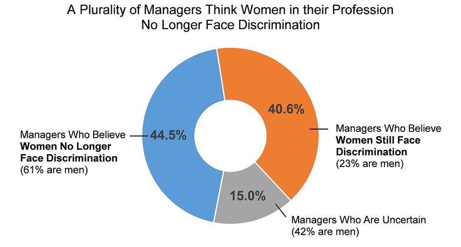

# Die Problematik des Themas
„Wir können die Bewerberin nicht nehmen. Sie ist dreißig und verheiratet. Sie bekommt sicher bald Kinder.“ Dieser und ähnliche Sätze fallen häufig im Zusammenhang von Bewerbungen und jungen Frauen. In den meisten Fällen wird die geschlechterbezogene Diskriminierung zwar nicht derart direkt formuliert, jedoch kommt diese auch heutzutage noch in einigen Unternehmen in abgeschwächter und oftmals unbeabsichtigter Form vor.[^1] Der Beitrag beschäftigt sich mit dem Problem der Ungleichbehandlung der Geschlechter. 
# Was bedeutet der Begriff und woher kommt er?
Der Begriff Gender Bias kann übersetzt werden als geschlechtsbezogener Verzerrungseffekt. Es handelt sich um eine [Verzerrung](https://github.com/ManagingProjectsSuccessfully/ManagingProjectsSuccessfully.github.io/blob/main/kb/Dunning_Kruger_Effekt.md) der Wirklichkeit durch Annahmen, Formulierungen und Fehler, welche zu einer falschen Darstellung der tatsächlich vorherrschenden geschlechtsspezifischen Verhältnisse führt.[^2] Geprägt wurde der Begriff maßgeblich von Judith Fuchs, Kris Maschewsky und Ulrike Maschewsky-Schneider. Der Begriff entstand im Jahr 1988. Die [Wahrnehmungsverzerrungseffekte](https://github.com/ManagingProjectsSuccessfully/ManagingProjectsSuccessfully.github.io/blob/main/kb/Survivorship_Bias.md) in Verbindung mit dem Geschlecht können aufgrund von Alltagstheorien, mangelnder Auseinandersetzung und fehlendem Wissen entstehen. Man konnte feststellen, dass drei Hauptannahmen die Basis für Genderbias bilden.
*	Annahme der Unterschiedlichkeit in bestimmten Bereichen, wo (eventuell) keine besteht,
*	Annahme der Gleichheit dort, wo die Gleichheit nicht vorhanden ist,
*	Unterschiedliche (Be-)Wertung von Faktoren, die bei beiden Geschlechtern auftreten[^3] 
# Die Fachbegriffe
Die drei Formen heißen Androzentrismus, Geschlechtsinsensibilität und Doppelte Bewertungsmaßstäbe. Androzentrismus bedeutet, dass in der Forschung vor allem Probleme untersucht werden, die Männer betreffen, obwohl die Ergebnisse auf alle Menschen verallgemeinert werden (Unterformen: Übergeneralisierung, Männer als Norm, Paradoxer Gynozentrismus). Geschlechtsinsensibilität liegt vor, wenn das biologische oder soziale Geschlecht ignoriert wird. Dies wird auch als Geschlechterblindheit bezeichnet (Unterformen: Familialismus, Dekontextualisierung, Annahme der Gleichheit von Frauen und Männern). Doppelte Bewertungsmaßstäbe verzerren Forschungsergebnisse, wenn identische Eigenschaften von Frauen und Männern unterschiedlich untersucht oder beurteilt werden (Unterformen: Geschlechterdichotomien, Geschlechterstereotype).[^4] 
# Welche Rolle spielen kognitive Verzerrungen?
Mithilfe von kognitiven Abkürzungen kann unser Gehirn Informationen des Alltags reduzieren. Dadurch werden sinnvolle Funktionen erfüllt. Deshalb kann es jedoch zu Verzerrungen und voreiligen Annahmen kommen, welche sich negativ auf einzelne Personengruppen auswirken können.[^5]  
# Beispiele
Wir sprechen zum Beispiel von einem Gender Bias, wenn bei der Neuzulassung von Autos lediglich Sicherheitstests mit auf Männern zugeschnittenen Dummies gesetzlich vorgeschrieben sind oder Wissenschaftler die biologischen Unterschiede zwischen Männern und Frauen bei der Entwicklung neuer Medikamente nicht hinreichend beachten oder man Männer bzw. Frauen stereotypisiert und ihnen bestimmte Kompetenzen zuweist und diese gleichzeitig mit einzelnen Jobs verbindet.[^6] 
# Wie denken Führungskräfte darüber? 

 

Abbildung 1: [Die Mehrheit der Manager glaubt, dass Frauen im Beruf nicht mehr diskriminiert werden.](https://science.orf.at/stories/3201035/)
 
Die Ergebnisse stammen aus einer Studie von Christopher Begeny. Es wurde ein Arbeitsumfeld gewählt, in dem Frauen zahlenmäßig aufgeholt haben, und zwar die Veterinärmedizin. Die Manager*innen wurden befragt, ob sie glauben, dass Frauen und Männer die gleichen Chancen haben und gleichberechtigt sind. Mehr als 44% waren dieser Meinung, 61% davon Männer. 40 Prozent hatten die Meinung, dass es noch immer einen Gender-Bias gebe, nur 23% davon waren Männer. Der Rest war unsicher.[^7] Zahlreiche Unternehmen zweifeln immer noch an der Vereinbarkeit von beruflichem und privatem. Oft werden Frauen in bestimmten Branchen als untypische oder ungeeignete Führungskraft abgestempelt. Das führt dazu, dass Frauen in Führungspositionen [kritischer](https://github.com/ManagingProjectsSuccessfully/ManagingProjectsSuccessfully.github.io/blob/main/kb/Umgang_mit_Kritik.md) beobachtet werden als ihre männlichen Kollegen.[^8] 
# Was kann man als einzelnes Unternehmen bewegen?
Als einzelnes Unternehmen kann man die traditionelle Rollenverteilung der Geschlechter in der Gesellschaft nicht verändern. Trotzdem kann das Unternehmen bewusst die Vereinbarkeit von Beruf und Privatleben sowie untypische Karrierewege aufzeigen, stärken und fördern.[^9]  

# Siehe auch 
* [Dunning-Kruger-Effekt](https://github.com/ManagingProjectsSuccessfully/ManagingProjectsSuccessfully.github.io/blob/main/kb/Dunning_Kruger_Effekt.md)
* [Survivorship_Bias](https://github.com/ManagingProjectsSuccessfully/ManagingProjectsSuccessfully.github.io/blob/main/kb/Survivorship_Bias.md)
* [Umgang mit Kritik](https://github.com/ManagingProjectsSuccessfully/ManagingProjectsSuccessfully.github.io/blob/main/kb/Umgang_mit_Kritik.md)
# Quellen
[^1]: [Karriere-Killer Gender Bias](https://blog.iao.fraunhofer.de/karriere-killer-gender-bias/)
[^2]: [Gender Bias](https://de.wikipedia.org/wiki/Gender_Bias)
[^3]: [Genderbias: Wahrnehmungsverzerrungen in Bezug auf Gender](https://erwachsenenbildung.at/themen/gender_mainstreaming/grundlagen/genderbias.php)
[^4]: [Geschlechtsbezogener Verzerrungseffekt (Gender Bias)](http://www.genderkompetenz.info/w/files/gkompzpdf/gender_bias.pdf)
[^5]: [Gender Bias in der Wissenschaft](https://www.gesis.org/cews/themen/gender-bias)
[^6]: [Karriere-Killer Gender Bias](https://blog.iao.fraunhofer.de/karriere-killer-gender-bias/)
[^7]: [„Gender-Bias“ überlebt im Kopf](https://science.orf.at/stories/3201035/)
[^8]: [Karriere-Killer Gender Bias](https://blog.iao.fraunhofer.de/karriere-killer-gender-bias/)
[^9]: [Karriere-Killer Gender Bias](https://blog.iao.fraunhofer.de/karriere-killer-gender-bias/)

