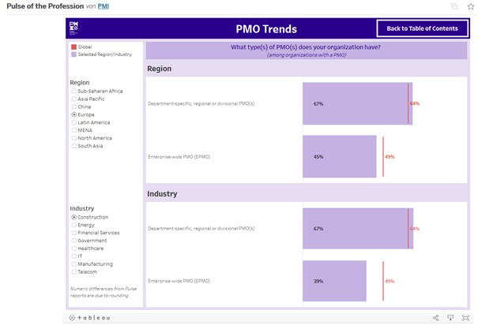

Die Global Project Management Survey dienen dazu, von Firmen bereits durchgeführte Projekte im Nachgang zu untersuchen, um realistische Aussagen über den Ablauf, die Art, den
Erfolg/Misserfolg und alle weiteren wichtigen Faktoren innerhalb der weltweit in Unternehmen durchgeführten Projektmanagements zu erhalten und darauf aufbauend für die Zukunft 
neue Trends zu identifizieren beziehungsweise neuen Entwicklungsbedarf zu sichten/abzuleiten.

# Historische Entwicklung und aktueller Stand zu den Global Project Management Surveys

Von der Deutschen Gesellschaft für Projektmanagement e.V. (GPM) wurde erst und auch einmalig eine solche Studie im Jahr 2010 durchgeführt[^1].
Da es sich hier um einen veraltetet und nicht jährlich aktualisierten Report handelt, wird dieser im weiterem nicht betrachtet und analysiert. Jedoch lässt sich der Report in
Hinblick auf die Entwicklung des Projektmanagements innerhalb der letzten 10 Jahre als Vergleich zu aktuellen Reports heranziehen.

Aktuelle Entwicklungen werden vom Project Management Institute (PMI) in einem jährlich veröffentlichten Report, beginnend im Jahr 2006, erfasst[^2].
Dieser Report trägt den Namen "Pulse of Profession" und wird durch die Zusammenarbeit und Befragung weltweit agierender Unternehmen und deren mit dem Projektmanagement betrauten
Mitarbeitern erstellt. Durch die Vielzahl an Daten und den jährlichen Befragungsturnus kann der "Pulse of Profession" als eine der wichtigsten Studien in Bezug
auf Projektmanagement weltweit angesehen werden, der den aktuellen Stand innerhalb der Unternehmen abbilden kann.
Die Herausgeber der Studie, das Project Management Institute wird "als die weltweit führende Autorität im Projektmanagement"[^3][^4][^5] angesehen, wodurch die Daten, 
deren Erhebung, Verarbeitung und Veröffentlicung als valide angesehen werden kann. 

*lustiges Testbild*

# Eckdaten der Pulse of the Profession Reports von PMI:

*	Erstmals 2006 durchgeführt
*	Erste weltweite Untersuchung von Projektmanagement innerhalb von Unternehmen
*	Hauptreport erscheint einmal jährlich, kleinere (auch zwischen-)Reports auch mehrmals innerhalb eines Jahres 
*	Zeigt aktuelle und zukünftige Entwicklungen im Bereich des Projektmanagements unter Einbezug von Marktforschungen die Einblicke in das Arbeitsleben von Projekt-, Programm und 
  Portfoliomanagers gewähren
*	Im Report wird eine große Anzahl an unterschiedlichen Branchen und Regionen abgefragt
*	Der Report ist auf der Internetseite des PMI kostenlos zur Verfügung gestellt
*	Die Befragung wird jährlich, je nach Interessenslage, variiert. So wurde 2020/2021 beispielsweise Corona besondere Beachtung geschenkt.
*	Der Report stellt Versionen für verschiedene Regionen zur Verfügung, um Unterschiede herausstellen zu können und einen tieferen Einblick je nach Region zu gewähren. Der 
  Hauptreport und die Regionalen Reports sind in mehreren Sprachen verfügbar:
  
.
*	Seit 2021 lassen sich die Daten der Reports nach eigens gewählten Kriterien filtern, um noch schneller und übersichtlicher die Benchmark mit dem eigenen Unternehmen Regional 
und weltweit vergleichen zu können:

.

Die Daten lassen sich unter folgendem Link beliebig Filtern:
[Datenbank Survey 2021](https://public.tableau.com/app/profile/pmi2161/viz/PulseoftheProfession/PulseoftheProfession)

## Hier eine Ebene-2-Überschrift unter Aspekt 2

So kann man eine Tabelle erstellen:

| First Header  | Second Header |
| ------------- | ------------- |
| Content Cell  | Content Cell  |
| Content Cell  | Content Cell  |

## Hier gleich noch eine Ebene-2-Überschrift :-)

Wenn man hier noch ein bisschen untergliedern will kann man noch eine Ebene einfügen.

### Ebene-3-Überschrift

Vorsicht: nicht zu tief verschachteln. Faustregel: Wenn man mehr als 3 
Ebenen benötigt, dann passt meist was mit dem Aufbau nicht.

# Kernaussagen und Erkenntnisse aus dem Report 2021

1. das
2. hier 
4. ist 
4. eine
7. nummerierte liste
   1. und hier eine Ebene tiefer

# Kernaussagen und Erkenntnisse aus dem Report 2020

# Kernaussagen und Erkenntnisse aus dem Report 2019

# Siehe auch

* Verlinkungen zu angrenzenden Themen
* [Link auf diese Seite](Global_Project_Management_Survey.md)

# Weiterführende Literatur

* Weiterfuehrende Literatur zum Thema z.B. Bücher, Webseiten, Blogs, Videos, Wissenschaftliche Literatur, ...

# Quellen

[^1]: [Deutsche Gesellschaft für Projektmanagement e.V.](https://www.gpm-ipma.de/know_how/studienergebnisse/global_project_management_survey.html)
[^2]: [Project Management Institute (2021). Beyond Agility: Flex to the Future. Pulse of the Profession](https://www.pmi.org/learning/thought-leadership/pulse)
[^3]: [Businesswire (2021)](https://www.businesswire.com/news/home/20210324005874/de/)
[^4]: [Onvista (2021)](https://www.onvista.de/news/der-bericht-pulse-of-the-profession-von-2021-des-pmi-enthuellt-die-vorteile-der-organisatorischen-flexibilitaet-in-zeitengrosser-veraenderungen-444246997)
[^5]: [Boerse.de (2018)](https://www.boerse.de/nachrichten/PMI-2018-Pulse-of-the-Profession-Detailbericht/7955140)
