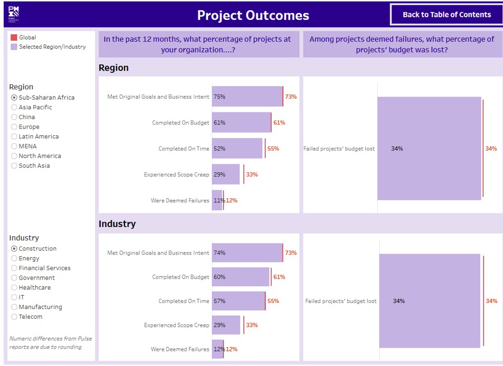
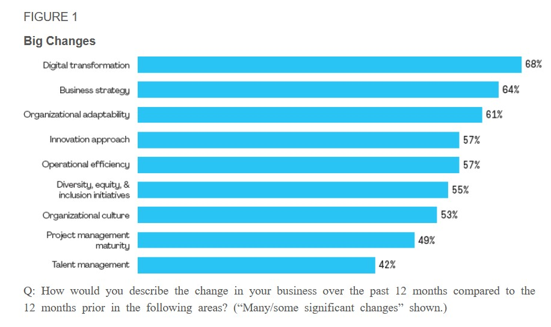
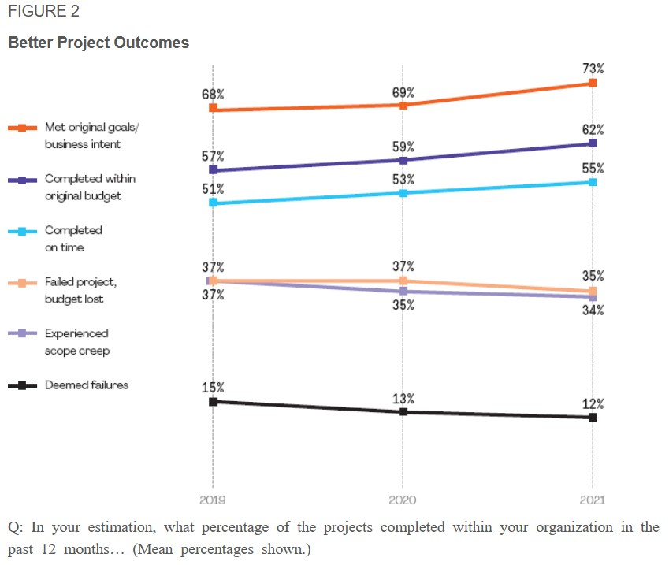
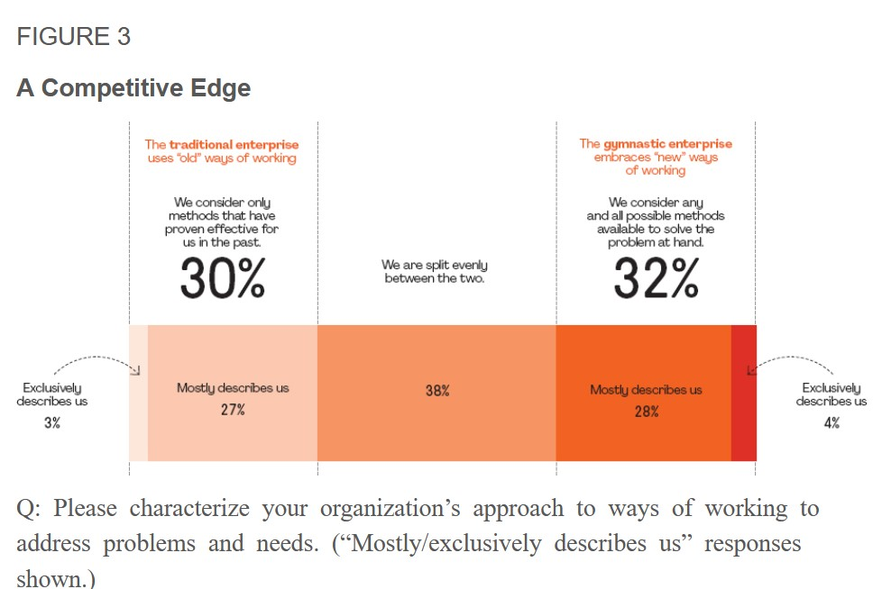
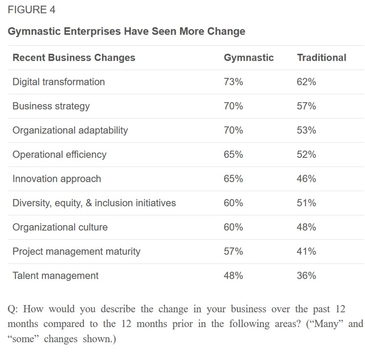
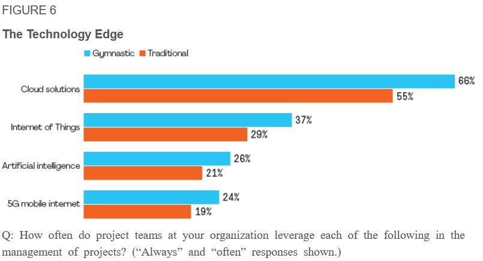

Die Global Project Management Surveys (GMS) dienen dazu, von Firmen bereits durchgeführte Projekte im Nachgang zu untersuchen, um realistische Aussagen über den Ablauf, die Art, den Erfolg/Misserfolg und alle weiteren [aktuelle Entwicklungen](https://github.com/ManagingProjectsSuccessfully/ManagingProjectsSuccessfully.github.io/blob/main/kb/Aktuelle_Entwicklungen_im_PM.md) der weltweit in Unternehmen durchgeführten Projekte treffen und darauf aufbauend neuen Weiterentwicklungsbedarf ableiten zu können.

# Historische Entwicklung und aktueller Stand zu den GMS
Von der [Deutschen Gesellschaft für Projektmanagement e.V.](https://github.com/ManagingProjectsSuccessfully/ManagingProjectsSuccessfully.github.io/blob/main/kb/GPM_Institution.md) (GPM) wurde erst und auch einmalig eine Studie mit dem Fokus auf [Projektmanagement](https://github.com/ManagingProjectsSuccessfully/ManagingProjectsSuccessfully.github.io/blob/main/kb/Projektmanagement.md) innerhalb von Unternehmen im Jahr 2010 durchgeführt[^1].
Da es sich hier um einen veraltetet und nicht jährlich aktualisierten Report handelt, wird dieser im weiterem nicht betrachtet und analysiert. Jedoch lässt sich der Report in
Hinblick auf die Entwicklung des Projektmanagements innerhalb der letzten 10 Jahre als Vergleich zu aktuellen Reports heranziehen.

Aktuelle Entwicklungen werden vom [Projekt Management Institute](https://github.com/ManagingProjectsSuccessfully/ManagingProjectsSuccessfully.github.io/blob/main/kb/PMI_Institution.md) (PMI) in einem jährlich veröffentlichten Report, beginnend im Jahr 2006, erfasst[^2].
Dieser Report trägt den Namen "Pulse of Profession" und wird durch die Zusammenarbeit und Befragung weltweit agierender Unternehmen und deren mit dem Projektmanagement betrauten
Mitarbeitern erstellt. Durch die Vielzahl an Daten und den jährlichen Befragungsturnus kann der "Pulse of Profession" als eine der wichtigsten Studien in Bezug
auf Projektmanagement weltweit angesehen werden, der den aktuellen Stand innerhalb der Unternehmen abbilden kann.

Die Herausgeber der Studie, das [Projekt Management Institute](https://github.com/ManagingProjectsSuccessfully/ManagingProjectsSuccessfully.github.io/blob/main/kb/PMI_Institution.md) wird "als die weltweit führende Autorität im Projektmanagement"[^3][^4][^5] angesehen, wodurch die Daten, 
deren Erhebung, Verarbeitung und Veröffentlichung als valide angesehen werden kann. 

# Eckdaten der Pulse of the Profession Reports:

*	Erstmals 2006 durchgeführt
*	Erste weltweite Untersuchung von [Projektmanagement](https://github.com/ManagingProjectsSuccessfully/ManagingProjectsSuccessfully.github.io/blob/main/kb/Projektmanagement.md) innerhalb von Unternehmen
*	Hauptreport erscheint einmal jährlich, kleinere (auch zwischen-)Reports teilweise mehrmals innerhalb eines Jahres 
*	Zeigt aktuelle und zukünftige Entwicklungen im Bereich des [Projektmanagements](https://github.com/ManagingProjectsSuccessfully/ManagingProjectsSuccessfully.github.io/blob/main/kb/Projektmanagement.md) unter Einbezug von Marktforschungen die Einblicke in das Arbeitsleben von Projekt-, Programm- und 
  Portfoliomanagern gewähren (siehe auch [Portfoliomanagement](https://github.com/ManagingProjectsSuccessfully/ManagingProjectsSuccessfully.github.io/blob/main/kb/Projektportfoliomanagement.md) und [Programmmanagement](https://github.com/ManagingProjectsSuccessfully/ManagingProjectsSuccessfully.github.io/blob/main/kb/Programmmanagement.md) )
*	Für den Report wird eine große Anzahl an unterschiedlichen Branchen und Regionen befragt
*	Der Report ist auf der Internetseite des [PMI](https://github.com/ManagingProjectsSuccessfully/ManagingProjectsSuccessfully.github.io/blob/main/kb/PMI_Institution.md) kostenlos zur Verfügung gestellt
*	Die Befragung wird jährlich, je nach aktueller Situation, variiert. Bei der Befragung 2020/2021 wurde vor allem der weltweiten Coronapandemie im Zusammenhang mit traditionellen und agilen Projektmanagement-Methoden und die daraus resultierenden Folgen, große Aufmerksamkeit geschenkt
*	Der Report stellt zusätzlich gefilterte Daten für verschiedene Regionen zur Verfügung. Der 
  Hauptreport und die Regionalen Reports sind zusätzlich in mehreren Sprachen verfügbar
*	Seit 2021 lassen sich die Daten der Reports nach eigens gewählten weiteren Kriterien filtern:

.

Folgender Link ruft die Datenbank mit verschiedenen Filtermöglichkeiten auf:
[Datenbank Survey 2021](https://public.tableau.com/app/profile/pmi2161/viz/PulseoftheProfession/PulseoftheProfession)

# Kernaussagen und Erkenntnisse des Reports 2021 [^6]

Innerhalb des Reports von 2021 wurde vor allem die Corona Situation im Zusammenhang mit der weltweit in Unternehmen durchgeführten Projekttätigkeit Beachtung geschenkt.
Dabei wurde vor allem hinsichtlich der in den Unternehmen genutzten [Projektmanagement Methoden](https://github.com/ManagingProjectsSuccessfully/ManagingProjectsSuccessfully.github.io/blob/main/kb/Methoden.md) gefiltert und daraus Erkenntnisse abgeleitet.
Im ersten Schritt wurden dabei die größten Veränderungen innerhalb des Unternehmens innerhalb der letzten 12 Monate im Vergleich zu den vorausgegangenen 12 Monaten, also vor der 
Corona-Pandemie, abgefragt: 

.

Nachfolgend wurde abgefragt wie der Projekterfolg, im Vergleich zu den Vorangegangenen Jahren, eingestuft wird:

Des weiteren wurde eine Aufteilung der Unternehmen in "Gymnastic Enterprises" und "Tradional Enterprises" durchgeführt.
Die Unternehmen, die bei der Anwendung von Projektmanagement eine "agile" Ausrichtung aufwiesen, wurden als "Gymnastic Enterprises" bezeichnet. Unternehmen,
die eher auf traditionelle bzw. bereits angewendete/bewährte [Projektmanagement Methoden](https://github.com/ManagingProjectsSuccessfully/ManagingProjectsSuccessfully.github.io/blob/main/kb/Methoden.md) setzten, wurden als "traditional enterprises" eingestuft. 
Charakteristisch für die „Gymnastic Enterprises“ ist die vielfältige Anwendung unterschiedlicher [Projektmanagement Methoden](https://github.com/ManagingProjectsSuccessfully/ManagingProjectsSuccessfully.github.io/blob/main/kb/Methoden.md), wohingegen „traditional enterprises“ Unternehmen 
darstellen, die sich auf bewährte Methoden konzentriert haben. Zusätzlich konzentrieren sich die "Gynmastic Enterprises" verstärkt auf das Ergebnis als
auf die Prozesse und fokussieren sich auf Ihre Mitarbeitenden und deren individuellen Leistungen/Fähigkeiten. Die  traditionellen Unternehmen erlangten insgesamt eher 
negativere Ergebnisse innerhalb der Projektarbeit. 

Bei der Befragung wurden 1/3 der Unternehmen als „Gymnastic Enterprises“ eingestuft, und 30 % als „Traditional Enterprises“, die restlichen konnten nicht eindeutig zugeordnet werden:

Kernerkenntisse waren dabei unter anderem:

1. Sogenannte „Gymnastic Enterprises“ sind besser durch die Krise gekommen, wenn es um den Erfolg einzelner Projekte im Unternehmen geht. Bei der Betrachtung der Grafik
muss berücksichtigt werden, dass die unteren drei Zeilen eine negative Situation darstellen und somit ein niedrigerer Wert als "besser" anzusehen ist.

2. Die "Gymnastic Enterprises" erfuhren in den letzten 12 Monate im Vergleich zu den "Tradional Enterprises" mehr Veränderungen innerhalb des Unternehmens
oder trieben diese aktiv voran:

3. Die "Gymnastic Enterprises" nutzten bei der Umsetzung der Projekte vermehrt aktuelle technologische Trends und Möglichkeiten:

.

4. Als zusätzlicher Erfolgsfaktor wurde herausgefunden, dass die "Gymnastic Enterprises" neben des hohen Grades an Agilität innerhalb des Unternehmens zusätzlich 
standardisierte [Risikoanalyse und -managementverfahren](https://github.com/ManagingProjectsSuccessfully/ManagingProjectsSuccessfully.github.io/blob/main/kb/Risikomanagement.md) nutzten sowie eine geringere schleichende Umfangsausweitung innerhalb eines Projektes aufwiesen (siehe auch [Projektumfang](https://github.com/ManagingProjectsSuccessfully/ManagingProjectsSuccessfully.github.io/blob/main/kb/Projektumfang.md)). Diese Kombination ist 
laut PMI[^6] neben weiteren Faktoren ursächlich für den erhöhten Projekterfolg (siehe auch [Projekterfolgsmessung](https://github.com/ManagingProjectsSuccessfully/ManagingProjectsSuccessfully.github.io/blob/main/kb/Erfolgsmessung.md)) im Vergleich zu den "Tradional Enterprises": 
"Higher levels of organizational agility, more standardized risk management practices, and less project scope creep, among other benefits, all contributing to better project 
performance." 

# Siehe auch

* [aktuelle Entwicklungen im PM](https://github.com/ManagingProjectsSuccessfully/ManagingProjectsSuccessfully.github.io/blob/main/kb/Aktuelle_Entwicklungen_im_PM.md) 
* [Deutschen Gesellschaft für Projektmanagement e.V.](https://github.com/ManagingProjectsSuccessfully/ManagingProjectsSuccessfully.github.io/blob/main/kb/GPM_Institution.md)
* [Portfoliomanagement](https://github.com/ManagingProjectsSuccessfully/ManagingProjectsSuccessfully.github.io/blob/main/kb/Projektportfoliomanagement.md)
* [Programmmanagement](https://github.com/ManagingProjectsSuccessfully/ManagingProjectsSuccessfully.github.io/blob/main/kb/Programmmanagement.md)
* [Projekterfolgsmessung](https://github.com/ManagingProjectsSuccessfully/ManagingProjectsSuccessfully.github.io/blob/main/kb/Erfolgsmessung.md)
* [Projektmanagement](https://github.com/ManagingProjectsSuccessfully/ManagingProjectsSuccessfully.github.io/blob/main/kb/Projektmanagement.md)
* [Projekt Management Institute](https://github.com/ManagingProjectsSuccessfully/ManagingProjectsSuccessfully.github.io/blob/main/kb/PMI_Institution.md)
* [Projektmanagement Methoden](https://github.com/ManagingProjectsSuccessfully/ManagingProjectsSuccessfully.github.io/blob/main/kb/Methoden.md)
* [Projektumfang](https://github.com/ManagingProjectsSuccessfully/ManagingProjectsSuccessfully.github.io/blob/main/kb/Projektumfang.md)
* [Risikomanagement](https://github.com/ManagingProjectsSuccessfully/ManagingProjectsSuccessfully.github.io/blob/main/kb/Risikomanagement.md)

# Weiterführende Literatur

Durch die individuelle Datenauswertung mittels der Datenbank lohnt es sich, Zusammenfassungen der Ergebnisse des Berichtes von 2021 von unterschiedlichen 
Internetseiten zu lesen. Hierbei wird jeweils der Fokus auf verschiedene Branchen, Regionen und damit einhergehende Zusammenhänge gesetzt, die im Bericht
des Project Management Institute nicht berücksichtigt wurden. Für Mitarbeitende innerhalb verschiedener Branchen lohnt sich eine eigenständige Betrachtung der 
Datenbank unter Einbezug der eigenen Unternehmenssituation und Ausrichtung.

Beispiele frei zugänglicher Zusammenfassungen sind:

* Zusammenfassung von businesswire der Kernaussagen des Berichtes von 2021: [Businesswire](https://www.businesswire.com/news/home/20210324005874/de/)
* Zusammenfassung von onvista der Kernaussagen des Berichtes von 2021: [Onvista](https://www.onvista.de/news/der-bericht-pulse-of-the-profession-von-2021-des-pmi-enthuellt-die-vorteile-der-organisatorischen-flexibilitaet-in-zeiten-grosser-veraenderungen-444246997)

# Quellen

[^1]: [Deutsche Gesellschaft für Projektmanagement e.V.](https://www.gpm-ipma.de/know_how/studienergebnisse/global_project_management_survey.html)
[^2]: [Project Management Institute (2021)](https://www.pmi.org/learning/thought-leadership/pulse)
[^3]: [Businesswire (2021)](https://www.businesswire.com/news/home/20210324005874/de/)
[^4]: [Onvista (2021)](https://www.onvista.de/news/der-bericht-pulse-of-the-profession-von-2021-des-pmi-enthuellt-die-vorteile-der-organisatorischen-flexibilitaet-in-zeitengrosser-veraenderungen-444246997)
[^5]: [Boerse.de (2018)](https://www.boerse.de/nachrichten/PMI-2018-Pulse-of-the-Profession-Detailbericht/7955140)
[^6]: [Project Management Institute (2021). Beyond Agility: Flex to the Future. Pulse of the Profession®](https://www.pmi.org/learning/library/beyond-agility-gymnastic-enterprises-12973)
