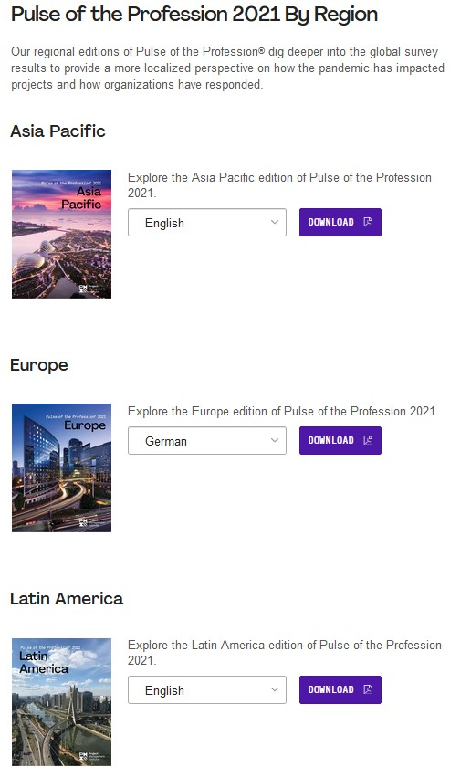
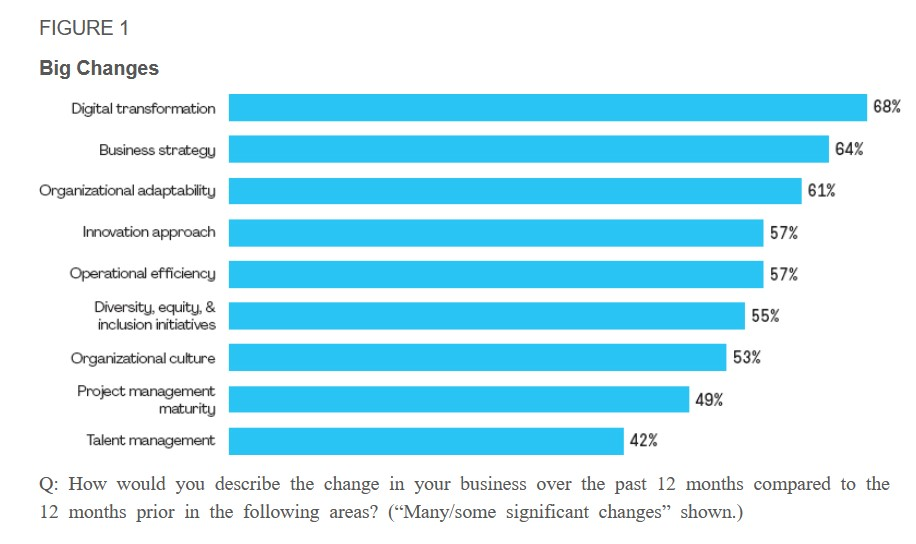
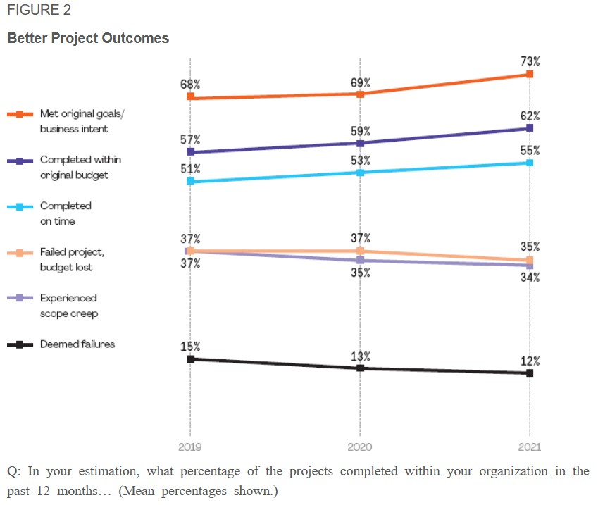

Die Global Project Management Survey dienen dazu, von Firmen bereits durchgeführte Projekte im Nachgang zu untersuchen, um realistische Aussagen über den Ablauf, die Art, den
Erfolg/Misserfolg und alle weiteren wichtigen Faktoren innerhalb der weltweit in Unternehmen durchgeführten Projektmanagements zu erhalten und darauf aufbauend für die Zukunft 
neue Trends zu identifizieren beziehungsweise neuen Entwicklungsbedarf zu sichten/abzuleiten.

# Historische Entwicklung und aktueller Stand zu den Global Project Management Surveys

Von der Deutschen Gesellschaft für Projektmanagement e.V. (GPM) wurde erst und auch einmalig eine solche Studie im Jahr 2010 durchgeführt[^1].
Da es sich hier um einen veraltetet und nicht jährlich aktualisierten Report handelt, wird dieser im weiterem nicht betrachtet und analysiert. Jedoch lässt sich der Report in
Hinblick auf die Entwicklung des Projektmanagements innerhalb der letzten 10 Jahre als Vergleich zu aktuellen Reports heranziehen.

Aktuelle Entwicklungen werden vom Project Management Institute (PMI) in einem jährlich veröffentlichten Report, beginnend im Jahr 2006, erfasst[^2].
Dieser Report trägt den Namen "Pulse of Profession" und wird durch die Zusammenarbeit und Befragung weltweit agierender Unternehmen und deren mit dem Projektmanagement betrauten
Mitarbeitern erstellt. Durch die Vielzahl an Daten und den jährlichen Befragungsturnus kann der "Pulse of Profession" als eine der wichtigsten Studien in Bezug
auf Projektmanagement weltweit angesehen werden, der den aktuellen Stand innerhalb der Unternehmen abbilden kann.

Die Herausgeber der Studie, das Project Management Institute wird "als die weltweit führende Autorität im Projektmanagement"[^3][^4][^5] angesehen, wodurch die Daten, 
deren Erhebung, Verarbeitung und Veröffentlicung als valide angesehen werden kann. 

# Eckdaten der Pulse of the Profession Reports von PMI:

*	Erstmals 2006 durchgeführt
*	Erste weltweite Untersuchung von Projektmanagement innerhalb von Unternehmen
*	Hauptreport erscheint einmal jährlich, kleinere (auch zwischen-)Reports teilweise mehrmals innerhalb eines Jahres 
*	Zeigt aktuelle und zukünftige Entwicklungen im Bereich des Projektmanagements unter Einbezug von Marktforschungen die Einblicke in das Arbeitsleben von Projekt-, Programm und 
  Portfoliomanagers gewähren
*	Für den Report wird eine große Anzahl an unterschiedlichen Branchen und Regionen befragt
*	Der Report ist auf der Internetseite des PMI kostenlos zur Verfügung gestellt
*	Die Befragung wird jährlich, je nach aktueller Situation, variiert. Bei der Befragung 2020/2021 wurde vor allem der weltweiten Coronapandemie im Zusammenhang mit tradionellen 
  und agilen Projektmanagement-Methoden und die daraus resultierenden Folgen, große Aufmerksamkeit geschenkt
*	Der Report stellt zusätzlich gefilterte Daten für verschiedene Regionen zur Verfügung. Der 
  Hauptreport und die Regionalen Reports sind zusätzlich in mehreren Sprachen verfügbar:
  
.

*	Seit 2021 lassen sich die Daten der Reports nach eigens gewählten weiteren Kriterien filtern:

.

Die Daten lassen sich unter folgendem Link beliebig filtern:
[Datenbank Survey 2021](https://public.tableau.com/app/profile/pmi2161/viz/PulseoftheProfession/PulseoftheProfession)

# Kernaussagen und Erkenntnisse aus dem Report 2021 [^6]

Innerhalb des Reports von 2021 wurde vor allem die Corona Situation im Zusammenhang mit der weltweit in Unternehmen durchgeführten Projekttätigkeit Beachtung geschenkt.
Dabei wurde vor allem hinsichtlich der in den Unternehmen genutzten Projektmanagement Methoden gefiltert und daraus Erkenntnisse abgeleitet.
Im ersten Schritt wurden dabei die größten Veränderungen innerhalb des Unternehmens innerhalb der letzten 12 Monate im Vergleich zu den vorausgegangenen 12 Monaten, also vor der 
Corona-Pandemie, abgefragt: 

.

Nachfolgend wurde abgefragt wie der Projekterfolg, im Vergleich zu den Vorangegangenen Jahren, eingestuft wird:

Des weiteren wurde eine Aufteilung der Unternehmen in "Gymnastic Enterprises" und "Tradional Enterprises" durchgeführt.
Die Unternehmen, die bei der Anwendung von Projektmanagement eine "agile" Ausrichtung aufwiesen, wurden als "Gymnastic Enterprises" bezeichnet. Unternehmen,
die eher auf traditionelle bzw. bereits angewendete/bewährte Methoden setzten, wurden als "traditional enterprises" eingestuft. 
Charakteristisch für die „Gymnastic Enterprises“ ist die vielfältige Anwendung unterschiedlicher Projektmanagement Methoden, wohingegen „traditionel enterprises“ Unternehmen 
darstellen, die sich auf bewährte bereits verwendete Methoden konzentriert haben. Zusätzlich konzentrieren sich die "Gynmastic Enterprises" verstärkt auf das Ergebnis als
auf die Prozesse und fokussieren sich auf Ihre Mitarbeitenden und deren individuellen Leistungen/Fähigkeiten. Die  traditionellen Unternehmen erlangten insgesamt eher 
negativere Ergebnissen innerhalb der Projektarbeit. 

Bei der Befragung wurden 1/3 der Unternehmen als „Gymnastic Enterprises“ eingestuft, und 30 % als „Traditional Enterprises“, die restlichen konnten nicht eindeutig zuge-
ordnet werden:

3. Die "Gymnastic Enterprises" nutzten bei der Umsetzung der Projekte vermehrt aktuelle technolgische Trends und Möglichkeiten:

# Weiterführende Literatur

* Weiterfuehrende Literatur zum Thema z.B. Bücher, Webseiten, Blogs, Videos, Wissenschaftliche Literatur, ...

# Quellen

[^1]: [Deutsche Gesellschaft für Projektmanagement e.V.](https://www.gpm-ipma.de/know_how/studienergebnisse/global_project_management_survey.html)
[^2]: [Project Management Institute (2021)](https://www.pmi.org/learning/thought-leadership/pulse)
[^3]: [Businesswire (2021)](https://www.businesswire.com/news/home/20210324005874/de/)
[^4]: [Onvista (2021)](https://www.onvista.de/news/der-bericht-pulse-of-the-profession-von-2021-des-pmi-enthuellt-die-vorteile-der-organisatorischen-flexibilitaet-in-zeitengrosser-veraenderungen-444246997)
[^5]: [Boerse.de (2018)](https://www.boerse.de/nachrichten/PMI-2018-Pulse-of-the-Profession-Detailbericht/7955140)
[^6]: [Project Management Institute (2021). Beyond Agility: Flex to the Future. Pulse of the Profession®](https://www.pmi.org/learning/library/beyond-agility-gymnastic-enterprises-12973)
