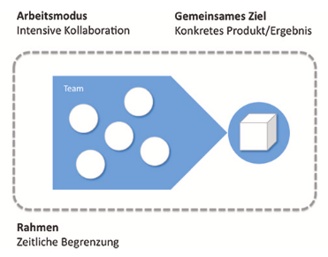
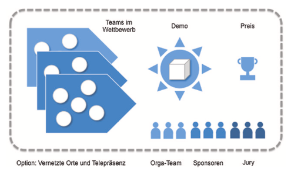
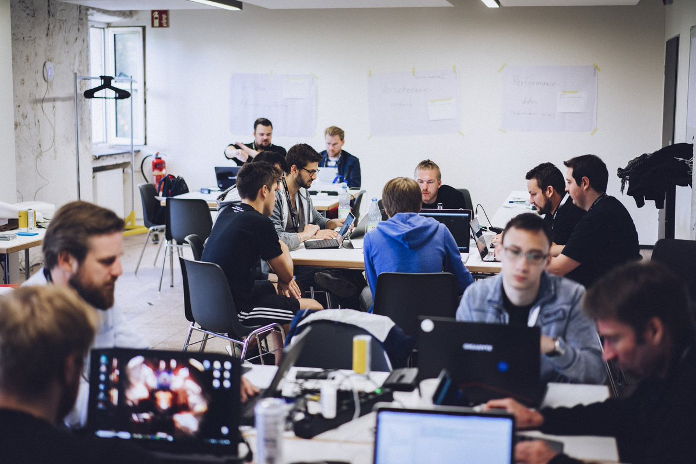

Als Hackathon wird eine kollaborative Veranstaltung bezeichnet, bei welcher die Teilnehmer in kleinen Gruppen zielorientiert eine Lösung zu einer zuvor definierten Problemstellung erarbeiten.[^]

Bei dem Begriff handelt es sich um eine Zusammensetzung aus den Wörtern „Hacken“ und „Marathon“. Unter „Hacken“ wird hier das (Software basierende) Entwickeln und Programmieren von Lösungen verstanden. „Marathon“ bezieht sich auf die zeitliche Komponente des Events.[^]

Oftmals werden auch andere Bezeichnungen verwendet, wie z.B. Hack Fest, Hack Days oder Code Days. Hinter allen steckt jedoch ein und dieselbe grundlegende Idee, was einen Hackathon im Kern charakterisiert und als Veranstaltungsformat über Jahre hinweg in allen erdenklichen Themenfeldern so beliebt gemacht hat.[^]

# Grundlegende Idee und Ziel

Die grundlegende Idee liegt in der eventspezifischen Herangehensweise an die gestellte Problemsituation. Diese erfolgt auf eine intuitive, kreative und experimentierfreudige Art und Weise. Das Ziel soll nicht eine in allen Belangen absolut perfekte Lösung sein, sondern ein Prototyp, der erste problemlösende Funktionalitäten enthält.[^] 

Der innovative Kern des Hackathons lässt sich anhand von drei wesentlichen Merkmalen charakterisieren:

* __Arbeitsmodus:__ die Zusammenarbeit ist sehr intensiv und erfolgt kollaborativ
* __Gemeinsames Ziel:__ ein klares, problemlösendes Produkt
* __Rahmen:__ gibt dem Event eine Dauer und eine feste Deadline

*Abbildung 1: Minimalstruktur eines Hackathons* [^]

Der erfolgsversprechende Kern wird aber noch zusätzlich von weiteren Elementen verstärkt, die zum einen im Zuge der Entwicklung des Formats hinzugekommen sind, und zum anderen den Anreiz des Hackens steigern. Dazu gehört die Kreation einer Wettbewerbssituation durch ein Organisationsteam, Präsentation der Ergebnisse vor einer Jury, als auch vielversprechende Preise.[^]

*Abbildung 2: Charackteristische Elemente eines Hackathons mit mehreren Teams*[^]

# Ablauf

Der Ablauf eines Hackathons variiert je nach Thema, Dauer oder Teilnehmergröße. Dennoch weisen sie alle eine gemeinsame Grundstruktur auf.

__1. Vorstellung und Vorträge__

__2. Teambuilding__

__3. Let's Hack__

__4. Pitchen__

# Aspekt 1

Aspekte zu Themen können ganz unterschiedlich sein:

* Verschiedene Teile eines Themas 
* Historische Entwicklung
* Kritik 

*lustiges Testbild*

# Aspekt 2

* das
* hier 
* ist
* eine 
* Punkteliste
  - mit unterpunkt

## Hier eine Ebene-2-Überschrift unter Aspekt 2

So kann man eine Tabelle erstellen:

| First Header  | Second Header |
| ------------- | ------------- |
| Content Cell  | Content Cell  |
| Content Cell  | Content Cell  |

## Hier gleich noch eine Ebene-2-Überschrift :-)

Wenn man hier noch ein bisschen untergliedern will kann man noch eine Ebene einfügen.

### Ebene-3-Überschrift

Vorsicht: nicht zu tief verschachteln. Faustregel: Wenn man mehr als 3 
Ebenen benötigt, dann passt meist was mit dem Aufbau nicht.

# Aspekt n

1. das
2. hier 
4. ist 
4. eine
7. nummerierte liste
   1. und hier eine Ebene tiefer

# Siehe auch

* Verlinkungen zu angrenzenden Themen
* [Link auf diese Seite](Hackathon.md)

# Weiterführende Literatur

* Weiterfuehrende Literatur zum Thema z.B. Bücher, Webseiten, Blogs, Videos, Wissenschaftliche Literatur, ...

# Quellen

[^1]: https://de.wikipedia.org/wiki/Hackathon
[^2]: https://www.ionos.de/digitalguide/websites/web-entwicklung/was-ist-ein-hackathon/
[^3]: https://www.elektrotechnik.vogel.de/was-ist-ein-hackathon-definition-ablauf-vor-und-nachteile-a-841459/
[^4]: https://digitaleneuordnung.de/blog/hackathon/
[^5]: https://www.dev-insider.de/was-ist-ein-hackathon-a-810665/
[^6]: https://www.vgsd.de/hackathon-ideen-fuer-die-zukunft-der-wirtschaft-in-rheinland-pfalz-gesucht/
[^7]: [Kollaborative Innovationsprozesse - Hackathons in Theorie und Praxis](https://link.springer.com/chapter/10.1007/978-3-658-16223-8_6) (S. ,S. )
[^8]: [Grundlagen zu Hackathons](https://link.springer.com/book/10.1007/978-3-658-26028-6)

