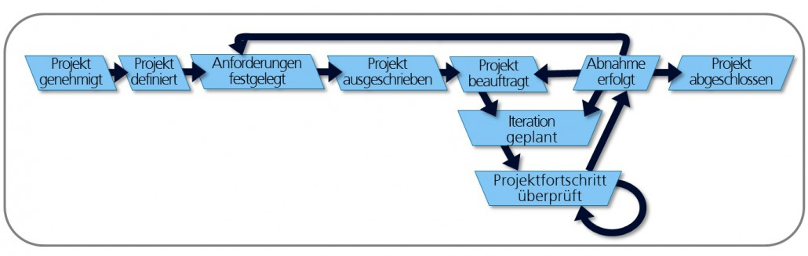

# IT-Projekte
Unter IT-Projekte versteht man die Entwicklung von Informations- und Kommunikationssystemen. Die Hauptaufgabe dabei ist die Entwicklung bzw. Anpassung von Software[^1].

## Klassische Methoden 
Im Bereich der Softwareentwicklung sind die klassischen Vorgehensmethoden „Hermes“, „PRINCE2“ und „V-Model XT geeignet[^2].
### HERMES
Bei Hermes wird nach den Prinzipien des Wasserfallmodells gearbeitet, siehe folgende Abbildung:[^3].  

Die Vorgabe von Projektergebnissen und Strukturierung spielen eine wichtige Rolle, was dazu führt, dass die erforderlichen Projekttätigkeiten und Verantwortlichkeiten abgeleitet werden. Die Ergebnisse sind eindeutig definiert, wodurch der Anfang- und Endpunkt der Phasen vordefiniert sind und somit eine präzise Vorgehensweise gewährleistet wird. Hermes ist gekennzeichnet durch eine lineare Abfolge der Aktivitäten, was den Einsatz dieser Methode in IT-Projekten ermöglicht. Hermes wird hauptsächlich in der Schweiz angewendet[^4].

### PRINCE2
"PRINCE2" (Projects in Controlled Environments) steht für Projekte unter Kontrolle, das heißt, dass das Vorgehen vom Start bis zum Ende eines Projektes vordefiniert ist. Wie etwas hergestellt wird, ist nicht definiert, sondern von wem und wann etwas erzeugt werden soll. Durch diese Trennung zwischen der Herstellung von Produkten und dem Management von Projekten unterscheidet sich Prince2 von anderen Methoden und eignet sich zugleich sehr gut für das Zusammenspiel mit Methoden, die sich um die Produktherstellung kümmern. Prince2 zählt zu den meistgenutzten Methoden weltweit[^5] 
#### Die Elemente von Prince2
| 7 Grundprinzipien                                   | 7 Themen             | 7 Prozesse                         | 
| --------------------------------------------------- | -------------------  |----------------------------------  |
|Prinzip 1: Fortlaufende geschäftliche Rechtfertigung |Thema 1: Business Case|Prozess 1: Vorbereiten eines Projekt| 
|Prinzip 2: Lernen aus Erfahrungen                    |Thema 2: Organisation |Prozess 2: Lenken eines Projekts    |  |Prinzip 3: Definierte Rollen und Verantwortlichkeiten|Thema 3: Qualität     |Prozess 3: Initiieren eines Projekts|
|Prinzip 4: Steuern über Managementphasen             |Thema 4: Pläne        |Prozess 4: Steuern einer Phase      |  |Prinzip 5: Managen nach dem Ausnahmeprinzip          |Thema 5: Risiken   |Prozess 5: Managen der Produktlieferung|
|Prinzip 6: Fokus auf Produkte                        |Thema 6: Änderungen|Prozess 6: Managen des Phasenübergangs |  |Prinzip 7: Anpassen an die Projektsituation          |Thema 7: Fortschritt|Prozess 7: Abschließen eines Projekts | 
[^5]

### V-Modell XT
Eine in Deutschland stark genutzte Variante ist das V-Modell XT, das erstmals im Jahr 1992 von der Bundeswehr veröffentlicht wurde. Sie ist ein Vorgehensmodell für die Durchführung von IT-Projekten, insbesondere zur Entwicklung von Softwaresystemen. Ergebnisse und Abläufe sind bei dieser Methode vorgegeben, wodurch möglichst viel Zeit gespart werden kann. Dies ist anhand der folgenden Darstellung ersichtlich[^6].: Die wichtigste Aufgabe des V-Modell XT ist Regelung der Kommunikation zwischen dem Auftraggeber und den Auftragnehmern, um typische Quellen für Missverständnisse zwischen den Beteiligten auszuschließen. Der Zusatz "XT" steht dabei für "eXtreme Tailoring" und unterstreicht die flexible Anpassbarkeit an spezifische Projektumfelder. Die aktuelle Version 2.3 gewährleistet eine verbesserte Anwendbarkeit durch das Neugestalten der Produktabhängigkeiten. Somit ist eine Qualitätssicherung möglich[^7].

## Gescheiterte IT-Projekte
### 7030-Projekt von IBM
Die International Business Machine Corporation (IBM) begann 1956 die Entwicklung des 7030 Rechners, welches zu der Zeit zwar der schnellste Rechner war, aber die versprochene Leistung wurde nicht gewährleistet. Der Rechner war nur 30-mal so schnell wie das vorherige System, statt die Versprochene 100-fache Leistung[^8].
### Barcode-Scanner mit Lesefehler
Im für Südenglang zuständigen Auslieferungszentrum Waltham Point in Essex wurde im Jahr 2003 ein System eingesetzt, welches Barcodes scannen und Auslieferungen beschleunigen sollte. Das Barcode-System war fehlerhaft, was zu Schäden im Millionenbereich führte und somit das Projekt 4 Jahre später beendet wurde[^9].
### Das Größte Lidl IT-Projekt
Der Lebensmittel-Discounters Lidl wollte ein neues Warenwirtschaftssystem, das von SAP entwickelt wurde, anwenden. Dieses sollte das selbst programmierte und jahrzehntealte System Wawi ablösen. Eine Reduzierung des Aufwands für die Stammdatenpflege und die Möglichkeit für Prognosen in Echtzeit waren die Ziele, die das System schaffen sollte. Das Elektronisches Lidl-Warenwirtschaftsinformationssystem (Elwis) wurde nach sieben Jahren Entwicklungszeit im Jahr 2018 gestoppt. Die Ziele waren mit dem gegeben Aufwand nicht realisierbar[^10].

# Angrenzende Themen
[Microsoft_Project_PM_Tool](https://github.com/AbderrahmaneBennani/ManagingProjectsSuccessfully.github.io/blob/main/kb/Microsoft_Project_PM_Tool.md)

[Java Projektmanagement Tools](https://github.com/ManagingProjectsSuccessfully/ManagingProjectsSuccessfully.github.io/blob/main/kb/Java_PM_Tool.md)

# Quellen

[^1]: [Projektart: IT-Projekte](https://www.guteprojekte.ch/projektarten/it-projekte)
[^2]: [Vorgehensmethoden](https://www.guteprojekte.ch/methoden/hermes)
[^3]: [Wasserfallmethode](https://de.wikipedia.org/wiki/Wasserfallmodell)
[^4]: [Methode Hermes9](https://www.kpm.unibe.ch/weiterbildung/weiterbildung/cas_arbeiten_frueher_zertifikatsarbeiten/e237093/e237217/Bachmann_CeMaP_ger.pdf)
[^5]: [Methode Prince2](https://www.microtool.de/wissen-online/wie-funktioniert-prince2/)
[^6]: [: V-Modell-XT Durchführungsstrategie](https://www.microtool.de/wissen-online/wie-funktioniert-das-v-modell-xt/)
[^7]: [Methode V-Modell XT](https://www.cio.bund.de/Web/DE/Architekturen-und-Standards/V-Modell-XT/vmodell_xt_node.html)
[^8]: [Gescheitertes IBM-Projekt](https://www.cio.de/a/elf-it-projekte-im-sturzflug,859906)
[^9]: [Barcode-Scanner mit Lesefehler](https://www.cio.de/a/elf-it-projekte-im-sturzflug,859906,3)
[^10]: [Elwis Lidl Projekt](https://www.com-magazin.de/praxis/business-it/erfolgreiche-it-projekte-in-stuermischen-zeiten-2656021.html)

