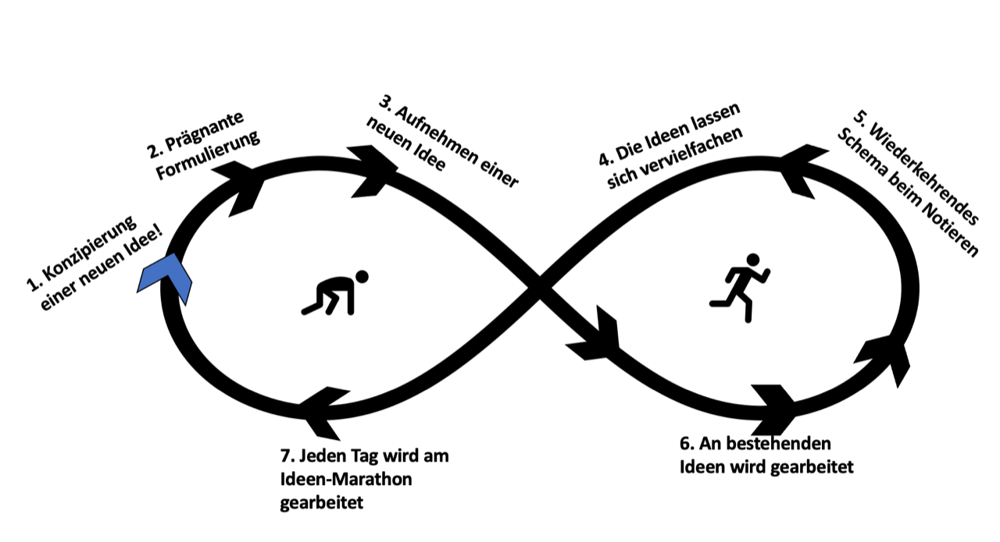

Um um ein erstes Verständnis zu schaffen, folgt zunächst eine Kurzbeschreibung des Ideen-Marathon.
Der Ideen-Marathon wurde in den 1980er Jahren von Takeo Higuchi entwickelt. Dabei handelt es sich um eine Kreativitätstechnik zur Ideenfindung für Einzelpersonen. 
Mit Hilfe des Ideen-Marathon soll ein umfangreicher Ideen-Pool geschaffen werden[^1].

# Der Ideen-Marathon im klassischen Projektmanagement

Kreativität gilt interdisziplinär als Diktum und ist als Persönlichkeitseigenschaft und Fähigkeit im ökonomischen Kontext unerlässlich. Kreative Talente produzieren „neue, 
originelle und sinnvolle“ Ideen und können durch ihre hohe kognitive Flexibilität besser auf tägliche Herausforderungen reagieren als ihre weniger kreativen Kollegen[^2][^3]. 

Dank dieser Eigenschaften wird Kreativität auch im fluiden Umfeld des [Projektmanagements](Projektmanagement.md) gefordert - so müssen gerade zu Beginn eines Projekts einige 
Unsicherheiten beseitigt 
werden. Beispielsweise gilt es vorab zu klären, welche Stakeholder ins Projekt miteinbezogen werden müssen. Welche Chancen und Risiken das Projekt bürgen könnte, sollte 
ebenfalls vor Projektbeginn geklärt werden[^4]. Für diese Herausforderungen und für noch viele Weitere ist Kreativität gefragt. 

Kreativität – oder vielmehr kreatives denken – kann gezielt stimuliert werden. Im folgenden Artikel wird die Kreativitätstechnik „Ideen-Marathon“ vorgestellt werden. Zunächst 
wird das Grundprinzip des Ideen-Marathons beschrieben, danach werden die Grundregeln der Kreativitätstechnik dargestellt. 

## Hintergründe zum Ideen-Marathon

Wie bereits in der Kurzbeschreibung erwähnt, wurde der Ideen-Marathon in den 1980er Jahren von Takeo Higuchi entwickelt. Ziel der Kreativitätstechnik ist die Ideenfindung für 
Einzelpersonen. 
Der mit Hilfe des Ideen-Marathons erschaffene Ideen-Pool führt laut Higuchi dazu, eine große Anzahl an einzigartigen Lösungen zu finden und eine Vielzahl an Problemen zu 
lösen[^1].

## Grundprinzip des Ideen-Marathons

Zu Beginn des Artikels soll das Grundprinzip eines Ideen-Marathons kurz erläutert werde.
Um einen Ideen-Marthon durchzuführen wird über einen bestimmten Zeitraum ein sogenanntes „Ideentagebuch“ geführt. Unter der Berücksichtigung von sieben Grundregeln wird jeden 
Tag mindestens eine Idee konzipiert und in besagtes Tagebuch geschrieben[^5].

## Regeln des Ideen-Marathons

Nun werden die sieben Grundregeln des Ideen-Marathon näher erläutert. 
Die erste Regel lautet, dass jeden Tag mindestens eine neue Idee konzipiert werden muss. 
Als zweite Regel folgt, dass jede Idee möglichst prägnant formuliert und verfasst werden sollte. 
An dieser Stelle kann das bereits beschriebene Notizbuch genutzt werden.

Die dritte Regel besagt, dass die Möglichkeit bestehen muss, dass zu jedem Zeitpunkt eine neue Idee in das Notizbuch geschrieben werden kann. 
Die darauffolgende vierte Regel gibt an, dass sich die Ideen vervielfachen lassen, indem man mit Freunden, Kollegen oder Familie über die Ideen spricht.  

An fünfter Stelle steht, dass beim Notieren einer Idee besten Falls das gleiche wiederkehrende Schema angewandt werden sollte. Dies kann sich beispielsweise auf ein 
fortlaufendes Datum, die Kategorie der Idee, die Beschreibung der Idee sowie den Ideenstatus beziehen. 

Die sechste Regel lautet, dass mit der Idee gearbeitet werden soll. Das bedeutet, dass an bestehende Ideen, Notizen sowie Erläuterungen und Skizzierungen angefügt werden sollen. 
Die siebte und letzte Regel besagt, dass jeden Tag am persönlichen Ideen-Marathon weitergearbeitet werden muss[^6].

## Effektivität des Ideen-Marathons

Die Effektivität des Ideen-Marathons lässt sich an den Erfolgen von Takeo Higuchi beweisen. So entwickelte der Japaner seit 1984 über 300.000 Ideen und füllte damit 400 
Notizbücher.
Takeo Higuchi beabsichtigt die Kreativitätstechnik auch in Zukunft weiterhin nutzen, er würde damit bis 2035, 1.000.000 Ideen entwickeln[^5].

# Visualisierung des Ideen-Marathons

 [^7]

*Selbsterstellte Grafik zur Visualierung des Prozesses*

# Siehe auch

*[Projektmanagement](Projektmanagement.md)
*[Projektmanagementsoftware](Projektmanagementsoftware.md)
*[Hackathon](Hackathon.md)
*[Provokationstechnik](Provokationstechnik.md)

# Weiterführende Literatur

* Weiterfuehrende Literatur zum Thema z.B. Bücher, Webseiten, Blogs, Videos, Wissenschaftliche Literatur, ...

# Quellen

[^1]: [Ideen-Marathon - jeden Tag eine gute Idee](https://www.creaffective.de/2010/12/ideen-marathon-jeden-tag-eine-gute-idee/)
[^2]: [The Birth of a Movement: Joy Paul Guilford and Creativity Research in American Psychology, 1950-70](https://www.academia.edu/5227271/The_Birth_of_a_Movement_Joy_Paul_Guilford_and_Creativity_Research_in_American_Psychology_1950_70)
[^3]: [„Creativity“, Annual Review of Psychology, 55(1)](http://people.wku.edu/richard.miller/creativity.pdf)
[^4]: [Warum Kreativität so wichtig für den Projekterfolg ist](https://projekte-leicht-gemacht.de/blog/softskills/kreativitaet/kreativitaet-projektmanagement/)
[^5]: [Ideen-Marathon](https://www.deinlexikon.de/wiki/Ideen-Marathon)
[^6]: [Ideen_Marathon](https://de.wikipedia.org/wiki/Ideen-Marathon)
[^7]: [Bild](https://de.wikipedia.org/wiki/Ideen-Marathon)

