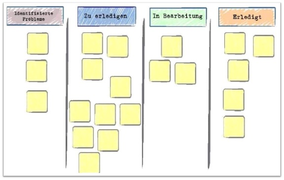
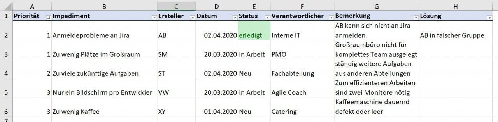

**Impediments** (engl.: *„Behinderungen“*) beschreiben Hindernisse und Störungen aller Art, die während eines [Scrum](SCRUM.md) - Projekts auftreten. Sie schränken die Mitglieder eines Projektteams bei der Erfüllung ihrer Aufgaben (zum Beispiel der Erreichung eines [Sprint](Sprint.md) - Ziels) ein. [^1]

Das **Impediment Backlog** wird zumeist zur Visualisierung und Priorisierung von Impediments verwendet. Darin werden bestehende Hindernisse mit dem Ziel zusammengefasst, sie so schnell wie möglich zu überwinden. [^1][^2]

# Beispiele für Impediments

Impediments sind (mehr oder weniger deutlich erkennbar) in nahezu jedem Scrum - Projekt vorhanden,
wie zum Beispiel:
* Zu hohe Temperaturen im Büro
* Zu wenig Arbeitsplätze für das komplette Team
* Störungen in der Zusammenarbeit oder Kommunikation
* Ablenkung durch andere Aufgaben außerhalb des Projekts
* Druck von außen durch Management 
* Persönliche Konflikte zwischen Teammitgliedern
* Mangel an Wissen, Fähigkeiten, Ressourcen[^2]

# Darstellung im Impediment Backlog

Der Impediment Backlog stellt das Verzeichnis dar, in dem bestehende Einschränkungen aufgelistet und priorisiert werden. Es gibt keine vorgeschriebene Form für den Aufbau des Backlogs. Wichtig ist lediglich, dass alle Hindernisse erfasst werden (egal wie groß oder wie wichtig), denn alle Hindernisse können Einfluss auf die Zielerreichung nehmen. Ansonsten lässt sich die Liste jedoch frei nach den Vorstellungen des Projektteams aufbauen.[^2]

Neben einer kurzen Beschreibung des Impediments sollten im Backlog noch folgende Daten enthalten sein: 

* Betroffene Personen
* Bisherige Dauer der Störung
* Mögliche Kontaktpersonen (zur Lösungsfindung)[^3]

Impediment Backlogs können in unterschiedlichsten Darstellungen geführt werden, beispielsweise als Excel-Tabellen, als Einträge in [Projektmanagement - Tools](Uebersicht_PM_Tools.md) oder als Post-Its an einem Whiteboard. [^1][^4]

                                                    
*Abbildung 1: Impediment Backlog in Form eines [Kanban - Boards](Kanban_Boards.md)*  [^3]

*Abbildung 2: Impediment Backlog in Form einer Excel - Tabelle*  [^5]

# Verantwortlichkeit für Impediments im Scrum-Prozess

Gemäß dem [Scrum Guide](Scrum_Guide.md) 2020 liegt die schnellstmögliche Beseitigung von Impediments in der Verantwortung des [Scrum Masters](Scrum_Master.md). 
Somit ist er auch für die Dokumentation der Hindernisse im Impediment Backlog zuständig. Wie genau er bei der Erfüllung dieser Aufgabe vorzugehen hat, ist jedoch nicht festgelegt.  [^1][^5]

Das reine Ermitteln der Störungen selbst ist dagegen nicht nur die Aufgabe des Scrum Masters, sondern die des gesamten Projektteams. [^5]

# Idealtypischer Ablauf für den Umgang mit Impediments

**1. Aufnehmen:** In den meisten Fällen stößt man während der [Daily Scrums](Daily_Scrum.md) auf Impediments. Diese können dann direkt im Backlog dokumentiert und im Nachgang besprochen werden.[^6]
Der Hinweis auf ein Impediment kann einerseits durch die Projektmitglieder erfolgen, oder der Scrum Master selbst erkennt weniger offenkundige Probleme und bringt sie zur Sprache.[^2]

**2. Priorisieren:** Hat der Scrum Master ausreichend Informationen über jedes Impediment gesammelt, so kann er eine Priorisierung der Hindernisse nach deren Relevanz vornehmen.[^5][^6]

**3. Veröffentlichen:** Für das Bewusstsein über die Hindernisse und den Informationsfluss ist es wichtig, dass das Impediment Backlog dem kompletten Team und dem [Product Owner](Product_Owner.md), wenn nicht sogar allen Stakeholdern zur Verfügung steht.[^3][^6]

**4. Handeln:** Im Anschluss geht der Scrum Master der Lösung der Probleme nach priorisierter Reihenfolge nach. 
Scrum Master müssen jedoch nicht alle Hindernisse im Alleingang beseitigen, sondern in Zusammenarbeit mit dem Team feststellen, welche Hindernisse es selbstständig überwinden kann und wie es dabei unterstützt werden kann.[^5][^6]

**5. Informieren:** Ist das Problem gelöst, bringt der Scrum – Master das Impediment Backlog auf den neusten Stand und unterrichtet alle Projektbeteiligten darüber. [^6]

# Fazit

Oft wird das Impediments Backlog unterschätzt, dabei gehört es als zentrales Instrument zur Veranschaulichung des Problemlösungsfortschritts eigentlich in jedes Scrum – Projekt. In nahezu jedem Projekt gibt es Hindernisse, aber nicht immer werden diese wirklich überwunden. Erst durch das Impediment Backlog finden sie die angemessene Beachtung und können effizient gelöst werden.

# Siehe auch

* [SCRUM](SCRUM.md)
* [Sprint](Sprint.md)
* [Scrum Master](Scrum_Master.md)
* [Scrum Guide](Scrum_Guide.md)
* [Daily Scrum](Daily_Scrum.md)
* [Product Owner](Product_Owner.md)
* [Projektmanagement Tools](Uebersicht_PM_Tools.md)
* [Kanban Boards](Kanban_Boards.md)

# Weiterführende Literatur

* [The Impediment List and What We Can Do About It](https://www.youtube.com/watch?v=R2LhL6RkUh)
* [Schwaber K. & Sutherland,J. (2020). Der Scrum Guide. Der gültige Leitfaden für Scrum: Die Spielregeln](https://www.itsmgroup.com/fileadmin/user_upload/pdfs/2020-Scrum-Guide-German.pdf)

# Quellen

[^1]: [Impediment](https://www.onlinesolutionsgroup.de/blog/glossar/i/impediment/)
[^2]: [Scrum Impediments kurz und knapp erklärt](https://alphanodes.com/de/scrum-impediments-kurz-knapp-erklaert)
[^3]: [Impediment Backlog - Entwicklung ohne Hindernisse](https://blog.ordix.de/impediment-backlog)
[^4]: [Das Impediment Backlog in Scrum – Hindernisse erkennen und beseitigen](http://agiles-projektmanagement.org/scrum-impediment-backlog/)
[^5]: [Was ist ein Impediment?](https://t2informatik.de/wissen-kompakt/impediment/)
[^6]: [Scrum Basics: Impediments Backlog ](http://unternehmen-organisieren.de/2019/01/31/scrum-basics-impediments-backlog/)
