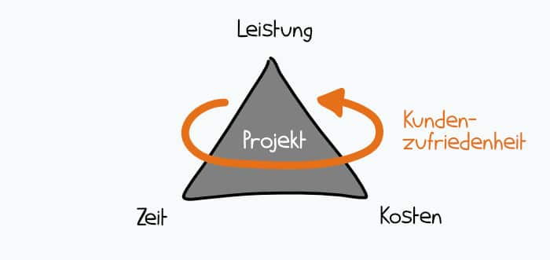

Innovationsprojekte verknüpfen Innovationen mit Projekten, wobei Lösungen verschiedenster Arten erarbeitet werden. Hinsichtlich der unterschiedlichen Formen und Eigenschaften solcher Projekte, braucht es eine detaillierte Aufteilung in einzelne Phasen sowie angepasste Management-Methoden, um das Innovationsprojekt erfolgreich zu realisieren.

# 1.	Innovation und Projekte

Innovation wird oft primär mit Produktneuerungen in Verbindung gebracht, was allerdings eine verbreitete Fehlansicht ist.[^1] Der Begriff der Innovation umfasst nicht nur Produkte, sondern beispielsweise auch neue Prozesse oder Dienstleistungen sowie deren erfolgreiche Kommerzialisierung am Markt.[^2]

Umgesetzt werden solche Innovationen in einem Unternehmen häufig im Rahmen eines [Projekts](Projekt.md), welches neu sein muss, innerhalb eines vorgegebenen zeitlichen Rahmens (siehe [Zeitplanung](Zeitplanung.md)) durchgeführt werden und eine eindeutig definierte Absicht verfolgen muss. Insbesondere die [Projektsteuerung](Projektsteuerung.md) bei Innovationsprojekten stellt eine Herausforderung dar. Da sich in der Regel in Bezug auf Zeit, Qualität und Kosten verschiedene Zielsetzungen herauskristallisieren, kann dies folglich zu [Zielkonflikten](Zielkonflikte.md) führen.[^3]

*[Magisches Dreieck](Magisches_Dreieck.md)*

# 2.	Innovationsprojekte
## 2.1	Eigenschaften

Innovationsprojekte erfüllen für gewöhnlich vier grundlegende Eigenschaften:
1. Die erste und wichtigste Eigenschaft ist dabei der *Neuheitsgrad*. Das Ergebnis des Projekts bringt einen bisher unbekannten Nutzen mit sich.[^3]
2. Dadurch entsteht auch immer ein bestimmtes Maß an *Unsicherheit*. Bei Projekten, die stärker von Routineaufgaben des Unternehmens abweichen, entsteht unweigerlich eine finanzielle sowie operative Unsicherheit.[^3]
3. Das dritte Charakteristikum ist die *Komplexität*, die eng mit der Unsicherheit und der Neuheit verknüpft ist. Aufgrund der unsicheren Abläufe wegen des hohen Grades an Neuheit kommt es zu einem höheren und somit weitaus komplexeren Organisationsumfang.[^3]
4. Die letzte Eigenschaft bildet das *Konfliktpotential*, welches auf verschiedenen Ebenen auftreten kann. Es kann sowohl zu Konflikten innerhalb des Projektteams (siehe [Konfliktmanagement](Konfliktmanagement.md)) als auch zu Zielkonflikten bezüglich vorher festgelegter Zielvorgaben kommen.[^3]

## 2.2	Arten

Je nach Neuheitsgrad des Marktes und der Technologie lassen sich vier verschiedene Formen von Innovationsprojekten unterscheiden:[^4]

|         | Bestehende Technologie| Neue Technologie|
| -------------: | :-------------: | :-------------: |
|**Bestehender Markt**|[Inkrementelles](Increment.md) Innovationsprojekt|Disruptives Innovationsprojekt|
|**Neuer Markt**|Architektonisches Innovationsprojekt|Radikales Innovationsprojekt|

## 2.3	Projektträger

Durchgeführt werden alle Formen der Innovationsprojekte durch ein bereichsübergreifendes Projektteam, welches sich aus Experten von verschiedenen Standorten zusammensetzt. Dieses Projektteam integriert aber unter anderem auch Kunden oder Lieferanten, die das Innovationsprojekt mit Informationen aus den vor- oder nachgelagerten Wertschöpfungsstufen unterstützen.[^3]

## 2.4	Projektphasen

Ein Innovationsprojekt lässt sich in zwei große Phasen unterteilen, die ebenso Teil des [Innovationsprozesses](https://wirtschaftslexikon.gabler.de/definition/innovationsprozess-41599) sind.[^3]
Die erste Phase ist dabei die Forschung und Entwicklung, durch welche in erster Linie die innovative Idee umgesetzt wird und folglich eine Invention entsteht.[^3]
Diese Invention wird dann in der zweiten Phase, die erfolgreiche Markteinführung, zu einer Innovation.[^3]

## 2.5	Projektmanagement

Bei Innovationsprojekten mit kurzer Dauer kann im Management das sogenannte [Stage-Gate-Tracking](https://de.wikipedia.org/wiki/Stage-Gate-Modell#:~:text=Das%20Stage%2DGate%2DModell%20wurde,lediglich%20eine%20suboptimale%20Ber%C3%BCcksichtigung%20fanden.) angewendet werden. Dabei werden vorweg mehrere [Meilensteine](Meilensteine.md) festgelegt, anhand derer sich später Planabweichungen nachweisen lassen.[^3]
Bei mehrjährigen Projekten hilft es, eine [Meilensteintrendanalyse](Meilensteintrendanalyse.md) zu nutzen. Damit können vorher bereits mögliche spätere Abweichungen abgeschätzt werden und Verzögerungen in gewissem Maße prognostiziert werden.[^3]

## 2.6	Erfolgsfaktoren

Um den [Erfolg eines Innovationsprojekts zu messen](Erfolgsmessung.md), werden die Faktoren Zeit, Qualität und Kosten herangezogen. Dabei werden die Soll-Werte mit den Ist-Werten verglichen und infolgedessen die mittlere negative Abweichung berechnet. Sowohl negative als auch positive Abweichungen können sich negativ auf den Projekterfolg auswirken. Weicht man zu stark von Qualitätsanforderungen, Meilensteinterminen oder geplantem Kostenbudget ab, verursacht das üblicherweise hohe Kosten. Werden die Planwerte eingehalten, so führt das zu einer erfolgreichen Umsetzung eines Innovationsprojekts.[^5]

# Siehe auch

* [Projektmanagement](Projektmanagement.md)
* [Praxisbeispiele für erfolgreiche Projekte](Praxisbeispiele_erfolgreiche_Projekte.md)

# Weiterführende Literatur

* [Project strategy: strategy types and their contents in innovation projects](https://www.emerald.com/insight/content/doi/10.1108/17538370810846414/full/html?skipTracking=true)
* [A complex adaptive perspective on learning within innovation projects](https://www.emerald.com/insight/content/doi/10.1108/09696470310497177/full/html?casa_token=sGYcffGP2QIAAAAA:Y-vCtYQIiCmw0WQ_dl4H_jlzhjgFd4WTset6XZL2SJE84cjCv7_guhodcM4HHH2SJD4YEvr-ecyJzjLYnA21jSMyxinkMcO3R8rYa8020Jb6r3x7vRFl)
* [Risks of Development and Implementation of Innovative Projects](https://www.richtmann.org/journal/index.php/mjss/article/view/7373)

# Quellen

[^1]: [Eric von Hippel: The Sources of Innovation, Oxford, 1988](https://link.springer.com/content/pdf/10.1007/978-3-8349-9320-5_10.pdf)
[^2]: [Jan Eric Borchert: Operatives Innovationsmanagement in Unternehmensnetzwerken: Gestaltung von Instrumenten für Innovationsprojekte, Göttingen, 2006](https://books.google.de/books?hl=de&lr=&id=SBH_DwAAQBAJ&oi=fnd&pg=PR14&dq=innovationsprojekte&ots=ysHBRqOPqJ&sig=hWOvhN2a1oV1_59y_G0V0SzSxcU&redir_esc=y#v=onepage&q=innovationsprojekte&f=false)
[^3]: [ Björn F. Söndgerath: Steuerung von Innovationsprojekten unter Einbeziehung von Erfolgsfaktoren, Magdeburg, 2002](https://opendata.uni-halle.de/bitstream/1981185920/10766/1/bjosoendgerath.pdf)
[^4]: [Ian Chaston: TECHNOLOGICAL ENTREPRENEURSHIP. Technology-Driven vs Market-Driven Innovation, Schweiz, 2017](https://link.springer.com/content/pdf/10.1007%2F978-3-319-45850-2.pdf)
[^5]: [Rainer Erne: Wie wirksam sind Methoden des Projektmanagements für die Produktivität von Innovationsprojekten, Dornbirn, 2008](https://idp-lab.org/wp-content/uploads/IDP-Lab-Rainer-Erne-Wie-wirksam-sind-Methoden-des-Projektmanagements-f%C3%BCr-die-Produktivit%C3%A4t-von-Innovationsprojekten.pdf)

