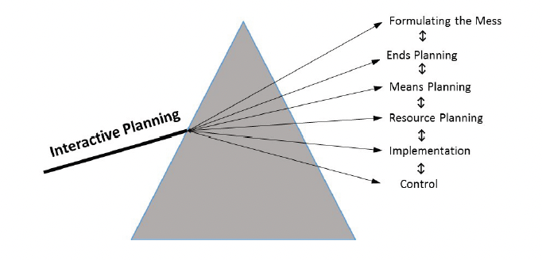

# Einleitung

Interactive Planning ist ein Konzept, das vom Theoretiker Russell L. Ackoff entwickelt wurde[^2]. 
Dahinter steckt die Idee, dass, um ein wünschenswertes Zukunftsbild zu erreichen, man zuerst eine wünschenswerte Gegenwart kreieren muss, um dann Wege und Mittel zu 
finden diese nachzustellen. Zudem lässt dieses Konzept zu, dass die [Stakeholder](Stakeholderanalyse.md) der Organisation im Planungsprozess involviert sind.

Interactive Planning besteht aus zwei Teilen, der Idealisierung und der Realisierung. Diese zwei Teile sind zudem in sechs voneinander abhängigen Teilen unterteilt.

*lustiges Testbild*

# Idealisierung

## Formulierung der Unordnung (Formulating the Mess)

Jedes Unternehmen ist konfrontiert mit interagierenden [Gefahren und Möglichkeiten](SWAT_Analyse.md), einem System von Problemen, das nach Russell L. Ackoff „mess“  
genannt wird.
Diese Phase der Planung hat das Ziel festzulegen, wie die Organisation sich früher oder später selbst schaden könnte, wenn so weiter operiert werden würde, wie es 
zum aktuellen Zeitpunkt der Fall ist.

Diese Phase beinhaltet Folgendes:
* die Vorbereitung einer Systemanalyse (detaillierte Beschreibung wie das System aktuell arbeitet) 
* eine [Hindernisanalyse](Hemmnisanalyse.md) (Identifikation der Eigenschaften der Organisation, welche den Fortschritt der Organisation behindern) 
* Referenzprojektionen (Projektionen der Aspekte auf die Zukunft der Organisation; erstens auf der Annahme, dass keine Veränderungen an aktuellen Plänen, 
Richtlinien oder [Programmen](Programmmanagement.md) stattfinden und zweitens, dass das künftige Umfeld, so 
eintritt wie aktuell erwartet) 
* und einem Referenzszenario (Beschreibung, wie und warum sich die Organisation selber schaden würde, wenn die Annahmen, die gemacht wurden, sich bewahrheiten[^1]. 

## Beendigung der Planung (Ends Planning)

In dieser Phase wird bestimmt, wie die Organisation idealerweise zum aktuellen Zeitpunkt sein würde und wie die groß die Lücken zwischen Ideal und der Organisation, 
welche im Referenzszenario projiziert wurde, sind. 
Der Rest des Planungsprozesses bezieht sich auf das kollektive und interaktive schließen und verringern dieser Lücken[^1].

# Realisierung

## Mittelplanung (Means Planning)

In diesem Abschnitt wird beschlossen, welche Maßnahmen getroffen werden müssen, um die in der zweiten Phase identifizierten Lücken zu schließen oder zu verkleinern.
Dabei werden Vorgehensweisen, wie Übungen, Projekte, Programme oder Richtlinien gesucht und ausgewählt, die implementiert werden müssen, um das ideale 
[Organisationziel](Ziel_Planung.md) zu erreichen[^1].

## Ressourcenplanung (Resource Planning)

Die [Ressourcenplanung](Ressourcenplanung.md) befasst sich unter anderem mit der Frage welche und wie viele Ressourcen wann und wo benötigt werden, um die 
ausgewählten Mittel zu implementieren, zudem mit den Fragen, wie oft welche Ressourcen zur gewünschten Zeit und Ort verfügbar sind, wenn es keine Planungseingriffe 
gibt und wie man identifizierte Überschüsse oder Kürzungen handhabt[^1].

## Gestaltung der Umsetzung (Design of Implementation)

Diese Phase dient der Bestimmung, welcher [Projektmitarbeiter](Projektmitarbeiter.md) was, zu welchem Zeitpunkt und an welchem Ort zu tun hat[^1].

## Gestaltung der Kontrolle (Design of Controls)

Die letzte Phase befasst sich mit der Frage, wie man diese Aufgaben und Zeitpläne optimal kontrolliert und gegebenenfalls adjustiert und wie man die implementierten 
Planungsentscheidungen kontrolliert, um die Resultate auszuwerten, um gegebenenfalls Korrekturen durchzuführen.

Diese 6 Phasen müssen nicht zwingend in dieser Reihenfolge ausgeführt werden. Jedoch bietet sich diese Reihenfolge gut an, da die sechs Phasen stark voneinander 
abhängig sind. In der Regel finden diese simultan und interaktiv statt.
Interaktives Planen ist ein kontinuierlicher Prozess und die einzelnen Phasen werden niemals abgeschlossen.
Die daraus [resultierenden Ergebnisse](Erfolgsmessung.md) dienen der nachträglichen Überarbeitung[^1].

# Weiterführende Literatur

* [Russell Ackoff, 1997, Systems, Messes and Interactive Planning, The Social Engagement of Social Science, a Tavistock Anthology, Volume 3](https://www.degruyter.com/document/doi/10.9783/9781512819069-021/html)

# Quellen

[^1]: [Ackoff, R. L., 2001, A Brief Guide to Interactive Planning and Idealized Design](https://www.ida.liu.se/~steho87/und/htdd01/AckoffGuidetoIdealizedRedesign.pdf)
[^2]: [Interactive Planning](https://en.wikipedia.org/wiki/Interactive_planning), abgerufen am 18.11.2021
[^3]: [Basic Formatting Syntax for GitHub flavored Markdown](https://docs.github.com/en/github/writing-on-github/getting-started-with-writing-and-formatting-on-github/basic-writing-and-formatting-syntax)
[^4]: [Advanced Formatting Syntax for GitHub flavored Markdown](https://docs.github.com/en/github/writing-on-github/working-with-advanced-formatting/organizing-information-with-tables)

