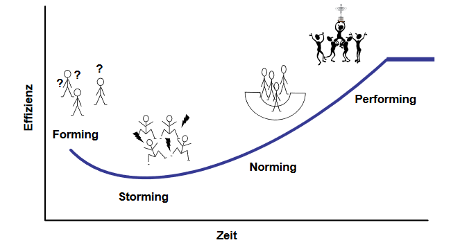

# Internationale Projektteams führen

Große Projekte involvieren oftmals Menschen aus verschiedensten Teilen der Welt. Dies erweitert die Bandbreite der Fähigkeiten, welche Projektmanager besitzen sollten. In der heutigen globalisierten Wirtschaft scheinen sowohl Projektteams aus diversen Ländern als auch die Zusammensetzung virtueller Projektteams die Norm zu sein. Der Übergang vom Management von Projekten bei welchen das gesamte Team vor Ort ist, zum Management von Teams, die verschiedene Zeitzonen und Nationalitäten repräsentieren, wird immer herausfordernder. Daher sollten Projektmanager, welche solche Projekte leiten, zusätzliche Planungszeit einplanen, um alle Hindernisse zu vermeiden, die zu Spannungen und damit zu Konflikten führen könnten [^1]. 

# Prozess der Entstehung von Teams

*Abb. 1*

Internationale und interkulturelle Projekte basieren immer auf der effektiven Zusammenarbeit eines Teams. Bereits in den 1960ern entwickelte der US-amerikanische Psychologe Bruce Tuckmann ein Phasenmodell, welches den Prozess der Entstehung von Teams plastisch skizziert.

Bruce Tuckmann erklärte im Wesentlichen, welche Schritte die Teams durchlaufen müssen (siehe Abb 1) damit diese gemeinsam ihr maximales Potential entfalten können. Vor allem der Anfang dieses Prozesses ist häufiger mit Spannungen und Konflikten verbunden. Dieses Modell kann die Führungskräfte dabei unterstützen die Dynamiken der Gruppe besser zu verstehen und angemessene Maßnahmen zu ergreifen, um den Reifeprozess zu beschleunigen, damit schließlich die Performing-Phase größtenteils unproblematisch erreicht wird [^2].

# Die Bedeutung von Kommunikation

Unabhängig davon, ob die Projektmitarbeiter zentral an einem Ort oder dezentral in mehreren Ländern verteilt sind, ist ein gemeinsames Treffen zu kritischen Zeitpunkten im Projekt, ein sicherer Weg, um mit einem Minimum an Misskommunikation fortzufahren.
Die größten Problemstellen bei internationalen Projektteams sind vor allem das kulturelle Verständnis und die Kommunikation. Ersteres hängt von der emotionalen Intelligenz des Projektleiters, seinen Führungsqualitäten, seiner Anpassungsfähigkeit und seiner Fähigkeit ab, die Teams zu informieren und zu schulen. Eine erfolgreiche Kommunikation hängt auch von den Soft Skills ab, die ein Projektmanager mitbringt.
Diese sind:
* die Fähigkeit zuzuhören
* die Feinfühligkeit, die unausgesprochenen Anliegen zu erkennen
* die Fähigkeit, klar und deutlich zu kommunizieren, so dass die anderen Personen es verstehen [^3].
Gerade dadurch, dass in internationalen Projekten die Projektmitarbeiter räumlich getrennt sind und kaum direkter Kontakt vorliegt, wird der Wissensaustausch und gegenseitige Information erschwert. Hier kann es dann vorkommen, dass z.B. ein Mitarbeiter vergisst, notwendige Informationen seinem Kollegen im Ausland zukommen zu lassen. Für die Führungskräfte ist es also wichtig am Anfang des Projektes Kommunikationsstandards festzulegen, z.B. indem festgelegt wird, wie oft sich das Team zusammensetzt und austauschen soll bzw. ist auch die verwendete Sprache von entscheidender Bedeutung, sodass sowohl Verständlichkeit gewährleistet wird, als auch der Informationsverlust möglichst gering gehalten wird [^4].

# Kulturübergreifendes Führen

Um die Mentalitäten, Werte und Erwartungen des Teams aufeinander anzupassen ist ein offener Austausch wichtig. 
Bei der Zusammenarbeit von internationalen Projektteams treffen unterschiedliche Menschen mit unterschiedlichen Kulturen aufeinander. Dies muss dementsprechend von den führenden Projektmanagern berücksichtigt werden.  Denn kulturell diverse Teams können Unternehmen und Projekten einige Vorteile verschaffen. 
Da Verschiedene Kulturen unterschiedliche Blickwinkel einnehmen können, kann die Zusammenarbeit des internationalen Projektteams zu kreativen, unkonventionellen Lösungen für Probleme führen. Wichtig hierbei ist nur, dass die Kulturen im Projektteam ausgeglichen vertreten sind und dass sich in diesem Sinne keine Hierarchie bildet [^5].

[kb/Internationale_Projektteams/Phasenmodell_Tuckmann.PNG]

# Siehe auch

* Verlinkungen zu angrenzenden Themen
* [Link auf diese Seite](Internationale_Projektteams.md)

# Weiterführende Literatur

* Weiterfuehrende Literatur zum Thema z.B. Bücher, Webseiten, Blogs, Videos, Wissenschaftliche Literatur, ...

# Quellen

[^1]: https://www.projecttimes.com/articles/managing-international-teams-the-importance-of-cultural-management-and-communications/#:~:text=Managing%20International%20Teams%3A%20The%20Importance%20of%20Cultural%20Management,easy%20with%20these%20diverse%20teams.%20Weitere%20Artikel...%20
[^2]: https://www.me-company.de/magazin/forming-storming-norming-performing/ 
[^3]: https://www.girlsguidetopm.com/6-tips-for-managing-international-project-teams/
[^4]: https://www.projektmagazin.de/internationales-PM
[^5]: https://www.managementcircle.de/blog/kulturelle-unterschiede.html
[^6]: https://www.managementcircle.de/blog/internationale-projektteams.html

